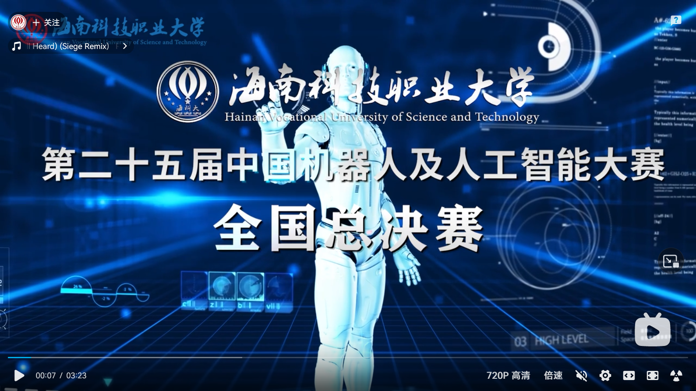
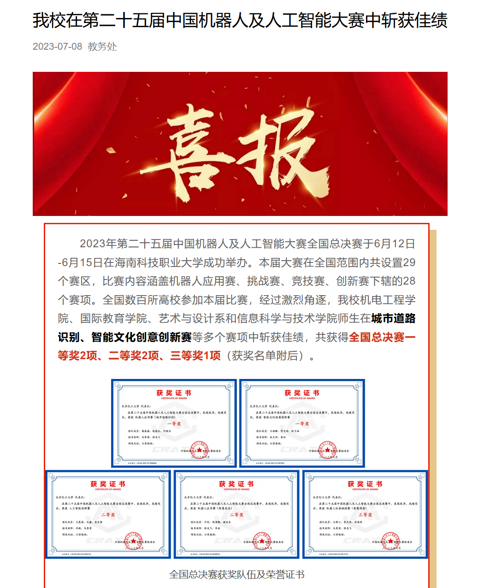
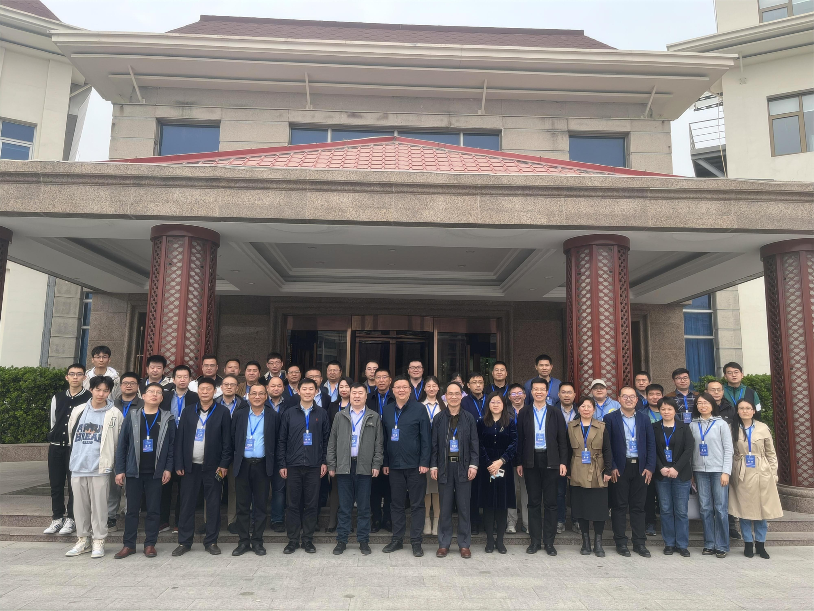
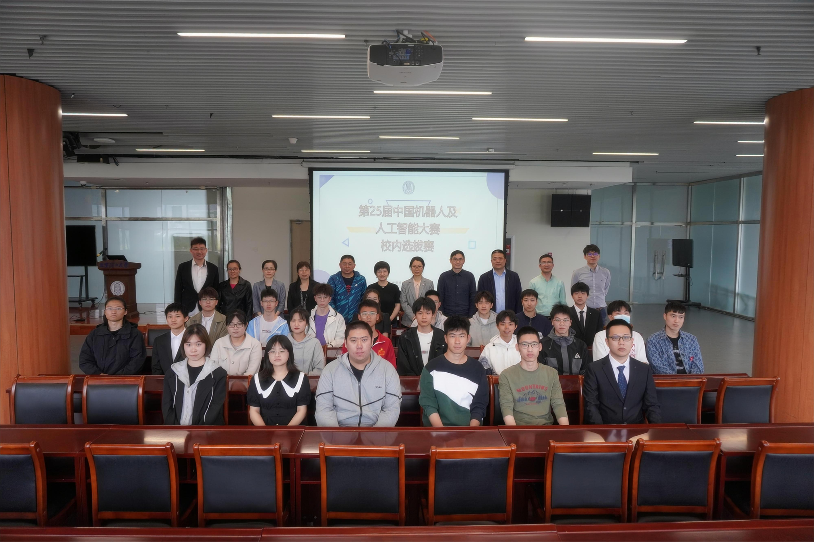
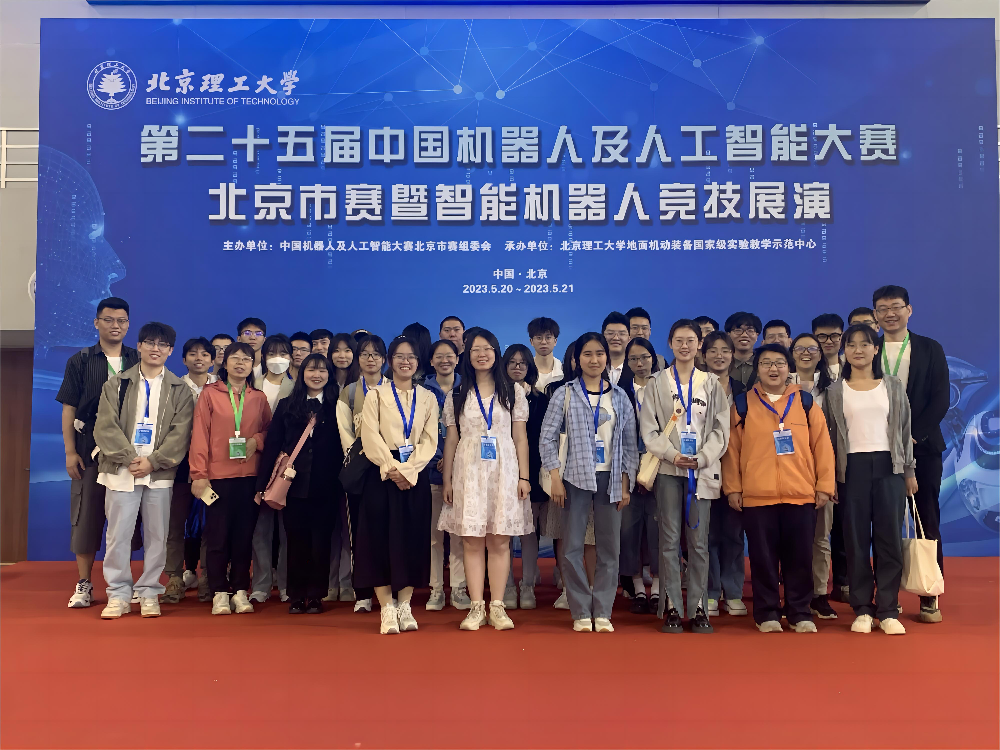
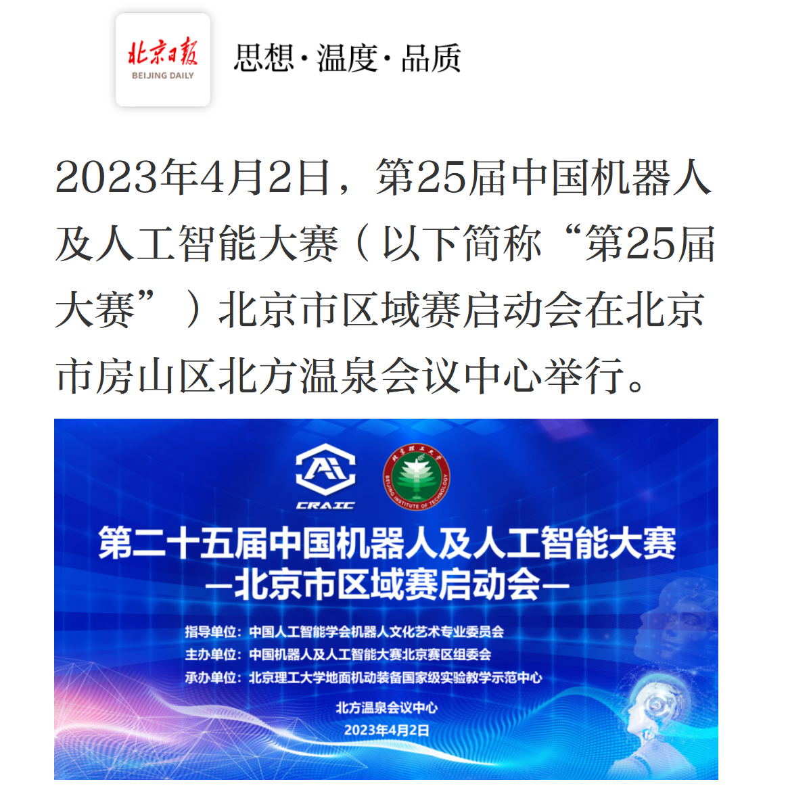
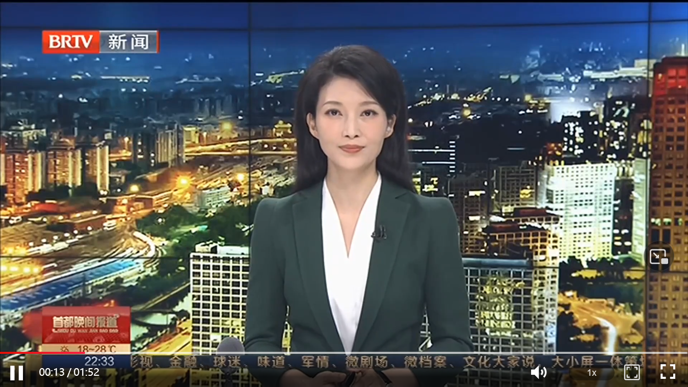
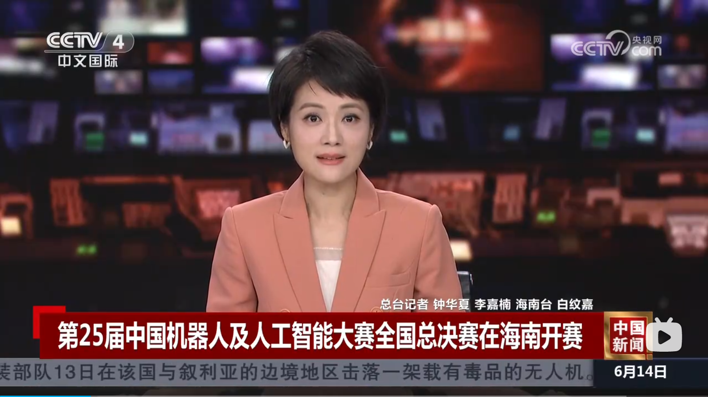
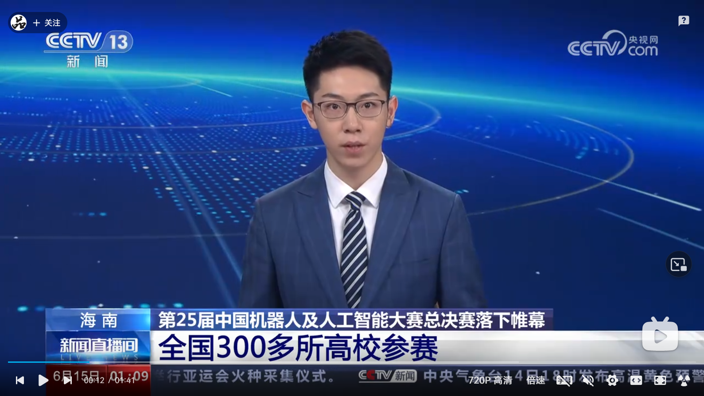

# 2023-第25届中国机器人及人工智能大赛

> **[success] 提示**
> 
> 使用`Crl + 鼠标左键点击链接`或`鼠标右键点击链接，选择从链接另存文件为`，可下载文件 

### 1 大赛信息

1 中国机器人及人工智能大赛官网：https://craic.yuntop.com/#/index

2 中国人工智能学会机器人文化艺术专业委员会官网：https://www.caairobot.com/

### 2 通知文件

1 [关于举办第二十五届中国机器人及人工智能大赛的通知](./files/25/关于举办第二十五届中国机器人及人工智能大赛的通知.pdf)

2 [关于举办第二十五届中国机器人及人工智能大赛（北京市区域赛）的通知](./files/25/关于举办第二十五届中国机器人及人工智能大赛（北京市区域赛）的通知.pdf)

3 [关于公布CRAIC2023比赛规则及联系方式的通知](./files/25/关于公布CRAIC2023比赛规则及联系方式的通知.pdf)

4 [关于组织参加“第二十五届中国机器人及人工智能大赛”的通知](https://open.work.weixin.qq.com/wwopen/mpnews?mixuin=1Ko2BwAABwA-GIG6AAAUAA&mfid=WW0331-pxcgigAABwBHe3Wh_kJTxQM72XI73&idx=0&sn=936499e0f713de0790d97e17b972eadb&version=4.1.6.6018&platform=win)，文本文件请参阅: [关于举办第二十五届中国机器人及人工智能大赛校赛的通知-机电工程学院](./files/25/关于举办第二十五届中国机器人及人工智能大赛校赛的通知-机电工程学院.pdf)

### 3 比赛规则

1 [CRAIC2023比赛线下规则](./files/25/CRAIC2023比赛线下规则.pdf)

2 [参赛硬件要求统计](./files/25/参赛硬件要求统计.pdf)

### 4 参赛报名

1 [CRAIC2023报名表](./files/25/CRAIC2023报名表.zip)

2 [参赛报名演示](https://pan.baidu.com/s/1PcUiBFlXz8sEGZ0rLcbs-g?pwd=6666)

3 [各项比赛简介](https://pan.baidu.com/s/1vaDdbMJkClenumTWWHoNKQ?pwd=6666)

### 5 校赛 

1 [校赛评选结果](./files/25/校赛评选结果-第25届中国机器人及人工智能大赛.pdf)

### 6 北京区域赛

1 [北京赛秩序册](./files/25/北京赛秩序册.pdf)

### 7 全国决赛 

1 [全国决赛秩序册](./files/25/全国赛秩序册.pdf)

2 [全国决赛获奖名单](./files/25/2023年第25届中国机器人及人工智能大赛全国决赛获奖公示表（公示版本）.pdf)

3 [全国决赛宣传片](https://www.bilibili.com/video/BV1fM4y1j7sP/?spm_id_from=333.337.search-card.all.click&vd_source=7df640296c15e75b5fbd2da8cc72a434)

<!--  -->

    <iframe src="//player.bilibili.com/player.html?aid=913288195&bvid=BV1fM4y1j7sP&cid=1192712024&p=1&autoplay=false"
            scrolling="no" 
            border="0" 
            frameborder="no" 
            framespacing="0" 
            allowfullscreen="true" 
            style="position: absolute; top: 0; left: 0; width: 100%; height: 100%;"></iframe>

  

### 8 比赛结果喜报

[我校在第二十五届中国机器人及人工智能大赛中斩获佳绩](https://open.work.weixin.qq.com/wwopen/mpnews?mixuin=1Ko2BwAABwA-GIG6AAAUAA&mfid=WW0308-fU1ojQAABwCdIT2mqTGUwg1LpaQ77&idx=0&sn=4b059e033c62c596959657c165b19e95&version=4.1.6.6018&platform=win)

 
### 9 比赛过程记录

第25届中国机器人及人工智能大赛北京市区域赛启动会

 

第25届中国机器人及人工智能大赛校赛合影

 

第25届中国机器人及人工智能大赛北京赛合影

 
### 10 新闻报道

1 [第25届中国机器人及人工智能大赛北京市区域赛启动会在京举行](https://bj.bjd.com.cn/5b165687a010550e5ddc0e6a/contentShare/5ba1f926e4b0976ea0d9a0fc/AP642ace21e4b05339adcbc8d6.html?from=appMessage&timestamp=1680617422458)

 
2 [第25届中国机器人及人工智能大赛北京市赛启动](https://item.btime.com/26ud045c4svdf5c1vesbh3mq04j)

 
3 [第25届中国机器人及人工智能大赛全国总决赛在海南开赛](https://www.bilibili.com/video/BV18z4y1e7Xj/?spm_id_from=333.337.search-card.all.click&vd_source=7df640296c15e75b5fbd2da8cc72a434)
<!--  -->

    <iframe src="//player.bilibili.com/player.html?aid=572331841&bvid=BV18z4y1e7Xj&cid=1163854087&p=1&autoplay=false"
            scrolling="no" 
            border="0" 
            frameborder="no" 
            framespacing="0" 
            allowfullscreen="true" 
            style="position: absolute; top: 0; left: 0; width: 100%; height: 100%;"></iframe>

  

 
4 [第25届中国机器人及人工智能大赛总决赛落下帷幕 全国300多所高校参赛](https://www.bilibili.com/video/BV1So4y1N7AY/?spm_id_from=333.788&vd_source=7df640296c15e75b5fbd2da8cc72a434)

<!--  -->

    <iframe src="//player.bilibili.com/player.html?aid=402268413&bvid=BV1So4y1N7AY&cid=1165288154&p=1&autoplay=false"
            scrolling="no" 
            border="0" 
            frameborder="no" 
            framespacing="0" 
            allowfullscreen="true" 
            style="position: absolute; top: 0; left: 0; width: 100%; height: 100%;"></iframe>

  