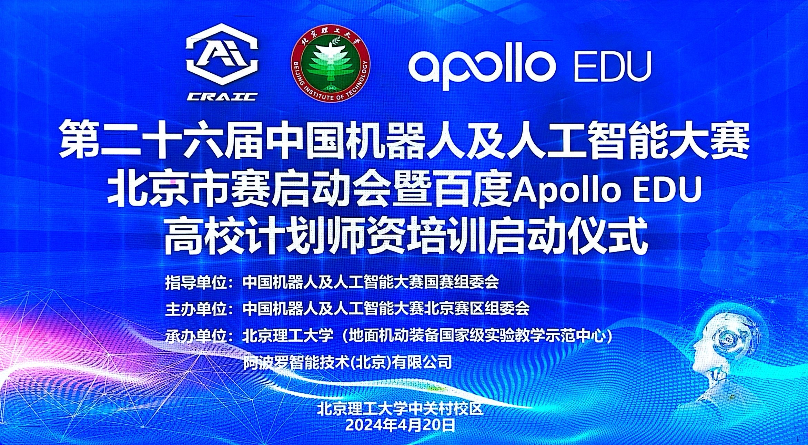
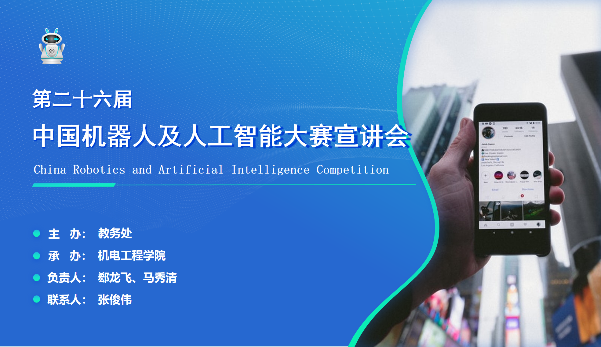

# 2024-第26届中国机器人及人工智能大赛

> **[success] 提示**
> 
> 使用`Crl + 鼠标左键点击链接`或`鼠标右键点击链接，选择从链接另存文件为`，可下载文件 

### 1 大赛信息

1 中国机器人及人工智能大赛官网：https://craic.yuntop.com/#/index

2 中国机器人及人工智能大赛组委会官网：https://www.caairobot.com/

### 2 通知文件

1 [关于举办第二十六届中国机器人及人工智能大赛的通知](./files/26/关于举办第二十六届中国机器人及人工智能大赛的通知（第一轮）.pdf)

2 [关于举办第二十六届中国机器人及人工智能大赛（北京市区域赛）的通知](./files/26/关于举办第二十六届中国机器人及人工智能大赛（北京区域赛）的通知-2号文件.pdf)

3 [关于发布第二十六届中国机器人及人工智能大赛比赛规则的通知](https://www.caairobot.com/html/robot2024/44550.html)

4 [关于组织参加“第二十六届中国机器人及人工智能大赛”的通知](https://open.work.weixin.qq.com/wwopen/mpnews?mixuin=1Ko2BwAABwA-GIG6AAAUAA&mfid=WW0326-TUjP8AAABwCtJJrbod2wvQERn8f84&idx=0&sn=7e0521636c57bed950569ab7ad32497b&version=4.1.22.6014&platform=win)

### 3 比赛规则

1 [CRAIC2024比赛线下规则](./files/26/CRAIC2024比赛规则.zip) 

2 [各项比赛简介-CRAIC2023](https://pan.baidu.com/s/1vaDdbMJkClenumTWWHoNKQ?pwd=6666) 

3 [各项比赛简介-CRAIC2024](https://pan.baidu.com/s/1Icqa09OyO7F827xns179mQ?pwd=6666) 

### 4 参赛报名

1 报名系统：https://craic.yuntop.com/#/index

2 [参赛报名演示](https://pan.baidu.com/s/1Af83MSt3m91EpV9smpsHDQ?pwd=6666)

> **[success] 提示**
> 
> 比赛报名不收费，进北京决赛才需要缴费，由各个学院负责缴费 

### 5 比赛过程记录

第26届中国机器人及人工智能大赛北京市区域赛启动会-20240420

 

第26届中国机器人及人工智能大赛校赛宣讲会-20240428 [(PPT下载)](./files/26/第二十六届中国机器人及人工智能大赛宣讲会-20240428.pptx) 

 

