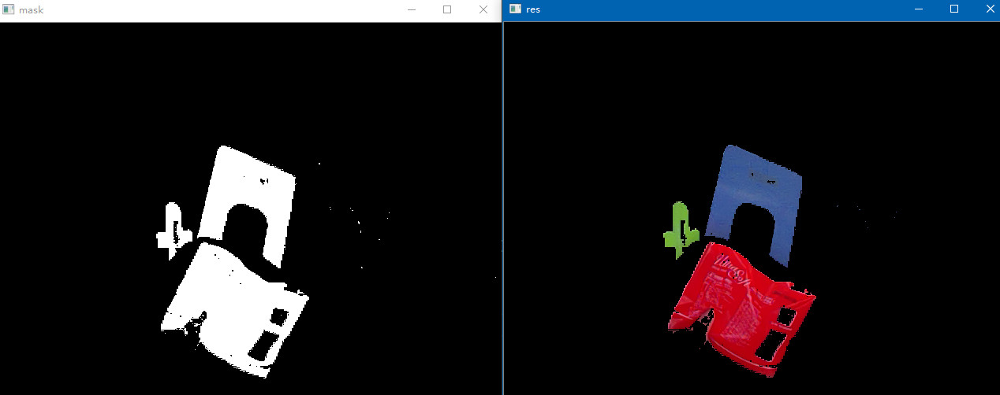
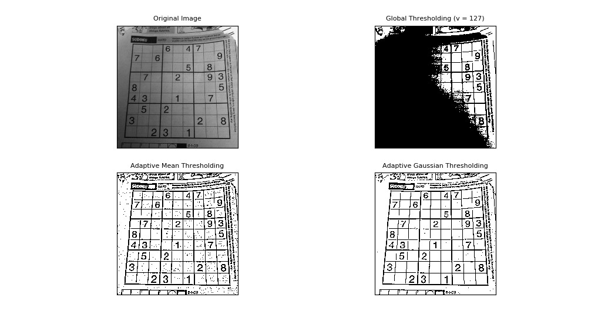
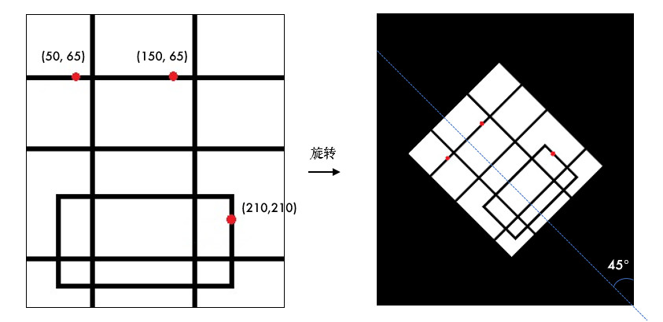
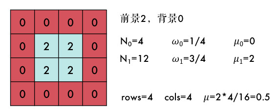
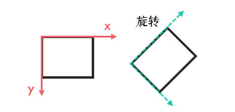
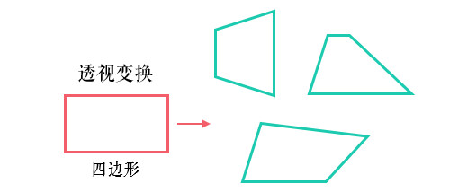
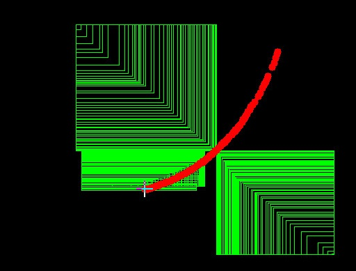

# 1.1 OpenCV入门

教程使用说明参见：[基础入门](./chapter1.md)

---

# 1 简介与安装

相信大部分人知道的 OpenCV 都是用 C++ 来开发的，那为什么笔者推荐使用 Python 呢？

> [!TIP]
>
> 本教程基础内容来自 [OpenCV 官方英文教程](https://docs.opencv.org/)，按照使用度和难易度翻译，重新编写了大量原创内容，将不常用和较难的部分写成番外篇，浅显易懂，很 easy 的辣。

## 1.1 Python 照样快！

众所周知，虽然 Python 语法简洁、编写高效，但相比 C/C++运行慢很多。然而 Python 还有个重要的特性：它是一门胶水语言！Python 可以很容易地扩展 C/C++。OpenCV-Python 就是用 Python 包装了 C++ 的实现，背后实际就是 C++ 的代码在跑，运行速度非常接近原生。

比如笔者分别用 Python 和 C++实现读入图片和调整图片的亮度对比度，结果如下：


**可以看到某些情况下 Python 的运行速度甚至好于 C++，代码行数也直接少一半多！**

另外，图像是矩阵数据，OpenCV-Python 原生支持 [Numpy](https://baike.baidu.com/item/numpy)，相当于 Python 中的 Matlab，为矩阵运算、科学计算提供了极大的便利性。

## 1.2 人工智能浪潮

近些年，人工智能 AI 相关技术的快速发展大家有目共睹。在编程语言方面，更多人希望的是具备高效开发效率、跨平台、高度扩展性的语言，尤其是一些 AI 巨头优先推出支持 Python 语言的深度学习框架，如 Facebook 的[PyTorch](https://pytorch.org/)、Google 的[Tensorflow](https://tensorflow.google.cn/)等，可以说 Python 是名副其实的“网红语言”了。


从[TIOBE 编程语言排行榜](https://www.tiobe.com/tiobe-index/)也可以看到，Python 发展迅猛，已经逼近 C++的份额。这个排行榜每月更新，就不截图了，笔者编写时的 TOP5：Java/C/C++/Python/C\#。

## 1.3 人生苦短，笔者用 Python

- 如果你搞科研用，果断放弃 C++（Matlab？出门左拐）
- 如果你是快速原型开发，验证方案，果断放弃 C++
- 如果你懒的配置 OpenCV 环境，果断放弃 C++
- 如果你的程序是在支持 Python 的较高硬件环境下运行，果断放弃 C++
- 如果你担心 Python 写不了界面，那是你的问题 o_o ....
- 除非你的程序是 MFC 或已经用 C++编写其他模块或是嵌入式设备，那就用 C++吧

**"人生苦短，我用 Python！！！"**

## 1.4 安装

> 本教程编写时使用的相关版本是：OpenCV 4.x，Python 3.x。

### 1.4.1 opencv-python

只需终端下的一条指令：

```bash
pip install opencv-python
```

pip 是 Python 的包管理器，如果你还没安装 Python，强烈推荐安装[Anaconda](https://www.anaconda.com/download/)，它包含了大量的科学计算包，不用后期一个个安装。

### 1.4.2 Anaconda 安装

进入 Anaconda[官网](https://www.anaconda.com/download/)，下载最新版本的安装文件，速度比较慢的话，可以去[清华开源镜像站](https://mirrors.tuna.tsinghua.edu.cn/anaconda/archive/)。

- Windows 版是 exe 文件，双击直接安装，安装时记得勾选 `Add Anaconda to my PATH environment variable`，添加到环境变量。
- Linux 版是 sh 文件，执行`bash Anaconda3-xx.sh`，Linux 版也会提示添加到环境变量，记得输 yes 就行。
- MAC 版是 pkg 文件，同样直接双击安装即可。
- Anaconda和Pip换源，可参考[1.2 Ubuntu安装之后需要做的事](https://rosit.gitee.io/Markdown/Ubuntu/chapter1-2.html)

### 1.4.3 安装测试

Python 的版本可以在终端中输入`python --version`来查看。对于 OpenCV，打开 Python 的开发环境，输入`import cv2`，运行没有报错说明一切正常。要查看 OpenCV 的版本，可以：

```python
import cv2

print(cv2.__version__)
```

> 编辑器笔者习惯用 [Visual Studio Code](http://code.visualstudio.com/)，也可以用 [PyCharm](http://www.jetbrains.com/pycharm/)/[Atom](https://atom.io/)/Jupyter Notebook\(Anaconda 自带\)。

### 1.4.4 常见问题

1. pip 识别不了：pip 的目录没有添加到环境变量中，添加到用户\(或系统\) 变量的 path 中。
2. 下载速度很慢：可到[此处](https://pypi.org/search/?q=opencv-python)下载离线版，完成后在终端输入`pip install 文件名`安装。

## 1.5 学习软件

为了便于学习 OpenCV，笔者编写了一款 Windows 平台的教学软件[LearnOpenCVEdu](https://github.com/codecwang/LearnOpenCVEdu)，目前只开发了一部分功能，欢迎 Star 支持:smiley:。


>[!TIP]
>
> 虽然笔者推荐大家使用 OpenCV-Python 进行图像处理，但想要深入理解 OpenCV，C++是必须的，尤其是**OpenCV 源码**！

## 1.6 引用

- [Github源码](https://github.com/CodecWang/opencv-python-tutorial/tree/master)

## 1.7 网络资料

- [OpenCV Docs 官方文档](https://docs.opencv.org/)
- [OpenCV 源码](https://github.com/opencv/opencv)
- [LearnOpenCV](http://www.learnopencv.com)、[LearnOpenCV Github](https://github.com/spmallick/learnopencv)
- [OpenCV 中文教程](http://www.opencv.org.cn/opencvdoc/2.3.2/html/doc/tutorials/tutorials.html)
- [OpenCV 中文文档](https://apachecn.github.io/opencv-doc-zh/#/)

## 1.8 书籍

- [Programming Computer Vision with Python](http://programmingcomputervision.com/)、[中文书](https://www.amazon.cn/dp/B00L3Y3NEM/ref=sr_1_1?ie=UTF8&qid=1543929834&sr=8-1&keywords=Python+%E8%AE%A1%E7%AE%97%E6%9C%BA%E8%A7%86%E8%A7%89)
- [Practical Python and OpenCV](https://www.pyimagesearch.com/practical-python-opencv/)

## 1.9 名校视觉研究所/课程

- [卡内基梅隆大学](http://graphics.cs.cmu.edu/)
- [多伦多大学](https://www.cs.toronto.edu/~guerzhoy/320/)

<br/>


# 2 基本元素 - 图片


学习如何加载图片，显示并保存图片。

## 2.1 目标

- 加载图片，显示图片，保存图片
- OpenCV 函数：`cv2.imread()`, `cv2.imshow()`, `cv2.imwrite()`

## 2.2 教程

大部分人可能都知道电脑上的彩色图是以 RGB(Red/Green/Blue: 红/绿/蓝) 颜色模式显示的，但 OpenCV 中彩色图是以 BGR 通道顺序存储的，灰度图只有一个通道。

图像坐标的起始点是在**左上角**，所以行对应的是 y，列对应的是 x：


### 2.2.1 加载图片

使用`cv2.imread()`来读入一张图片：

```python
import cv2

# 加载灰度图
img = cv2.imread('lena.jpg', 0)
```

- 参数 1：图片的文件名
  - 如果图片放在当前文件夹下，直接写文件名就行，如'lena.jpg'
  - 否则需要给出绝对路径，如'D:\OpenCVSamples\lena.jpg'
- 参数 2：读入方式，省略即采用默认值
  - `cv2.IMREAD_COLOR`：彩色图，默认值 (1)
  - `cv2.IMREAD_GRAYSCALE`：灰度图 (0)
  - `cv2.IMREAD_UNCHANGED`：包含透明通道的彩色图 (-1)

> [!TIP]
>
> 路径中不能有中文噢，并且没有加载成功的话是不会报错的，`print(img)`的结果为 None，后面处理才会报错，算是个小坑。


### 2.2.2 显示图片

使用`cv2.imshow()`显示图片，窗口会自适应图片的大小：

```python
cv2.imshow('lena', img)
cv2.waitKey(0)
```

参数 1 是窗口的名字，参数 2 是要显示的图片。不同窗口之间用窗口名区分，所以窗口名相同就表示是同一个窗口，显示结果如下：


`cv2.waitKey()`是让程序暂停的意思，参数是等待时间，单位毫秒 ms。时间一到，会继续执行接下来的程序，传入 0 的话表示一直等待。等待期间也可以获取用户的按键输入：`k = cv2.waitKey(0)`（[练习](#练习)）。

我们也可以先用`cv2.namedWindow()`创建一个窗口，之后再显示图片：

```python
# 先定义窗口，后显示图片
cv2.namedWindow('lena2', cv2.WINDOW_NORMAL)
cv2.imshow('lena2', img)
cv2.waitKey(0)
```

参数 1 依旧是窗口的名字，参数 2 默认是`cv2.WINDOW_AUTOSIZE`，表示窗口大小自适应图片，也可以设置为`cv2.WINDOW_NORMAL`，表示窗口大小可调整。图片比较大的时候，可以考虑用后者。

### 2.2.3 保存图片

使用`cv2.imwrite()`保存图片，参数 1 是包含后缀名的文件名：

```python
cv2.imwrite('lena_gray.jpg', img)
```

Nice，是不是很简单呐，再接再厉噢\(●'◡'●\)

## 2.3 小结

- `cv2.imread()`读入图片、`cv2.imshow()`显示图片、`cv2.imwrite()`保存图片。

## 2.4 练习

1. 打开 lena.jpg 并显示，如果按下's'，就保存图片为'lena_save.bmp'，否则就结束程序。
2. Matplotlib 是 Python 中常用的一个绘图库，请学习**2 番外篇：无损保存和 Matplotlib 使用**。

## 2.5 接口文档

- [Mat Object](https://docs.opencv.org/4.0.0/d3/d63/classcv_1_1Mat.html)
- [cv2.imread\(\)](https://docs.opencv.org/4.0.0/d4/da8/group__imgcodecs.html#ga288b8b3da0892bd651fce07b3bbd3a56)
- [cv2.imshow\(\)](https://docs.opencv.org/4.0.0/d7/dfc/group__highgui.html#ga453d42fe4cb60e5723281a89973ee563)
- [cv2.imwrite\(\)](https://docs.opencv.org/4.0.0/d4/da8/group__imgcodecs.html#gabbc7ef1aa2edfaa87772f1202d67e0ce)
- [cv.namedWindow\(\)](https://docs.opencv.org/4.0.0/d7/dfc/group__highgui.html#ga5afdf8410934fd099df85c75b2e0888b)


# 3 打开摄像头

学习打开摄像头捕获照片、播放本地视频、录制视频等。

## 3.1 目标

- 打开摄像头并捕获照片
- 播放本地视频，录制视频
- OpenCV 函数：`cv2.VideoCapture()`, `cv2.VideoWriter()`

## 3.2 教程

### 3.2.1 打开摄像头

要使用摄像头，需要使用`cv2.VideoCapture(0)`创建 VideoCapture 对象，参数 0 指的是摄像头的编号，如果你电脑上有两个摄像头的话，访问第 2 个摄像头就可以传入 1，依此类推。

```python
# 打开摄像头并灰度化显示
import cv2

capture = cv2.VideoCapture(0)

while(True):
    # 获取一帧
    ret, frame = capture.read()
    # 将这帧转换为灰度图
    gray = cv2.cvtColor(frame, cv2.COLOR_BGR2GRAY)

    cv2.imshow('frame', gray)
    if cv2.waitKey(1) == ord('q'):
        break
```

`capture.read()`函数返回的第 1 个参数 ret(return value) 是一个布尔值，表示当前这一帧是否获取正确。`cv2.cvtColor()`用来转换颜色，这里将彩色图转成灰度图。

另外，通过`cap.get(propId)`可以获取摄像头的一些属性，比如捕获的分辨率，亮度和对比度等。propId 是从 0~18 的数字，代表不同的属性，完整的属性列表可以参考：[VideoCaptureProperties](https://docs.opencv.org/4.0.0/d4/d15/group__videoio__flags__base.html#gaeb8dd9c89c10a5c63c139bf7c4f5704d)。也可以使用`cap.set(propId,value)`来修改属性值。比如说，我们在 while 之前添加下面的代码：

```python
# 获取捕获的分辨率
# propId 可以直接写数字，也可以用 OpenCV 的符号表示
width, height = capture.get(3), capture.get(4)
print(width, height)

# 以原分辨率的一倍来捕获
capture.set(cv2.CAP_PROP_FRAME_WIDTH, width * 2)
capture.set(cv2.CAP_PROP_FRAME_HEIGHT, height * 2)
```

> [!TIP]
>
> 某些摄像头设定分辨率等参数时会无效，因为它有固定的分辨率大小支持，一般可在摄像头的资料页中找到。


### 3.2.2 播放本地视频

跟打开摄像头一样，如果把摄像头的编号换成视频的路径就可以播放本地视频了。回想一下`cv2.waitKey()`，它的参数表示暂停时间，所以这个值越大，视频播放速度越慢，反之，播放速度越快，通常设置为 25 或 30。

```python
# 播放本地视频
capture = cv2.VideoCapture('demo_video.mp4')

while(capture.isOpened()):
    ret, frame = capture.read()
    gray = cv2.cvtColor(frame, cv2.COLOR_BGR2GRAY)

    cv2.imshow('frame', gray)
    if cv2.waitKey(30) == ord('q'):
        break
```

### 3.2.3 录制视频

之前我们保存图片用的是`cv2.imwrite()`，要保存视频，我们需要创建一个`VideoWriter`的对象，需要给它传入四个参数：

- 输出的文件名，如'output.avi'
- 编码方式 [FourCC](https://baike.baidu.com/item/fourcc/6168470?fr=aladdin) 码
- 帧率 [FPS](https://baike.baidu.com/item/FPS/3227416)
- 要保存的分辨率大小

FourCC 是用来指定视频编码方式的四字节码，所有的编码可参考[Video Codecs](http://www.fourcc.org/codecs.php)。如 MJPG 编码可以这样写： `cv2.VideoWriter_fourcc(*'MJPG')`或`cv2.VideoWriter_fourcc('M','J','P','G')`

```python
capture = cv2.VideoCapture(0)

# 定义编码方式并创建 VideoWriter 对象
fourcc = cv2.VideoWriter_fourcc(*'MJPG')
outfile = cv2.VideoWriter('output.avi', fourcc, 25., (640, 480))

while(capture.isOpened()):
    ret, frame = capture.read()

    if ret:
        outfile.write(frame)  # 写入文件
        cv2.imshow('frame', frame)
        if cv2.waitKey(1) == ord('q'):
            break
    else:
        break
```

## 3.3 小结

- 使用`cv2.VideoCapture()`创建视频对象，然后在循环中一帧帧显示图像。参数传入数字时，代表打开摄像头，传入本地视频路径时，表示播放本地视频。
- `cap.get(propId)`获取视频属性，`cap.set(propId,value)`设置视频属性。
- `cv2.VideoWriter()`创建视频写入对象，用来录制/保存视频。

## 3.4 练习

1. 请先阅读**3 番外篇：滑动条**，然后实现一个可以拖动滑块播放视频的功能。（提示：需要用到 `cv2.CAP_PROP_FRAME_COUNT`和`cv2.CAP_PROP_POS_FRAMES`两个属性）。

## 3.5 接口文档

- [VideoCapture Object](https://docs.opencv.org/4.0.0/d8/dfe/classcv_1_1VideoCapture.html>)
- [VideoWriter Object](https://docs.opencv.org/4.0.0/dd/d9e/classcv_1_1VideoWriter.html>)
- [cv2.cvtColor()](https://docs.opencv.org/4.0.0/d8/d01/group__imgproc__color__conversions.html#ga397ae87e1288a81d2363b61574eb8cab)

## 3.6 引用

- [Video Codecs by FOURCC](http://www.fourcc.org/codecs.php)


# 4 图像基本操作


学习获取和修改像素点的值，ROI 感兴趣区域，通道分离合并等基本操作。

## 4.1 目标

- 访问和修改图片像素点的值
- 获取图片的宽、高、通道数等属性
- 了解感兴趣区域 ROI
- 分离和合并图像通道

## 4.2 教程

### 4.2.1 获取和修改像素点值

我们先读入一张图片：

```python
import cv2

img = cv2.imread('lena.jpg')
```

通过行列的坐标来获取某像素点的值，对于彩色图，结果是 B,G,R 三个值的列表，对于灰度图或单通道图，只有一个值：

```python
px = img[100, 90]
print(px)  # [103 98 197]

# 只获取蓝色 blue 通道的值
px_blue = img[100, 90, 0]
print(px_blue)  # 103
```

还记得吗？**行对应 y，列对应 x，所以其实是`img[y, x]`，需要注意噢\(●ˇ∀ˇ●\)**。容易混淆的话，可以只记行和列，行在前，列在后。

修改像素的值也是同样的方式：

```python
img[100, 90] = [255, 255, 255]
print(img[100, 90])  # [255 255 255]
```

> [!TIP]
> 
> 还有一种性能更好的方式，获取：`img.item(100,100,0)`，修改：`img.itemset((100,100,0),255)`，但这种方式只能 B,G,R 逐一进行。

注意：这步操作只是内存中的 img 像素点值变了，因为没有保存，所以原图并没有更改。

### 4.2.2 图片属性

`img.shape`获取图像的形状，图片是彩色的话，返回一个包含**行数（高度）、列数（宽度）和通道数**的元组，灰度图只返回行数和列数：

```python
print(img.shape)  # (263, 263, 3)
# 形状中包括行数、列数和通道数
height, width, channels = img.shape
# img 是灰度图的话：height, width = img.shape
```

`img.dtype`获取图像数据类型：

```python
print(img.dtype)  # uint8
```

> [!TIP]
> 
> 多数错误是因为数据类型不对导致的，所以健壮的代码应该对这个属性加以判断。

`img.size`获取图像总像素数：

```python
print(img.size)  # 263*263*3=207507
```

### 4.2.3 ROI

[ROI](https://baike.baidu.com/item/ROI/1125333#viewPageContent)：Region of Interest，感兴趣区域。什么意思呢？比如我们要检测眼睛，因为眼睛肯定在脸上，所以我们感兴趣的只有脸这部分，其他都不 care，所以可以单独把脸截取出来，这样就可以大大节省计算量，提高运行速度。


截取 ROI 非常简单，指定图片的范围即可（后面我们学了特征后，就可以自动截取辣，\(ง •\_•\)ง）：

```python
# 截取脸部 ROI
face = img[100:200, 115:188]
cv2.imshow('face', face)
cv2.waitKey(0)
```

### 4.2.4 通道分割与合并

彩色图的 BGR 三个通道是可以分开单独访问的，也可以将单独的三个通道合并成一副图像。分别使用`cv2.split()`和`cv2.merge()`：

```python
b, g, r = cv2.split(img)
img = cv2.merge((b, g, r))
```

`split()`函数比较耗时，**更高效的方式是用 numpy 中的索引**，如提取 B 通道：

```python
b = img[:, :, 0]
cv2.imshow('blue', b)
cv2.waitKey(0)
```

## 4.3 小结

- `img[y,x]`获取/设置像素点值，`img.shape`：图片的形状（行数、列数、通道数）,`img.dtype`：图像的数据类型。
- `img[y1:y2,x1:x2]`进行 ROI 截取，`cv2.split()/cv2.merge()`通道分割/合并。更推荐的获取单通道方式：`b = img[:, :, 0]`。

## 4.4 练习

1. 打开 lena.jpg，将帽子部分（高：25-120，宽：50-220）的红色通道截取出来并显示。

## 4.5 接口文档

- [cv2.split()](https://docs.opencv.org/4.0.0/d2/de8/group__core__array.html#ga0547c7fed86152d7e9d0096029c8518a)
- [cv2.merge()](https://docs.opencv.org/4.0.0/d2/de8/group__core__array.html#ga7d7b4d6c6ee504b30a20b1680029c7b4)


# 5 颜色空间转换



学习如何进行图片的颜色空间转换，视频中追踪特定颜色的物体。

## 5.1 目标

- 颜色空间转换，如 BGR↔Gray，BGR↔HSV 等
- 追踪视频中特定颜色的物体
- OpenCV 函数：`cv2.cvtColor()`, `cv2.inRange()`

## 5.2 教程

### 5.2.1 颜色空间转换

```python
import cv2

img = cv2.imread('lena.jpg')
# 转换为灰度图
img_gray = cv2.cvtColor(img, cv2.COLOR_BGR2GRAY)

cv2.imshow('img', img)
cv2.imshow('gray', img_gray)
cv2.waitKey(0)
```

`cv2.cvtColor()`用来进行**颜色模型转换**，参数 1 是要转换的图片，参数 2 是转换模式， `COLOR_BGR2GRAY`表示 BGR→Gray，可用下面的代码显示所有的转换模式：

```python
flags = [i for i in dir(cv2) if i.startswith('COLOR_')]
print(flags)
```

> [!TIP]
> 
> 颜色转换其实是数学运算，如灰度化最常用的是：`gray=R*0.299+G*0.587+B*0.114`。

### 5.2.2 视频中特定颜色物体追踪

[HSV](https://baike.baidu.com/item/HSV/547122)是一个常用于颜色识别的模型，相比 BGR 更易区分颜色，转换模式用`COLOR_BGR2HSV`表示。

> [!TIP]
> 
> OpenCV 中色调 H 范围为\[0,179\]，饱和度 S 是\[0,255\]，明度 V 是\[0,255\]。虽然 H 的理论数值是 0°~360°，但 8 位图像像素点的最大值是 255，所以 OpenCV 中除以了 2，某些软件可能使用不同的尺度表示，所以同其他软件混用时，记得归一化。

现在，我们实现一个使用 HSV 来只显示视频中蓝色物体的例子，步骤如下：

1. 捕获视频中的一帧
2. 从 BGR 转换到 HSV
3. 提取蓝色范围的物体
4. 只显示蓝色物体


```python
import cv2
import numpy as np

capture = cv2.VideoCapture(0)

# 蓝色的HSV范围，不同光照条件下不一样，可灵活调整
lower_blue = np.array([100, 110, 110])
upper_blue = np.array([130, 255, 255])

while(True):
    # 1.捕获视频中的一帧
    ret, frame = capture.read()

    # 2.从 BGR 转换到 HSV
    hsv = cv2.cvtColor(frame, cv2.COLOR_BGR2HSV)

    # 3.inRange()：介于 lower/upper 之间的为白色，其余黑色
    mask = cv2.inRange(hsv, lower_blue, upper_blue)

    # 4.只保留原图中的蓝色部分
    res = cv2.bitwise_and(frame, frame, mask=mask)

    cv2.imshow('frame', frame)
    cv2.imshow('mask', mask)
    cv2.imshow('res', res)

    if cv2.waitKey(1) == ord('q'):
        break
```

其中，`bitwise_and()`函数暂时不用管，后面会讲到。那蓝色的 HSV 值的上下限 lower 和 upper 范围是怎么得到的呢？其实很简单，我们先把标准蓝色的 BGR 值用`cvtColor()`转换下：

```python
blue = np.uint8([[[255, 0, 0]]])
hsv_blue = cv2.cvtColor(blue, cv2.COLOR_BGR2HSV)
print(hsv_blue)  # [[[120 255 255]]]
```

结果是\[120, 255, 255\]，所以，我们把蓝色的范围调整成了上面代码那样。

> [!TIP]
> 
> [Lab](https://baike.baidu.com/item/Lab/1514615) 颜色空间也经常用来做颜色识别，有兴趣的同学可以了解下。

## 5.3 小结

- `cv2.cvtColor()`函数用来进行颜色空间转换，常用 BGR↔Gray，BGR↔HSV。
- HSV 颜色模型常用于颜色识别。要想知道某种颜色在 HSV 下的值，可以将它的 BGR 值用`cvtColor()`转换得到。

## 5.4 练习

1. 尝试在视频中同时提取红色、蓝色、绿色的物体。（效果如下）


## 5.5 接口文档

- [cv2.cvtColor\(\)](https://docs.opencv.org/4.0.0/d8/d01/group__imgproc__color__conversions.html#ga397ae87e1288a81d2363b61574eb8cab)
- [cv2.inRange\(\)](https://docs.opencv.org/4.0.0/d2/de8/group__core__array.html#ga48af0ab51e36436c5d04340e036ce981)
- [cv2.bitwise_and\(\)](https://docs.opencv.org/4.0.0/d2/de8/group__core__array.html#ga60b4d04b251ba5eb1392c34425497e14)


# 6 阈值分割


学习使用不同的阈值方法"二值化"图像。

## 6.1 目标

- 使用固定阈值、自适应阈值和 Otsu 阈值法"二值化"图像
- OpenCV 函数：`cv2.threshold()`, `cv2.adaptiveThreshold()`

## 6.2 教程

### 6.2.1 固定阈值分割

固定阈值分割很直接，一句话说就是像素点值大于阈值变成一类值，小于阈值变成另一类值。


```python
import cv2

# 灰度图读入
img = cv2.imread('gradient.jpg', 0)

# 阈值分割
ret, th = cv2.threshold(img, 127, 255, cv2.THRESH_BINARY)
cv2.imshow('thresh', th)
cv2.waitKey(0)
```

`cv2.threshold()`用来实现阈值分割，ret 代表当前的阈值，暂时不用理会。函数有 4 个参数：

- 参数 1：要处理的原图，**一般是灰度图**
- 参数 2：设定的阈值
- 参数 3：对于`THRESH_BINARY`、`THRESH_BINARY_INV`阈值方法所选用的最大阈值，一般为 255
- 参数 4：阈值的方式，主要有 5 种，详情：[ThresholdTypes](https://docs.opencv.org/4.0.0/d7/d1b/group__imgproc__misc.html#gaa9e58d2860d4afa658ef70a9b1115576)

下面结合代码理解下这 5 种阈值方式：

```python
import cv2
import matplotlib.pyplot as plt

img = cv2.imread('gradient.jpg', 0)

# 应用 5 种不同的阈值方法
ret, th1 = cv2.threshold(img, 127, 255, cv2.THRESH_BINARY)
ret, th2 = cv2.threshold(img, 127, 255, cv2.THRESH_BINARY_INV)
ret, th3 = cv2.threshold(img, 127, 255, cv2.THRESH_TRUNC)
ret, th4 = cv2.threshold(img, 127, 255, cv2.THRESH_TOZERO)
ret, th5 = cv2.threshold(img, 127, 255, cv2.THRESH_TOZERO_INV)

titles = ['Original', 'BINARY', 'BINARY_INV', 'TRUNC', 'TOZERO', 'TOZERO_INV']
images = [img, th1, th2, th3, th4, th5]

# 使用 Matplotlib 显示
for i in range(6):
    plt.subplot(2, 3, i + 1)
    plt.imshow(images[i], 'gray')
    plt.title(titles[i], fontsize=8)
    plt.xticks([]), plt.yticks([])  # 隐藏坐标轴

plt.show()
```


> [!TIP]
> 
> 很多人误以为阈值分割就是 [二值化](https://baike.baidu.com/item/%E4%BA%8C%E5%80%BC%E5%8C%96)。从上图中可以发现，两者并不等同，阈值分割结果是两类值，而不是两个值，所以教程开头笔者把二值化加了引号。


### 6.2.2 自适应阈值

看得出来固定阈值是在整幅图片上应用一个阈值进行分割，_它并不适用于明暗分布不均的图片_。 `cv2.adaptiveThreshold()`自适应阈值会每次取图片的一小部分计算阈值，这样图片不同区域的阈值就不尽相同。它有 5 个参数，其实很好理解，先看下效果：

```python
import cv2
import matplotlib.pyplot as plt

# 自适应阈值对比固定阈值
img = cv2.imread('sudoku.jpg', 0)

# 固定阈值
ret, th1 = cv2.threshold(img, 127, 255, cv2.THRESH_BINARY)
# 自适应阈值
th2 = cv2.adaptiveThreshold(
    img, 255, cv2.ADAPTIVE_THRESH_MEAN_C, cv2.THRESH_BINARY, 11, 4)
th3 = cv2.adaptiveThreshold(
    img, 255, cv2.ADAPTIVE_THRESH_GAUSSIAN_C, cv2.THRESH_BINARY, 17, 6)

titles = ['Original', 'Global(v = 127)', 'Adaptive Mean', 'Adaptive Gaussian']
images = [img, th1, th2, th3]

for i in range(4):
    plt.subplot(2, 2, i + 1), plt.imshow(images[i], 'gray')
    plt.title(titles[i], fontsize=8)
    plt.xticks([]), plt.yticks([])
plt.show()
```



- 参数 1：要处理的原图
- 参数 2：最大阈值，一般为 255
- 参数 3：小区域阈值的计算方式
  - `ADAPTIVE_THRESH_MEAN_C`：小区域内取均值
  - `ADAPTIVE_THRESH_GAUSSIAN_C`：小区域内加权求和，权重是个高斯核
- 参数 4：阈值方法，只能使用`THRESH_BINARY`、`THRESH_BINARY_INV`，具体见前面所讲的阈值方法
- 参数 5：小区域的面积，如 11 就是 11\*11 的小块
- 参数 6：最终阈值等于小区域计算出的阈值再减去此值

如果你没看懂上面的参数也不要紧，暂时会用就行，当然建议你调整下参数看看不同的结果。

### 6.2.3 Otsu 阈值

在前面固定阈值中，我们是随便选了一个阈值如 127，那如何知道我们选的这个阈值效果好不好呢？答案是：不断尝试，所以这种方法在很多文献中都被称为经验阈值。[Otsu 阈值法](https://baike.baidu.com/item/otsu/16252828)就提供了一种自动高效的二值化方法，不过我们直方图还没学，这里暂时略过。

好吧，我知道我激起了你的兴趣，~ o\(_￣ ▽ ￣_\)o，有能力的童鞋可以看下**练习题**。

## 6.3 小结

- `cv2.threshold()`用来进行固定阈值分割。固定阈值不适用于光线不均匀的图片，所以用 `cv2.adaptiveThreshold()`进行自适应阈值分割。
- 二值化跟阈值分割并不等同。针对不同的图片，可以采用不同的阈值方法。

## 6.4 练习

1. Otsu 阈值是一种高效的二值化算法，请阅读**4 番外篇：Otsu 阈值法**。

## 6.5 接口文档

- [cv2.threshold\(\)](https://docs.opencv.org/4.0.0/d7/d1b/group__imgproc__misc.html#gae8a4a146d1ca78c626a53577199e9c57)
- [cv2.adaptiveThreshold\(\)](https://docs.opencv.org/4.0.0/d7/d1b/group__imgproc__misc.html#ga72b913f352e4a1b1b397736707afcde3)
- [cv2.ThresholdTypes\(\)](https://docs.opencv.org/4.0.0/d7/d1b/group__imgproc__misc.html#gaa9e58d2860d4afa658ef70a9b1115576)


# 7 图像几何变换


学习如何旋转、平移、缩放和翻转图片。

## 7.1 目标

- 实现旋转、平移和缩放图片
- OpenCV 函数：`cv2.resize()`, `cv2.flip()`, `cv2.warpAffine()`

## 7.2 教程

> [!TIP]
> 
> 图像的几何变换从原理上看主要包括两种：基于 2×3 矩阵的仿射变换（平移、缩放、旋转和翻转等）、基于 3×3 矩阵的透视变换，感兴趣的小伙伴可参考**5 番外篇：仿射变换与透视变换**。

### 7.2.1 缩放图片

缩放就是调整图片的大小，使用`cv2.resize()`函数实现缩放。可以按照比例缩放，也可以按照指定的大小缩放：

```python
import cv2

img = cv2.imread('drawing.jpg')

# 按照指定的宽度、高度缩放图片
res = cv2.resize(img, (132, 150))
# 按照比例缩放，如 x,y 轴均放大一倍
res2 = cv2.resize(img, None, fx=2, fy=2, interpolation=cv2.INTER_LINEAR)

cv2.imshow('shrink', res), cv2.imshow('zoom', res2)
cv2.waitKey(0)
```

我们也可以指定缩放方法`interpolation`，更专业点叫插值方法，默认是`INTER_LINEAR`，全部可以参考：[InterpolationFlags](https://docs.opencv.org/4.0.0/da/d54/group__imgproc__transform.html#ga5bb5a1fea74ea38e1a5445ca803ff121)

### 7.2.2 翻转图片

镜像翻转图片，可以用`cv2.flip()`函数：

```python
dst = cv2.flip(img, 1)
```

其中，参数 2 = 0：垂直翻转 (沿 x 轴)，参数 2 &gt; 0: 水平翻转 (沿 y 轴)，参数 2 &lt; 0: 水平垂直翻转。


### 7.2.3 平移图片

要平移图片，我们需要定义下面这样一个矩阵，tx,ty 是向 x 和 y 方向平移的距离：

<!-- $$
M = \left[
 \begin{matrix}
   1 & 0 & t_x \newline
   0 & 1 & t_y
  \end{matrix}
  \right]
$$ -->


平移是用仿射变换函数`cv2.warpAffine()`实现的：

```python
# 平移图片
import cv2
import numpy as np

img = cv2.imread('drawing.jpg')
rows, cols = img.shape[:2]

# 定义平移矩阵，需要是 numpy 的 float32 类型
# x 轴平移 100，y 轴平移 50
M = np.float32([[1, 0, 100], [0, 1, 50]])
# 用仿射变换实现平移
dst = cv2.warpAffine(img, M, (cols, rows))

cv2.imshow('shift', dst)
cv2.waitKey(0)
```


### 7.2.4 旋转图片

旋转同平移一样，也是用仿射变换实现的，因此也需要定义一个变换矩阵。OpenCV 直接提供了 `cv2.getRotationMatrix2D()`函数来生成这个矩阵，该函数有三个参数：

- 参数 1：图片的旋转中心
- 参数 2：旋转角度 (正：逆时针，负：顺时针)
- 参数 3：缩放比例，0.5 表示缩小一半

```python
# 45°旋转图片并缩小一半
M = cv2.getRotationMatrix2D((cols / 2, rows / 2), 45, 0.5)
# (cols, rows)表示输出图片的大小
dst = cv2.warpAffine(img, M, (cols, rows))

cv2.imshow('rotation', dst)
cv2.waitKey(0)
```



## 7.3 小结

- `cv2.resize()`缩放图片，可以按指定大小缩放，也可以按比例缩放。
- `cv2.flip()`翻转图片，可以指定水平/垂直/水平垂直翻转三种方式。
- 平移/旋转是靠仿射变换`cv2.warpAffine()`实现的。

## 7.4 接口文档

- [cv2.resize\(\)](https://docs.opencv.org/4.0.0/da/d54/group__imgproc__transform.html#ga47a974309e9102f5f08231edc7e7529d)
- [cv2.filp\(\)](https://docs.opencv.org/4.0.0/d2/de8/group__core__array.html#gaca7be533e3dac7feb70fc60635adf441)
- [cv2.warpAffine\(\)](https://docs.opencv.org/4.0.0/da/d54/group__imgproc__transform.html#ga0203d9ee5fcd28d40dbc4a1ea4451983)
- [cv2.getRotationMatrix2D\(\)](https://docs.opencv.org/4.0.0/da/d54/group__imgproc__transform.html#gafbbc470ce83812914a70abfb604f4326)


# 8 绘图功能


学习画线、圆和矩形等多种几何形状，给图片添加文字。

## 8.1 目标

- 绘制各种几何形状、添加文字
- OpenCV 函数：`cv2.line()`, `cv2.circle()`, `cv2.rectangle()`, `cv2.ellipse()`, `cv2.putText()`

## 8.2 教程

### 8.2.1 参数说明

绘制形状的函数有一些共同的参数，提前在此说明一下：

- img：要绘制形状的图片
- color：绘制的颜色
  - 彩色图就传入 BGR 的一组值，如蓝色就是 (255, 0, 0)
  - 灰度图，传入一个灰度值就行
- thickness：线宽，默认为 1；**对于矩形/圆之类的封闭形状而言，传入 -1 表示填充形状**

需要导入的模块和显示图片的通用代码：

```python
import cv2
import numpy as np
import matplotlib.pyplot as plt

cv2.imshow('img', img)
cv2.waitKey(0)
```


上图就是本教程绘制的最终效果，下面一步步来看：

### 8.2.2 画线

画直线只需指定起点和终点的坐标就行：

```python
# 创建一副黑色的图片
img = np.zeros((512, 512, 3), np.uint8)
# 画一条线宽为 5 的蓝色直线，参数 2：起点，参数 3：终点
cv2.line(img, (0, 0), (512, 512), (255, 0, 0), 5)
```

> [!TIP]
> 
> 所有绘图函数均会直接影响原图片，这点要注意。

### 8.2.3 画矩形

画矩形需要知道左上角和右下角的坐标：

```python
# 画一个绿色边框的矩形，参数 2：左上角坐标，参数 3：右下角坐标
cv2.rectangle(img, (384, 0), (510, 128), (0, 255, 0), 3)
```

### 8.2.4 画圆

画圆需要指定圆心和半径，注意下面的例子中线宽=-1 代表填充：

```python
# 画一个填充红色的圆，参数 2：圆心坐标，参数 3：半径
cv2.circle(img, (447, 63), 63, (0, 0, 255), -1)
```

### 8.2.5 画椭圆

画椭圆需要的参数比较多，请对照后面的代码理解这几个参数：

- 参数 2：椭圆中心 (x,y)
- 参数 3：x/y 轴的长度
- 参数 4：angle - 椭圆的旋转角度
- 参数 5：startAngle - 椭圆的起始角度
- 参数 6：endAngle - 椭圆的结束角度

> [!TIP]
> 
> OpenCV 中原点在左上角，所以这里的角度是以顺时针方向计算的。

```python
# 在图中心画一个填充的半圆
cv2.ellipse(img, (256, 256), (100, 50), 0, 0, 180, (255, 0, 0), -1)
```

### 8.2.6 画多边形

画多边形需要指定一系列多边形的顶点坐标，相当于从第一个点到第二个点画直线，再从第二个点到第三个点画直线....

OpenCV 中需要先将多边形的顶点坐标变成顶点数 ×1×2 维的矩阵，再来绘制：

```python
# 定义四个顶点坐标
pts = np.array([[10, 5],  [50, 10], [70, 20], [20, 30]], np.int32)
# 顶点个数：4，矩阵变成 4*1*2 维
pts = pts.reshape((-1, 1, 2))
cv2.polylines(img, [pts], True, (0, 255, 255))
```

`cv2.polylines()`的参数 3 如果是 False 的话，多边形就不闭合。

> [!TIP]
> 
> 如果需要绘制多条直线，使用 cv2.polylines\(\) 要比 cv2.line\(\) 高效很多，例如：

```python
# 使用 cv2.polylines() 画多条直线
line1 = np.array([[100, 20],  [300, 20]], np.int32).reshape((-1, 1, 2))
line2 = np.array([[100, 60],  [300, 60]], np.int32).reshape((-1, 1, 2))
line3 = np.array([[100, 100],  [300, 100]], np.int32).reshape((-1, 1, 2))
cv2.polylines(img, [line1, line2, line3], True, (0, 255, 255))
```

### 8.2.7 添加文字

使用`cv2.putText()`添加文字，它的参数也比较多，同样请对照后面的代码理解这几个参数：

- 参数 2：要添加的文本
- 参数 3：文字的起始坐标（左下角为起点）
- 参数 4：字体
- 参数 5：文字大小（缩放比例）

```python
# 添加文字
font = cv2.FONT_HERSHEY_SIMPLEX
cv2.putText(img, 'ex2tron', (10, 500), font,
            4, (255, 255, 255), 2, lineType=cv2.LINE_AA)
```

字体可参考：[HersheyFonts](https://docs.opencv.org/4.0.0/d6/d6e/group__imgproc__draw.html#ga0f9314ea6e35f99bb23f29567fc16e11)。另外，这里有个线型 lineType 参数，LINE_AA 表示抗锯齿线型，具体可见[LineTypes](https://docs.opencv.org/3.3.1/d0/de1/group__core.html#gaf076ef45de481ac96e0ab3dc2c29a777)

## 8.3 小结

- `cv2.line()`画直线，`cv2.circle()`画圆，`cv2.rectangle()`画矩形，`cv2.ellipse()`画椭圆，`cv2.polylines()`画多边形，`cv2.putText()`添加文字。
- 画多条直线时，`cv2.polylines()`要比`cv2.line()`高效很多。

## 8.4 练习

1. 你能用已学的绘图功能画出 OpenCV 的 logo 吗？\(提示：椭圆和圆\)


## 8.5 接口文档

- [cv2.line\(\)](https://docs.opencv.org/4.0.0/d6/d6e/group__imgproc__draw.html#ga7078a9fae8c7e7d13d24dac2520ae4a2)
- [cv2.circle\(\)](https://docs.opencv.org/4.0.0/d6/d6e/group__imgproc__draw.html#gaf10604b069374903dbd0f0488cb43670)
- [cv2.rectangle\(\)](https://docs.opencv.org/4.0.0/d6/d6e/group__imgproc__draw.html#ga07d2f74cadcf8e305e810ce8eed13bc9)
- [cv2.ellipse\(\)](https://docs.opencv.org/4.0.0/d6/d6e/group__imgproc__draw.html#ga28b2267d35786f5f890ca167236cbc69)
- [cv2.putText\(\)](https://docs.opencv.org/4.0.0/d6/d6e/group__imgproc__draw.html#ga5126f47f883d730f633d74f07456c576)
- [cv2.polylines\(\)](https://docs.opencv.org/4.0.0/d6/d6e/group__imgproc__draw.html#ga1ea127ffbbb7e0bfc4fd6fd2eb64263c)


# 1 番外篇：代码性能优化

学习如何评估和优化代码性能。

完成一项任务很重要，高效地完成更重要。图像处理是对矩阵的操作，数据量巨大。如果代码写的不好，性能差距将很大，所以这节我们来了解下如何评估和提升代码性能。

## 1.1 评估代码运行时间

```python
import cv2

start = cv2.getTickCount()
# 这里写测试代码...
end = cv2.getTickCount()
print((end - start) / cv2.getTickFrequency())
```

这段代码就是用来测量程序运行时间的（单位：s），其中`cv2.getTickCount()`函数得到电脑启动以来的时钟周期数，`cv2.getTickFrequency()`返回你电脑的主频，前后相减再除以主频就是你代码的运行时间（这样解释并不完全准确，但能理解就行）。另外，也可以用 Python 中的 time 模块计时：

```python
import time

# Python Version >= 3.8
start = time.perf_counter()
# 这里写测试代码...
end = time.perf_counter()
print(end - start)
```

> [!TIP]
> 
> 如果你使用的是 [IPython](https://baike.baidu.com/item/ipython) 或 [Jupyter Notebook](https://baike.baidu.com/item/Jupyter) 开发环境，性能分析将会非常方便，详情请参考：[Timing and Profiling in IPython](http://pynash.org/2013/03/06/timing-and-profiling/)

## 1.2 优化原则

- 数据元素少时用 Python 语法，数据元素多时用 Numpy：

```python
x = 10
z = np.uint8([10])

# 尝试比较下面三句话各自的运行时间
y = x * x * x   # (1.6410249677846285e-06)
y = x**3        # (2.461537451676943e-06)
y = z * z * z   # 最慢 (3.1179474387907945e-05)
```

所以 Numpy 的运行速度并不一定比 Python 本身语法快，元素数量较少时，请用 Python 本身格式。

- 尽量避免使用循环，尤其嵌套循环，因为极其慢！！！
- 优先使用 OpenCV/Numpy 中封装好的函数
- 尽量将数据向量化，变成 Numpy 的数据格式
- 尽量避免数组的复制操作

## 1.3 接口文档

- [cv2.getTickCount\(\)](https://docs.opencv.org/4.0.0/db/de0/group__core__utils.html#gae73f58000611a1af25dd36d496bf4487)
- [cv2.getTickFrequency\(\)](https://docs.opencv.org/4.0.0/db/de0/group__core__utils.html#ga705441a9ef01f47acdc55d87fbe5090c)

## 1.4 引用

- [Python Optimization Techniques](https://wiki.python.org/moin/PythonSpeed/PerformanceTips)
- [Timing and Profiling in IPython](http://pynash.org/2013/03/06/timing-and-profiling/)
- [Advanced Numpy](http://www.scipy-lectures.org/advanced/advanced_numpy/index.html#advanced-numpy)


# 2 番外篇：无损保存和 Matplotlib


了解常用图片格式和 OpenCV 高质量保存图片的方式，学习如何使用 Matplotlib 显示 OpenCV 图像。

## 2.1 无损保存

事实上，我们日常看到的大部分图片都是压缩过的，那么都有哪些常见的图片格式呢？

### 2.1.1 常用图片格式

- [bmp](https://baike.baidu.com/item/BMP/35116)
  - 全称：Bitmap
  - **不压缩**
- [jpg](https://baike.baidu.com/item/JPEG)
  - 全称：Joint Photographic Experts Group
  - **有损压缩方式**
- [png](https://baike.baidu.com/item/PNG)
  - 全称：Portable Network Graphics
  - **无损压缩方式**

简单来说，同一个文件保存成不同的格式后，文件大小上 bmp 肯定是最大的，而 png 和 jpg，不同的压缩比结果会有所不同。可以用画图工具新建一副 100×100 的图像，分别保存成这三种格式来验证：


### 2.1.2 高质量保存

用 cv2.imwrite() 保存图片时，可以传入第三个参数，用于控制保存质量：

- `cv2.IMWRITE_JPEG_QUALITY`：jpg 质量控制，取值 0~100，值越大，质量越好，默认为 95
- `cv2.IMWRITE_PNG_COMPRESSION`：png 质量控制，取值 0~9，值越大，压缩比越高，默认为 1

还有诸如`CV_IMWRITE_WEBP_QUALITY`的参量，不常用，请参考：[ImwriteFlags](https://docs.opencv.org/4.0.0/d4/da8/group__imgcodecs.html#ga292d81be8d76901bff7988d18d2b42ac>)。

举例来说，原图 lena.jpg 的分辨率是 350×350，大小 49.7KB。我们把它转成不同格式看下：

```python
import cv2

new_img = cv2.imread('lena.jpg')

# bmp
cv2.imwrite('img_bmp.bmp',new_img) # 文件大小：359KB

# jpg 默认 95% 质量
cv2.imwrite('img_jpg95.jpg',new_img) # 文件大小：52.3KB
# jpg 20% 质量
cv2.imwrite('img_jpg20.jpg',new_img,[int(cv2.IMWRITE_JPEG_QUALITY),20]) # 文件大小：8.01KB
# jpg 100% 质量
cv2.imwrite('img_jpg100.jpg',new_img,[int(cv2.IMWRITE_JPEG_QUALITY),100]) # 文件大小：82.5KB

# png 默认 1 压缩比
cv2.imwrite('img_png1.png',new_img) # 文件大小：240KB
# png 9 压缩比
cv2.imwrite('img_png9.png',new_img,[int(cv2.IMWRITE_PNG_COMPRESSION),9]) # 文件大小：207KB
```

可以看到：

- bmp 文件是最大的，没有任何压缩（1 个像素点 1byte，3 通道的彩色图总大小：350×350×3/1024 ≈ 359 KB）
- jpg/png 本身就有压缩的，所以就算是 100% 的质量保存，体积也比 bmp 小很多
- jpg 的容量优势很明显，这也是它为什么如此流行的原因

> 思考：为什么原图 49.7KB，保存成 bmp 或其他格式反而大了呢？

这是个很有趣的问题，很多童鞋都问过笔者。这里需要明确的是保存新格式时，**容量大小跟原图的容量没有直接关系，而是取决于原图的分辨率大小和原图本身的内容（压缩方式）**。所以 lena.jpg 保存成不压缩的 bmp 格式时，容量大小就是固定的 350×350×3/1024 ≈ 359 KB；另外，容量变大不代表画质提升噢，不然就逆天了~~~

## 2.2 Matplotlib

Matplotlib 是 Python 的一个很常用的绘图库，有兴趣的可以去[官网](http://www.matplotlib.org/)学习更多内容。

### 2.2.1 显示灰度图

```python
import cv2
import matplotlib.pyplot as plt

img = cv2.imread('lena.jpg', 0)

# 灰度图显示，cmap(color map) 设置为 gray
plt.imshow(img, cmap='gray')
plt.show()
```

结果如下：


### 2.2.2 显示彩色图

**OpenCV 中的图像是以 BGR 的通道顺序存储的**，但 Matplotlib 是以 RGB 模式显示的，所以直接在 Matplotlib 中显示 OpenCV 图像会出现问题，因此需要转换一下：

```python
import cv2
import matplotlib.pyplot as plt

img = cv2.imread('lena.jpg')
img2 = img[:, :, ::-1]
# 或使用
# img2 = cv2.cvtColor(img, cv2.COLOR_BGR2RGB)

# 显示不正确的图
plt.subplot(121),plt.imshow(img)

# 显示正确的图
plt.subplot(122)
plt.xticks([]), plt.yticks([]) # 隐藏 x 和 y 轴
plt.imshow(img2)

plt.show()
```

> [!TIP]
> 
> `img[:,:,0]`表示图片的蓝色通道，`img[:,:,::-1]`就表示 BGR 翻转，变成 RGB，说明一下

熟悉 Python 的童鞋应该知道，对一个字符串 s 翻转可以这样写：`s[::-1]`，'abc'变成'cba'，-1 表示逆序。图片是二维的，所以完整地复制一副图像就是：

```python
img2 = img[:,:] # 写全就是：img2 = img[0:height,0:width]
```

而图片是有三个通道，相当于一个长度为 3 的字符串，所以通道翻转与图片复制组合起来便是`img[:,:,::-1]`。

结果如下：


### 2.2.3 加载和保存图片

不使用 OpenCV，Matplotlib 也可以加载和保存图片：

```python
import matplotlib.image as pli
import matplotlib.pyplot as plt


img = pli.imread('lena.jpg')
plt.imshow(img)

# 保存图片，需放在 show() 函数之前
plt.savefig('lena2.jpg')
plt.show()
```

## 2.3 接口文档

- [cv2.imwrite()](https://docs.opencv.org/4.0.0/d4/da8/group__imgcodecs.html#gabbc7ef1aa2edfaa87772f1202d67e0ce)
- [ImwriteFlags](https://docs.opencv.org/4.0.0/d4/da8/group__imgcodecs.html#ga292d81be8d76901bff7988d18d2b42ac)

## 2.4 引用

- [聊一聊几种常用 web 图片格式](https://segmentfault.com/a/1190000013589397)
- [Matplotlib 官网](http://www.matplotlib.org/)


# 3 番外篇：滑动条


学习使用滑动条动态调整参数。

## 3.1 滑动条的使用

首先我们需要创建一个滑动条，如`cv2.createTrackbar('R','image',0,255,call_back)`，其中

- 参数 1：滑动条的名称
- 参数 2：所在窗口的名称
- 参数 3：当前的值
- 参数 4：最大值
- 参数 5：回调函数名称，回调函数默认有一个表示当前值的参数

创建好之后，可以在回调函数中获取滑动条的值，也可以用：`cv2.getTrackbarPos()`得到，其中，参数 1 是滑动条的名称，参数 2 是窗口的名称。

## 3.2 RGB 调色板

下面我们实现一个 RGB 的调色板，理解下滑动条的用法：

```python
import cv2
import numpy as np

# 回调函数，x 表示滑块的位置，本例暂不使用
def nothing(x):
    pass

img = np.zeros((300, 512, 3), np.uint8)
cv2.namedWindow('image')

# 创建 RGB 三个滑动条
cv2.createTrackbar('R', 'image', 0, 255, nothing)
cv2.createTrackbar('G', 'image', 0, 255, nothing)
cv2.createTrackbar('B', 'image', 0, 255, nothing)

while(True):
    cv2.imshow('image', img)
    if cv2.waitKey(1) == 27:
        break

    # 获取滑块的值
    r = cv2.getTrackbarPos('R', 'image')
    g = cv2.getTrackbarPos('G', 'image')
    b = cv2.getTrackbarPos('B', 'image')
    # 设定 img 的颜色
    img[:] = [b, g, r]
```


## 3.3 小结

- `cv2.createTrackbar()`用来创建滑动条，可以在回调函数中或使用`cv2.getTrackbarPos()`得到滑块的位置

## 3.4 接口文档

- [cv2.createTrackbar\(\)](https://docs.opencv.org/4.0.0/d7/dfc/group__highgui.html#gaf78d2155d30b728fc413803745b67a9b)
- [cv2.getTrackbarPos\(\)](https://docs.opencv.org/4.0.0/d7/dfc/group__highgui.html#ga122632e9e91b9ec06943472c55d9cda8)


# 4 番外篇：Otsu 阈值法


大部分图像处理任务都需要先进行二值化操作，阈值的选取很关键，Otsu 阈值法会自动计算阈值。

Otsu 阈值法（日本人大津展之提出的，也可称大津算法）非常适用于双峰图片，啥意思呢？

> [Otsu N. A threshold selection method from gray-level histograms\[J\]. IEEE transactions on systems, man, and cybernetics, 1979, 9\(1\): 62-66.](https://ieeexplore.ieee.org/stamp/stamp.jsp?arnumber=4310076)

## 4.1 什么是双峰图片？

双峰图片就是指图片的灰度直方图上有两个峰值，直方图就是每个值（0~255）的像素点个数统计，后面会详细介绍。


Otsu 算法假设这副图片由前景色和背景色组成，通过统计学方法（最大类间方差）选取一个阈值，将前景和背景尽可能分开，我们先来看下代码，然后详细说明下算法原理。

## 4.2 代码示例

下面这段代码对比了使用固定阈值和 Otsu 阈值后的不同结果：

另外，对含噪点的图像，先进行滤波操作效果会更好。

```python
import cv2
from matplotlib import pyplot as plt

img = cv2.imread('noisy.jpg', 0)

# 固定阈值法
ret1, th1 = cv2.threshold(img, 100, 255, cv2.THRESH_BINARY)

# Otsu 阈值法
ret2, th2 = cv2.threshold(img, 0, 255, cv2.THRESH_BINARY + cv2.THRESH_OTSU)

# 先进行高斯滤波，再使用 Otsu 阈值法
blur = cv2.GaussianBlur(img, (5, 5), 0)
ret3, th3 = cv2.threshold(blur, 0, 255, cv2.THRESH_BINARY + cv2.THRESH_OTSU)
```

下面我们用 Matplotlib 把原图、直方图和阈值图都显示出来：

```python
images = [img, 0, th1, img, 0, th2, blur, 0, th3]
titles = ['Original', 'Histogram', 'Global(v=100)',
          'Original', 'Histogram', "Otsu's",
          'Gaussian filtered Image', 'Histogram', "Otsu's"]

for i in range(3):
    # 绘制原图
    plt.subplot(3, 3, i * 3 + 1)
    plt.imshow(images[i * 3], 'gray')
    plt.title(titles[i * 3], fontsize=8)
    plt.xticks([]), plt.yticks([])

    # 绘制直方图 plt.hist，ravel 函数将数组降成一维
    plt.subplot(3, 3, i * 3 + 2)
    plt.hist(images[i * 3].ravel(), 256)
    plt.title(titles[i * 3 + 1], fontsize=8)
    plt.xticks([]), plt.yticks([])

    # 绘制阈值图
    plt.subplot(3, 3, i * 3 + 3)
    plt.imshow(images[i * 3 + 2], 'gray')
    plt.title(titles[i * 3 + 2], fontsize=8)
    plt.xticks([]), plt.yticks([])
plt.show()
```


可以看到，Otsu 阈值明显优于固定阈值，省去了不断尝试阈值判断效果好坏的过程。其中，绘制直方图时，使用了 numpy 中的[ravel\(\)](https://docs.scipy.org/doc/numpy/reference/generated/numpy.ravel.html)函数，它会将原矩阵压缩成一维数组，便于画直方图。

## 4.3 Otsu 算法详解

Otsu 阈值法将整幅图分为前景（目标）和背景，以下是一些符号规定：

- `T`：分割阈值
- `N0`：前景像素点数
- `N1`：背景像素点数
- `w0`：前景的像素点数占整幅图像的比例
- `w1`：背景的像素点数占整幅图像的比例
- `u0`：前景的平均像素值
- `u1`：背景的平均像素值
- `u`：整幅图的平均像素值
- `rows × cols`：图像的行数和列数

结合下图会更容易理解一些，有一副大小为 4×4 的图片，假设阈值 T 为 1，那么：



其实很好理解，`N0+N1`就是总的像素点个数，也就是行数乘列数：

<!-- $$
N_0+N_1=rows\times cols
$$ -->


`w0`和`w1`是前/背景所占的比例，也就是：

<!-- $$
\omega_0=\frac{N_0}{rows\times cols}
$$ -->


<!-- $$
\omega_1=\frac{N_1}{rows\times cols}
$$ -->


<!-- $$
\omega_0+\omega_1=1 \tag{1}
$$ -->


整幅图的平均像素值就是：


<!-- $$
\mu=\omega_0\times \mu_0+\omega_1\times \mu_1  \tag{2}
$$ -->


此时，我们定义一个前景`u0`与背景`u1`的方差`g`：


<!-- $$
g=\omega_0(\mu_0-\mu)^2+\omega_1(\mu_1-\mu)^2  \tag{3}
$$ -->


将前述的3个公式整合在一起，便是：


<!-- $$
g=\omega_0\omega_1(\mu_0-\mu_1)^2
$$ -->


**`g`就是前景与背景两类之间的方差，这个值越大，说明前景和背景的差别也就越大，效果越好。Otsu 算法便是遍历阈值 T，使得`g`最大，所以又称为最大类间方差法。**基本上双峰图片的阈值 T 在两峰之间的谷底。

## 4.4 接口文档

- [cv2.ThresholdTypes](https://docs.opencv.org/4.0.0/d7/d1b/group__imgproc__misc.html#gaa9e58d2860d4afa658ef70a9b1115576)
- [cv2.GaussianBlur()](https://docs.opencv.org/4.0.0/d4/d86/group__imgproc__filter.html#gaabe8c836e97159a9193fb0b11ac52cf1)

## 4.5 引用

- [numpy.ravel](https://docs.scipy.org/doc/numpy/reference/generated/numpy.ravel.html)
- [Otsu's Method\(wikipedia\)](https://en.wikipedia.org/wiki/Otsu%27s_method)
- [一维 OTSU 法、最小交叉熵法、二维 OTSU 法及 C++源码](https://blog.csdn.net/u011776903/article/details/73274802)
- [Otsu N. A threshold selection method from gray-level histograms\[J\]. IEEE transactions on systems, man, and cybernetics, 1979, 9\(1\): 62-66.](https://ieeexplore.ieee.org/stamp/stamp.jsp?arnumber=4310076)


# 5 番外篇：仿射变换与透视变换


常见的 2D 图像变换从原理上讲主要包括基于 2×3 矩阵的[仿射变换](https://baike.baidu.com/item/%E4%BB%BF%E5%B0%84%E5%8F%98%E6%8D%A2)和基于 3×3 矩阵[透视变换](https://baike.baidu.com/item/%E9%80%8F%E8%A7%86%E5%8F%98%E6%8D%A2)。

## 5.1 仿射变换

基本的图像变换就是二维坐标的变换：从一种二维坐标\(x,y\) 到另一种二维坐标\(u,v\) 的线性变换：

<!-- $$
\begin{matrix}
   u=a_1x+b_1y+c_1 \newline
   v=a_2x+b_2y+c_2
  \end{matrix}
$$ -->


如果写成矩阵的形式，就是：

<!-- $$
\left[
 \begin{matrix}
   u \newline
   v
  \end{matrix}
  \right]  = \left[
 \begin{matrix}
   a_1 & b_1  \newline
   a_2 & b_2
  \end{matrix}
  \right] \left[
 \begin{matrix}
   x \newline
   y
  \end{matrix}
  \right]+\left[
 \begin{matrix}
   c_1 \newline
   c_2
  \end{matrix}
  \right]
$$ -->


作如下定义：

<!-- $$
R=\left[
 \begin{matrix}
   a_1 & b_1  \newline
   a_2 & b_2
  \end{matrix}
  \right], t=\left[
 \begin{matrix}
   c_1 \newline
   c_2
  \end{matrix}
  \right],T=\left[
 \begin{matrix}
   R & t
  \end{matrix}
  \right]
$$ -->


矩阵 T\(2×3\) 就称为仿射变换的变换矩阵，R 为线性变换矩阵，t 为平移矩阵，简单来说，仿射变换就是线性变换 + 平移。变换后直线依然是直线，平行线依然是平行线，直线间的相对位置关系不变，因此**非共线的三个对应点便可确定唯一的一个仿射变换**。线性变换 4 个自由度 + 平移 2 个自由度 →**仿射变换自由度为 6**。


来看下 OpenCV 中如何实现仿射变换：

```python
import cv2
import numpy as np
import matplotlib.pyplot as plt

img = cv2.imread('drawing.jpg')
rows, cols = img.shape[:2]

# 变换前的三个点
pts1 = np.float32([[50, 65], [150, 65], [210, 210]])
# 变换后的三个点
pts2 = np.float32([[50, 100], [150, 65], [100, 250]])

# 生成变换矩阵
M = cv2.getAffineTransform(pts1, pts2)
dst = cv2.warpAffine(img, M, (cols, rows))

plt.subplot(121), plt.imshow(img), plt.title('input')
plt.subplot(122), plt.imshow(dst), plt.title('output')
plt.show()
```

三个点笔者已经在图中标记了出来。用`cv2.getAffineTransform()`生成变换矩阵，接下来再用`cv2.warpAffine()`实现变换。

> 思考：三个点笔者标记的是红色，为什么 Matplotlib 显示出来是下面这种颜色？


其实平移、旋转、缩放和翻转等变换就是对应了不同的仿射变换矩阵，下面分别来看下。


### 5.1.1 平移


平移就是 x 和 y 方向上的直接移动，可以上下/左右移动，自由度为 2，变换矩阵可以表示为：

<!-- $$
\left[
 \begin{matrix}
   u \newline
   v
  \end{matrix}
  \right]  = \left[
 \begin{matrix}
   1 & 0  \newline
   0 & 1
  \end{matrix}
  \right] \left[
 \begin{matrix}
   x \newline
   y
  \end{matrix}
  \right]+\left[
 \begin{matrix}
   t_x \newline
   t_y
  \end{matrix}
  \right]
$$ -->


### 5.1.2 旋转



旋转是坐标轴方向饶原点旋转一定的角度 θ，自由度为 1，不包含平移，如顺时针旋转可以表示为：

<!-- $$
\left[
 \begin{matrix}
   u \newline
   v
  \end{matrix}
  \right]  = \left[
 \begin{matrix}
   \cos \theta & -\sin \theta \newline
   \sin \theta & \cos \theta
  \end{matrix}
  \right] \left[
 \begin{matrix}
   x \newline
   y
  \end{matrix}
  \right]+\left[
 \begin{matrix}
   0 \newline
   0
  \end{matrix}
  \right]
$$ -->


> 思考：如果不是绕原点，而是可变点，自由度是多少呢？（请看下文刚体变换）

### 5.1.3 翻转

翻转是 x 或 y 某个方向或全部方向上取反，自由度为 2，比如这里以垂直翻转为例：

<!-- $$
\left[
 \begin{matrix}
   u \newline
   v
  \end{matrix}
  \right]  = \left[
 \begin{matrix}
   1 & 0 \newline
   0 & -1
  \end{matrix}
  \right] \left[
 \begin{matrix}
   x \newline
   y
  \end{matrix}
  \right]+\left[
 \begin{matrix}
   0 \newline
   0
  \end{matrix}
  \right]
$$ -->


### 5.1.4 刚体变换

旋转 + 平移也称刚体变换（Rigid Transform），就是说如果**图像变换前后两点间的距离仍然保持不变**，那么这种变化就称为刚体变换。刚体变换包括了平移、旋转和翻转，自由度为 3。变换矩阵可以表示为：

<!-- $$
\left[
 \begin{matrix}
   u \newline
   v
  \end{matrix}
  \right]  = \left[
 \begin{matrix}
   \cos \theta & -\sin \theta \newline
   \sin \theta & \cos \theta
  \end{matrix}
  \right] \left[
 \begin{matrix}
   x \newline
   y
  \end{matrix}
  \right]+\left[
 \begin{matrix}
   t_x  \newline
   t_y
  \end{matrix}
  \right]
$$ -->


由于只是旋转和平移，刚体变换保持了直线间的长度不变，所以也称欧式变换（变化前后保持欧氏距离）。

### 5.1.5 缩放


缩放是 x 和 y 方向的尺度（倍数）变换，在有些资料上非等比例的缩放也称为拉伸/挤压，等比例缩放自由度为 1，非等比例缩放自由度为 2，矩阵可以表示为：

<!-- $$
\left[
 \begin{matrix}
   u \newline
   v
  \end{matrix}
  \right]  = \left[
 \begin{matrix}
   s_x & 0 \newline
   0 & s_y
  \end{matrix}
  \right] \left[
 \begin{matrix}
   x \newline
   y
  \end{matrix}
  \right]+\left[
 \begin{matrix}
   0 \newline
   0
  \end{matrix}
  \right]
$$ -->


### 5.1.6 相似变换

相似变换又称缩放旋转，相似变换包含了旋转、等比例缩放和平移等变换，自由度为 4。在 OpenCV 中，旋转就是用相似变换实现的：

若缩放比例为 scale，旋转角度为 θ，旋转中心是$(center_x,center_y)$，则仿射变换可以表示为：

<!-- $$
\left[
 \begin{matrix}
   u \newline
   v
  \end{matrix}
  \right]  = \left[
 \begin{matrix}
   \alpha & \beta \newline
   -\beta & \alpha
  \end{matrix}
  \right] \left[
 \begin{matrix}
   x \newline
   y
  \end{matrix}
  \right]+\left[
 \begin{matrix}
   (1-\alpha)center_x-\beta center_y \newline
   \beta center_x+(1-\alpha)center_y
  \end{matrix}
  \right]
$$ -->


其中，

<!-- $$
\alpha=scale \cdot \cos \theta,\beta=scale \cdot \sin \theta
$$ -->


**相似变换相比刚体变换加了缩放，所以并不会保持欧氏距离不变，但直线间的夹角依然不变。**

> [!TIP]
> 
> OpenCV 中默认按照逆时针旋转噢~

总结一下![\#计算机视觉：算法与应用 p39\]](./img/OpenCV_start/cv2_transformation_matrix_dof_summary.jpg)

| 变换 |       矩阵       | 自由度 |           保持性质           |
| :--: | :--------------: | :----: | :--------------------------: |
| 平移 | \[I, t\]（2×3）  |   2    | 方向/长度/夹角/平行性/直线性 |
| 刚体 | \[R, t\]（2×3）  |   3    |   长度/夹角/平行性/直线性    |
| 相似 | \[sR, t\]（2×3） |   4    |      夹角/平行性/直线性      |
| 仿射 |   \[T\]（2×3）   |   6    |        平行性/直线性         |
| 透视 |   \[T\]（3×3）   |   8    |            直线性            |

## 5.2 透视变换

前面仿射变换后依然是平行四边形，并不能做到任意的变换。



[透视变换](https://baike.baidu.com/item/%E9%80%8F%E8%A7%86%E5%8F%98%E6%8D%A2)（Perspective Transformation）是将二维的图片投影到一个三维视平面上，然后再转换到二维坐标下，所以也称为投影映射（Projective Mapping）。简单来说就是二维 → 三维 → 二维的一个过程。

<!-- $$
\begin{matrix}
   X=a_1 x + b_1 y + c_1 \newline
   Y=a_2 x + b_2 y + c_2  \newline
   Z=a_3 x + b_3 y + c_3
  \end{matrix}
$$ -->


写成齐次矩阵的形式：

<!-- $$
\left[
 \begin{matrix}
   X \newline
   Y \newline
   Z
  \end{matrix}
  \right]  = \left[
 \begin{matrix}
   a_1 & b_1 & c_1  \newline
   a_2 & b_2 & c_2  \newline
   a_3 & b_3 & c_3
  \end{matrix}
  \right] \left[
 \begin{matrix}
   x \newline
   y \newline
   1
  \end{matrix}
  \right]
$$ -->


其中，[[a1 b1] [a2 b2]]表示线性变换，[a3 b3]产生透视变换，其余表示平移变换，因此仿射变换是透视变换的子集。接下来再通过除以 Z 轴转换成二维坐标：

<!-- $$
x^{’}=\frac{X}{Z}=\frac{a_1x+b_1y+c_1}{a_3x+b_3y+c_3 }
$$

$$
y^{’}=\frac{Y}{Z}=\frac{a_2x+b_2y+c_2}{a_3x+b_3y+c_3 }
$$ -->


透视变换相比仿射变换更加灵活，变换后会产生一个新的四边形，但不一定是平行四边形，所以需要**非共线的四个点才能唯一确定**，原图中的直线变换后依然是直线。因为四边形包括了所有的平行四边形，所以透视变换包括了所有的仿射变换。

OpenCV 中首先根据变换前后的四个点用`cv2.getPerspectiveTransform()`生成 3×3 的变换矩阵，然后再用`cv2.warpPerspective()`进行透视变换。实战演练一下：


```python
import cv2
import numpy as np
import matplotlib.pyplot as plt


img = cv2.imread('card.jpg')

# 原图中卡片的四个角点
pts1 = np.float32([[148, 80], [437, 114], [94, 247], [423, 288]])
# 变换后分别在左上、右上、左下、右下四个点
pts2 = np.float32([[0, 0], [320, 0], [0, 178], [320, 178]])

# 生成透视变换矩阵
M = cv2.getPerspectiveTransform(pts1, pts2)
# 进行透视变换，参数 3 是目标图像大小
dst = cv2.warpPerspective(img, M, (320, 178))

plt.subplot(121), plt.imshow(img[:, :, ::-1]), plt.title('input')
plt.subplot(122), plt.imshow(dst[:, :, ::-1]), plt.title('output')
plt.show()
```

> 代码中有个`img[:, :, ::-1]`还记得吗？忘记的话，请看 **练习**。

当然，我们后面学习了特征提取之后，就可以自动识别角点了。透视变换是一项很酷的功能。比如我们经常会用手机去拍身份证和文件，无论你怎么拍，貌似都拍不正或者有边框。如果你使用过手机上面一些扫描类软件，比如"[扫描全能王](https://baike.baidu.com/item/%E6%89%AB%E6%8F%8F%E5%85%A8%E8%83%BD%E7%8E%8B)"，"[Office Lens](https://baike.baidu.com/item/Office%20Lens)"，它们能很好地矫正图片，这些软件就是应用透视变换实现的。

## 5.3 练习

1. 请复习：**2 番外篇：无损保存和 Matplotlib**。

## 5.4 引用

- [维基百科：仿射变换](https://zh.wikipedia.org/wiki/%E4%BB%BF%E5%B0%84%E5%8F%98%E6%8D%A2)
- [如何通俗地讲解「仿射变换」这个概念？](https://www.zhihu.com/question/20666664)


# 6 番外篇：鼠标绘图


学习如何用鼠标实时绘图。

## 6.1 目标

- 捕获鼠标事件
- OpenCV 函数：`cv2.setMouseCallback()`

## 6.2 教程

### 6.2.1 知道鼠标在哪儿

OpenCV 中，我们需要创建一个鼠标的回调函数来获取鼠标当前的位置、当前的事件如左键按下/左键释放或是右键单击等等，然后执行相应的功能。

使用`cv2.setMouseCallback()`来创建鼠标的回调函数，比如我们在左键单击的时候，打印出当前鼠标的位置：

```python
import cv2
import numpy as np

# 鼠标的回调函数
def mouse_event(event, x, y, flags, param):
    # 通过 event 判断具体是什么事件，这里是左键按下
    if event == cv2.EVENT_LBUTTONDOWN:
        print((x, y))

img = np.zeros((512, 512, 3), np.uint8)
cv2.namedWindow('image')
# 定义鼠标的回调函数
cv2.setMouseCallback('image', mouse_event)

while(True):
    cv2.imshow('image', img)
    # 按下 ESC 键退出
    if cv2.waitKey(20) == 27:
        break
```

上面的代码先定义鼠标的回调函数`mouse_event()`，然后在回调函数中判断是否是左键单击事件 `EVENT_LBUTTONDOWN`，是的话就打印出坐标。需要注意的是，回调函数的参数格式是固定的，不要随意更改。

那除了左键单击之外，还有哪些事件呢？可以用下面的代码打印出来：

```python
# 获取所有的事件
events = [i for i in dir(cv2) if 'EVENT' in i]
print(events)
```

### 6.2.2 综合实例

现在我们来实现一个综合的例子，这个实例会帮助你理解图像交互的一些思想：

在图像上用鼠标画图，可以画圆或矩形，按 m 键在两种模式下切换。左键按下时开始画图，移动到哪儿画到哪儿，左键释放时结束画图。听上去很复杂，是吗？一步步来看：

- 用鼠标画图：需要定义鼠标的回调函数 mouse_event
- 画圆或矩形：需要定义一个画图的模式 mode
- 左键单击、移动、释放：需要捕获三个不同的事件
- 开始画图，结束画图：需要定义一个画图的标记位 drawing

好，开始 coding 吧：

```python
import cv2
import numpy as np

drawing = False  # 是否开始画图
mode = True  # True：画矩形，False：画圆
start = (-1, -1)

def mouse_event(event, x, y, flags, param):
    global start, drawing, mode

    # 左键按下：开始画图
    if event == cv2.EVENT_LBUTTONDOWN:
        drawing = True
        start = (x, y)
    # 鼠标移动，画图
    elif event == cv2.EVENT_MOUSEMOVE:
        if drawing:
            if mode:
                cv2.rectangle(img, start, (x, y), (0, 255, 0), 1)
            else:
                cv2.circle(img, (x, y), 5, (0, 0, 255), -1)
    # 左键释放：结束画图
    elif event == cv2.EVENT_LBUTTONUP:
        drawing = False
        if mode:
            cv2.rectangle(img, start, (x, y), (0, 255, 0), 1)
        else:
            cv2.circle(img, (x, y), 5, (0, 0, 255), -1)


img = np.zeros((512, 512, 3), np.uint8)
cv2.namedWindow('image')
cv2.setMouseCallback('image', mouse_event)

while(True):
    cv2.imshow('image', img)
    # 按下 m 切换模式
    if cv2.waitKey(1) == ord('m'):
        mode = not mode
    elif cv2.waitKey(1) == 27:
        break
```

效果应该如下图所示：



## 6.3 小结

- 要用鼠标绘图，需要用`cv2.setMouseCallback()`定义回调函数，然后在回调函数中根据不同的 event 事件，执行不同的功能。

## 6.4 练习

1.（选做）实现用鼠标画矩形，跟实例差不多，但只实时画一个，类似下面动图：


2.（选做）做一个在白色面板上绘图的简单程序，可用滑动条调整颜色和笔刷大小。


