# 1.2 OpenCV基础

教程使用说明参见：[基础入门](http://localhost:4000/Markdown/OpenCV/chapter1.html)

---

# 9 图像混合

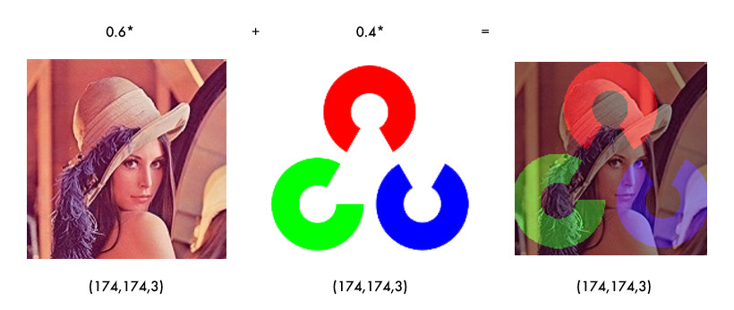

学习图片间的数学运算，图像混合。

## 9.1 目标

- 图片间的数学运算，如相加、按位运算等
- OpenCV 函数：`cv2.add()`, `cv2.addWeighted()`, `cv2.bitwise_and()`

## 9.2 教程

> 首先恭喜你已经完成了入门篇的学习噢，接下来我们学习一些 OpenCV 的基础内容，加油\(ง •\_•\)ง

### 9.2.1 图片相加

要叠加两张图片，可以用`cv2.add()`函数，相加两幅图片的形状（高度/宽度/通道数）必须相同。numpy 中可以直接用 res = img + img1 相加，但这两者的结果并不相同：

```python
import cv2
import numpy as np

x = np.uint8([250])
y = np.uint8([10])
print(cv2.add(x, y))  # 250+10 = 260 => 255, 大于 255 取 255
print(x + y)  # 250+10 = 260 % 256 = 4, 大于 255 取 255 的余数
```

如果是二值化图片（只有 0 和 255 两种值），两者结果是一样的（用 numpy 的方式更简便一些）。

### 9.2.2 图像混合

图像混合`cv2.addWeighted()`也是一种图片相加的操作，只不过两幅图片的权重不一样，γ 相当于一个修正值：

<!-- $$
dst = \alpha\times img1+\beta\times img2 + \gamma
$$ -->


```python
import cv2

img1 = cv2.imread('lena_small.jpg')
img2 = cv2.imread('opencv-logo-white.png')
res = cv2.addWeighted(img1, 0.6, img2, 0.4, 0)
cv2.imshow("imgMix", res)
```


> [!TIP]
> 
> α 和 β 都等于 1 时，就相当于图片相加。

### 9.2.3 按位操作

按位操作包括按位与/或/非/异或操作，有什么用途呢？比如说我们要实现下图的效果：


如果将两幅图片直接相加会改变图片的颜色，如果用图像混合，则会改变图片的透明度，所以我们需要用按位操作。首先来了解一下[掩膜](https://baike.baidu.com/item/%E6%8E%A9%E8%86%9C/8544392?fr=aladdin)（mask）的概念：掩膜是用一副二值化图片对另外一幅图片进行局部的遮挡，看下图就一目了然了：

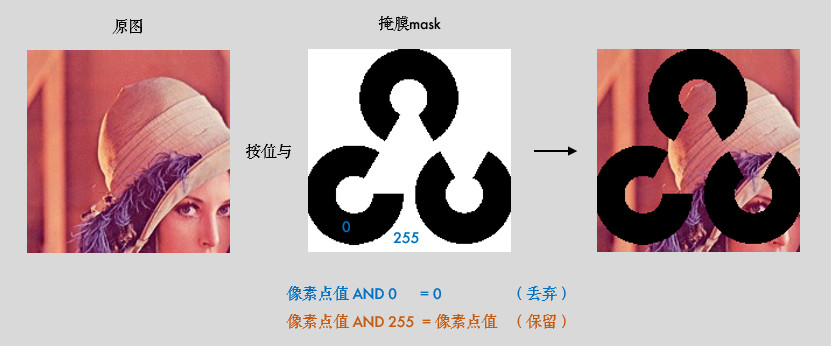

所以我们的思路就是把原图中要放 logo 的区域抠出来，再把 logo 放进去就行了：

```python
import cv2

img1 = cv2.imread('lena.jpg')
img2 = cv2.imread('opencv-logo-white.png')

# 把 logo 放在左上角，所以我们只关心这一块区域
rows, cols = img2.shape[:2]
roi = img1[:rows, :cols]

# 创建掩膜
img2gray = cv2.cvtColor(img2, cv2.COLOR_BGR2GRAY)
ret, mask = cv2.threshold(img2gray, 10, 255, cv2.THRESH_BINARY)
mask_inv = cv2.bitwise_not(mask)

# 保留除 logo 外的背景
img1_bg = cv2.bitwise_and(roi, roi, mask=mask_inv)
dst = cv2.add(img1_bg, img2)  # 进行融合
img1[:rows, :cols] = dst  # 融合后放在原图上
cv2.imshow('img1', img1)
cv2.waitKey(0)
```

> [!TIP]
> 
> 掩膜的概念在图像混合/叠加的场景下使用较多，可以多多练习噢！


## 9.3 小结

- `cv2.add()`用来叠加两幅图片，`cv2.addWeighted()`也是叠加两幅图片，但两幅图片的权重不一样。
- `cv2.bitwise_and()`, `cv2.bitwise_not()`, `cv2.bitwise_or()`, `cv2.bitwise_xor()`分别执行按位与/或/非/异或运算。掩膜就是用来对图片进行全局或局部的遮挡。

## 9.4 接口文档

- [cv2.add\(\)](https://docs.opencv.org/4.0.0/d2/de8/group__core__array.html#ga10ac1bfb180e2cfda1701d06c24fdbd6)
- [cv2.addWeighted\(\)](https://docs.opencv.org/4.0.0/d2/de8/group__core__array.html#gafafb2513349db3bcff51f54ee5592a19)
- [cv2.bitwise_and\(\)](https://docs.opencv.org/4.0.0/d2/de8/group__core__array.html#ga60b4d04b251ba5eb1392c34425497e14)
- [cv2.bitwise_not\(\)](https://docs.opencv.org/4.0.0/d2/de8/group__core__array.html#ga0002cf8b418479f4cb49a75442baee2f)

## 9.5 引用

- [掩膜](https://baike.baidu.com/item/%E6%8E%A9%E8%86%9C/8544392?fr=aladdin)


# 10 平滑图像


学习模糊/平滑图像，消除噪点。

## 10.1 目标

- 模糊/平滑图片来消除图片噪声
- OpenCV 函数：`cv2.blur()`, `cv2.GaussianBlur()`, `cv2.medianBlur()`, `cv2.bilateralFilter()`

## 10.2 教程

### 10.2.1 滤波与模糊

> 推荐大家先阅读：**8 番外篇：卷积基础 (图片边框)**，有助于理解卷积和滤波的概念。

关于滤波和模糊，很多人分不清，笔者来给大家理理（虽说如此，笔者后面也会混着用，,ԾㅂԾ,,）：

- 它们都属于卷积，不同滤波方法之间只是卷积核不同（对线性滤波而言）
- 低通滤波器是模糊，高通滤波器是锐化

**低通滤波器就是允许低频信号通过，在图像中边缘和噪点都相当于高频部分，所以低通滤波器用于去除噪点、平滑和模糊图像。高通滤波器则反之，用来增强图像边缘，进行锐化处理。**

> 常见噪声有 [椒盐噪声](https://baike.baidu.com/item/%E6%A4%92%E7%9B%90%E5%99%AA%E5%A3%B0/3455958?fr=aladdin) 和 [高斯噪声](https://baike.baidu.com/item/%E9%AB%98%E6%96%AF%E5%99%AA%E5%A3%B0)，椒盐噪声可以理解为斑点，随机出现在图像中的黑点或白点；高斯噪声可以理解为拍摄图片时由于光照等原因造成的噪声。

### 10.2.2 均值滤波

均值滤波是一种最简单的滤波处理，它取的是卷积核区域内元素的均值，用`cv2.blur()`实现，如 3×3 的卷积核：

<!-- $$
kernel = \frac{1}{9}\left[
 \begin{matrix}
   1 & 1 & 1 \newline
   1 & 1 & 1 \newline
   1 & 1 & 1
  \end{matrix}
  \right]
$$ -->


```python
img = cv2.imread('lena.jpg')
blur = cv2.blur(img, (3, 3))  # 均值模糊
```

> 所有的滤波函数都有一个可选参数 borderType，这个参数就是 **8 番外篇：卷积基础 (图片边框)** 中所说的边框填充方式。

### 10.2.3 方框滤波

方框滤波跟均值滤波很像，如 3×3 的滤波核如下：

<!-- $$
k = a\left[
 \begin{matrix}
   1 & 1 & 1 \newline
   1 & 1 & 1 \newline
   1 & 1 & 1
  \end{matrix}
  \right]
$$ -->


用`cv2.boxFilter()`函数实现，当可选参数 normalize 为 True 的时候，方框滤波就是均值滤波，上式中的 a 就等于 1/9；normalize 为 False 的时候，a=1，相当于求区域内的像素和。

```python
# 前面的均值滤波也可以用方框滤波实现：normalize=True
# img: 表示输入的图像，即要进行滤波处理的图像。
# -1: 表示输出图像的深度。如果为-1，表示输出图像的深度将与输入图像的深度相同。
# (3, 3): 卷积核（kernel）的大小。
# normalize=True: 这是一个布尔值，用于指定是否对卷积结果进行归一化。如果设置为True，将对卷积结果进行归一化，否则不进行归一化
blur = cv2.boxFilter(img, -1, (2, 2), normalize=False)
```

### 10.2.4 高斯滤波

前面两种滤波方式，卷积核内的每个值都一样，也就是说图像区域中每个像素的权重也就一样。高斯滤波的卷积核权重并不相同：中间像素点权重最高，越远离中心的像素权重越小。来，数学时间\( ╯□╰ \)，还记得标准正态分布的曲线吗？


显然这种处理元素间权值的方式更加合理一些。图像是 2 维的，所以我们需要使用[2 维的高斯函数](https://en.wikipedia.org/wiki/Gaussian_filter)。比如 OpenCV 中默认的 3×3 的高斯卷积核（具体原理和卷积核生成方式请参考文末的**番外小篇**）：

<!-- $$
k = \left[
 \begin{matrix}
   0.0625 & 0.125 & 0.0625 \newline
   0.125 & 0.25 & 0.125 \newline
   0.0625 & 0.125 & 0.0625
  \end{matrix}
  \right]
$$ -->


OpenCV 中对应函数为`cv2.GaussianBlur(src,ksize,sigmaX)`：

```python
img = cv2.imread('gaussian_noise.bmp')
# 均值滤波 vs 高斯滤波
blur = cv2.blur(img, (5, 5))  # 均值滤波
gaussian = cv2.GaussianBlur(img, (5, 5), 1)  # 高斯滤波
```

参数 3 sigmax 值越大，模糊效果越明显。高斯滤波相比均值滤波效率要慢，但可以有效消除高斯噪声，能保留更多的图像细节，所以经常被称为最有用的滤波器。均值滤波与高斯滤波的对比结果如下（均值滤波丢失的细节更多）：

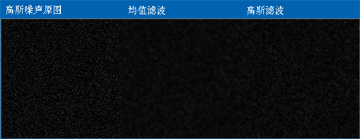

### 10.2.5 中值滤波

[中值](https://baike.baidu.com/item/%E4%B8%AD%E5%80%BC)又叫中位数，是所有数排序后取中间的值。中值滤波就是用区域内的中值来代替本像素值。所以那种孤立的斑点，如 0 或 255 很容易消除掉，适用于去除椒盐噪声和斑点噪声。中值是一种非线性操作，效率相比前面几种线性滤波要慢。

比如下面这张斑点噪声图，用中值滤波显然更好：

```python
img = cv2.imread('salt_noise.bmp', 0)
# 均值滤波 vs 中值滤波
blur = cv2.blur(img, (5, 5))  # 均值滤波
median = cv2.medianBlur(img, 5)  # 中值滤波
# img: 表示输入的图像，即要进行中值滤波处理的图像。
# 5: 表示在中值滤波过程中使用的核大小，核的大小决定了对每个像素周围的邻域进行排序并取中值的范围。
```


### 10.2.6 双边滤波

模糊操作基本都会损失掉图像细节信息，尤其前面介绍的线性滤波器，图像的边缘信息很难保留下来。然而，边缘（edge）信息是图像中很重要的一个特征，所以这才有了[双边滤波](https://baike.baidu.com/item/%E5%8F%8C%E8%BE%B9%E6%BB%A4%E6%B3%A2)。用`cv2.bilateralFilter()`函数实现：

```python
img = cv2.imread('lena.jpg')
# 双边滤波 vs 高斯滤波
gau = cv2.GaussianBlur(img, (5, 5), 0)  # 高斯滤波
blur = cv2.bilateralFilter(img, 9, 75, 75)  # 双边滤波
# img: 表示输入的图像，即要进行双边滤波处理的图像。
# 9: 表示在双边滤波中考虑的邻域直径。这是一个正整数，控制了在滤波过程中考虑的像素的范围。
# 75: 表示空间高斯函数的标准差，控制了像素在空间上的权重。较大的值意味着更远的像素将被考虑在内。
# 75: 表示灰度值相似性高斯函数的标准差，控制了像素值相似性的权重。较大的值表示更广泛的灰度范围将被考虑在内。
```


可以看到，双边滤波明显保留了更多边缘信息。

> 在图像处理中，边缘信息通常指的是图像中明显变化的区域，即像素值发生显著变化的地方。这些变化可能表示物体之间的边界或不同区域之间的过渡。边缘通常对于理解图像的结构和特征非常重要。
>
> 在图像中，边缘可以由以下几种情况引起：
>
> 1. **颜色或灰度的跳变：** 当图像中相邻区域的像素值发生显著变化时，这可能表示物体的边界。例如，在一张黑白图像中，物体与背景之间的灰度变化就可能形成边缘。
> 2. **纹理变化：** 图像中的纹理变化也可能导致边缘的出现。如果一个区域具有不同的纹理特征，与相邻区域相比，这也可能被认为是一个边缘。
> 3. **深度或阴影变化：** 在包含光照和阴影的图像中，深度变化或阴影的出现也可能导致边缘。
>
> 边缘信息对于许多图像处理任务非常重要，例如物体检测、分割、识别等。保留图像中的边缘信息可以帮助算法更好地理解图像内容，并提高对图像特征的提取和识别能力。在滤波操作中，双边滤波是一种能够平滑图像同时保留边缘信息的技术。

## 10.3 番外小篇：高斯滤波卷积核

要解释高斯滤波卷积核是如何生成的，需要先复习下概率论的知识（What？？又是数学\( ╯□╰ \)）

一维的高斯函数/正态分布`X~N(u,σ2)`：

<!-- $$
G(x)=\frac{1}{\sqrt{2\pi}\sigma}exp(-\frac{(x-\mu)^2}{2\sigma^2})
$$ -->


当`u=0,σ2=1`时，称为标准正态分布`X~N(0,1)`：

<!-- $$
G(x)=\frac{1}{\sqrt{2\pi}}exp(-\frac{x^2}{2})
$$ -->


二维 X/Y 相互独立的高斯函数：

<!-- $$
G(x,y)=\frac{1}{2\pi\sigma_x\sigma_y}exp(-\frac{(x-\mu_x)^2+(y-\mu_y)^2}{2\sigma_x\sigma_y})=G(x)G(y)
$$ -->


由上可知，**二维高斯函数具有可分离性**。所以 OpenCV 分两步计算二维高斯卷积，先水平再垂直，每个方向上都是一维的卷积。OpenCV 中这个一维卷积的计算公式类似于上面的一维高斯函数：

<!-- $$
G(i)=\alpha *exp(-\frac{(i-\frac{ksize-1}{2})^2}{2\sigma^2})
$$ -->


其中 i=0…ksize-1，α 是一个常数，也称为缩放因子，它使得(`ΣG(i)=1`)

比如我们可以用[`cv2.getGaussianKernel(ksize,sigma)`](https://docs.opencv.org/3.3.1/d4/d86/group__imgproc__filter.html#gac05a120c1ae92a6060dd0db190a61afa)来生成一维卷积核：

- sigma<=0 时，`sigma=0.3*((ksize-1)*0.5 - 1) + 0.8`
- sigma>0 时，sigma=sigma

```python
print(cv2.getGaussianKernel(3, 0))
# 结果：[[0.25][0.5][0.25]]
```

生成之后，先进行三次的水平卷积：

<!-- $$
I×\left[
 \begin{matrix}
   0.25 & 0.5 & 0.25 \newline
    0.25 & 0.5 & 0.25 \newline
   0.25 & 0.5 & 0.25
  \end{matrix}
  \right]
$$ -->


然后再进行垂直的三次卷积：

<!-- $$
I×\left[
 \begin{matrix}
   0.25 & 0.5 & 0.25 \newline
    0.25 & 0.5 & 0.25 \newline
   0.25 & 0.5 & 0.25
  \end{matrix}
  \right]×\left[
 \begin{matrix}
   0.25 & 0.25 & 0.25 \newline
    0.5 & 0.5 & 0.5 \newline
   0.25 & 0.25 & 0.25
  \end{matrix}
  \right] =I×\left[
 \begin{matrix}
   0.0625 & 0.125 & 0.0625 \newline
   0.125 & 0.25 & 0.125 \newline
   0.0625 & 0.125 & 0.0625
  \end{matrix}
  \right]
$$ -->


这就是 OpenCV 中高斯卷积核的生成方式。其实，OpenCV 源码中对小于 7×7 的核是直接计算好放在数组里面的，这样计算速度会快一点，感兴趣的可以看下源码：[getGaussianKernel()](https://docs.opencv.org/3.3.1/d4/d86/group__imgproc__filter.html#gac05a120c1ae92a6060dd0db190a61afa)

上面矩阵也可以写成：

<!-- $$
\frac{1}{16}\left[
 \begin{matrix}
   1& 2 & 1 \newline
   2 & 4 & 2 \newline
   1 & 2 & 1
  \end{matrix}
  \right]
$$ -->


## 10.4 小结

- 在不知道用什么滤波器好的时候，优先高斯滤波`cv2.GaussianBlur()`，然后均值滤波`cv2.blur()`。
- 斑点和椒盐噪声优先使用中值滤波`cv2.medianBlur()`。
- 要去除噪点的同时尽可能保留更多的边缘信息，使用双边滤波`cv2.bilateralFilter()`。
- 线性滤波方式：均值滤波、方框滤波、高斯滤波（速度相对快）。
- 非线性滤波方式：中值滤波、双边滤波（速度相对慢）。

## 10.5 接口文档

- [cv2.blur()](https://docs.opencv.org/4.0.0/d4/d86/group__imgproc__filter.html#ga8c45db9afe636703801b0b2e440fce37)
- [cv2.boxFilter()](https://docs.opencv.org/4.0.0/d4/d86/group__imgproc__filter.html#gad533230ebf2d42509547d514f7d3fbc3)
- [cv2.GaussianBlur()](https://docs.opencv.org/4.0.0/d4/d86/group__imgproc__filter.html#gaabe8c836e97159a9193fb0b11ac52cf1)
- [cv2.getGaussianKernel()](https://docs.opencv.org/4.0.0/d4/d86/group__imgproc__filter.html#gac05a120c1ae92a6060dd0db190a61afa)
- [cv2.medianBlur()](https://docs.opencv.org/4.0.0/d4/d86/group__imgproc__filter.html#ga564869aa33e58769b4469101aac458f9)
- [cv2.bilateralFilter()](https://docs.opencv.org/4.0.0/d4/d86/group__imgproc__filter.html#ga9d7064d478c95d60003cf839430737ed)

## 10.6 引用

- [图像平滑处理](http://www.opencv.org.cn/opencvdoc/2.3.2/html/doc/tutorials/imgproc/gausian_median_blur_bilateral_filter/gausian_median_blur_bilateral_filter.html)


# 11 边缘检测


学习使用 Canny 获取图像的边缘。

> Canny J . A Computational Approach To Edge Detection\[J\]. IEEE Transactions on Pattern Analysis and Machine Intelligence, 1986, PAMI-8\(6\):679-698.

## 11.1 目标

- Canny 边缘检测的简单概念
- OpenCV 函数：`cv2.Canny()`

## 11.2 教程

Canny 边缘检测方法常被誉为边缘检测的最优方法，废话不多说，先看个例子：

```python
import cv2
import numpy as np

img = cv2.imread('handwriting.jpg', 0)
edges = cv2.Canny(img, 30, 70)  # canny 边缘检测

cv2.imshow('Img->Canny', np.hstack((img, edges)))
cv2.waitKey(0)
```


`cv2.Canny()`进行边缘检测，参数 2、3 表示最低、高阈值，下面来解释下具体原理。

> [!TIP]
> 
> 之前我们用低通滤波的方式模糊了图片，那反过来，想得到物体的边缘，就需要用到高通滤波。推荐先阅读：**9 番外篇：图像梯度**。

### 11.2.1 Canny 边缘检测

Canny 边缘提取的具体步骤如下：

1 使用 5×5 高斯滤波消除噪声：

边缘检测本身属于锐化操作，对噪点比较敏感，所以需要进行平滑处理。高斯滤波的具体内容参考前一篇：**10 平滑图像**

<!-- $$
K=\frac{1}{256}\left[
 \begin{matrix}
   1 & 4 & 6 & 4 & 1 \newline
   4 & 16 & 24 & 16 & 4  \newline
   6 & 24 & 36 & 24 & 6  \newline
   4 & 16 & 24 & 16 & 4  \newline
   1 & 4 & 6 & 4 & 1
  \end{matrix}
  \right]
$$ -->


2 计算图像梯度的方向：

首先使用 Sobel 算子计算两个方向上的梯度`Gx`和`Gy`，然后算出梯度的方向：

<!-- $$
\theta=\arctan(\frac{G_y}{G_x})
$$ -->


保留这四个方向的梯度：0°/45°/90°/135°，有什么用呢？我们接着看。

3 取局部极大值：

梯度其实已经表示了轮廓，但为了进一步筛选，可以在上面的四个角度方向上再取局部极大值：


比如，A 点在 45° 方向上大于 B/C 点，那就保留它，把 B/C 设置为 0。

4 滞后阈值：

经过前面三步，就只剩下 0 和可能的边缘梯度值了，为了最终确定下来，需要设定高低阈值：


- 像素点的值大于最高阈值，那肯定是边缘（上图 A）
- 同理像素值小于最低阈值，那肯定不是边缘
- 像素值介于两者之间，如果与高于最高阈值的点连接，也算边缘，所以上图中 C 算，B 不算

Canny 推荐的高低阈值比在 2:1 到 3:1 之间。

### 11.2.2 先阈值分割后检测

其实很多情况下，阈值分割后再检测边缘，效果会更好：

```python
import cv2
import numpy as np

img = cv2.imread('handwriting.jpg', 0)
_, thresh = cv2.threshold(img, 0, 255, cv2.THRESH_BINARY + cv2.THRESH_OTSU)
edges = cv2.Canny(thresh, 30, 70)

cv2.imshow('Img->Threshold->Canny', np.hstack((img, thresh, edges)))
cv2.waitKey(0)
```

代码中笔者用了**4 番外篇：Otsu 阈值法**中的自动阈值分割。如果你不太了解，大可以使用传统的方法，不过如果是下面这种图片，推荐用 Otsu 阈值法。另外 Python 中某个值不用的话，就写个下划线'\_'。


## 11.3 练习

1. （选做）如果你不太理解高低阈值的效果，创建两个滑动条来调节它们的值看看：


## 11.4 小结

- Canny 是用的最多的边缘检测算法，用`cv2.Canny()`实现。

## 11.5 接口文档

- [cv2.Canny()](https://docs.opencv.org/4.0.0/dd/d1a/group__imgproc__feature.html#ga04723e007ed888ddf11d9ba04e2232de)

## 11.6 引用

- [Canny 边缘检测](http://www.opencv.org.cn/opencvdoc/2.3.2/html/doc/tutorials/imgproc/imgtrans/canny_detector/canny_detector.html)
- Canny J . A Computational Approach To Edge Detection\[J\]. IEEE Transactions on Pattern Analysis and Machine Intelligence, 1986, PAMI-8\(6\):679-698.


# 12 腐蚀与膨胀


学习常用形态学操作：腐蚀膨胀，开运算和闭运算。

## 12.1 目标

- 了解形态学操作的概念
- 学习膨胀、腐蚀、开运算和闭运算等形态学操作
- OpenCV 函数：`cv2.erode()`, `cv2.dilate()`, `cv2.morphologyEx()`

## 12.2 教程

### 12.2.1 啥叫形态学操作

形态学操作其实就是**改变物体的形状**，比如腐蚀就是"变瘦"，膨胀就是"变胖"，看下图就明白了：


> [!TIP]
> 
> 形态学操作一般作用于二值化图，来连接相邻的元素或分离成独立的元素。**腐蚀和膨胀是针对图片中的白色部分！**

### 12.2.2 腐蚀

腐蚀的效果是把图片"变瘦"，其原理是在原图的小区域内取局部最小值。因为是二值化图，只有 0 和 255，所以小区域内有一个是 0 该像素点就为 0：

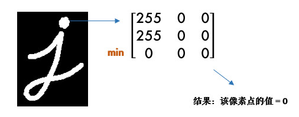

这样原图中边缘地方就会变成 0，达到了瘦身目的（小胖福利\(●ˇ∀ˇ●\)）

OpenCV 中用`cv2.erode()`函数进行腐蚀，只需要指定核的大小就行：

```python
import cv2
import numpy as np

img = cv2.imread('j.bmp', 0)
kernel = np.ones((5, 5), np.uint8)
erosion = cv2.erode(img, kernel)  # 腐蚀
cv2.imshow('Img->Erosion', np.hstack((img, erosion)))
cv2.waitKey(0)  
cv2.destroyAllWindows()
```

> 这个核也叫结构元素，因为形态学操作其实也是应用卷积来实现的。结构元素可以是矩形/椭圆/十字形，可以用`cv2.getStructuringElement()`来生成不同形状的结构元素，比如：

```python
kernel = cv2.getStructuringElement(cv2.MORPH_RECT, (5, 5))  # 矩形结构
kernel = cv2.getStructuringElement(cv2.MORPH_ELLIPSE, (5, 5))  # 椭圆结构
kernel = cv2.getStructuringElement(cv2.MORPH_CROSS, (5, 5))  # 十字形结构
```

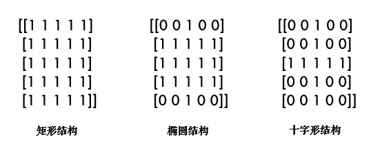

### 12.2.3 膨胀

膨胀与腐蚀相反，取的是局部最大值，效果是把图片"变胖"：

```python
dilation = cv2.dilate(img, kernel)  # 膨胀
```

### 12.2.4 开/闭运算

先腐蚀后膨胀叫开运算（因为先腐蚀会分开物体，这样容易记住），其作用是：分离物体，消除小区域。这类形态学操作用`cv2.morphologyEx()`函数实现：

```python
kernel = cv2.getStructuringElement(cv2.MORPH_RECT, (5, 5))  # 定义结构元素

img = cv2.imread('j_noise_out.bmp', 0)
opening = cv2.morphologyEx(img, cv2.MORPH_OPEN, kernel)  # 开运算
```

闭运算则相反：先膨胀后腐蚀（先膨胀会使白色的部分扩张，以至于消除"闭合"物体里面的小黑洞，所以叫闭运算）

```python
img = cv2.imread('j_noise_in.bmp', 0)
closing = cv2.morphologyEx(img, cv2.MORPH_CLOSE, kernel)  # 闭运算
```

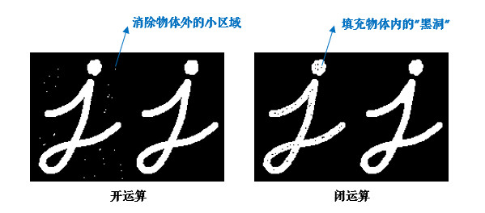

> [!TIP]
> 
> 很多人对开闭运算的作用不是很清楚（好吧，其实是比较容易混 ◑﹏◐）。且看上图 ↑：如果我们的目标物体外面有很多无关的小区域，就用开运算去除掉；如果物体内部有很多小黑洞，就用闭运算填充掉。


接下来的 3 种形态学操作并不常用，大家有兴趣可以看看（因为较短，没有做成番外篇）：

### 12.2.5 其他形态学操作

- 形态学梯度：膨胀图减去腐蚀图，`dilation - erosion`，这样会得到物体的轮廓：

```python
img = cv2.imread('school.bmp', 0)
gradient = cv2.morphologyEx(img, cv2.MORPH_GRADIENT, kernel)
```


- 顶帽：原图减去开运算后的图：`src - opening`

```python
tophat = cv2.morphologyEx(img, cv2.MORPH_TOPHAT, kernel)
```

- 黑帽：闭运算后的图减去原图：`closing - src`

```python
blackhat = cv2.morphologyEx(img, cv2.MORPH_BLACKHAT, kernel)
```

## 12.3 小结

- 形态学操作就是改变物体的形状，如腐蚀使物体"变瘦"，膨胀使物体"变胖"。
- 先腐蚀后膨胀会分离物体，所以叫开运算，常用来去除小区域物体。
- 先膨胀后腐蚀会消除物体内的小洞，所以叫闭运算。开/闭理解了之后很容易记忆噢\(⊙o⊙\)。

## 12.4 接口文档

- [cv2.erode()](https://docs.opencv.org/4.0.0/d4/d86/group__imgproc__filter.html#gaeb1e0c1033e3f6b891a25d0511362aeb)
- [cv2.getStructuringElement()](https://docs.opencv.org/4.0.0/d4/d86/group__imgproc__filter.html#gac342a1bb6eabf6f55c803b09268e36dc)
- [cv2.dilate()](https://docs.opencv.org/4.0.0/d4/d86/group__imgproc__filter.html#ga4ff0f3318642c4f469d0e11f242f3b6c)
- [cv2.MorphShapes](https://docs.opencv.org/4.0.0/d4/d86/group__imgproc__filter.html#gac2db39b56866583a95a5680313c314ad)
- [cv2.morphologyEx()](https://docs.opencv.org/4.0.0/d4/d86/group__imgproc__filter.html#ga67493776e3ad1a3df63883829375201f)
- [cv2.MorphTypes](https://docs.opencv.org/4.0.0/d4/d86/group__imgproc__filter.html#ga7be549266bad7b2e6a04db49827f9f32)

## 12.5 引用

- [Morphological Operations](http://homepages.inf.ed.ac.uk/rbf/HIPR2/morops.htm)
- [Computer Vision: Algorithms and Applications](http://szeliski.org/Book/)


# 13 轮廓


学习如何寻找并绘制轮廓。

## 13.1 目标

- 了解轮廓概念
- 寻找并绘制轮廓
- OpenCV 函数：`cv2.findContours()`, `cv2.drawContours()`

## 13.2 教程

### 13.2.1 啥叫轮廓

轮廓是一系列相连的点组成的曲线，代表了物体的基本外形。

谈起轮廓不免想到边缘，它们确实很像。简单的说，**轮廓是连续的，边缘并不全都连续**（下图）。其实边缘主要是作为图像的特征使用，比如可以用边缘特征区分脸和手，而轮廓主要用来分析物体的形态，比如物体的周长和面积等，可以说边缘包括轮廓。


寻找轮廓的操作一般用于二值化图，所以通常会使用阈值分割或 Canny 边缘检测先得到二值图。

> [!TIP]
> 
> **寻找轮廓是针对白色物体的**，一定要保证物体是白色，而背景是黑色，**不然很多人在寻找轮廓时会找到图片最外面的一个框**。


### 13.2.2 寻找轮廓

使用`cv2.findContours()`寻找轮廓：

```python
import cv2

img = cv2.imread('handwriting.jpg')
img_gray = cv2.cvtColor(img, cv2.COLOR_BGR2GRAY)
ret, thresh = cv2.threshold(img_gray, 0, 255, cv2.THRESH_BINARY_INV + cv2.THRESH_OTSU)

# 寻找二值化图中的轮廓
contours, hierarchy = cv2.findContours(
    thresh, cv2.RETR_TREE, cv2.CHAIN_APPROX_SIMPLE)
print(len(contours))  # 结果为 2
```

- 参数 2：轮廓的查找方式，一般使用 cv2.RETR_TREE，表示提取所有的轮廓并建立轮廓间的层级。更多请参考：[RetrievalModes](https://docs.opencv.org/4.0.0/d3/dc0/group__imgproc__shape.html#ga819779b9857cc2f8601e6526a3a5bc71)
- 参数 3：轮廓的近似方法。比如对于一条直线，我们可以存储该直线的所有像素点，也可以只存储起点和终点。使用 cv2.CHAIN_APPROX_SIMPLE 就表示用尽可能少的像素点表示轮廓。更多请参考：[ContourApproximationModes](https://docs.opencv.org/4.0.0/d3/dc0/group__imgproc__shape.html#ga4303f45752694956374734a03c54d5ff)
- 简便起见，这两个参数也可以直接用真值 3 和 2 表示。

函数有 2 个返回值，hierarchy 是轮廓间的层级关系（轮廓层级参看**10 番外篇：轮廓层级**），这两个暂时不用理会。我们主要看 contours，它就是找到的轮廓了，以数组形式存储，记录了每条轮廓的所有像素点的坐标\(x,y\)。


### 13.2.3 绘制轮廓

轮廓找出来后，为了方便观看，可以像前面图中那样用红色画出来：`cv2.drawContours()`

```python
cv2.drawContours(img, contours, -1, (0, 0, 255), 2)
```

其中参数 2 就是得到的 contours，参数 3 表示要绘制哪一条轮廓，-1 表示绘制所有轮廓，参数 4 是颜色（B/G/R 通道，所以\(0,0,255\) 表示红色），参数 5 是线宽，之前在绘制图形中介绍过。

> [!TIP]
> 
> 很多人画图时明明用了彩色，但没有效果，请检查你是在哪个图上画，画在灰度图和二值图上显然是没有彩色的\(⊙o⊙\)。


一般情况下，我们会首先获得要操作的轮廓，再进行轮廓绘制及分析：

```python
cnt = contours[1]
cv2.drawContours(img, [cnt], 0, (0, 0, 255), 2)
```

## 13.3 小结

- 轮廓特征非常有用，使用`cv2.findContours()`寻找轮廓，`cv2.drawContours()`绘制轮廓。

## 13.4 接口文档

- [cv2.findContours()](https://docs.opencv.org/4.0.0/d3/dc0/group__imgproc__shape.html#gadf1ad6a0b82947fa1fe3c3d497f260e0)
- [cv2.RetrievalModes](https://docs.opencv.org/4.0.0/d3/dc0/group__imgproc__shape.html#ga819779b9857cc2f8601e6526a3a5bc71)
- [cv2.ContourApproximationModes](https://docs.opencv.org/4.0.0/d3/dc0/group__imgproc__shape.html#ga4303f45752694956374734a03c54d5ff)
- [cv2.drawContours()](https://docs.opencv.org/4.0.0/d6/d6e/group__imgproc__draw.html#ga746c0625f1781f1ffc9056259103edbc)


# 14 轮廓特征


学习计算轮廓特征，如面积、周长、最小外接矩形等。

## 14.1 目标

- 计算物体的周长、面积、质心、最小外接矩形等
- OpenCV 函数：`cv2.contourArea()`, `cv2.arcLength()`, `cv2.approxPolyDP()` 等

## 14.2 教程

在计算轮廓特征之前，我们先用上一节的代码把轮廓找到：


```python
import cv2
import numpy as np

img = cv2.imread('handwriting.jpg', 0)
_, thresh = cv2.threshold(img, 0, 255, cv2.THRESH_BINARY_INV + cv2.THRESH_OTSU)
contours, hierarchy = cv2.findContours(thresh, 3, 2)

# 以数字 3 的轮廓为例
cnt = contours[0]
```

为了便于绘制，我们创建出两幅彩色图，并把轮廓画在第一幅图上：

```python
img_color1 = cv2.cvtColor(image, cv2.COLOR_GRAY2BGR)
img_color2 = np.copy(img_color1)
cv2.drawContours(img_color1, [cnt], 0, (0, 0, 255), 2)
```

### 14.2.1 轮廓面积

```python
area = cv2.contourArea(cnt)  
```

注意轮廓特征计算的结果并不等同于像素点的个数，而是根据几何方法算出来的，所以有小数。

> 如果统计二值图中像素点个数，应尽量避免循环，**可以使用`cv2.countNonZero()`**，更加高效。

### 14.2.2 轮廓周长

```python
perimeter = cv2.arcLength(cnt, True)  
```

参数 2 表示轮廓是否封闭，显然我们的轮廓是封闭的，所以是 True。

### 14.2.3 图像矩

矩可以理解为图像的各类几何特征，详情请参考：[Image Moments](http://en.wikipedia.org/wiki/Image_moment)

```python
M = cv2.moments(cnt)
```

M 中包含了很多轮廓的特征信息，比如 M\['m00'\] 表示轮廓面积，与前面`cv2.contourArea()`计算结果是一样的。质心也可以用它来算：

```python
cx, cy = M['m10'] / M['m00'], M['m01'] / M['m00']  
```

### 14.2.4 外接矩形

形状的外接矩形有两种，如下图。绿色的叫外接矩形，表示不考虑旋转并且能包含整个轮廓的矩形。蓝色的叫最小外接矩，考虑了旋转：


```python
x, y, w, h = cv2.boundingRect(cnt)  # 外接矩形
cv2.rectangle(img_color1, (x, y), (x + w, y + h), (0, 255, 0), 2)

rect = cv2.minAreaRect(cnt)  # 最小外接矩形
box = np.intp(cv2.boxPoints(rect))  # 矩形的四个角点取整
cv2.drawContours(img_color1, [box], 0, (255, 0, 0), 2)
```

其中 np.intp\(x\) 是把 x 取整的操作，比如 377.93 就会变成 377，也可以用 x.astype\(np.int\)。

### 14.2.5 最小外接圆

外接圆跟外接矩形一样，找到一个能包围物体的最小圆：

```python
(x, y), radius = cv2.minEnclosingCircle(cnt)
(x, y, radius) = np.intp((x, y, radius))  # 圆心和半径取整
cv2.circle(img_color2, (x, y), radius, (0, 0, 255), 2)
```

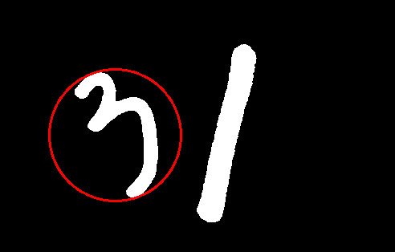

### 14.2.6 拟合椭圆

我们可以用得到的轮廓拟合出一个椭圆：

```python
ellipse = cv2.fitEllipse(cnt)
cv2.ellipse(img_color2, ellipse, (255, 255, 0), 2)
```


### 14.2.7 形状匹配

`cv2.matchShapes()`可以检测两个形状之间的相似度，返回**值越小，越相似**。先读入下面这张图片：


```python
img = cv2.imread('shapes.jpg', 0)
_, thresh = cv2.threshold(img, 0, 255, cv2.THRESH_BINARY + cv2.THRESH_OTSU)
contours, hierarchy = cv2.findContours(thresh, 3, 2)
img_color = cv2.cvtColor(thresh, cv2.COLOR_GRAY2BGR)  # 用于绘制的彩色图
```

图中有 3 条轮廓，我们用 A/B/C 表示：

```python
cnt_a, cnt_b, cnt_c = contours[0], contours[1], contours[2]
print(cv2.matchShapes(cnt_b, cnt_b, 1, 0.0))  # 0.0
print(cv2.matchShapes(cnt_b, cnt_c, 1, 0.0))  # 2.17e-05
print(cv2.matchShapes(cnt_b, cnt_a, 1, 0.0))  # 0.418
```

可以看到 BC 相似程度比 AB 高很多，并且图形的旋转或缩放并没有影响。其中，参数 3 是匹配方法，详情可参考：[ShapeMatchModes](https://docs.opencv.org/4.0.0/d3/dc0/group__imgproc__shape.html#gaf2b97a230b51856d09a2d934b78c015f)，参数 4 是 OpenCV 的预留参数，暂时没有实现，可以不用理会。

形状匹配是通过图像的 Hu 矩来实现的\(`cv2.HuMoments()`\)，大家如果感兴趣，可以参考：[Hu-Moments](http://en.wikipedia.org/wiki/Image_moment#Rotation_invariant_moments)

## 14.3 练习

1. 前面我们是对图片中的数字 3 进行轮廓特征计算的，大家换成数字 1 看看。
2. （选做）用形状匹配比较两个字母或数字（这相当于很简单的一个[OCR](https://baike.baidu.com/item/%E5%85%89%E5%AD%A6%E5%AD%97%E7%AC%A6%E8%AF%86%E5%88%AB/4162921?fr=aladdin&fromid=25995&fromtitle=OCR)噢）。

## 14.4 小结

常用的轮廓特征：

- `cv2.contourArea()`算面积，`cv2.arcLength()`算周长，`cv2.boundingRect()`算外接矩。
- `cv2.minAreaRect()`算最小外接矩，`cv2.minEnclosingCircle()`算最小外接圆。
- `cv2.matchShapes()`进行形状匹配。

## 14.5 接口文档

- [cv2.contourArea()](https://docs.opencv.org/4.0.0/d3/dc0/group__imgproc__shape.html#ga2c759ed9f497d4a618048a2f56dc97f1)
- [cv2.arcLength()](https://docs.opencv.org/4.0.0/d3/dc0/group__imgproc__shape.html#ga8d26483c636be6b35c3ec6335798a47c)
- [cv2.moments()](https://docs.opencv.org/4.0.0/d3/dc0/group__imgproc__shape.html#ga556a180f43cab22649c23ada36a8a139)
- [cv2.boundingRect()](https://docs.opencv.org/4.0.0/d3/dc0/group__imgproc__shape.html#ga103fcbda2f540f3ef1c042d6a9b35ac7)
- [cv2.minAreaRect()](https://docs.opencv.org/4.0.0/d3/dc0/group__imgproc__shape.html#ga3d476a3417130ae5154aea421ca7ead9)
- [cv2.minEnclosingCircle()](https://docs.opencv.org/4.0.0/d3/dc0/group__imgproc__shape.html#ga8ce13c24081bbc7151e9326f412190f1)
- [cv2.fitEllipse()](https://docs.opencv.org/4.0.0/d3/dc0/group__imgproc__shape.html#gaf259efaad93098103d6c27b9e4900ffa)
- [cv2.matchShapes()](https://docs.opencv.org/4.0.0/d3/dc0/group__imgproc__shape.html#gaadc90cb16e2362c9bd6e7363e6e4c317)
- [cv2.ShapeMatchModes](https://docs.opencv.org/4.0.0/d3/dc0/group__imgproc__shape.html#gaf2b97a230b51856d09a2d934b78c015f)


# 15 直方图


学习计算并绘制直方图，直方图均衡化等。

## 15.1 目标

- 计算并绘制直方图
- （自适应）直方图均衡化
- OpenCV 函数：`cv2.calcHist()`, `cv2.equalizeHist()`

## 15.2  教程

### 15.2.1 啥叫直方图

简单来说，直方图就是图像中每个像素值的个数统计，比如说一副灰度图中像素值为 0 的有多少个，1 的有多少个……


在计算直方图之前，有几个术语先来了解一下：

- dims: 要计算的通道数，对于灰度图 dims=1，普通彩色图 dims=3
- range: 要计算的像素值范围，一般为\[0,256\)
- bins: 子区段数目，如果我们统计 0~255 每个像素值，bins=256；如果划分区间，比如 0~15, 16~31 … 240~255 这样 16 个区间，bins=16

### 15.2.2 计算直方图

OpenCV 和 Numpy 中都提供了计算直方图的函数，我们对比下它们的性能。

#### 15.2.2.1 OpenCV 中直方图计算

使用`cv2.calcHist(images, channels, mask, histSize, ranges)`计算，其中：

- 参数 1：要计算的原图，以方括号的传入，如：\[img\]
- 参数 2：类似前面提到的 dims，灰度图写\[0\] 就行，彩色图 B/G/R 分别传入\[0\]/\[1\]/\[2\]
- 参数 3：要计算的区域，计算整幅图的话，写 None
- 参数 4：前面提到的 bins
- 参数 5：前面提到的 range

```python
import cv2
import numpy as np
import matplotlib.pyplot as plt

img = cv2.imread('hist.jpg', 0)
hist = cv2.calcHist([img], [0], None, [256], [0, 256])  # 性能：0.025288 s
```

#### 15.2.2.2 Numpy 中直方图计算

也可用 Numpy 的函数计算，其中[ravel\(\)](https://docs.scipy.org/doc/numpy/reference/generated/numpy.ravel.html)函数将二维矩阵展平变成一维数组，之前有提到过：

```python
hist, bins = np.histogram(img.ravel(), 256, [0, 256])  # 性能：0.020628 s
```

> [!TIP]
> 
> Numpy 中还有一种更高效的方式：(还记得怎么评估性能吗：**1 番外篇：代码性能优化**)


```python
hist = np.bincount(img.ravel(), minlength=256)  # 性能：0.003163 s
```

计算出直方图之后，怎么把它画出来呢？

### 15.2.3 绘制直方图

其实 Matplotlib 自带了一个计算并绘制直方图的功能，不需要用到上面的函数：

```python
plt.hist(img.ravel(), 256, [0, 256])
plt.show()
```

当然，也可以用前面计算出来的结果绘制：

```python
plt.plot(hist)
plt.show()
```


从直方图上可以看到图片的大部分区域集中在 150 偏白的附近，这其实并不是很好的效果，下面我们来看看如何改善它。

> 使用 OpenCV 的画线功能也可以画直方图，不过太麻烦了，有兴趣的可以看下官方示例：[hist.py](https://github.com/opencv/opencv/blob/master/samples/python/hist.py)。

### 15.2.4 直方图均衡化

一副效果好的图像通常在直方图上的分布比较均匀，直方图均衡化就是用来改善图像的全局亮度和对比度。其实从观感上就可以发现，前面那幅图对比度不高，偏灰白。对均衡化算法感兴趣的同学可参考：[维基百科：直方图均衡化](https://zh.wikipedia.org/wiki/%E7%9B%B4%E6%96%B9%E5%9B%BE%E5%9D%87%E8%A1%A1%E5%8C%96)


```python
equ = cv2.equalizeHist(img)
```

OpenCV 中用`cv2.equalizeHist()`实现均衡化。我们把两张图片并排显示，对比一下：

```python
cv2.imshow('equalization', np.hstack((img, equ)))  # 并排显示
cv2.waitKey(0)
```


可以看到均衡化后图片的亮度和对比度效果明显好于原图。

### 15.2.5 自适应均衡化

不难看出来，直方图均衡化是应用于整幅图片的，会有什么问题呢？看下图：


很明显，因为全局调整亮度和对比度的原因，脸部太亮，大部分细节都丢失了。

自适应均衡化就是用来解决这一问题的：它在每一个小区域内（默认 8×8）进行直方图均衡化。当然，如果有噪点的话，噪点会被放大，需要对小区域内的对比度进行了限制，所以这个算法全称叫：**对比度受限的自适应直方图均衡化**CLAHE\([Contrast Limited Adaptive Histogram Equalization](https://en.wikipedia.org/wiki/Adaptive_histogram_equalization)\)。

```python
# 自适应均衡化，参数可选
clahe = cv2.createCLAHE(clipLimit=2.0, tileGridSize=(8, 8))
# clipLimit: 表示阈值，用于限制对比度的增强。对比度限制是CLAHE算法的一个重要参数，它控制了每个像素周围直方图均衡化的程度。较大的值将导致更强烈的限制，可能防止过度增强对比度。
# tileGridSize: 这是用于图像分割的瓦片（tile）的大小。图像将被分成多个瓦片，每个瓦片将独立进行直方图均衡化。tileGridSize指定了这些瓦片的大小，它是一个包含两个整数的元组，表示瓦片的行数和列数

cl1 = clahe.apply(img)
```

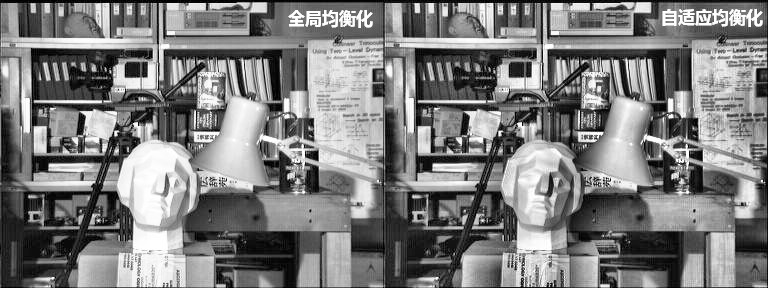

## 15.3 练习

1. `cv2.calcHist()`函数中的参数 3 是指要计算的区域\(mask：目标区域白色，其余黑色\)，编写一个只计算图片左上角 200×200 区域直方图的程序。


## 15.4 小结

- 直方图是一种分析图像的手段。
- `cv2.calcHist()`和`numpy.bincount()`均可用来计算直方图，使用 Matplotlib 绘制直方图。
- 均衡化用来使图像的直方图分布更加均匀，提升亮度和对比度。

## 15.5 引用

- [维基百科：直方图均衡化](https://zh.wikipedia.org/wiki/%E7%9B%B4%E6%96%B9%E5%9B%BE%E5%9D%87%E8%A1%A1%E5%8C%96)
- [维基百科：自适应直方图均衡化](https://en.wikipedia.org/wiki/Adaptive_histogram_equalization)
- [Cambridge in Color website](http://www.cambridgeincolour.com/tutorials/histograms1.htm)


# 16 模板匹配

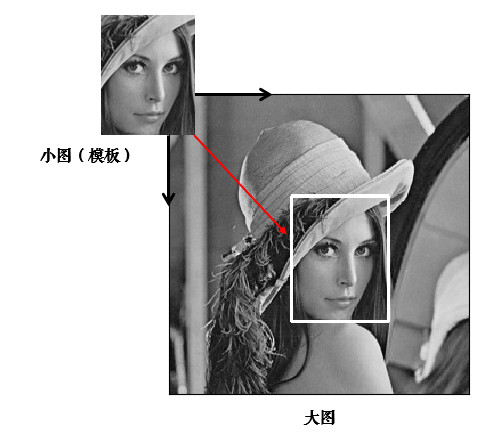

学习使用模板匹配在图像中寻找物体。

## 16.1 目标

- 使用模板匹配在图像中寻找物体
- OpenCV 函数：`cv2.matchTemplate()`, `cv2.minMaxLoc()`

## 16.2 教程

### 16.2.1 模板匹配

[模板匹配](https://baike.baidu.com/item/模板匹配)就是用来在大图中找小图，也就是说在一副图像中寻找另外一张模板图像的位置：


用`cv2.matchTemplate()`实现模板匹配。首先我们来读入图片和模板：

```python
import cv2
import numpy as np
from matplotlib import pyplot as plt

img = cv2.imread('lena.jpg', 0)
template = cv2.imread('face.jpg', 0)
h, w = template.shape[:2]  # rows->h, cols->w
```

匹配函数返回的是一副灰度图，最白的地方表示最大的匹配。使用`cv2.minMaxLoc()`函数可以得到最大匹配值的坐标，以这个点为左上角角点，模板的宽和高画矩形就是匹配的位置了：

```python
# 相关系数匹配方法：cv2.TM_CCOEFF
res = cv2.matchTemplate(img, template, cv2.TM_CCOEFF)
min_val, max_val, min_loc, max_loc = cv2.minMaxLoc(res)

left_top = max_loc  # 左上角
right_bottom = (left_top[0] + w, left_top[1] + h)  # 右下角
cv2.rectangle(img, left_top, right_bottom, 255, 2)  # 画出矩形位置
```


### 16.2.2 原理

> 这部分可看可不看，不太理解也没关系，还记得前面的方法吗？不懂得就划掉\(✿◕‿◕✿\)

模板匹配的原理其实很简单，就是不断地在原图中移动模板图像去比较，有 6 种不同的比较方法，详情可参考：[TemplateMatchModes](https://docs.opencv.org/3.3.1/df/dfb/group__imgproc__object.html#ga3a7850640f1fe1f58fe91a2d7583695d)

- 平方差匹配 CV_TM_SQDIFF：用两者的平方差来匹配，最好的匹配值为 0
- 归一化平方差匹配 CV_TM_SQDIFF_NORMED
- 相关匹配 CV_TM_CCORR：用两者的乘积匹配，数值越大表明匹配程度越好
- 归一化相关匹配 CV_TM_CCORR_NORMED
- 相关系数匹配 CV_TM_CCOEFF：用两者的相关系数匹配，1 表示完美的匹配，-1 表示最差的匹配
- 归一化相关系数匹配 CV_TM_CCOEFF_NORMED

归一化的意思就是将值统一到 0~1。模板匹配也是应用卷积来实现的：假设原图大小为 W×H，模板图大小为 w×h，那么生成图大小是\(W-w+1\)×\(H-h+1\)，生成图中的每个像素值表示原图与模板的匹配程度。

### 16.2.3 匹配多个物体

前面我们是找最大匹配的点，所以只能匹配一次。我们可以设定一个匹配阈值来匹配多次：

```python
# 1.读入原图和模板
img_rgb = cv2.imread('mario.jpg')
img_gray = cv2.cvtColor(img_rgb, cv2.COLOR_BGR2GRAY)
template = cv2.imread('mario_coin.jpg', 0)
h, w = template.shape[:2]

# 2.标准相关模板匹配
res = cv2.matchTemplate(img_gray, template, cv2.TM_CCOEFF_NORMED)
threshold = 0.8

# 3.这边是 Python/Numpy 的知识，后面解释
loc = np.where(res >= threshold)  # 匹配程度大于%80 的坐标 y,x
for pt in zip(*loc[::-1]):  # *号表示可选参数
    right_bottom = (pt[0] + w, pt[1] + h)
    cv2.rectangle(img_rgb, pt, right_bottom, (0, 0, 255), 2)
```


第 3 步有几个 Python/Numpy 的重要知识，来大致看下：

- [np.where\(\)](https://docs.scipy.org/doc/numpy/reference/generated/numpy.where.html)在这里返回 res 中值大于 0.8 的所有坐标，如：

```python
x = np.arange(9.).reshape(3, 3)
print(np.where(x > 5))
# 结果 (先 y 坐标，再 x 坐标)：(array([2, 2, 2]), array([0, 1, 2]))
```


- [zip\(\)](https://docs.python.org/3/library/functions.html#zip)函数，功能强大到难以解释，举个简单例子就知道了：

```python
x = [1, 2, 3]
y = [4, 5, 6]
print(list(zip(x, y)))  # [(1, 4), (2, 5), (3, 6)]
```

这样大家就能理解前面代码的用法了吧：因为 loc 是先 y 坐标再 x 坐标，所以用 loc\[::-1\] 翻转一下，然后再用 zip 函数拼接在一起。

## 16.3 练习

1. 之前我们有学过形状匹配，不论形状旋转/缩放都可以匹配到。思考一下，图片旋转或缩放的话模板匹配还有作用吗？

## 16.4 小结

- 模板匹配用来在大图中找小图。
- `cv2.matchTemplate()`用来进行模板匹配。

## 16.5 引用

- [模板匹配](http://www.opencv.org.cn/opencvdoc/2.3.2/html/doc/tutorials/imgproc/histograms/template_matching/template_matching.html#template-matching)
- [TemplateMatchModes](https://docs.opencv.org/3.3.1/df/dfb/group__imgproc__object.html#ga3a7850640f1fe1f58fe91a2d7583695d)


# 17 霍夫变换


学习使用霍夫变换识别出图像中的直线和圆。

## 17.1 目标

- 理解霍夫变换的实现
- 分别使用霍夫线变换和圆变换检测图像中的直线和圆
- OpenCV 函数：`cv2.HoughLines()`, `cv2.HoughLinesP()`, `cv2.HoughCircles()`

## 17.2 教程

### 17.2.1 理解霍夫变换

霍夫变换常用来在图像中提取直线和圆等几何形状，笔者来做个简易的解释：


学过几何的都知道，直线可以分别用直角坐标系和极坐标系来表示：

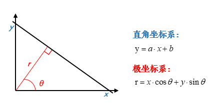

那么经过某个点`(x0,y0)`的所有直线都可以用这个式子来表示：

<!-- $$
r_\theta=x_0\cdot\cos \theta+y_0\cdot\sin \theta
$$ -->


也就是说每一个`(r,θ)`都表示一条经过`(x0,y0)`直线，那么同一条直线上的点必然会有同样的`(r,θ)`。如果将某个点所有的`(r,θ)`绘制成下面的曲线，那么同一条直线上的点的`(r,θ)`曲线会相交于一点：


OpenCV 中首先计算`(r,θ)`累加数，累加数超过一定值后就认为在同一直线上。

> 霍夫变换通过将图像中的每个点映射到一个累加器空间（Hough空间）中，通过在该空间中累加点的信息，可以找到对应于在图像中共线的点的直线参数。对于直线检测，通常使用极坐标表示直线，即`(r, θ)`，其中`r`是从原点到直线的距离，`θ`是直线与水平轴的夹角。
>
> 在霍夫直线检测中，计算`(r, θ)`累加数的过程如下：
>
> 1. 对于图像中的每个边缘点，计算`(r, θ)`空间上的可能直线参数。
> 2. 对于每个边缘点的`(r, θ)`，在霍夫空间中进行累加，增加相应位置的计数器。
> 3. 当某个`(r, θ)`位置的计数超过了一个阈值（通常设定的阈值），则认为在霍夫空间中找到了一个共线的点组，对应于一条直线。
>
> 这种方法的思想是，如果在图像中存在一条直线，那么通过这条直线上的点在霍夫空间中形成的曲线就会交于一点或者一组点，而其他非共线的点则会在霍夫空间中形成零散的计数。
>
> 霍夫变换的优点是对于存在噪声、间断和部分遮挡的图像中的直线检测仍然较为鲁棒。

### 17.2.2 霍夫直线变换

OpenCV 中用`cv2.HoughLines()`在二值图上实现霍夫变换，函数返回的是一组直线的`(r,θ)`数据：

```python
import cv2
import numpy as np

# 加载图片，转为二值图
img = cv2.imread('shapes.jpg')
drawing = np.zeros(img.shape[:], dtype=np.uint8)
gray = cv2.cvtColor(img, cv2.COLOR_BGR2GRAY)
edges = cv2.Canny(gray, 50, 150)

# 霍夫直线变换
lines = cv2.HoughLines(edges, 0.8, np.pi / 180, 90)
```

函数中：

- 参数 1：要检测的二值图（一般是阈值分割或边缘检测后的图）
- 参数 2：距离 r 的精度，值越大，考虑越多的线
- 参数 3：角度 θ 的精度，值越小，考虑越多的线
- 参数 4：累加数阈值，值越小，考虑越多的线

```python
# 将检测的线画出来（注意是极坐标噢）
for line in lines:
    rho, theta = line[0]
    a = np.cos(theta)
    b = np.sin(theta)
    x0 = a * rho
    y0 = b * rho
    x1 = int(x0 + 1000 * (-b))
    y1 = int(y0 + 1000 * (a))
    x2 = int(x0 - 1000 * (-b))
    y2 = int(y0 - 1000 * (a))

    cv2.line(drawing, (x1, y1), (x2, y2), (0, 0, 255))
```


### 17.2.3 统计概率霍夫直线变换

前面的方法又称为标准霍夫变换，它会计算图像中的每一个点，计算量比较大，另外它得到的是整一条线（r 和 θ），并不知道原图中直线的端点。所以提出了统计概率霍夫直线变换\(Probabilistic Hough Transform\)，是一种改进的霍夫变换：

```python
drawing = np.zeros(img.shape[:], dtype=np.uint8)
# 统计概率霍夫线变换
lines = cv2.HoughLinesP(edges, 0.8, np.pi / 180, 90,
                        minLineLength=50, maxLineGap=10)
```

前面几个参数跟之前的一样，有两个可选参数：

- `minLineLength`：最短长度阈值，比这个长度短的线会被排除
- `maxLineGap`：同一直线两点之间的最大距离

```python
# 将检测的线画出来
for line in lines:
    x1, y1, x2, y2 = line[0]
    cv2.line(drawing, (x1, y1), (x2, y2), (0, 255, 0), 1, lineType=cv2.LINE_AA)
```

`cv2.LINE_AA`在之前绘图功能中讲解过，表示抗锯齿线型。

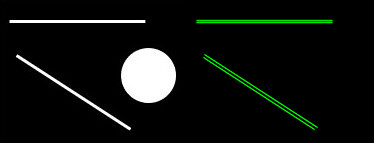

### 17.2.4 霍夫圆变换

霍夫圆变换跟直线变换类似，只不过线是用`(r, θ)`表示，圆是用`(x_center, y_center, r)`来表示，从二维变成了三维，数据量变大了很多；所以一般使用霍夫梯度法减少计算量，对该算法感兴趣的同学可参考：[Circle Hough Transform](https://en.wikipedia.org/wiki/Circle_Hough_Transform)

```python
drawing = np.zeros(img.shape[:], dtype=np.uint8)
# 霍夫圆变换
circles = cv2.HoughCircles(edges, cv2.HOUGH_GRADIENT, 1, 20, param2=30)
circles = np.intp(np.around(circles))
```

其中，

- 参数 2：变换方法，一般使用霍夫梯度法，详情：[HoughModes](https://docs.opencv.org/3.3.1/d7/dbd/group__imgproc.html#ga073687a5b96ac7a3ab5802eb5510fe65)
- 参数 3 dp=1：表示霍夫梯度法中累加器图像的分辨率与原图一致
- 参数 4：两个不同圆圆心的最短距离
- 参数 5：param2 跟霍夫直线变换中的累加数阈值一样

```python
# 将检测的圆画出来
for i in circles[0, :]:
    cv2.circle(drawing, (i[0], i[1]), i[2], (0, 255, 0), 2)  # 画出外圆
    cv2.circle(drawing, (i[0], i[1]), 2, (0, 0, 255), 3)  # 画出圆心
```


## 17.3 小结

- 霍夫变换用来提取图像中的直线和圆等几何形状。
- 霍夫直线变换：`cv2.HoughLines()`（整条直线）, `cv2.HoughLinesP()`。
- 霍夫圆变换：`cv2.HoughCircles()`。

## 17.4 引用

- [Hough transform](https://en.wikipedia.org/wiki/Hough_transform)
- [经典霍夫变换（Hough Transform）](https://blog.csdn.net/YuYunTan/article/details/80141392)


# 7 番外篇：亮度与对比度

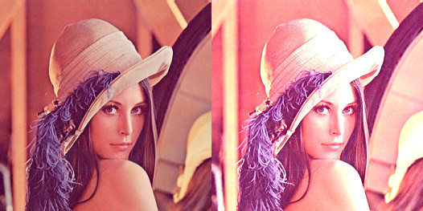

学习如何调整图片的亮度和对比度。

## 7.1 亮度与对比度

亮度调整是将图像像素的强度整体变大/变小，对比度调整指的是图像暗处的像素强度变低，亮处的像素强度变高，从而拓宽某个区域内的显示精度。

OpenCV 中亮度和对比度应用这个公式来计算：`g(x)=αf(x)+β`，其中：`α`、`β`常称为增益与偏置值，分别控制图片的对比度和亮度。

> [!TIP]
> 
> 此处对 α/β 控制对比度和亮度有争议，具体请参考：[OpenCV 关于对比度和亮度的误解](http://blog.csdn.net/abc20002929/article/details/40474807)。


```python
import cv2
import numpy as np

img = cv2.imread('lena.jpg')
# 此处需注意，请参考后面的解释
res = np.uint8(np.clip((1.5 * img + 10), 0, 255))
tmp = np.hstack((img, res))  # 两张图片横向合并（便于对比显示）

cv2.imshow('Img->ContrastBrightness', tmp)
cv2.waitKey(0)
```

还记得图像混合那一节中 numpy 对数据溢出的取模处理吗？`250+10 = 260 => 260%256=4`。它并不适用于我们的图像处理，所以用 [np.clip\(\)](https://docs.scipy.org/doc/numpy/reference/generated/numpy.clip.html#numpy.clip) 函数将数据限定：`a<0 => a=0, a>255 => a=255`。


## 7.2 练习

1. 创建两个滑动条分别调整对比度和亮度（对比度范围：0~0.3，亮度：0~100）。提示：因为滑动条没有小数，所以可以设置为 0~300，然后乘以 0.01。
2. 亮度/对比度用 C++实现也很有趣，推荐阅读：[OpenCV 改变图像亮度和对比度以及优化](http://blog.csdn.net/u013139259/article/details/52145377)。

## 7.3 引用

- [numpy.clip()](https://docs.scipy.org/doc/numpy/reference/generated/numpy.clip.html#numpy.clip)
- [OpenCV 关于对比度和亮度的误解](http://blog.csdn.net/abc20002929/article/details/40474807)
- [OpenCV 改变图像亮度和对比度以及优化](http://blog.csdn.net/u013139259/article/details/52145377)
- [Mat::convertTo](https://docs.opencv.org/3.1.0/d3/d63/classcv_1_1Mat.html#a3f356665bb0ca452e7d7723ccac9a810)


# 8 番外篇：卷积基础 - 图片边框


了解卷积/滤波的基础知识，给图片添加边框。

卷积的概念其实很好理解，下面我就给大家做个最简单的解释，绝对轻松加愉快的辣 o\(_￣ ▽ ￣_\)o

## 8.1 卷积

什么是二维卷积呢？看下面一张图就一目了然：


卷积就是循环对**图像跟一个核逐个元素相乘再求和得到另外一副图像的操作**，比如结果图中第一个元素 5 是怎么算的呢？原图中 3×3 的区域与 3×3 的核逐个元素相乘再相加：

<!-- $$
5=1\times1+2\times0+1\times0+0\times0+1\times0+1\times0+3\times0+0\times0+2\times2
$$ -->


算完之后，整个框再往右移一步继续计算，横向计算完后，再往下移一步继续计算……网上有一副很经典的动态图，方便我们理解卷积：


## 8.2 padding

不难发现，前面我们用 3×3 的核对一副 6×6 的图像进行卷积，得到的是 4×4 的图，图片缩小了！那怎么办呢？我们可以**把原图扩充一圈，再卷积，这个操作叫填充 padding**。

> 事实上，原图为 n×n，卷积核为 f×f，最终结果图大小为\(n-f+1\) × \(n-f+1\)。


那么扩展的这一层应该填充什么值呢？OpenCV 中有好几种填充方式，都使用`cv2.copyMakeBorder()`函数实现，一起来看看。

## 8.3 添加边框

`cv2.copyMakeBorder()`用来给图片添加边框，它有下面几个参数：

- src：要处理的原图
- top, bottom, left, right：上下左右要扩展的像素数
- **borderType**：边框类型，这个就是需要关注的填充方式，详情请参考：[BorderTypes](https://docs.opencv.org/3.3.1/d2/de8/group__core__array.html#ga209f2f4869e304c82d07739337eae7c5)

其中默认方式和固定值方式最常用，我们详细说明一下：

### 8.3.1 固定值填充

顾名思义，`cv2.BORDER_CONSTANT`这种方式就是边框都填充成一个固定的值，比如下面的程序都填充 0：

```python
img = cv2.imread('6_by_6.bmp', 0)
print(img)

# 固定值边框，统一都填充 0 也称为 zero padding
cons = cv2.copyMakeBorder(img, 1, 1, 1, 1, cv2.BORDER_CONSTANT, value=0)
print(cons)
```


### 8.3.2 默认边框类型

默认边框`cv2.BORDER_DEFAULT`其实是取镜像对称的像素填充，比较拗口，一步步解释：

```python
default = cv2.copyMakeBorder(img, 1, 1, 1, 1, cv2.BORDER_DEFAULT)
print(default)
```

首先进行上下填充，填充成与原图像边界对称的值，如下图：


同理再进行左右两边的填充，最后把四个顶点补充上就好了：


> [!TIP]
> 
> 一般情况下默认方式更加合理，因为边界的像素值更加接近。具体应视场合而定。


## 8.4 OpenCV 进行卷积

OpenCV 中用`cv2.filter2D()`实现卷积操作，比如我们的核是下面这样（3×3 区域像素的和除以 10）：

<!-- $$
M = \frac{1}{10}\left[
 \begin{matrix}
   1 & 1 & 1 \newline
   1 & 1 & 1 \newline
   1 & 1 & 1
  \end{matrix}
  \right] \tag{3}
$$ -->


```python
img = cv2.imread('lena.jpg')
# 定义卷积核
kernel = np.ones((3, 3), np.float32) / 10
# 卷积操作，-1 表示通道数与原图相同
dst = cv2.filter2D(img, -1, kernel)
```


可以看到这个核对图像进行了模糊处理，这是卷积的众多功能之一。当然卷积还有很多知识没有学到，后面我们再继续深入。

## 8.5 练习

1. 尝试给"lena.jpg"添加几种不同的边框类型，对比下效果。

## 8.6 引用

- [图像卷积与滤波的一些知识点](http://blog.csdn.net/zouxy09/article/details/49080029)


# 9 番外篇：图像梯度


了解图像梯度和边缘检测的相关概念。

还记得前面**10 平滑图像**中提到的滤波与模糊的区别吗？我们说低通滤波器是模糊，高通滤波器是锐化，这节我们就来看看高通滤波器。

## 9.1 [图像梯度](https://baike.baidu.com/item/图像梯度/8528837?fr=aladdin)

如果你还记得高数中用一阶导数来求极值的话，就很容易理解了。**把图片想象成连续函数，因为边缘部分的像素值是与旁边像素明显有区别的，所以对图片局部求极值，就可以得到整幅图片的边缘信息了**。不过图片是二维的离散函数，导数就变成了差分，这个差分就称为图像的梯度。

当然，大部分人应该是早忘记高数了\(￣ ▽ ￣\)"，所以看不懂的话，就把上面的解释划掉，我们重新从卷积的角度来看看。

### 9.1.1 垂直边缘提取

滤波是应用卷积来实现的，卷积的关键就是卷积核，我们来考察下面这个卷积核：

<!-- $$
k1 = \left[
 \begin{matrix}
   -1 & 0 & 1 \newline
   -2 & 0 & 2 \newline
   -1 & 0 & 1
  \end{matrix}
  \right]
$$ -->


这个核是用来提取图片中的垂直边缘的，怎么做到的呢？看下图：


上图中进行了2次卷积操作，第一次卷积结果为-290，取为0；第二次卷积结果为930，取为255。卷积的结果就是垂直方向上的梯度值，即边缘的强度。由于边缘的值明显小于（或大于）周边像素，所以边缘的差分结果会明显不同，这样就提取出了垂直边缘。同理，把上面那个矩阵转置一下，就是提取水平边缘。这种差分操作就称为图像的梯度计算：

<!-- $$
k2 = \left[
 \begin{matrix}
   -1 & -2 & -1 \newline
   0 & 0 & 0 \newline
   1 & 2 & 1
  \end{matrix}
  \right]
$$ -->


> 还记得滤波函数`cv2.filter2D()`吗？（**08 番外篇：卷积基础 - 图片边框**）我们来手动实现上面的功能：

```python
img = cv2.imread('sudoku.jpg', 0)

# 进行垂直边缘提取
kernel = np.array([[-1, 0, 1],
                   [-2, 0, 2],
                   [-1, 0, 1]], dtype=np.float32)
dst_v = cv2.filter2D(img, -1, kernel)
# 进行水平边缘提取
dst_h = cv2.filter2D(img, -1, kernel.T)
# 横向并排对比显示
cv2.imshow('Img->EdgeVertical->EdgeHorizontal', np.hstack((img, dst_v, dst_h)))
cv2.waitKey(0)
```

### 9.1.2 Sobel 算子

上面的这种差分方法就叫[Sobel 算子](https://baike.baidu.com/item/Sobel%E7%AE%97%E5%AD%90/11000092?fr=aladdin)，它先在垂直方向计算梯度`Gx=k1×src`，再在水平方向计算梯度`Gy=k2×src`，最后求出总梯度：`G=sqrt{Gx^2+Gy^2}`

我们可以把前面的代码用 Sobel 算子更简单地实现：

```python
sobelx = cv2.Sobel(img, -1, 1, 0, ksize=3)  # 只计算 x 方向
sobely = cv2.Sobel(img, -1, 0, 1, ksize=3)  # 只计算 y 方向
# img: 表示输入的图像，即要应用Sobel算子的图像。
# -1: 表示深度（depth）参数，表示输出图像的深度。如果为-1，表示输出图像的深度将与输入图像的深度相同。
# 0: 表示在x方向上的差分阶数，表示Sobel算子在水平方向上的导数。在这种情况下，设置为0表示不在x方向上进行差分。
# 1: 表示在y方向上的差分阶数，表示Sobel算子在垂直方向上的导数。在这种情况下，它用于计算图像中每个像素在y方向上的梯度。
# ksize=3: 这是Sobel核的大小，即核的尺寸。
```

> [!TIP]
> 
> 很多人疑问，Sobel 算子的卷积核这几个值是怎么来的呢？事实上，并没有规定，你可以用你自己的。


比如，最初只利用领域间的原始差值来检测边缘的[Prewitt 算子](https://baike.baidu.com/item/Prewitt%E7%AE%97%E5%AD%90/8415245?fr=aladdin)：

<!-- $$
K = \left[
 \begin{matrix}
   -1 & 0 & 1 \newline
   -1 & 0 & 1 \newline
   -1 & 0 & 1
  \end{matrix}
  \right]
$$ -->


还有比 Sobel 更好用的**Scharr 算子**，大家可以了解下：

<!-- $$
K = \left[
 \begin{matrix}
   -3 & 0 & 3 \newline
   -10 & 0 & 10 \newline
   -3 & 0 & 3
  \end{matrix}
  \right]
$$ -->


这些算法都是一阶边缘检测的代表，网上也有算子之间的对比资料，有兴趣的可参考文末引用。

### 9.1.3 Laplacian 算子

高数中用一阶导数求极值，在这些极值的地方，二阶导数为 0，所以也可以通过求二阶导计算梯度：

<!-- $$
dst=\frac{\partial^2 f}{\partial x^2}+\frac{\partial^2 f}{\partial y^2}
$$ -->


一维的一阶和二阶差分公式分别为：

<!-- $$
\frac{\partial f}{\partial x}=f(x+1)-f(x)
$$ -->


<!-- $$
\frac{\partial^2 f}{\partial x^2}=f(x+1)+f(x-1)-2f(x)
$$ -->


提取前面的系数，那么一维的 Laplacian 滤波核是：

<!-- $$
K=\left[
 \begin{matrix}
   1 & -2 & 1
  \end{matrix}
  \right]
$$ -->


而对于二维函数 f\(x,y\)，两个方向的二阶差分分别是：

<!-- $$
\frac{\partial^2 f}{\partial x^2}=f(x+1,y)+f(x-1,y)-2f(x,y)
$$ -->


<!-- $$
\frac{\partial^2 f}{\partial y^2}=f(x,y+1)+f(x,y-1)-2f(x,y)
$$ -->

合在一起就是：

<!-- $$
\triangledown^2 f(x,y)=f(x+1,y)+f(x-1,y)+f(x,y+1)+f(x,y-1)-4f(x,y)
$$ -->


同样提取前面的系数，那么二维的 Laplacian 滤波核就是：

<!-- $$
K = \left[
 \begin{matrix}
   0 & 1 & 0 \newline
   1 & -4 & 1 \newline
   0 & 1 & 0
  \end{matrix}
  \right]
$$ -->


这就是 Laplacian 算子的图像卷积模板，有些资料中在此基础上考虑斜对角情况，将卷积核拓展为：

<!-- $$
K = \left[
 \begin{matrix}
   1 & 1 & 1 \newline
   1 & -8 & 1 \newline
   1 & 1 & 1
  \end{matrix}
  \right]
$$ -->


OpenCV 中直接使用`cv2.Laplacian()`函数：

```python
laplacian = cv2.Laplacian(img, -1)  # 使用 Laplacian 算子
```

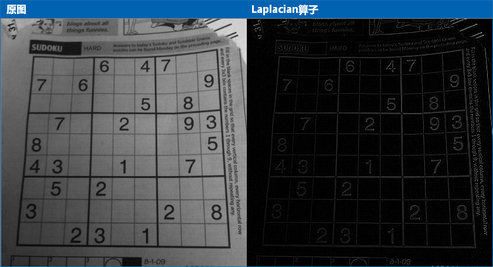

Laplacian 算子是二阶边缘检测的典型代表，一/二阶边缘检测各有优缺点，大家可自行了解。

## 9.2 练习

1. （选做）同志们有空补补高数~~姿势~~（知识）呗！\(✿◕‿◕✿\)

## 9.3 引用

- [Sobel 导数](http://www.opencv.org.cn/opencvdoc/2.3.2/html/doc/tutorials/imgproc/imgtrans/sobel_derivatives/sobel_derivatives.html#sobel-derivatives)
- [维基百科：边缘检测](https://zh.wikipedia.org/wiki/%E8%BE%B9%E7%BC%98%E6%A3%80%E6%B5%8B)
- [数字图像 - 边缘检测原理 - Sobel, Laplace, Canny 算子](https://www.jianshu.com/p/2334bee37de5)


# 10 番外篇：轮廓层级


了解轮廓间的层级关系。

前面我们使用`cv2.findContours()`寻找轮廓时，参数 3 表示轮廓的寻找方式\(RetrievalModes\)。当时我们传入的是 cv2.RETR_TREE，它表示什么意思呢？另外，函数返回值 hierarchy 有什么用途呢？下面我们就来研究下这两个问题。

## 10.1 理解轮廓层级

很多情况下，图像中的形状之间是有关联的，比如说下图：


图中总共有 8 条轮廓，2 和 2a 分别表示外层和里层的轮廓，3 和 3a 也是一样。从图中看得出来：

- 轮廓 0/1/2 是最外层的轮廓，我们可以说它们处于同一轮廓等级：0 级
- 轮廓 2a 是轮廓 2 的子轮廓，反过来说 2 是 2a 的父轮廓，轮廓 2a 算一个等级：1 级
- 同样 3 是 2a 的子轮廓，轮廓 3 处于一个等级：2 级
- 类似的，3a 是 3 的子轮廓，等等…………

这里面 OpenCV 关注的就是两个概念：同一轮廓等级和轮廓间的子属关系。

## 10.2 OpenCV 中轮廓等级的表示

如果我们打印出`cv2.findContours()`函数的返回值 hierarchy，会发现它是一个包含 4 个值的数组：**\[Next, Previous, First Child, Parent\]**

- Next：与当前轮廓处于同一层级的下一条轮廓

举例来说，前面图中跟 0 处于同一层级的下一条轮廓是 1，所以 Next=1；同理，对轮廓 1 来说，Next=2；那么对于轮廓 2 呢？没有与它同一层级的下一条轮廓了，此时 Next=-1。

- Previous：与当前轮廓处于同一层级的上一条轮廓

跟前面一样，对于轮廓 1 来说，Previous=0；对于轮廓 2，Previous=1；对于轮廓 1，没有上一条轮廓了，所以 Previous=-1。

- First Child：当前轮廓的第一条子轮廓

比如对于轮廓 2，第一条子轮廓就是轮廓 2a，所以 First Child=2a；对轮廓 3a，First Child=4。

- Parent：当前轮廓的父轮廓

比如 2a 的父轮廓是 2，Parent=2；轮廓 2 没有父轮廓，所以 Parent=-1。

下面我们通过代码验证一下：

```python
import cv2

# 1.读入图片
img = cv2.imread('hierarchy.jpg')
img_gray = cv2.cvtColor(img, cv2.COLOR_BGR2GRAY)
_, thresh = cv2.threshold(img_gray, 0, 255, cv2.THRESH_BINARY + cv2.THRESH_OTSU)

# 2.寻找轮廓
contours, hierarchy = cv2.findContours(thresh, cv2.RETR_TREE, 2)

# 3.绘制轮廓
print(len(contours),hierarchy)  # 8 条
cv2.drawContours(img, contours, -1, (0, 0, 255), 2)
```

> [!TIP]
> 
> OpenCV 中找到的轮廓序号跟前面讲的不同噢，如下图：


现在既然我们了解了层级的概念，那么类似 cv2.RETR_TREE 的轮廓寻找方式又是啥意思呢？

## 10.3 轮廓寻找方式

OpenCV 中有四种轮廓寻找方式[RetrievalModes](https://docs.opencv.org/3.3.1/d3/dc0/group__imgproc__shape.html#ga819779b9857cc2f8601e6526a3a5bc71)，下面分别来看下：

### 10.3.1  RETR_LIST

这是最简单的一种寻找方式，它不建立轮廓间的子属关系，也就是所有轮廓都属于同一层级。这样，hierarchy 中的后两个值\[First Child, Parent\] 都为-1。比如同样的图，我们使用 cv2.RETR_LIST 来寻找轮廓：

```python
contours, hierarchy = cv2.findContours(thresh, cv2.RETR_LIST, 2)
print(hierarchy)
# 结果如下
[[[ 1 -1 -1 -1]
  [ 2  0 -1 -1]
  [ 3  1 -1 -1]
  [ 4  2 -1 -1]
  [ 5  3 -1 -1]
  [ 6  4 -1 -1]
  [ 7  5 -1 -1]
  [-1  6 -1 -1]]]
```

因为没有从属关系，所以轮廓 0 的下一条是 1，1 的下一条是 2……

> [!TIP]
> 
> 如果你不需要轮廓层级信息的话，cv2.RETR_LIST 更推荐使用，因为性能更好。


### 10.3.2 RETR_TREE

cv2.RETR_TREE 就是之前我们一直在使用的方式，它会完整建立轮廓的层级从属关系，前面已经详细说明过了。

### 10.3.3 RETR_EXTERNAL

这种方式只寻找最高层级的轮廓，也就是它只会找到前面我们所说的 3 条 0 级轮廓：

```python
contours, hierarchy = cv2.findContours(thresh, cv2.RETR_EXTERNAL, 2)
print(len(contours), hierarchy, sep='\n')
# 结果如下
3
[[[ 1 -1 -1 -1]
  [ 2  0 -1 -1]
  [-1  1 -1 -1]]]
```

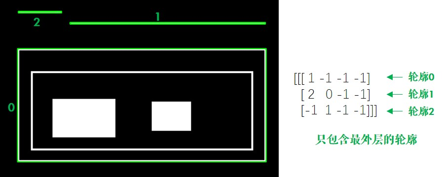

### 10.3.4 RETR_CCOMP

相比之下 cv2.RETR_CCOMP 比较难理解，但其实也很简单：它把所有的轮廓只分为 2 个层级，不是外层的就是里层的。结合代码和图片，我们来理解下：

```python
contours, hierarchy = cv2.findContours(thresh, cv2.RETR_CCOMP, 2)
print(hierarchy)
# 结果如下
[[[ 1 -1 -1 -1]
  [ 2  0 -1 -1]
  [ 4  1  3 -1]
  [-1 -1 -1  2]
  [ 6  2  5 -1]
  [-1 -1 -1  4]
  [ 7  4 -1 -1]
  [-1  6 -1 -1]]]
```


> [!TIP]
>
> 使用这个参数找到的轮廓序号与之前不同。

图中括号里面 1 代表外层轮廓，2 代表里层轮廓。比如说对于轮廓 2，Next 就是 4，Previous 是 1，它有里层的轮廓 3，所以 First Child=3，但因为只有两个层级，它本身就是外层轮廓，所以 Parent=-1。大家可以针对其他的轮廓自己验证一下。

## 10.4 练习

1. 如下图，找到 3 个圆环的内环，然后填充成\(180,215,215\) 这种颜色：


# 11 番外篇：凸包及更多轮廓特征


计算凸包及更多轮廓特征。

## 11.1 多边形逼近

前面我们学习过最小外接矩和最小外接圆，那么可以用一个最小的多边形包围物体吗？当然可以：

```python
import cv2
import numpy as np


# 1.先找到轮廓
origin = cv2.imread('unregular.jpg')
img = cv2.imread('unregular.jpg', 0)
_, thresh = cv2.threshold(img, 0, 255, cv2.THRESH_BINARY + cv2.THRESH_OTSU)
contours, hierarchy = cv2.findContours(thresh, 3, 2)
cnt = contours[0]

# 2.进行多边形逼近，得到多边形的角点
approx3 = cv2.approxPolyDP(cnt, 3, True)
approx50 = cv2.approxPolyDP(cnt, 50, True)

# 3.画出多边形
image1 = cv2.cvtColor(img, cv2.COLOR_GRAY2BGR)
cv2.polylines(image1, [approx3], True, (0, 255, 0), 2)
print("approx3: ", len(approx3))  # 角点的个数

image2 = cv2.cvtColor(img, cv2.COLOR_GRAY2BGR)
cv2.polylines(image2, [approx50], True, (0, 255, 0), 2)
print("approx50: ", len(approx50))  # 角点的个数
cv2.imshow('Img->Approx50->Approx3', np.hstack((origin, image2, image1)))
cv2.waitKey(0)
```

其中`cv2.approxPolyDP()`的参数 2(epsilon) 是一个距离值，表示多边形的轮廓接近实际轮廓的程度，值越小，越精确；参数 3 表示是否闭合。

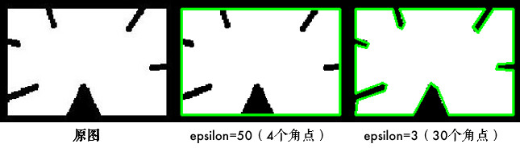

## 11.2 凸包

[凸包](https://baike.baidu.com/item/%E5%87%B8%E5%8C%85/179150?fr=aladdin)跟多边形逼近很像，只不过它是物体最外层的"凸"多边形：集合 A 内连接任意两个点的直线都在 A 的内部，则称集合 A 是凸形的。如下图，红色的部分为手掌的凸包，双箭头部分表示凸缺陷 (Convexity Defects)，凸缺陷常用来进行手势识别等：


```python
# 1.先找到轮廓
img = cv2.imread('convex.jpg', 0)
_, thresh = cv2.threshold(img, 0, 255, cv2.THRESH_BINARY + cv2.THRESH_OTSU)
contours, hierarchy = cv2.findContours(thresh, 3, 2)
cnt = contours[0]

# 2.寻找凸包，得到凸包的角点
hull = cv2.convexHull(cnt)

# 3.绘制凸包
image = cv2.cvtColor(img, cv2.COLOR_GRAY2BGR)
cv2.polylines(image, [hull], True, (0, 255, 0), 2)
```


其中函数`cv2.convexHull()`有个可选参数 returnPoints，默认是 True，代表返回角点的 x/y 坐标；如果为 False 的话，表示返回轮廓中是凸包角点的索引，比如说：

```python
print(hull[0])  # [[362 184]]（坐标）
hull2 = cv2.convexHull(cnt, returnPoints=False)
print(hull2[0])  # [510]（cnt 中的索引）
print(cnt[510])  # [[362 184]]
```

当使用`cv2.convexityDefects()`计算凸包缺陷时，returnPoints 需为 False

另外可以用下面的语句来判断轮廓是否是凸形的：

```python
print(cv2.isContourConvex(hull))  # True
```

## 11.3 点到轮廓距离

`cv2.pointPolygonTest()`函数计算点到轮廓的最短距离（也就是垂线），又称多边形测试：

```python
dist = cv2.pointPolygonTest(cnt, (100, 100), True)  # -3.535
```

其中参数 3 为 True 时表示计算距离值：点在轮廓外面值为负，点在轮廓上值为 0，点在轮廓里面值为正；参数 3 为 False 时，只返回-1/0/1 表示点相对轮廓的位置，不计算距离。

更多轮廓特征，如当量直径、平均强度等。