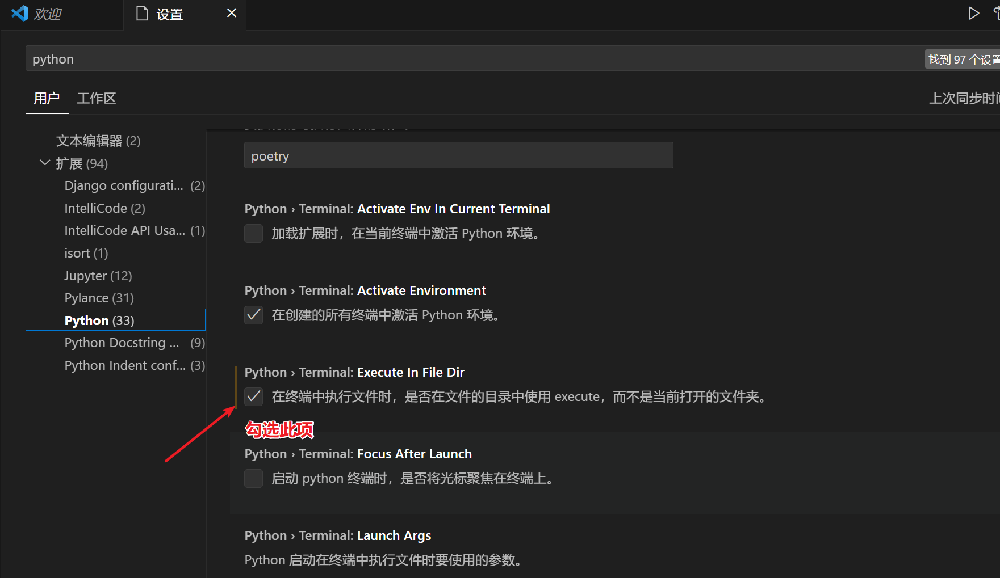

# 1 基础入门

1. 本教程摘录自[CodecWang](https://github.com/CodecWang)的[opencv-python-tutorial仓库](https://github.com/CodecWang/opencv-python-tutorial)，对局部内容做了补充和调整

2. 教程配套代码及练习代码见[链接](https://pan.baidu.com/s/1vcc4CNXEXotzpcIbMmjE0A?pwd=6666)。其中，`OpenCV入门+基础-配套代码.zip`为本教程配套代码；`OpenCV图像处理实战-代码.zip`为《OpenCV图像处理实战》书籍配套代码，与本教程内容非常相似，作为练习代码

3. 若使用Vscode出现无法找到运行文件的错误，在配置中勾选`Python>Terminal:Execute In File Dir`选项，见下图
   