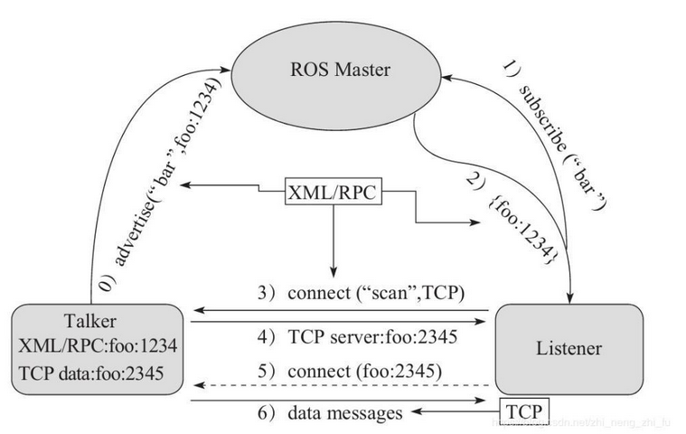
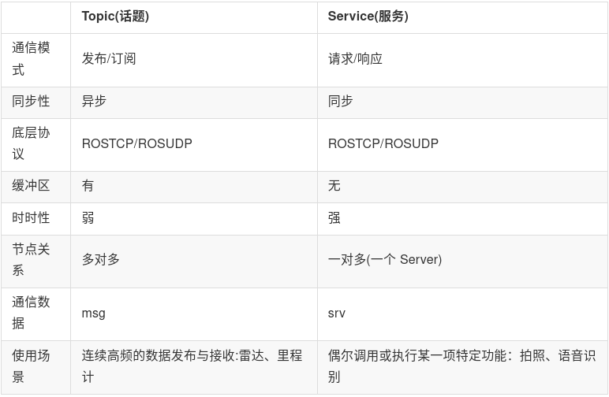

# 1 ROS基础知识

## 第1章 ROS概述与环境搭建  

### 1.1 ROS简介               

#### 1.1.1 ROS概念

ROS全称Robot Operating System(机器人操作系统)
- ROS是适用于机器人的开源元操作系统
- ROS集成了大量的工具，库，协议，提供类似OS所提供的功能，简化对机器人的控制
- 还提供了用于在多台计算机上获取，构建，编写和运行代码的工具和库，ROS在某些方面类似于“机器人框架”
- ROS设计者将ROS表述为“ROS = Plumbing + Tools + Capabilities + Ecosystem”，即ROS是通讯机制、工具软件包、机器人高层技能以及机器人生态系统的集合体

#### 1.1.2 ROS设计目标

机器人开发的分工思想，实现了不同研发团队间的共享和协作，提升了机器人的研发效率，为了服务“ 分工”，ROS主要设计了如下目标：
- **代码复用**:ROS的目标不是成为具有最多功能的框架，ROS的主要目标是支持机器人技术研发中的代码重用。
- **分布式**:ROS是进程（也称为Nodes）的分布式框架,ROS中的进程可分布于不同主机，不同主机协同工作，从而分散计算压力
- **松耦合**:ROS中功能模块封装于独立的功能包或元功能包，便于分享，功能包内的模块以节点为单位运行，以ROS标准的IO作为接口，开发者不需要关注模块内部实现，只要了解接口规则就能实现复用,实现了模块间点对点的松耦合连接
- **精简**：ROS被设计为尽可能精简，以便为ROS编写的代码可以与其他机器人软件框架一起使用。ROS易于与其他机器人软件框架集成：ROS已与OpenRAVE，Orocos和Player集成。
- **语言独立性**：包括Java，C++，Python等。为了支持更多应用开发和移植，ROS设计为一种语言弱相关的框架结构，使用简洁，中立的定义语言描述模块间的消息接口，在编译中再产生所使用语言的目标文件，为消息交互提供支持，同时允许消息接口的嵌套使用。
- **易于测试**：ROS具有称为[rostest](http://wiki.ros.org/rostest)的内置单元/集成测试框架，可轻松安装和拆卸测试工具。
- **大型应用**：ROS适用于大型运行时系统和大型开发流程。
- **丰富的组件化工具包**：ROS可采用组件化方式集成一些工具和软件到系统中并作为一个组件直接使用，如RVIZ（3D可视化工具），开发者根据ROS定义的接口在其中显示机器人模型等，组件还包括仿真环境和消息查看工具等
- **免费且开源**：开发者众多，功能包多

#### 1.1.3 ROS发展历程

- ROS是一个由来已久、贡献者众多的大型软件项目。在ROS诞生之前，很多学者认为，机器人研究需要一个开放式的协作框架，并且已经有不少类似的项目致力于实现这样的框架。在这些工作中，斯坦福大学在2000年年中开展了一系列相关研究项目，如斯坦福人工智能机器人（STandford AI Robot, STAIR）项目、个人机器人（Personal Robots, PR）项目等，在上述项目中，在研究具有代表性、集成式人工智能系统的过程中，创立了用于室内场景的高灵活性、动态软件系统，其可以用于机器人学研究。
- 2007年，柳树车库（Willow Garage）提供了大量资源，用于将斯坦福大学机器人项目中的软件系统进行扩展与完善，同时，在无数研究人员的共同努力下，ROS的核心思想和基本软件包逐渐得到完善。
- ROS的发行版本（ROS distribution）指ROS软件包的版本，其与Linux的发行版本（如Ubuntu）的概念类似。推出ROS发行版本的目的在于使开发人员可以使用相对稳定的代码库，直到其准备好将所有内容进行版本升级为止。因此，每个发行版本推出后，ROS开发者通常仅对这一版本的bug进行修复，同时提供少量针对核心软件包的改进。
- 版本特点: 按照英文字母顺序命名，ROS 目前已经发布了ROS1 的终极版本: noetic，并建议后期过渡至 ROS2 版本。noetic 版本之前默认使用的是 Python2，noetic 支持 Python3。


### 1.2 ROS安装 

#### 1.2.1 安装ROS

ROS Noetic安装教程见《1.2 Ubuntu安装之后要做的事》

#### 1.2.2 测试ROS

ROS 内置了一些小程序，可以通过运行这些小程序以检测 ROS 环境是否可以正常运行
1. 首先启动三个命令行(ctrl + alt + T)
2. 命令行1键入:roscore
3. 命令行2键入:rosrun turtlesim turtlesim_node(此时会弹出图形化界面)
4. 命令行3键入:rosrun turtlesim turtle_teleop_key(在3中可以通过上下左右控制2中乌龟的运动)
最终结果如下所示:


### 1.3 ROS快速体验

#### 1.3.1 HelloWorld实现简介

以HelloWorld程序为例，实现流程大致如下：
   1. 先创建一个工作空间；
   2. 再创建一个功能包；
   3. 编辑源文件；
   4. 编辑配置文件；
   5. 编译并执行。


**1.创建工作空间并初始化**

```shell
mkdir -p 自定义空间名称/src
cd 自定义空间名称
catkin_make 
```

上述命令，首先会创建一个工作空间以及一个 src 子目录，然后再进入工作空间调用 catkin_make 命令编译。


**2.进入 src 创建 ros 包并添加依赖**

```shell
cd src
catkin_create_pkg 自定义ROS包名 roscpp rospy std_msgs
```
上述命令，会在工作空间下生成一个功能包，该功能包依赖于 roscpp、rospy 与 std_msgs，其中 roscpp 是使用 C++ 实现的库，而 rospy 则是使用 python实现的库，std_msgs 是标准消息库，创建ROS功能包时，一般都会依赖这三个库实现。


#### 1.3.2 HelloWorld实现

**1.在demo01_ws/src/helloworld目录下 添加 scripts 目录并编辑 python 文件**

```
cd ros包
mkdir scripts
```

新建 python 文件: helloworld_p.py
```python
#! /usr/bin/env python
#step.0 指定解释器

#1.导包
import rospy

#2.编写主入口
if __name__ == "__main__":
        #3.初始化ros节点
        rospy.init_node("hello_p");
        #4.输出日志
        rospy.loginfo("hello world! by python");

```

**2.为 python 文件添加可执行权限**

` chmod +x helloworld_p.py `

**3.编辑 ros 包下的 CamkeList.txt 文件**

```
catkin_install_python(PROGRAMS scripts/自定义文件名.py
  DESTINATION ${CATKIN_PACKAGE_BIN_DESTINATION}
)
```

**4.进入工作空间目录并编译**

```shell
cd demo01_ws
catkin_make
```

**5.进入工作空间目录并执行**

先启动命令行1：
`roscore`

再启动命令行2：
```shell
cd demo01_ws
source ./devel/setup.bash
rosrun 包名 自定义文件名.py
```

最终结果:


### 1.4 ROS集成开发环境搭建 

#### 1.4.1 安装终端

在 ROS 中，需要频繁的使用到终端，且可能需要同时开启多个窗口，推荐一款较为好用的终端:**Terminator**。

1.安装
`sudo apt install terminator`

2.添加到收藏夹
显示应用程序 ---> 搜索 terminator ---> 右击 选择 添加到收藏夹

3.Terminator 常用快捷键
第一部份：关于在同一个标签内的操作
```
Alt+Up                          //移动到上面的终端
Alt+Down                        //移动到下面的终端
Alt+Left                        //移动到左边的终端
Alt+Right                       //移动到右边的终端
Ctrl+Shift+O                    //水平分割终端
Ctrl+Shift+E                    //垂直分割终端
Ctrl+Shift+Right                //在垂直分割的终端中将分割条向右移动
Ctrl+Shift+Left                 //在垂直分割的终端中将分割条向左移动
Ctrl+Shift+Up                   //在水平分割的终端中将分割条向上移动
Ctrl+Shift+Down                 //在水平分割的终端中将分割条向下移动
Ctrl+Shift+S                    //隐藏/显示滚动条
Ctrl+Shift+F                    //搜索
Ctrl+Shift+C                    //复制选中的内容到剪贴板
Ctrl+Shift+V                    //粘贴剪贴板的内容到此处
Ctrl+Shift+W                    //关闭当前终端
Ctrl+Shift+Q                    //退出当前窗口，当前窗口的所有终端都将被关闭
Ctrl+Shift+X                    //最大化显示当前终端
Ctrl+Shift+Z                    //最大化显示当前终端并使字体放大
Ctrl+Shift+N or Ctrl+Tab        //移动到下一个终端
Ctrl+Shift+P or Ctrl+Shift+Tab  //Crtl+Shift+Tab 移动到之前的一个终端
```

第二部份：有关各个标签之间的操作
```
F11                             //全屏开关
Ctrl+Shift+T                    //打开一个新的标签
Ctrl+PageDown                   //移动到下一个标签
Ctrl+PageUp                     //移动到上一个标签
Ctrl+Shift+PageDown             //将当前标签与其后一个标签交换位置
Ctrl+Shift+PageUp               //将当前标签与其前一个标签交换位置
Ctrl+Plus (+)                   //增大字体
Ctrl+Minus (-)                  //减小字体
Ctrl+Zero (0)                   //恢复字体到原始大小
Ctrl+Shift+R                    //重置终端状态
Ctrl+Shift+G                    //重置终端状态并clear屏幕
Super+g                         //绑定所有的终端，以便向一个输入能够输入到所有的终端
Super+Shift+G                   //解除绑定
Super+t                         //绑定当前标签的所有终端，向一个终端输入的内容会自动输入到其他终端
Super+Shift+T                   //解除绑定
Ctrl+Shift+I                    //打开一个窗口，新窗口与原来的窗口使用同一个进程
Super+i                         //打开一个新窗口，新窗口与原来的窗口使用不同的进程
```

#### 1.4.2 安装VScode
VSCode 全称 Visual Studio Code，是微软出的一款轻量级代码编辑器，免费、开源而且功能强大。它支持几乎所有主流的程序语言的语法高亮、智能代码补全、自定义热键、括号匹配、代码片段、代码对比 Diff、GIT 等特性，支持插件扩展，并针对网页开发和云端应用开发做了优化。软件跨平台支持 Win、Mac 以及 Linux。

1.下载
vscode 下载:https://code.visualstudio.com/docs?start=true
历史版本下载链接: https://code.visualstudio.com/updates

2.vscode 安装与卸载

2.1 安装
方式1:双击安装即可(或右击选择安装)
方式2:`sudo dpkg -i xxxx.deb`

2.2 卸载
`sudo dpkg --purge  code`

3.vscode 集成 ROS 插件
使用 VScode 开发 ROS 程序，需要先安装一些插件

4.vscode 使用_基本配置
4.1 创建 ROS 工作空间

```shell
mkdir -p xxx_ws/src(必须得有 src)
cd xxx_ws
catkin_make
```

4.2 启动 vscode
进入 xxx_ws 启动 vscode

```shell
cd xxx_ws
code .
```

4.3 vscode 中编译 ros
快捷键 ctrl + shift + B 调用编译，选择:`catkin_make:build`
可以点击配置设置为默认，修改.vscode/tasks.json 文件
```json
{
// 有关 tasks.json 格式的文档，请参见
    // https://go.microsoft.com/fwlink/?LinkId=733558
    "version": "2.0.0",
    "tasks": [
        {
            "label": "catkin_make:debug", //代表提示的描述性信息
            "type": "shell",  //可以选择shell或者process,如果是shell代码是在shell里面运行一个命令，如果是process代表作为一个进程来运行
            "command": "catkin_make",//这个是我们需要运行的命令
            "args": [],//如果需要在命令后面加一些后缀，可以写在这里，比如-DCATKIN_WHITELIST_PACKAGES=“pac1;pac2”
            "group": {"kind":"build","isDefault":true},
            "presentation": {
                "reveal": "always"//可选always或者silence，代表是否输出信息
            },
            "problemMatcher": "$msCompile"
        }
    ]
}
```

4.4 创建 ROS 功能包

选定 src 右击 ---> create catkin package
设置包名 添加依赖

4.5 python 实现

在 功能包 下新建 scripts 文件夹，添加 python 文件，并添加可执行权限

```python
#! /usr/bin/env python
"""
    Python 版本的 HelloVScode，执行在控制台输出 HelloVScode
    实现:
    1.导包
    2.初始化 ROS 节点
    3.日志输出 HelloWorld


"""

import rospy # 1.导包

if __name__ == "__main__":

    rospy.init_node("Hello_Vscode_p")  # 2.初始化 ROS 节点
    rospy.loginfo("Hello VScode, 我是 Python ....")  #3.日志输出 HelloWorld
```

4.6 配置 CMakeLists.txt

Python 配置:

```
catkin_install_python(PROGRAMS scripts/自定义文件名.py
  DESTINATION ${CATKIN_PACKAGE_BIN_DESTINATION}
)
```

4.7 编译执行


编译: ctrl + shift + B

执行: 和之前一致，只是可以在 VScode 中添加终端，首先执行:source ./devel/setup.bash


#### 1.4.3 launch文件演示

**1.需求**

一个程序中可能需要启动多个节点，比如:ROS 内置的小乌龟案例，如果要控制乌龟运动，要启动多个窗口，分别启动 roscore、乌龟界面节点、键盘控制节点。如果每次都调用 rosrun 逐一启动，显然效率低下，如何优化?
官方给出的优化策略是使用 launch 文件，可以一次性启动多个 ROS 节点。

**2.实现**
1. 选定功能包右击 ---> 添加 launch 文件夹
2. 选定 launch 文件夹右击 ---> 添加 launch 文件
3. 编辑 launch 文件内容
    ```launch
    <launch>
        <!-- 添加被执行的节点-->
        <!-- 乌龟GUI-->
        <node pkg="turtlesim" type="turtlesim_node" name="turtle_GUI" />
        <node pkg="turtlesim" type="turtle_teleop_key" name="turtle_key" />
        <!-- <nodepkg="hello_vscode" type="hello_vscode_c" name="hello" output="screen" /> -->
    </launch>
    ```
4. 运行 launch 文件
`roslaunch hello_vscode start_turtle.launch`
5. 运行结果: 一次性启动了多个节点

### 1.5 ROS架构

#### 1.5.1 ROS文件系统

ROS文件系统级指的是在硬盘上ROS源代码的组织形式，其结构大致可以如下图所示：


```
WorkSpace --- 自定义的工作空间

    |--- build:编译空间，用于存放CMake和catkin的缓存信息、配置信息和其他中间文件。

    |--- devel:开发空间，用于存放编译后生成的目标文件，包括头文件、动态&静态链接库、可执行文件等。

    |--- src: 源码

        |-- package：功能包(ROS基本单元)包含多个节点、库与配置文件，包名所有字母小写，只能由字母、数字与下划线组成

            |-- CMakeLists.txt 配置编译规则，比如源文件、依赖项、目标文件

            |-- package.xml 包信息，比如:包名、版本、作者、依赖项...(以前版本是 manifest.xml)

            |-- scripts 存储python文件

            |-- src 存储C++源文件

            |-- include 头文件

            |-- msg 消息通信格式文件

            |-- srv 服务通信格式文件

            |-- action 动作格式文件

            |-- launch 可一次性运行多个节点 

            |-- config 配置信息

        |-- CMakeLists.txt: 编译的基本配置
```
ROS 文件系统中部分目录和文件前面编程中已经有所涉及，比如功能包的创建、src目录下cpp文件的编写、scripts目录下python文件的编写、launch目录下launch文件的编写，并且也配置了 package.xml 与 CMakeLists.txt 文件。其他目录下的内容后面教程将会再行介绍，当前我们主要介绍: package.xml 与 CMakeLists.txt 这两个配置文件。

1.package.xml

该文件定义有关软件包的属性，例如软件包名称，版本号，作者，维护者以及对其他catkin软件包的依赖性。请注意，该概念类似于旧版 rosbuild 构建系统中使用的manifest.xml文件。
```
<?xml version="1.0"?>
<!-- 格式: 以前是 1，推荐使用格式 2 -->
<package format="2">
  <!-- 包名 -->
  <name>demo01_hello_vscode</name>
  <!-- 版本 -->
  <version>0.0.0</version>
  <!-- 描述信息 -->
  <description>The demo01_hello_vscode package</description>

  <!-- One maintainer tag required, multiple allowed, one person per tag -->
  <!-- Example:  -->
  <!-- <maintainer email="jane.doe@example.com">Jane Doe</maintainer> -->
  <!-- 维护人员 -->
  <maintainer email="xuzuo@todo.todo">xuzuo</maintainer>


  <!-- One license tag required, multiple allowed, one license per tag -->
  <!-- Commonly used license strings: -->
  <!--   BSD, MIT, Boost Software License, GPLv2, GPLv3, LGPLv2.1, LGPLv3 -->
  <!-- 许可证信息，ROS核心组件默认 BSD -->
  <license>TODO</license>


  <!-- Url tags are optional, but multiple are allowed, one per tag -->
  <!-- Optional attribute type can be: website, bugtracker, or repository -->
  <!-- Example: -->
  <!-- <url type="website">http://wiki.ros.org/demo01_hello_vscode</url> -->


  <!-- Author tags are optional, multiple are allowed, one per tag -->
  <!-- Authors do not have to be maintainers, but could be -->
  <!-- Example: -->
  <!-- <author email="jane.doe@example.com">Jane Doe</author> -->


  <!-- The *depend tags are used to specify dependencies -->
  <!-- Dependencies can be catkin packages or system dependencies -->
  <!-- Examples: -->
  <!-- Use depend as a shortcut for packages that are both build and exec dependencies -->
  <!--   <depend>roscpp</depend> -->
  <!--   Note that this is equivalent to the following: -->
  <!--   <build_depend>roscpp</build_depend> -->
  <!--   <exec_depend>roscpp</exec_depend> -->
  <!-- Use build_depend for packages you need at compile time: -->
  <!--   <build_depend>message_generation</build_depend> -->
  <!-- Use build_export_depend for packages you need in order to build against this package: -->
  <!--   <build_export_depend>message_generation</build_export_depend> -->
  <!-- Use buildtool_depend for build tool packages: -->
  <!--   <buildtool_depend>catkin</buildtool_depend> -->
  <!-- Use exec_depend for packages you need at runtime: -->
  <!--   <exec_depend>message_runtime</exec_depend> -->
  <!-- Use test_depend for packages you need only for testing: -->
  <!--   <test_depend>gtest</test_depend> -->
  <!-- Use doc_depend for packages you need only for building documentation: -->
  <!--   <doc_depend>doxygen</doc_depend> -->
  <!-- 依赖的构建工具，这是必须的 -->
  <buildtool_depend>catkin</buildtool_depend>

  <!-- 指定构建此软件包所需的软件包 -->
  <build_depend>roscpp</build_depend>
  <build_depend>rospy</build_depend>
  <build_depend>std_msgs</build_depend>

  <!-- 指定根据这个包构建库所需要的包 -->
  <build_export_depend>roscpp</build_export_depend>
  <build_export_depend>rospy</build_export_depend>
  <build_export_depend>std_msgs</build_export_depend>

  <!-- 运行该程序包中的代码所需的程序包 -->  
  <exec_depend>roscpp</exec_depend>
  <exec_depend>rospy</exec_depend>
  <exec_depend>std_msgs</exec_depend>


  <!-- The export tag contains other, unspecified, tags -->
  <export>
    <!-- Other tools can request additional information be placed here -->

  </export>
</package>
```

2.CMakelists.txt

文件CMakeLists.txt是CMake构建系统的输入，用于构建软件包。任何兼容CMake的软件包都包含一个或多个CMakeLists.txt文件，这些文件描述了如何构建代码以及将代码安装到何处。

```
cmake_minimum_required(VERSION 3.0.2) #所需 cmake 版本
project(demo01_hello_vscode) #包名称，会被 ${PROJECT_NAME} 的方式调用

## Compile as C++11, supported in ROS Kinetic and newer
# add_compile_options(-std=c++11)

## Find catkin macros and libraries
## if COMPONENTS list like find_package(catkin REQUIRED COMPONENTS xyz)
## is used, also find other catkin packages
#设置构建所需要的软件包
find_package(catkin REQUIRED COMPONENTS
  roscpp
  rospy
  std_msgs
)

## System dependencies are found with CMake's conventions
#默认添加系统依赖
# find_package(Boost REQUIRED COMPONENTS system)


## Uncomment this if the package has a setup.py. This macro ensures
## modules and global scripts declared therein get installed
## See http://ros.org/doc/api/catkin/html/user_guide/setup_dot_py.html
# 启动 python 模块支持
# catkin_python_setup()

################################################
## Declare ROS messages, services and actions ##
## 声明 ROS 消息、服务、动作... ##
################################################

## To declare and build messages, services or actions from within this
## package, follow these steps:
## * Let MSG_DEP_SET be the set of packages whose message types you use in
##   your messages/services/actions (e.g. std_msgs, actionlib_msgs, ...).
## * In the file package.xml:
##   * add a build_depend tag for "message_generation"
##   * add a build_depend and a exec_depend tag for each package in MSG_DEP_SET
##   * If MSG_DEP_SET isn't empty the following dependency has been pulled in
##     but can be declared for certainty nonetheless:
##     * add a exec_depend tag for "message_runtime"
## * In this file (CMakeLists.txt):
##   * add "message_generation" and every package in MSG_DEP_SET to
##     find_package(catkin REQUIRED COMPONENTS ...)
##   * add "message_runtime" and every package in MSG_DEP_SET to
##     catkin_package(CATKIN_DEPENDS ...)
##   * uncomment the add_*_files sections below as needed
##     and list every .msg/.srv/.action file to be processed
##   * uncomment the generate_messages entry below
##   * add every package in MSG_DEP_SET to generate_messages(DEPENDENCIES ...)

## Generate messages in the 'msg' folder
# add_message_files(
#   FILES
#   Message1.msg
#   Message2.msg
# )

## Generate services in the 'srv' folder
# add_service_files(
#   FILES
#   Service1.srv
#   Service2.srv
# )

## Generate actions in the 'action' folder
# add_action_files(
#   FILES
#   Action1.action
#   Action2.action
# )

## Generate added messages and services with any dependencies listed here
# 生成消息、服务时的依赖包
# generate_messages(
#   DEPENDENCIES
#   std_msgs
# )

################################################
## Declare ROS dynamic reconfigure parameters ##
## 声明 ROS 动态参数配置 ##
################################################

## To declare and build dynamic reconfigure parameters within this
## package, follow these steps:
## * In the file package.xml:
##   * add a build_depend and a exec_depend tag for "dynamic_reconfigure"
## * In this file (CMakeLists.txt):
##   * add "dynamic_reconfigure" to
##     find_package(catkin REQUIRED COMPONENTS ...)
##   * uncomment the "generate_dynamic_reconfigure_options" section below
##     and list every .cfg file to be processed

## Generate dynamic reconfigure parameters in the 'cfg' folder
# generate_dynamic_reconfigure_options(
#   cfg/DynReconf1.cfg
#   cfg/DynReconf2.cfg
# )

###################################
## catkin specific configuration ##
## catkin 特定配置##
###################################
## The catkin_package macro generates cmake config files for your package
## Declare things to be passed to dependent projects
## INCLUDE_DIRS: uncomment this if your package contains header files
## LIBRARIES: libraries you create in this project that dependent projects also need
## CATKIN_DEPENDS: catkin_packages dependent projects also need
## DEPENDS: system dependencies of this project that dependent projects also need
# 运行时依赖
catkin_package(
#  INCLUDE_DIRS include
#  LIBRARIES demo01_hello_vscode
#  CATKIN_DEPENDS roscpp rospy std_msgs
#  DEPENDS system_lib
)

###########
## Build ##
###########

## Specify additional locations of header files
## Your package locations should be listed before other locations
# 添加头文件路径，当前程序包的头文件路径位于其他文件路径之前
include_directories(
# include
  ${catkin_INCLUDE_DIRS}
)

## Declare a C++ library
# 声明 C++ 库
# add_library(${PROJECT_NAME}
#   src/${PROJECT_NAME}/demo01_hello_vscode.cpp
# )

## Add cmake target dependencies of the library
## as an example, code may need to be generated before libraries
## either from message generation or dynamic reconfigure
# 添加库的 cmake 目标依赖
# add_dependencies(${PROJECT_NAME} ${${PROJECT_NAME}_EXPORTED_TARGETS} ${catkin_EXPORTED_TARGETS})

## Declare a C++ executable
## With catkin_make all packages are built within a single CMake context
## The recommended prefix ensures that target names across packages don't collide
# 声明 C++ 可执行文件
add_executable(Hello_VSCode src/Hello_VSCode.cpp)

## Rename C++ executable without prefix
## The above recommended prefix causes long target names, the following renames the
## target back to the shorter version for ease of user use
## e.g. "rosrun someones_pkg node" instead of "rosrun someones_pkg someones_pkg_node"
#重命名c++可执行文件
# set_target_properties(${PROJECT_NAME}_node PROPERTIES OUTPUT_NAME node PREFIX "")

## Add cmake target dependencies of the executable
## same as for the library above
#添加可执行文件的 cmake 目标依赖
add_dependencies(Hello_VSCode ${${PROJECT_NAME}_EXPORTED_TARGETS} ${catkin_EXPORTED_TARGETS})

## Specify libraries to link a library or executable target against
#指定库、可执行文件的链接库
target_link_libraries(Hello_VSCode
  ${catkin_LIBRARIES}
)

#############
## Install ##
## 安装 ##
#############

# all install targets should use catkin DESTINATION variables
# See http://ros.org/doc/api/catkin/html/adv_user_guide/variables.html

## Mark executable scripts (Python etc.) for installation
## in contrast to setup.py, you can choose the destination
#设置用于安装的可执行脚本
catkin_install_python(PROGRAMS
  scripts/Hi.py
  DESTINATION ${CATKIN_PACKAGE_BIN_DESTINATION}
)

## Mark executables for installation
## See http://docs.ros.org/melodic/api/catkin/html/howto/format1/building_executables.html
# install(TARGETS ${PROJECT_NAME}_node
#   RUNTIME DESTINATION ${CATKIN_PACKAGE_BIN_DESTINATION}
# )

## Mark libraries for installation
## See http://docs.ros.org/melodic/api/catkin/html/howto/format1/building_libraries.html
# install(TARGETS ${PROJECT_NAME}
#   ARCHIVE DESTINATION ${CATKIN_PACKAGE_LIB_DESTINATION}
#   LIBRARY DESTINATION ${CATKIN_PACKAGE_LIB_DESTINATION}
#   RUNTIME DESTINATION ${CATKIN_GLOBAL_BIN_DESTINATION}
# )

## Mark cpp header files for installation
# install(DIRECTORY include/${PROJECT_NAME}/
#   DESTINATION ${CATKIN_PACKAGE_INCLUDE_DESTINATION}
#   FILES_MATCHING PATTERN "*.h"
#   PATTERN ".svn" EXCLUDE
# )

## Mark other files for installation (e.g. launch and bag files, etc.)
# install(FILES
#   # myfile1
#   # myfile2
#   DESTINATION ${CATKIN_PACKAGE_SHARE_DESTINATION}
# )

#############
## Testing ##
#############

## Add gtest based cpp test target and link libraries
# catkin_add_gtest(${PROJECT_NAME}-test test/test_demo01_hello_vscode.cpp)
# if(TARGET ${PROJECT_NAME}-test)
#   target_link_libraries(${PROJECT_NAME}-test ${PROJECT_NAME})
# endif()

## Add folders to be run by python nosetests
# catkin_add_nosetests(test)
```

#### 1.5.2 ROS文件系统相关命令

ROS 的文件系统本质上都还是操作系统文件，我们可以使用Linux命令来操作这些文件，不过，在ROS中为了更好的用户体验，ROS专门提供了一些类似于Linux的命令，这些命令较之于Linux原生命令，更为简介、高效。文件操作，无外乎就是增删改查与执行等操作，接下来，我们就从这五个维度，来介绍ROS文件系统的一些常用命令。

1.增
catkin_create_pkg 自定义包名 依赖包 === 创建新的ROS功能包
sudo apt install xxx === 安装 ROS功能包

2.删
sudo apt purge xxx ==== 删除某个功能包

3.查
rospack list === 列出所有功能包
rospack find 包名 === 查找某个功能包是否存在，如果存在返回安装路径
roscd 包名 === 进入某个功能包
rosls 包名 === 列出某个包下的文件
apt search xxx === 搜索某个功能包

4.改
rosed 包名 文件名 === 修改功能包文件
需要安装 vim
比如:rosed turtlesim Color.msg

5.执行

5.1 roscore
roscore === 是 ROS 的系统先决条件节点和程序的集合， 必须运行 roscore 才能使 ROS 节点进行通信。
roscore 将启动:
  - ros master
  - ros 参数服务器
  - rosout 日志节点
用法:
`roscore`
或(指定端口号)
`roscore -p xxxx`

5.2 rosrun
rosrun 包名 可执行文件名 === 运行指定的ROS节点
`rosrun turtlesim turtlesim_node`

5.3 roslaunch
roslaunch 包名 launch文件名 === 执行某个包下的 launch 文件

#### 1.5.3 ROS计算图             

1.计算图简介
前面介绍的是ROS文件结构，是磁盘上 ROS 程序的存储结构，是静态的，而 ros 程序运行之后，不同的节点之间是错综复杂的，ROS 中提供了一个实用的工具:rqt_graph。
rqt_graph能够创建一个显示当前系统运行情况的动态图形。ROS 分布式系统中不同进程需要进行数据交互，计算图可以以点对点的网络形式表现数据交互过程。rqt_graph是rqt程序包中的一部分。

2.计算图安装
如果前期把所有的功能包（package）都已经安装完成，则直接在终端窗口中输入
rosrun rqt_graph rqt_graph
如果未安装则在终端（terminal）中输入
```
$ sudo apt install ros-noetic-rqt
$ sudo apt install ros-noetic-rqt-common-plugins
```

3.计算图演示
接下来以 ROS 内置的小乌龟案例来演示计算图
首先，按照前面所示，运行案例
然后，启动新终端，键入: rqt_graph 或 rosrun rqt_graph rqt_graph，可以看到网络拓扑图，该图可以显示不同节点之间的关系。

### 1.6 本章小结


## 第2章 ROS通信机制             

### 2.1 话题通信

#### 2.1.1 话题通信理论模型

话题通信实现模型是比较复杂的，该模型如下图所示,该模型中涉及到三个角色:
  - ROS Master (管理者)
  - Talker (发布者)
  - Listener (订阅者)
ROS Master 负责保管 Talker 和 Listener 注册的信息，并匹配话题相同的 Talker 与 Listener，帮助 Talker 与 Listener 建立连接，连接建立后，Talker 可以发布消息，且发布的消息会被 Listener 订阅。


整个流程由以下步骤实现:

0.Talker注册
Talker启动后，会通过RPC在 ROS Master 中注册自身信息，其中包含所发布消息的话题名称。ROS Master 会将节点的注册信息加入到注册表中。

1.Listener注册
Listener启动后，也会通过RPC在 ROS Master 中注册自身信息，包含需要订阅消息的话题名。ROS Master 会将节点的注册信息加入到注册表中。

2.ROS Master实现信息匹配
ROS Master 会根据注册表中的信息匹配Talker 和 Listener，并通过 RPC 向 Listener 发送 Talker 的 RPC 地址信息。

3.Listener向Talker发送请求
Listener 根据接收到的 RPC 地址，通过 RPC 向 Talker 发送连接请求，传输订阅的话题名称、消息类型以及通信协议(TCP/UDP)。

4.Talker确认请求
Talker 接收到 Listener 的请求后，也是通过 RPC 向 Listener 确认连接信息，并发送自身的 TCP 地址信息。

5.Listener与Talker件里连接
Listener 根据步骤4 返回的消息使用 TCP 与 Talker 建立网络连接。

6.Talker向Listener发送消息

#### 2.1.2 话题通信基本操作

1. 在plumbing_pub_sub功能包中创建scripts文件夹
2. 在scripts文件夹中创建python文件demo01_pub_p.py，demo02_sub_p.py
3. 添加可执行权限` chmod +x *.py`
4. 在CMakeLists中修改文件名称，放开注释
5. 编译
6. 启动roscore
7. 运行ros节点`rosrun plumbing_pub_sub demo01_pub_p.py`
8. 运行ros节点`rosrun plumbing_pub_sub demo02_sub_p.py`

发布方
```python
#! /usr/bin/env python   #指定解释器

import rospy    #导包
from std_msgs.msg import String #发布消息的类型

"""
    使用python实现消息发布
        1.导包
        2.初始化ros节点
        3.创建发布者对象
        4.编写发布逻辑并发布数据
"""


if __name__ == "__main__":     
    #2.初始化ros节点，调用rospy中的函数
    rospy.init_node("sanDai")  #传入节点名称name
    #init_node函数定义
    #def init_node(name,argv=None,anonymous=False,log_level=None,
              #disable_rostime=False,disable_rosout=False,disable_signals=False,xmlrpc_port=0,tcpros_port=0):
    #3.创建发布者对象
    pub = rospy.Publisher("che",String,queue_size =10)   #括号内给定Publishier函数的参数，其中queue_size为消息堆叠容量是10,"che"为话题名称
    #4.编写发布逻辑并发布数据
    #创建数据
    msg = String()
    #指定发布频率
    rate = rospy.Rate(1)
    #设置计数器 
    count = 0
    #使用循环发布数据
    rospy.sleep(3)
    while not rospy.is_shutdown():      #如果节点关闭自增1
        count += 1
        msg.data = "hello" + str(count)
        #发布数据
        pub.publish(msg)
        rospy.loginfo("发布的数据:%s",msg.data)  #日志输出
        rate.sleep()    #休眠
```

订阅方

```python
#! /usr/bin/env python     #指定解释器
import rospy               #导包
from std_msgs.msg import String    #导包
"""
    订阅实现流程：
        1.导包
        2.初始化ros节点
        3.创建订阅者对象
        4.回调函数处理数据
        5.spin()
"""
#创建回调函数
def doMsg(msg):
    rospy.loginfo("我订阅的数据:%s",msg.data)   #日志输出

if __name__ =="__main__":
    #2.初始化ros节点
    rospy.init_node("huahua")
    #3.创建订阅者对象
    sub = rospy.Subscriber("che",String,doMsg,queue_size = 10)#传入参数name，指定订阅消息类型data_class，回调函数callback，消息堆叠数queue_size
    #4.回调函数处理数据
    
    #5.spin()，回调函数需要循环执行时加
    rospy.spin()
```

#### 2.1.3 话题通信自定义msg

在 ROS 通信协议中，数据载体是一个较为重要组成部分，ROS 中通过 std_msgs 封装了一些原生的数据类型,比如:String、Int32、Int64、Char、Bool、Empty.... 但是，这些数据一般只包含一个 data 字段，结构的单一意味着功能上的局限性，当传输一些复杂的数据，比如: 激光雷达的信息... std_msgs 由于描述性较差而显得力不从心，这种场景下可以使用自定义的消息类型
msgs只是简单的文本文件，每行具有字段类型和字段名称，可以使用的字段类型有：
- int8, int16, int32, int64 (或者无符号类型: uint*)
- float32, float64
- string
- time, duration
- other msg files
- variable-length array[] and fixed-length array[C]
- 

创建自定义消息，该消息包含人的信息:姓名、身高、年龄等流程：

1. 按照固定格式创建 msg 文件
2. 编辑配置文件
3. 编译生成可以被 Python 调用的中间文件

具体步骤：

1. 定义msg文件
在功能包下创建msg文件夹，添加文件Person.msg，在文件中编写以下内容
```
string name
uint16 age
float64 height
```

2. 编辑配置文件
- package.xml中添加编译依赖与执行依赖:
  ```
  <build_depend>message_generation</build_depend>
  <exec_depend>message_runtime</exec_depend>
  ```

- CMakeLists.txt编辑 msg 相关配置:
  ```
  find_package(catkin REQUIRED COMPONENTS
  roscpp
  rospy
  std_msgs
  message_generation
  )
  需要加入 message_generation,必须有 std_msgs
  
  ```

- 配置msg源文件
  ```
  add_message_files(
    FILES
    Person.msg
  )
  ```

- 生成消息时依赖于 std_msgs
  ```
  generate_messages(
    DEPENDENCIES
    std_msgs
  )
  ```

- 执行时依赖
  ```
  #执行时依赖,添加message_runtime
  catkin_package(
  #  INCLUDE_DIRS include
  #  LIBRARIES demo02_talker_listener
    CATKIN_DEPENDS roscpp rospy std_msgs message_runtime
  #  DEPENDS system_lib
  )
  ```

3. 编译

#### 2.1.4 话题通信自定义msg调用

需求:
  - 编写发布订阅实现，要求发布方以1HZ(每秒1次)的频率发布自定义消息，订阅方订阅自定义消息并将消息内容打印输出。

分析:
在模型实现中，ROS master 不需要实现，而连接的建立也已经被封装了，需要关注的关键点有三个:
- 发布方
- 接收方
- 数据

0.vscode配置
为了方便代码提示以及误抛异常，需要先配置 vscode，将前面生成的 python 文件路径配置进 settings.json，在终端中通过`pwd`获取路径，将路径粘贴到settings.json文件中
```
{
    "python.autoComplete.extraPaths": [
        "/opt/ros/noetic/lib/python3/dist-packages",
        "/home/jayson/demo/demo03_ws/devel/lib/python3/dist-packages/plumbing_pub_sub/msg"
    ],
    "python.analysis.extraPaths": [
        "/opt/ros/noetic/lib/python3/dist-packages"
    ]
}
```
其中`"/home/jayson/demo/demo03_ws/devel/lib/python3/dist-packages/plumbing_pub_sub/msg"`为粘贴的文件路径

1. 发布方
  ```python
  #! /usr/bin/env python

  import rospy
  from plumbing_pub_sub.msg import Person

  """
      发布方：发布人的消息
          1.导包
          2.初始化ros节点
          3.创建发布者对象
          4.组织发布逻辑并发布数据
  """

  if __name__ == "__main__":
      #2.初始化ros节点
      rospy.init_node("daMa")
      #3.创建发布者对象
      pub = rospy.Publisher("jiaoSheTou",Person,queue_size=10)
      #4.组织发布逻辑并发布数据
      #4-1创建Person数据
      p =Person()
      p.name = "奥特曼"
      p.age = 8
      p.height = 1.85
      #4-2创建Rate对象
      rate = rospy.Rate(1)
      #4-3循环发布数据
      while not rospy.is_shutdown():
          pub.publish(p)
          rospy.loginfo("发布的消息:%s,%d,%.2f",p.name,p.age,p.height)
          rate.sleep()
  ```

2. 订阅方
  ```python
  #! /usr/bin/env python

  import rospy
  from plumbing_pub_sub.msg import Person

  """
      订阅方：订阅人的消息
          1.导包
          2.初始化ros节点
          3.创建订阅者对象
          4.通过回调函数处理订阅数据
          5.spin()
  """

  def doPerson(p):
      rospy.loginfo("小伙子的数据:%s,%d,%.2f",p.name,p.age,p.height)

  if __name__ == "__main__":
      #2.初始化ros节点
      rospy.init_node("daYe")
      #3.创建订阅者对象
      sub = rospy.Subscriber("jiaoSheTou",Person,doPerson)
      #4.通过回调函数处理订阅数据
      #5.spin()
      rospy.spin()
  ```

3. 权限设置
    终端下进入 scripts 执行:`chmod +x *.py`
4. 配置 CMakeLists.txt
  ```
  catkin_install_python(PROGRAMS
  scripts/demo01_pub_p.py
  scripts/demo_02_sub_p.py
  scripts/demo03_pub_person_p.py
  scripts/demo04_sub_person_p.py
  DESTINATION ${CATKIN_PACKAGE_BIN_DESTINATION}
  )
  ```

5. 执行
  - 启动 roscore;
  - 启动发布节点;
  - 启动订阅节点。


### 2.2 服务通信
#### 2.2.1 服务通信理论模型

服务通信较之于话题通信更简单些，理论模型如下图所示，该模型中涉及到三个角色:
- ROS master(管理者)
- Server(服务端)
- Client(客户端)
  

ROS Master 负责保管 Server 和 Client 注册的信息，并匹配话题相同的 Server 与 Client ，帮助 Server 与 Client 建立连接，连接建立后，Client 发送请求信息，Server 返回响应信息。
  

整个流程由以下步骤实现:

0.Server注册
Server 启动后，会通过RPC在 ROS Master 中注册自身信息，其中包含提供的服务的名称。ROS Master 会将节点的注册信息加入到注册表中。

1.Client注册
Client 启动后，也会通过RPC在 ROS Master 中注册自身信息，包含需要请求的服务的名称。ROS Master 会将节点的注册信息加入到注册表中。

2.ROS Master实现信息匹配
ROS Master 会根据注册表中的信息匹配Server和 Client，并通过 RPC 向 Client 发送 Server 的 TCP 地址信息。

3.Client发送请求
Client 根据步骤2 响应的信息，使用 TCP 与 Server 建立网络连接，并发送请求数据。

4.Server发送响应
Server 接收、解析请求的数据，并产生响应结果返回给 Client。


#### 2.2.2 服务通信自定义srv

需求:
服务通信中，客户端提交两个整数至服务端，服务端求和并响应结果到客户端，请创建服务器与客户端通信的数据载体。
流程:
srv 文件内的可用数据类型与 msg 文件一致，且定义 srv 实现流程与自定义 msg 实现流程类似:
  1. 按照固定格式创建srv文件
  2. 编辑配置文件
  3. 编译生成中间文件

具体步骤：
1. 在工作空间中创建srv文件夹，定义srv文件AddInts.srv

```
int32 num1
int32 num2
---
int32 sum
```

2. 编辑配置文件
   1. package.xml中添加编译依赖与执行依赖
    ```
    <build_depend>message_generation</build_depend>
    <exec_depend>message_runtime</exec_depend>
    ```
   2. CMakeLists.txt编辑 srv 相关配置
    ```
    add_service_files(
      FILES
      AddInts.srv
    )
    ```
    其中部分配置在话题通信中已完成。

3. 编译

#### 2.2.3 服务通信自定义srv调用
需求:编写服务通信，客户端提交两个整数至服务端，服务端求和并响应结果到客户端。

分析:
在模型实现中，ROS master 不需要实现，而连接的建立也已经被封装了，需要关注的关键点有三个:
  1. 服务端
  2. 客户端
  3. 数据

流程：
  1. 编写服务端实现；
  2. 编写客户端实现；
  3. 为python文件添加可执行权限
  4. 编辑配置文件
  5. 编译并执行

具体步骤：
0. vscode配置
    配置settings.json文件，复制dist-packages的绝对路径到settings.json文件中
  ```
      "python.autoComplete.extraPaths": [
        "/opt/ros/noetic/lib/python3/dist-packages",
        "/home/jayson/demo/demo03_ws/devel/lib/python3/dist-packages"
    ]
  ```

1. 服务端

```python
#! /usr/bin/env python

import rospy         #导包
from plumbing_server_client.srv import AddInts,AddIntsRequest,AddIntsResponse
#from plumbing_server_client.srv import *   两种不同的导包方式

"""
    服务端：解析客户端请求，产生响应。
        1.导包
        2.初始化ros节点
        3.创建服务端对象
        4.编写处理逻辑（回调函数）
        5.spin()
"""
#参数：封装了请求数据
#返回值：响应数据
def doNum(request):
    #1.解析提交的两个整数
    num1 = request.num1
    num2 = request.num2
    #2.求和
    sum = num1 +num2
    #3.将结果sum封装进响应
    response = AddIntsResponse()
    response.sum = sum

    rospy.loginfo("服务器解析的数据num1 = %d, num2 = %d, 响应的结果: sum = %d",num1,num2,sum)

    return response


if __name__ == "__main__":
    #2.初始化ros节点
    rospy.init_node("heishui")
    #3.创建服务端对象
    server = rospy.Service("addInts",AddInts,doNum)   
    #三个参数分别为：话题名称，消息对应的类型，回调函数
    rospy.loginfo("服务器已经启动了")   #输出日志
    #4.编写处理逻辑（回调函数）
    #5.spin()
    rospy.spin()
```

2. 客户端

```python
#! /usr/bin/env python

import rospy
from plumbing_server_client.srv import AddInts,AddIntsRequest,AddIntsResponse
import sys     #“sys”即“system”，“系统”之意。该模块提供了一些接口，用于访问 Python 解释器自身使用和维护的变量，同时模块中还提供了一部分函数，可以与解释器进行比较深度的交互。

"""
    客户端：组织并提交请求，处理服务端响应
        1.导包
        2.初始化ros节点
        3.创建客户端对象
        4.组织请求数据，并发送请求
        5.处理响应

    优化实现：
        可以在执行节点时，动态传入参数

    问题：
        客户端先于服务端启动，会抛出异常
    需要：
        客户端先于服务员启动，不抛出异常而是挂起，等待服务启动后，再次发送请求
    实现：
        ROS中内置了相关函数,这些函数可以判断服务器状态,如果服务没有启动,那么就可以让客户端挂起
        方案1:
        client.wais_for_service()
        方案2:
        rospy.wait_for_service("话题名称")
"""


if __name__ == "__main__":
    
    #判断参数长度
    if len(sys.argv) != 3:        #“argv”即“argument value”的简写，是一个列表对象，其中存储的是在命令行调用 Python 脚本时提供的“命令行参数”。
    #这个列表中的第一个参数是被调用的脚本名称，包含传入的两个参数，正常情况下共有三个参数。
        rospy.logerr("传入的参数个数不对。")
        sys.exit(1)     #有错误退出
        #sys.exit()会引发一个异常：SystemExit，如果这个异常没有被捕获，那么python解释器将会退出。如果有捕获此异常的代码，那么这些代码还是会执行。捕获这个异常可以做一些额外的清理工作。0为正常退出，其他数值（1-127）为不正常，可抛异常事件供捕获。

    #2.初始化ros节点
    rospy.init_node("erHei")
    #3.创建客户端对象
    client = rospy.ServiceProxy("addInts",AddInts)  #两个参数分别为：话题名称，消息类型
    rospy.loginfo("客户端对象创建")
    #4.组织请求数据，并发送请求
    #解析传入的参数
    num1 = int(sys.argv[1])
    num2 = int(sys.argv[2])    
    #等待服务器启动,第一种实现策略：
    #client.wait_for_service()
    #第二种实现策略
    rospy.wait_for_service("addInts")
    response = client.call(num1,num2)
    #5.处理响应
    rospy.loginfo("响应的数据:%d",response.sum)
```

3. 设置权限
终端下进入 scripts 执行:`chmod +x *.py`

4. 配置CMakeLists.txt

```
catkin_install_python(PROGRAMS
  scripts/demo01_server_p.py
  scripts/demo02_client_p.py
  DESTINATION ${CATKIN_PACKAGE_BIN_DESTINATION}
)
```

5. 执行

流程:
  - 需要先启动服务:rosrun 包名 服务
    - `rosrun plumbing_server_client demo01_server_p.py`
  - 然后再调用客户端 :rosrun 包名 客户端 参数1 参数2
    - `rosrun plumbing_server_client demo02_client_p.py 12 34`

结果:
  会根据提交的数据响应相加后的结果。


### 2.3 参数服务器

#### 2.3.1 参数服务器理论模型

参数服务器实现是最为简单的，该模型如下图所示,该模型中涉及到三个角色:
- ROS Master (管理者)
- Talker (参数设置者)
- Listener (参数调用者)

ROS Master 作为一个公共容器保存参数，Talker 可以向容器中设置参数，Listener 可以获取参数。


整个流程由以下步骤实现:
- Talker 设置参数
Talker 通过 RPC 向参数服务器发送参数(包括参数名与参数值)，ROS Master 将参数保存到参数列表中。
- Listener 获取参数
Listener 通过 RPC 向参数服务器发送参数查找请求，请求中包含要查找的参数名。
- ROS Master 向 Listener 发送参数值
ROS Master 根据步骤2请求提供的参数名查找参数值，并将查询结果通过 RPC 发送给 Listener。

#### 2.3.2 参数操作

需求:实现参数服务器参数的增删改查操作。
1. 参数服务器新增(修改)参数

```python
#! /usr/bin/env python

import rospy
"""
    演示参数的新增与修改
    需求：在参数服务器中设置机器人属性，型号，半径
    实现：
        rospy.set_param()
"""


if __name__ == "__main__":
    #初始化ros节点
    rospy.init_node("param_set_p")
    #新增参数
    rospy.set_param("type_p","xiaoHuangChe")
    rospy.set_param("radius_p",0.15)
    #修改参数
    rospy.set_param("radius_p",0.2)          #两个语句键一样，后面语句将前面语句的值覆盖
```

2. 参数服务器获取参数

```python
#! /usr/bin/env python

import rospy

"""
    演示参数查询
        get_param(键,默认值)
            当键存在时，返回对应的值，如果不存在返回默认值
        get_param_cached
            和get_param 使用一致，只是效率高
        get_param_names
            获取所有的参数的键的集合
        has_param
            判断是否包含某个键
        search_param
            查找某个键，并返回完整的键名
"""

if __name__ == "__main__":
    rospy.init_node("get_param_p")
    #1.get_param
    radius = rospy.get_param("radius_p",0.5)
    radius2 = rospy.get_param("radius_p_xxx",0.5)
    rospy.loginfo("radius= %.2f",radius)
    rospy.loginfo("radius2= %.2f",radius2)

    #2.get_param_cached
    radius3 = rospy.get_param_cached("radius_p",0.5)
    radius4 = rospy.get_param_cached("radius_p_xxx",0.5)
    rospy.loginfo("radius3= %.2f",radius3)
    rospy.loginfo("radius4= %.2f",radius4)

    #3.get_param_names
    names = rospy.get_param_names()
    for name in names:
        rospy.loginfo("name = %s",name)

    #4.has_param
    flag1 = rospy.has_param("radius_p")
    if flag1:
        rospy.loginfo("radius_p 存在")
    else:
        rospy.loginfo("radius_p 不存在")
    flag2 = rospy.has_param("radius_p_xxx")
    if flag2:
        rospy.loginfo("radius_p_xxx 存在")
    else:
        rospy.loginfo("radius_p_xxx 不存在")

    #5.search_param
    key = rospy.search_param("radius_p")
    rospy.loginfo("key = %s",key)
```

3. 参数服务器删除参数

```python
#! usr/bin/env python

import rospy

"""
    演示参数删除：
        delete_param()
"""
if __name__ =="__main__":
    rospy.init_node("del_param_p")
    try:            #用于优化，捕获异常给出提示
        #删除参数
        rospy.delete_param("radius_p")
    except Exception as e:
        rospy.loginfo("被删除的参数不存在")
```

### 2.4 常用命令

#### 2.4.1 rosnode

rosnode 是用于获取节点信息的命令
```
rosnode ping    测试到节点的连接状态
rosnode list    列出活动节点
rosnode info    打印节点信息
rosnode machine    列出指定设备上节点
rosnode kill    杀死某个节点
rosnode cleanup    清除不可连接的节点
```
- rosnode ping
   测试节点的连接状态
- rosnode list
   列出活动节点
- rosnode info
   打印节点信息
- rosnode machine
   列出指定设备上的节点
- rosnode kill
   杀死某个正在运行的节点
- rosnode cleanup
   清除无用节点，启动乌龟节点，然后 `ctrl + c` 关闭，该节点并没被彻底清除，通过`rosnode list`仍可列出被关闭的节点，可以使用 cleanup 清除节点

#### 2.4.2 rostopic

rostopic包含rostopic命令行工具，用于显示有关ROS 主题的调试信息，包括发布者，订阅者，发布频率和ROS消息。它还包含一个实验性Python库，用于动态获取有关主题的信息并与之交互。
```
rostopic bw     显示主题使用的带宽
rostopic delay  显示带有 header 的主题延迟
rostopic echo   打印消息到屏幕
rostopic find   根据类型查找主题
rostopic hz     显示主题的发布频率
rostopic info   显示主题相关信息
rostopic list   显示所有活动状态下的主题
rostopic pub    将数据发布到主题
rostopic type   打印主题类型
```

- rostopic list 
  显示当前正在活跃的话题
- rostopic echo
  获取指定话题当前发布的消息
- rostopic pub
  可以直接调用命令向订阅者发布消息
- rostopic info
  获取当前话题的相关信息
- rostopic type
  列出话题的消息类型
- rostopic find 消息类型
  根据消息类型查找话题
- rostopic hz
  列出消息发布频率
- rostopic bw 
  列出消息发布带宽


#### 2.4.3 rosmsg
rosmsg是用于显示有关 ROS消息类型的 信息的命令行工具。
```
rosmsg show    显示消息描述
rosmsg info    显示消息信息
rosmsg list    列出所有消息
rosmsg md5    显示 md5 加密后的消息
rosmsg package    显示某个功能包下的所有消息
rosmsg packages    列出包含消息的功能包
```

- rosmsg list
  列出当前 ROS 中的所有 msg
- rosmsg packages
  列出包含消息的所有包
- rosmsg show
  显示消息描述
- rosmsg info
  作用与 rosmsg show 一样

#### 2.4.4 rosservice

rosservice包含用于列出和查询ROSServices的rosservice命令行工具。
调用部分服务时，如果对相关工作空间没有配置 path，需要进入工作空间调用 `source ./devel/setup.bash`
```
rosservice args 打印服务参数
rosservice call    使用提供的参数调用服务
rosservice find    按照服务类型查找服务
rosservice info    打印有关服务的信息
rosservice list    列出所有活动的服务
rosservice type    打印服务类型
rosservice uri    打印服务的 ROSRPC uri
```
- rosservice list
  列出所有活动的服务
- rosservice args
  打印服务参数
- rosservice call
  扮演客户端角色，可以向服务器发请求，调用服务
- rosservice find
  根据消息类型获取话题
- rosservice info
  获取服务话题详情
- rosservice type
  获取消息类型


#### 2.4.5 rossrv
rossrv是用于显示有关ROS服务类型的信息的命令行工具，与 rosmsg 使用语法高度雷同。
```
rossrv show    显示服务消息详情
rossrv info    显示服务消息相关信息
rossrv list    列出所有服务信息
rossrv md5    显示 md5 加密后的服务消息
rossrv package    显示某个包下所有服务消息
rossrv packages    显示包含服务消息的所有包
```
- rossrv list
  列出当前 ROS 中的所有 srv 消息
- rossrv packages
  列出包含服务消息的所有包
- rossrv show
  显示消息描述
- rossrv info
  作用与 rossrv show 一致


#### 2.4.6 rosparam
rosparam包含rosparam命令行工具，用于使用YAML编码文件在参数服务器上获取和设置ROS参数。
```
rosparam set    设置参数
rosparam get    获取参数
rosparam load    从外部文件加载参数
rosparam dump    将参数写出到外部文件
rosparam delete    删除参数
rosparam list    列出所有参数
```

- rosparam list
  列出所有参数
- rosparam set
  设置参数
- rosparam get
  获取参数
- rosparam delete
  删除参数

### 2.5 通信机制实操

#### 2.5.1 话题发布

运行乌龟案例后
- 使用`rqt_graph`获取乌龟案例不同节点之间的话题，为 /turtle1/cmd_vel
- 使用`rostopic info /turtle1/cmd_vel`获取指定话题的信息，得到消息类型为 geometry_msgs/Twist
- 使用`rosmsg info geometry_msgs/Twist`获取消息格式为

```
geometry_msgs/Vector3 linear    #线速度
  float64 x
  float64 y
  float64 z
geometry_msgs/Vector3 angular   #角速度
  float64 x
  float64 y
  float64 z
```

- 使用`rostopic echo turtle1/cmd_vel`可以获取乌龟运动时的线速度和角速度的值
- 使用`rostopic pub`命令可让乌龟实现圆周运动

```
rostopic pub -r 10 /turtle1/cmd_vel geometry_msgs/Twist "linear:
  x: 1.0
  y: 0.0
  z: 0.0
angular:
  x: 0.0
  y: 0.0
  z: 1.0" 
```
python实现代码：

```python
#! /usr/bin/env python

import rospy
from geometry_msgs.msg import Twist

"""
    发布方：发布速度消息
        话题名称：/turtle1/cmd_vel
        消息类型:geometry_msgs/Twist
    1.导包
    2.初始化ros节点
    3.创建发布者对象
    4.组织数据并发布数据
"""

if __name__ == "__main__":
    #2.初始化ros节点
    rospy.init_node("my_control_p")
    #3.创建发布者对象
    pub = rospy.Publisher("/turtle1/cmd_vel",Twist,queue_size=10)
    #4.组织数据并发布数据
    #设置发布频率
    rate = rospy.Rate(10)
    #创建速度消息
    twist = Twist()
    
    twist.linear.x = 1.0
    twist.linear.y = 0.0
    twist.linear.z = 0.0

    twist.angular.x = 0.0
    twist.angular.y = 0.0
    twist.angular.z = 1.0

    #循环发布
    while not rospy.is_shutdown():
        pub.publish(twist)
        rate.sleep()
```


#### 2.5.2 话题订阅

在功能包中创建launch文件夹，并在文件夹中创建start_turtle.launch文件

编写好代码后
使用`rostopic list`获取位姿话题为`/turtle1/pose`
使用`rostopic info /turtle1/pose`获取消息类型为`turtlesim/Pose`
使用`rosmsg info turtlesim/Pose`获取消息格式为
```
float32 x
float32 y
float32 theta
float32 linear_velocity
float32 angular_velocity
```
实时获取乌龟位姿信息python代码

```python
#! /usr/bin/env python

import rospy
from turtlesim.msg import Pose

"""
    需求：订阅并输出乌龟位姿信息

    1.导包
    2.初始化ros节点
    3.创建订阅者对象
    4.使用回调函数处理订阅到的消息
    5.spin()
"""

def doPose(pose):
    rospy.loginfo("P->乌龟位姿信息:左边(%.2f,%.2f),朝向:%.2f,线速度:%.2f,
    角速度:%.2f",pose.x,pose.y,pose.theta,pose.linear_velocity,pose.angular_velocity)

if __name__ == "__main__":

    #2.初始化ros节点
    rospy.init_node("sub_pose_p")
    #3.创建订阅者对象
    sub = rospy.Subscriber("/turtle1/pose",Pose,doPose,queue_size= 100)
    #4.使用回调函数处理订阅到的消息
    #5.spin()
    rospy.spin()
```

#### 2.5.3 服务调用

启动launch文件，使用`rosservice list`查询存在的服务
通过命令形式调用服务并给定相应参数，生成乌龟

```
rosservice call /spawn "x: 1.0
y: 4.0
theta: 1.57
name: 'turtle2'" 

```

python代码：

```
#! /usr/bin/env python

import rospy
from turtlesim.srv import Spawn,SpawnRequest,SpawnResponse
"""
    需求：向服务器发送请求，生成一只乌龟
        话题：/spawn
        消息:turtlesim/Spawn
    
    1.导包
    2.初始化ros节点
    3.创建服务的客户端对象
    4.组织数据并发送请求
    5.处理响应结果
"""

if __name__ == "__main__":
    #2.初始化ros节点
    rospy.init_node("service_call_p")
    #3.创建服务的客户端对象
    client = rospy.ServiceProxy("/spawn",Spawn)
    #4.组织数据并发送请求
    #4-1组织数据
    request = SpawnRequest()
    request.x = 4.5
    request.y = 2.0
    request.theta = -3
    request.name = "turtle3"
    #4-2判断服务器状态并发送
    client.wait_for_service()
    try:
        response = client.call(request)    
        #5.处理响应结果
        rospy.loginfo("生成乌龟的名字叫:%s",response.name)
    except Exception as e:
        rospy.logerr("请求处理异常")
```
#### 2.5.4 参数设置

通过命令修改乌龟背景颜色参数
`rosparam set /turtlesim/background_r 255`
`rosparam set /turtlesim/background_g 0`
`rosparam set /turtlesim/background_b 0`

python代码实现：
```
#! /usr/bin/env python 

import rospy

"""
    需求:修改乌龟GUI的背景色
    
    1.初始化ros节点
    2.设置参数

"""

if __name__ == "__main__":
    rospy.init_node("change_bgColor_p")
    #修改背景色
    rospy.set_param("/turtlesim/background_r",100)
    rospy.set_param("/turtlesim/background_r",50)
    rospy.set_param("/turtlesim/background_r",200)
```
### 2.6 通信机制比较

三种通信机制中，参数服务器是一种数据共享机制，可以在不同的节点之间共享数据，话题通信与服务通信是在不同的节点之间传递数据的，三者是ROS中最基础也是应用最为广泛的通信机制。
这其中，话题通信和服务通信有一定的相似性也有本质上的差异，在此将二者做一下简单比较:
二者的实现流程是比较相似的，都是涉及到四个要素:
  - 要素1: 消息的发布方/客户端(Publisher/Client)
  - 要素2: 消息的订阅方/服务端(Subscriber/Server)
  - 要素3: 话题名称(Topic/Service)
  - 要素4: 数据载体(msg/srv)
可以概括为: 两个节点通过话题关联到一起，并使用某种类型的数据载体实现数据传输。

二者的实现也是有本质差异的，具体比较如下:


同步性:
服务通信，由客户端发送请求给服务端，服务端处理完成后再响应给客户端；客户端再发送请求，服务端处理并响应，按照顺序依次执行。

话题通信,发布方发布消息后不用管订阅方是否处理完数据，为异步。

不同通信机制有一定的互补性，都有各自适应的应用场景。尤其是话题与服务通信，需要结合具体的应用场景与二者的差异，选择合适的通信机制。

### 2.7 本章小结
