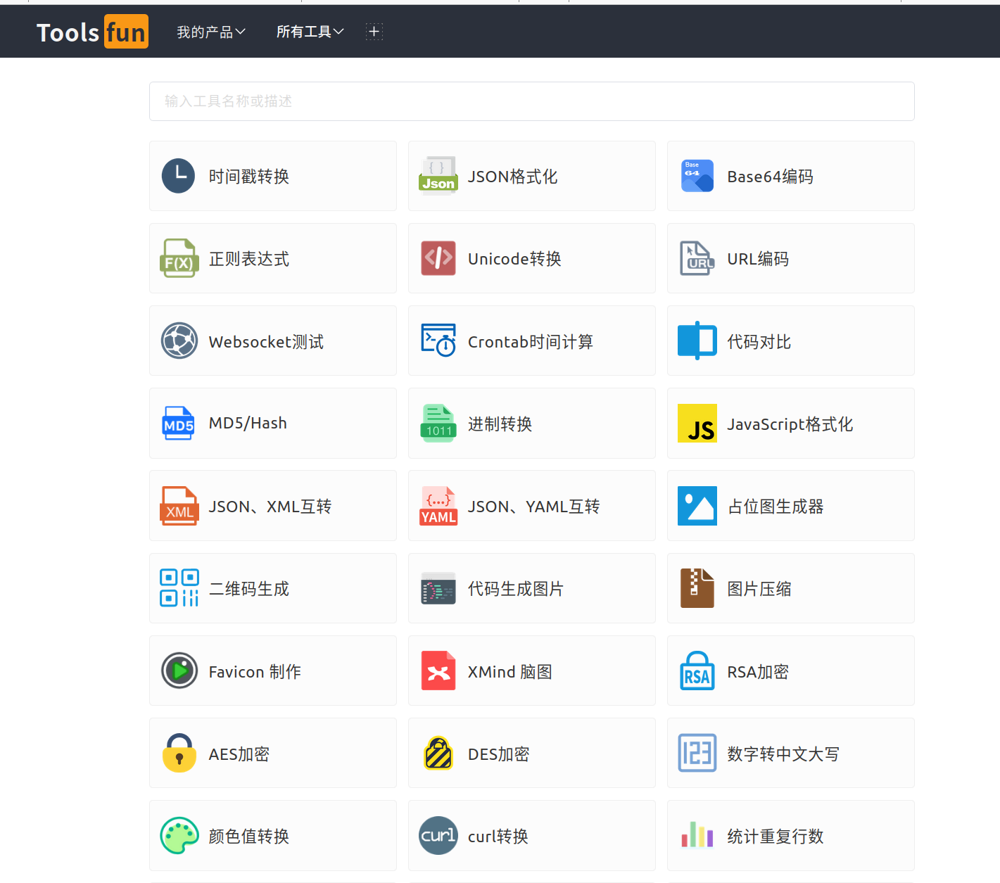
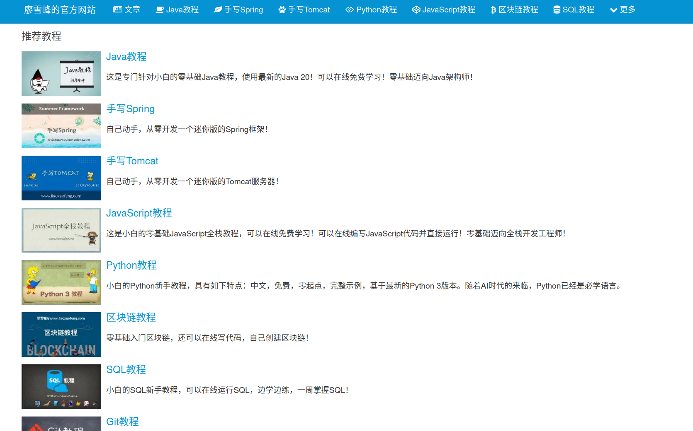

## 优秀资源汇总

### 1 在线工具

1 在线工具箱： https://tools.fun/

2 在线文档翻译和转换：https://products.groupdocs.app/translation/zh/total

3 虫部落(资源检索)：https://www.chongbuluo.com/

### 2 在线教程

1 廖雪峰官网：https://www.liaoxuefeng.com/

2 易佰教程：https://www.yiibai.com/

3 蓝桥云课：https://www.lanqiao.cn/

### 3 数据结构与算法

1 [数据结构与算法](https://github.com/RobotIt/hello-algo)
   - C++ 版本：https://pan.baidu.com/s/1hv_jB67ykcFQ1z2_r76log 提取码：6666
   - Python 版本：https://pan.baidu.com/s/1HhxDs6D-TBJnuW6l3o7cnQ 提取码：6666

### A Gitbook

1 江明博客，网址： https://jiangming_gitee.gitee.io/gitbook/

2 ghostwritten的CSDN，[CSDN网址](https://blog.csdn.net/xixihahalelehehe/article/details/121107739?ops_request_misc=%257B%2522request%255Fid%2522%253A%2522169364406816800227418582%2522%252C%2522scm%2522%253A%252220140713.130102334.pc%255Fblog.%2522%257D&request_id=169364406816800227418582&biz_id=0&utm_medium=distribute.pc_search_result.none-task-blog-2~blog~first_rank_ecpm_v1~rank_v31_ecpm-15-121107739-null-null.268^v1^koosearch&utm_term=git&spm=1018.2226.3001.4450)

3 valine评论插件，网址：https://console.leancloud.cn/apps

