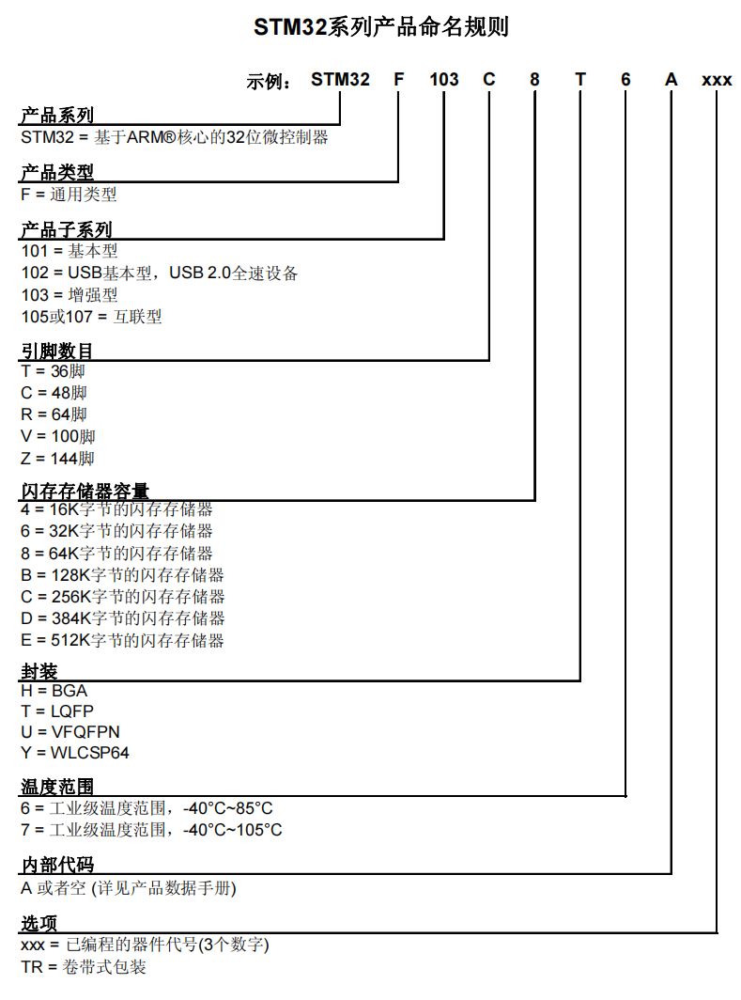

# 1.1 STM32简介及工程架构

### 1-1 课程简介

#### 1 课程概述

- 程序纯手打，手把手教学。在本套视频中除了一些比较固定的代码，比如延时函数、显示屏函数等，我会直接提供给大家，其他的关键部分代码我都会亲自给大家敲出来，一步步的演示工程是如何建立的，程序是如何调试的

- STM32最小系统版和面包版的硬件平台。在本套视频中，使用的硬件平台如下图所示

  

- 将STM32最小系统板插在面包板上，作为基本的硬件单元。下面插上一块0.96寸的OLED作为调试和显示的屏幕。在调试程序时，我们可以把程序中的变量显示在这个屏幕上，这样调试起来就会比较方便

- STLINK是插在电脑上用于下载程序和供电的。 LED按键插在最小系统板的两侧，其他的一些模块，比如这个是蜂鸣器模块，则是用杜邦线来连接的，带插针的模块则会跨接在面包板的中间，然后再进行连线

- 使用面包板能够完成任意电路的连接，连线和修改都是非常方便的，相比较成品的开发板方式，使用面包板更有利于我们对硬件电路的学习，而且也可以避免开发板的一些问题。比如引脚冲突，引脚无法更改等。当然使用面包板也会带来一些问题，比如你程序现象不出来，不仅可能是你程序的问题，也有可能是接线的问题。这就需要我们在连线的时候要更加细心一些，关注软件程序的同时也需要关注一下硬件电路

#### 2 硬件设备

##### 2.1 STM32入门套件

本套课程所使用的入门套件见下图


- 1为面包板，其他的模块和导线都是插在面包板上完成连接的
- 2是面包板专用的跳线，这种跳线比较短，可以贴在面包板上插线，比较适合长时间插线的情况
- 3是面包板的飞线，这种线比较长，也方便挪动，比较适合经常挪动的接线情况
- 4是杜邦线，分别是公对母和母对母的，可以用于插接一些电路模块
- 5是STM32最小系统板，上面黑色的小芯片就是STM32，我们主要就是学习这个芯片
- 6是0.96寸的OLED显示屏模块，用于显示参数和变量。这个显示屏是一个4引脚版本的，现在网上卖的有4引脚和7引脚的，注意不要弄错了
- 7是电位器，主要用来进行AD转换实验的
- 8是按键，我选的按键是这种两引脚的小按键，它可以正好跨接在面包板的引脚插孔和电源插孔之间，连接非常方便简洁
- 9是LED灯，用来做点灯实验的，我争取让大家都成为点灯大师
- 10是STLINK，用来下载程序和供电的
- 11是USB转串口模块，使用这个模块就可以使STM32和电脑进行串口通信了
- 12是有源蜂鸣器模块，它是内置震荡源的，接上电就可以响。相比较无源蜂鸣器模块需要不断翻转IO口的操作方式，这个就方便多了，基本和点灯一样简单
- 13是光敏电阻模块，下面的4个引脚有2个是用来供电的，还有2个是光敏电阻信号的模拟输出和数字输出，这个可以用来进行IO口读取实验或者AD实验
- 14是热敏电阻模块，也是有模拟输出和数字输出的
- 15是对射式红外模块，这个模块配合遮光片可以用来计次或者配合编码盘用来测速
- 16是反射式红外模块，这个做过循迹车的应该清楚，它可以向地面发射红外光，然后再用红外接收管接收地面反射的红外光，通过判断接收光的强度，就可以大致的识别出地面的颜色变化了
- 17是W25Q64 FLASH存储模块，它可以存储数据，并且它是用SPI总线进行通信的，我们主要用它来学习SPI通信
- 18是MPU6050陀螺仪和加速度计，它可以测量芯片自身的姿态，像四轴飞行器上一般都会配有陀螺仪和加速的计，这个模块是IIC总线通信的，我们主要用它来学习IIC通信
- 19是旋转编码器，它可以输出两路正交的方波信号，用于指示旋转的方向和速度。STM32里面有专门的编码器电路，可以很方便地识别这种信号，这个模块可以当做一个快速的按键来使用。当然我的主要意图还是用它来模拟编码器的测速。现在的编码电机一般都会配备霍尔传感器或者光电传感器，这些传感器的输出和这种旋转编码器是一样的，所以学习一下旋转编码器就可以了，而且这种旋转编码器还比较方便的插在面包板上
- 20和21是直流电机和TB6612电机驱动模块，可以用来进行直流电机的PWM调速实验
- 22是SG90舵机，它也是用PWM进行控制的。它的输出端可以像船舵一样，根据我们给定的PWM信号的占空比固定在某个角度上，这个可以用来做一些机器人或者机械臂的关节

##### 2.2 Windows电脑

- 电脑尽量选择windows系统的，因为我们的编程软件还有一些小工具都是在windows平台的，选择windows的电脑会方便一些

##### 2.3 工具

- 准备一些工具，比如万用表、示波器、镊子、剪刀等
- 万用表可以很方便的检查电路的连接情况，因为我们使用的是面包板搭接的电路，可能会存在接错线或者接触不良的情况，如果有个万用表就可以很方便的测试电路的连接情况
- 示波器可以测出引脚的电压波形变化，在PWM实验或者通讯协议的实验能看到波形，那对我们的调试程序将会有很大的帮助

#### 3 软件设备

- 本套教程学习STM32使用的是Keil5 MDK这个软件，Keil5 MDK是用来给ARM系列的单片机编程的软件。Keil5 MDK的安装软件和注册工具见网盘链接，安装方法见《2-1 软件安装》


### 1-2 STM32简介

#### 1 STM32 MCUs

##### 1.1 STM32

- ST是指ST公司，M是Microcontroller的首字母。微控制器就是MCU，就是我们常说的单片机，所以STM32也是一款单片机
- 32是指该处理器是32位，即32-bits。相比较8位的51单片机，STM32的性能还是非常强的
- ARM Cortex-M内核是STM32内部的核心部分。这个内核是ARM公司设计的，我们程序指令的执行、加减乘除的运算都是在内核里完成的，它相当于整个芯片的CPU。就像我们现在的电脑厂商一样，可以拿着英特尔或者AMD的CPU，然后自己完善外围电路，就可以推出自己品牌的电脑。STM32也是一样，ST公司拿着ARM公司设计的内核，再完善外围电路，整个封装起来就做成了STM32。当然也可以有其他的厂商拿着ARM的内核，来做自己的芯片，那这些芯片都叫做基于ARM内核的芯片
- STM32常应用在嵌入式领域，如智能车、无人机、机器人、无线通信、物联网、工业控制、娱乐电子产品等 

##### 1.2 STM32系列

- STM32分4个系列，分别是High Performance（高性能系列）、Mainstream（主流系列）、Ultra-low-power（超低功耗系列）、Wireless（无线系列），见下图


- High Performance：STM32F2、STM32F4、STM32F7、STM32H7

  - 上图中下面是芯片的性能介绍，比如STM32F2系列就是398的CoreMark和120MHz主频的Cortex-M3内核。这个CoreMark就是一个内核跑分，跑分越高性能越好。Cortex-M3内核就是ARM的其中一个内核芯片

  - 单片机的主频（也称为时钟频率或振荡频率）是指单片机的内部时钟频率，通常以赫兹（Hz）为单位表示。主频对单片机的性能和功能具有重要影响，具体用途包括：

    ​	1. 控制执行速度：主频决定了单片机执行指令的速度。较高的主频可以使单片机更快地执行指令，适用于需要高性能的应用，例如图形处理、音频处理或高速通信

    ​	2. 定时和延时：主频用于计算定时器和延时器的周期，从而实现精确的时间控制。这在许多应用中非常重要，如实时控制系统、定时器中断等

    ​	3. 节能和电源管理：通过降低主频，可以减少单片机的功耗，延长电池寿命，适用于侧重低功耗的应用，如便携设备和传感器节点

    ​	4. 通信速度：主频也可以影响串行通信的速度，例如UART（通用异步收发传输）通信或SPI（串行外设接口）通信速率。更高的主频可以支持更高的通信速度

    ​	5. 复杂性和功能：高主频的单片机通常具有更多的处理能力，可以执行更复杂的任务和算法。这对于需要处理大数据量或进行复杂计算的应用非常重要

    ​	6. 精确性和稳定性：主频的稳定性和精确性对某些应用非常重要，例如时钟同步、数据采集和传感器读数。单片机主频的稳定性可以影响系统性能

  - 高性能系列中，STM32H7的芯片就是目前最强的STM32芯片。拥有3224的内核跑分，550MHz的Cortex-M7和240MHz的 Cortex-M4的内核，是一个双核微控制机 

- Mainstream：STM32G0、STM32G4、STM32F0、STM32F1、STM32F3

  - 本次教程我们使用的是STM32F1这个系列，它有177的内核跑分和72MHz的Cortex-M3内核 


- Ultra-low-power：STM32L4+、STM32U5、STM32L0、STM32L1、STM32L4、STM32L5

- Wireless：STM32WL、STM32WB

#### 2 ARM处理器系列

- 这里的ARM既指ARM公司，也指ARM处理器内核。ARM公司是全球领先的半导体知识产权提供商，知识产权提供商的意思就是这个ARM公司是只设计ARM内核而不生产实物。实际的内核是各大半导体厂商连同芯片一起制作出来的。ARM可以授权给各大厂商它的设计，然后再收取授权费作为盈利方式。这实际是一种开放、合作、利益共享、风险共担的商业模式，现在全球超过95%的智能手机和平板电脑都采用了ARM的架构
- STM32是ST公司基于ARM内核，设计自己的存储器以及外设等组件，构成STM芯片，见下图
  
  - 蓝色部分是整个的STM32芯片，内部处于CPU地位的就是ARM公司设计的内核。右边这些橙色的部分就是ST公司设计的外围电路，比如存储器还有一些片上的外设资源等。如果ST公司觉得资源不够多，还可以继续增加外围电路 

- ARM公司的内核分为Classic、Embedded和Application，见下图
  


- Classic  
  - 经典ARM处理器，ARM老版本，现在用的比较少了
  - 主流型号：ARM7、ARM9、ARM11


- Application  
  - 在ARM11之后，为了迎合时代的发展和市场的变化，ARM更改了命名方式，推出了Cortex系列的内核，并且一下推出了三款子型号用于适用不同的场景。它们分别是Cortex-A系列、Cortex-R系列和Cortex-M系列，这三个系列加起正好构成的ARM三个字母。A系列适用于高端应用型的领域，R系列和M系列适用于嵌入式领域
  - A系列就是Application的意思，现在的苹果、高通、联发科的手机芯片基本上都是采用ARM内核架构。A系列也是ARM内核中性能最高、发展最快的系列。最近苹果推出了基于ARM架构的M1芯片，将ARM架构推进到了电脑领域，所以ARM的发展趋势还是非常好的 
  - 主流型号：Cortex-A5、Cortex-A7、Cortex-A8、Cortex-A9、Cortex-A15等


- Embedded  
  - 与A系列对比下来，R系列和M系列的型号发展就比较慢。R系列就是RealTime的意思，主要面向实时性很高的场景，比如硬盘控制器等。R系列的应用场景比较小，R系列的内核型号也不是很多 
  - M系列就是MicroController的意思，主要应用在单片机领域。STM32使用的就是M系列的内核，它的型号有Cortex-M0、Cortex-M1、Cortex-M3、Cortex-M4等。不同型号的内核性能也是不同的，参见上文STM32系列的配图 

#### 3 STM32F103C8T6

##### 3.1 芯片参数


- 系列：主流系列STM32F1
- 内核：ARM Cortex-M3
- 主频：72MHz
- RAM：20K，RAM是运行内存，实际的存储介质是SRAM
- ROM：64K，ROM是程序存储器，实际的存储介质是Flash闪存
- 供电：2.0~3.6V(标准3.3V)
  - USB和51单片机，都用的5V电压，不能给STM32供电。如果是5V电压，需要加一个稳压芯片，把电压降到3.3V再给STM32供电 
- 封装：LQFP48，如上图所示，总共有48个引脚，如果自己画PCB板需要了解一下它的封装 

**3.2 最小系统板**

最小系统板硬件信息


- ①两个跳线帽用来配置BOOT引脚
- ②黑色芯片是STM32F103C8T6
- ③是PWR电源指示灯
- ④是SWD的调试接口，用来下载程序
- ⑤是接在PC13口的测试LED灯
- ⑥32.768KHz的RTC晶振
- ⑦是8MHz的主时钟晶振
- ⑨是USB接口，它可以进行USB通信，也可以为板子供电
- 上下两排是用于接线的排针


- 系统板背面见上图，①标记处是3.3V稳压芯片，剩下的是电容、电阻这些零件

##### 3.3 片上资源(外设)

**1 外设资源**

- 在STM32微控制器中，**外设（Peripheral）**是指与主处理器核心（Core）相连的独立功能模块或硬件单元。这些外设模块能够通过特定的接口与主处理器核心进行通信和交互，以扩展微控制器的功能和性能
- STM32微控制器内部集成了各种外设，包括但不限于通用输入/输出引脚（GPIO）、定时器（Timer）、串行通信接口（UART、SPI、I2C等）、模数转换器（ADC）、通用定时/计数器（GPT）、以太网控制器、USB控制器、以及其他专用功能模块等。
- STM32F103XX系列的外设资源见下图，各个外设的作用见下表


- 通过使用这些外设，开发人员可以利用STM32微控制器的硬件资源来实现各种功能，例如读取传感器数据、控制外部设备、进行通信和网络连接等
  - 注意，下表是STM32F103XX系列的所有外设，并不是所有型号都拥有全部的外设。比如我们使用的C8T6的芯片就没有DAC、SDIO、FSMC和USB OTG这四个外设。每个芯片具体有哪些外设，每个外设有几个，需要查看该芯片的数据手册

| 英文缩写  | 名称               | 作用                                                         | 备注                    |
| --------- | ------------------ | ------------------------------------------------------------ | ----------------------- |
| NVIC      | 嵌套向量中断控制器 | 内核里面用于管理中断的设备，比如配置中断优先级等             | Cortex-M3内核里面的外设 |
| SysTick   | 系统滴答定时器     | 内核里面的定时器，用于给操作系统提供定时服务。STM32是可以加入操作系统的，如FreeRTOS、UCOS等。如果用了这些操作系统，就需要SysTik提供定时来进行任务切换的功能 | Cortex-M3内核里面的外设 |
| **RCC**   | 复位和时钟控制     | 对系统的时钟进行配置，以及使能各个模块的时钟。在STM32中，其他外设在上电情况下默认是没有时钟的，不给时钟的情况下操作外设是无效的，外设也不会工作。这样的目的是降低功耗，所以在操作外设之前必须先通过RCC来进行时钟使能 |                         |
| **GPIO**  | 通用IO口           | 通用的IO口                                                   |                         |
| AFIO      | 复用IO口           | 复用功能端口的重定义，以及中断端口的配置                     |                         |
| **EXTI**  | 外部中断           | 外部中断，配置好外部中断后，当引脚有电平变化时，可以触发中断，让CPU处理中断任务 |                         |
| **TIM**   | 定时器             | TIM是整个STM32最常用、功能最多的外设，TIM分为高级定时器、通用定时器、基本定时器3种类型。其中，高级定时器最为复杂，常用的是通用定时器。TIM定时器不仅可以完成定时中断的任务，还可以完成测频率、生成PWM波形、配置成专用的编码器接口等功能 |                         |
| ADC       | 模数转换器         | STM32内置的12位模数转换器，可以直接读取IO口的模拟电压值，无需外部连接AD芯片 |                         |
| DMA       | 直接内容访问       | 可以帮助CPU完成搬运大量数据的繁杂任务                        |                         |
| **USART** | 同步/异步串口通讯  | 平时用的UART是异步串口，这里的USART是既支持异步串口也支持同步串口，实际还是使用异步串口比较多 |                         |
| I2C       | I2C通信            | I2C通信协议，STM32内置了该通信协议的控制器，可以用硬件来输出时序波形，当然也可以用GPIO来模拟时序波形 |                         |
| SPI       | SPI通信            | SPI通信协议，STM32内置了该通信协议的控制器，可以用硬件来输出时序波形，当然也可以用GPIO来模拟时序波形 |                         |
| **CAN**   | CAN通信            | CAN通信协议                                                  |                         |
| USB       | USB通信            | USB通信协议，利用STM32的USB外设，可以做一个模拟鼠标、模拟U盘等设备 |                         |
| RTC       | 实时时钟           | 在STM32内部完成年月日、时分秒的计时功能。而且可以接外部备用电池，即使掉电也能正常运行 |                         |
| CRC       | CRC校验            | 数据校验方式，用于判断数据的正确性。有了这个外设的支持进行CRC校验就会更加方便 |                         |
| PWR       | 电源控制           | 可以让芯片进入睡眠模式，达到省电的目的                       |                         |
| BKP       | 备份寄存器         | 这是一段存储器，当系统掉电时，仍可由备用电池保持数据。这个根据需要可以完成一些特殊功能 |                         |
| IWDG      | 独立看门狗         | 当单片机因为电磁干扰死机，或程序设计不合理出现死循环时，看门狗可以及时复位芯片，保证系统的稳定 |                         |
| WWDG      | 窗口看门狗         | 当单片机因为电磁干扰死机，或程序设计不合理出现死循环时，看门狗可以及时复位芯片，保证系统的稳定 |                         |
| DAC       | 数模转换器         | 直接在IO口输出模拟电压，是ADC模数转换的逆过程                |                         |
| SDIO      | SD卡接口           | 可以用来读取SD卡                                             |                         |
| FSMC      | 可变静态存储控制器 | 可以用于扩展内存，或者配置成其他总线协议用于某些硬件的操作   |                         |
| USB OTG   | usb主机接口        | 使用OTG功能，让STM32作为USB主机去读取其他USB设备             |                         ||

**2 STM32时钟**

- 在STM32微控制器中，**时钟（Clock）**是指用于同步和驱动各个硬件模块和外设的基准信号。时钟信号提供了微控制器内部各个模块之间的时间参考，确保它们按照正确的时序进行操作和通信

- STM32微控制器具有多个时钟源和时钟树，用于提供不同频率和精度的时钟信号。主要的时钟源包括晶体振荡器（Crystal Oscillator）、内部高速振荡器（Internal High-Speed Oscillator）、外部时钟源（External Clock Source）等。这些时钟源通过时钟树的配置和分频器的设置，可以生成不同频率的系统时钟和各个外设所需的时钟信号

- 通过配置和管理时钟，开发人员可以控制外设的操作速度、功耗消耗，以及整个系统的时序和同步性


##### 3.3 芯片命名规则

STM32芯片命名规则，见下图


- 产品系列：STM32=基于ARM核心的32位微控制器
- 产品类型：F=通用类型
- 产品子系列：101-基本型、102=USB基本型、USB2.0全速设备、103=增强型、105或107=互联型
- 引脚数目：T=36引脚、C=48引脚、R=64引脚、V=100引脚、Z=144引脚（一般来说引脚越多，外设资源就越多）
- 内存存储器容量：4=16K字节的闪存存储器、6=32K字节的闪存存储器、8=64K字节的闪存存储器、B=128K字节的闪存存储器、C=256K字节的闪存存储器、D=384K字节的闪存存储器、E=512K字节的闪存存储器
- 封装：H=BGA、T=LQFP、U=VFQFPN、Y=WLCSP64
- 温度范围：6=工业级温度范围，-40℃-85℃、7=工业级温度范围，-40℃-105℃

##### 3.4 芯片系统结构

STM32的系统结构，见下图


上图可以分为四个部分：


- 左上角<br/>
  - ①是Cortex-M3内核，内核引出来了三条总线，分别是ICode的指令总线、DCode数据总线和System系统总线。ICode总线和DCode总线主要是用来②Flash闪存


- 右上角
  - Flash里面存储的是我们编写的程序，ICode指令总线就是用来加载程序指令，DCode的数据总线是用来加载数据，比如常量和调试参数等
  - 除了ICode总线和DCode总线，内核还引出了System系统总线。System总线连接到其他的资源上面，比如③SRAM，用于存储程序运行时的变量数据；还有④FSMC，这个本课程的芯片不会用到


- 右下角
  - ⑤AHB系统总线就是用于挂载主要的外设。AHB的意思是**先进高性能总线**，挂载的一般是最基本的或者性能比较高的外设。比如复位和时钟控制这些最基本的电路，还有⑥SDIO也是挂载在AHB总线
  - AHB总线后面是两个桥接，接到⑦APB1和⑧APB2两个外设总线上。APB的意思是**先进外设总线**，用于连接一般的外设。因为AHB和APB的总线协议、总线速度、还有数据传送格式的差异，所以中间需要加两个桥接来完成数据的转换和缓存
  - AHB的整体性能比APB高一些，其中这个⑧APB2的性能又比⑦APB1高一些。⑧APB2一般和AHB同频率，都是72MHz，APB1一般是36MHz。所以APB2连接的是外设中稍微重要的部分，比如GPIO端口、还有一些外设的1号选手等，比如USART1、SPI1、高级定时器TIM1和TIM8，以及ADC、EXTI、AFIO等外设
  - 其他的像这些2、3、4、5号的外设，还有DAC、PWR、BKB等这些次要一点的外设，都会分配到APB1上。当然在使用的时候个人一般感觉不到⑧APB2和⑦APB1的性能差距，只需要知道这个外设是挂到哪个总线上就可以，在进行时钟使能设置的时候需要用到
  - 总结：右下角的这一大部分主要介绍的是外设种类和分布，左下角的部分是DMA


- 左下角
  - ⑨DMA可以把它当做内核CPU的小秘书。比如有一些大量的数据搬运的工作，让CPU来干的话就太浪费资源。比如有个外设ADC模数转换的工作，模数转换为连续模式，每1毫秒转换一次。转换完的数据必须得转运出来，否则数据就会被覆盖丢失
  - 如果直接让CPU来干搬运工作，那CPU每过1毫秒就得来转运一下数据，这样会费时费力影响CPU的正常工作。而且这个工作就是简单的数据搬运，也没必要CPU来干这活，于是DMA这个小秘书就出现了
  - DMA主要干像数据搬运这样简单且反复要干的事情。DMA通过⑩DMA总线连接到总线矩阵上，它可以拥有和CPU一样的总线控制权，用于访问这些外设小弟。当需要DMA搬运数据时，外设小弟就会通过请求线发送DMA请求，然后DMA就会获得总线控制权访问并转运数据。整个过程不需要CPU的参与，省下CPU的资源来干其他的事情

##### 3.5 芯片引脚定义

STM32F103C8T6的引脚定义图


- 在引脚名称和引脚序号示意图中，左上角的小黑点代表它左边的引脚是1号引脚，然后逆时针依次排列，直到48号引脚，下面的表格是每个引脚的名称和功能，通过颜色进行标记


- 颜色标记说明
  - 标记红色的是电源相关的引脚
  - 标记蓝色的是最小系统相关的引脚
  - 标记绿色的是IO口、功能口这些引脚


- 关于上表的几点说明
  - 前两列是引脚号和引脚名称，和上面的芯片引脚一一对应
  - 类型：S代表电源、I代表输入、O代表输出、IO代表输入输出
  - I/O电平：表示I/O所能容忍的电压，FT表示可以容忍5V电压，没有表示可以容忍3.3V电压。如果某个引脚没有FT，需要接5V的电压，就需要加装电平转换电路
  - 主功能：上电后默认的功能，一般和引脚名称相同；若不同，引脚的实际功能是主功能，而不是引脚名称的功能
  - 默认复用功能：IO口上同时连接的外设功能引脚，这个配置IO口的时候可以选择是通用IO口还是复用功能
  - 重定义功能：如果有两个功能同时复用在了一个IO口上，而你确实需要用到这两个功能。那你可以把其中一个复用功能重映设到其他端口上，当然前提是这个重定义功能的表里有对应的端口 


- STM32F103C8T6引脚说明见下，参考链接：[点击传送](https://blog.csdn.net/weixin_42268054/article/details/104280487)


- 1号引脚是VBAT，它是备用电池供电的引脚，在这个引脚可以接一个3V的电池。当系统电源断电时，备用电池可以给内部的RTC时钟和备份寄存器提供电源

- 2号引脚是IO口、或者侵入检测、或者RTC

  - IO口可以根据程序输出或读取高低电平，是最基本也是最常用的功能
  - 侵入检测可以用来做安全保障的功能，比如你的产品安全性比较高，可以在外壳加一些防拆的触点，然后接上电路到到这个引脚。如果有人强行拆开设备，那触点断开这个引脚的电平变化，就会触发STM32的侵入信号，然后就会清空数据来保证安全
  - RTC引脚可以用来输出RTC较准时钟、RTC闹钟脉冲或者秒脉冲 


- 3、4号引脚是IO口，或者接32.768KHz的RTC晶振。2的15次方是32768，内部RTC经过2的15次方分频，就可以产生1秒的时间信号

- 5、6号引脚（在板子背面）接系统的主晶振，一般是8MHz。然后芯片内有锁相环电路，可以对这个8MHz的频率进行倍频，最终产生72MHz的频率作为系统的主时钟

- 7号引脚NRST是系统复位引脚，N代表它是低电平复位

- 8、9号引脚是内部模拟部分的电源（物理引脚没找到），比如ADC、RC振荡器等。VSS是负极，接GND；VDD是正极，接3.3V

- 10-19号引脚都是IO口，其中PA0还兼具了WKUP功能，可以用于唤醒处于待机模式的STM32

- 20号引脚是IO口或者BOOT1引脚，BOOT引脚用来配置启动模式

- 21、22号引脚是IO口

- 23、24号引脚的VSS_1和VDD_1是系统的主电源口。同样的VSS是负极，VDD是正极。另外下面还有VSS_2（35引脚）、VDD_2（36引脚）、VSS_3（47引脚）、VDD_3（48引脚），都是系统的主电源口。这里STM32内部采用了分区供电的方式，所以供电口会比较多。在使用时，把VSS都接GND，VDD都接3.3V即可

- 25-33号引脚都是IO口

- 34号引脚，加上37号到40号引脚，这些是IO口或者调试端口。上电默认的主功能是调试端口，调试端口用来调试程序和下载程序

  - STM32支持SWD和JTAG两种调试方式，SWD需要两根线，分别是SWDIO和SWCLK。JTAG需要五根线，分别是JTMS、JTCK、JTDI、JTDO、NJTRST
  - 本教程使用的是STLINK来下载调试程序，STLINK用的是SWD的方式，所以只需要占用PA13、PA14这两个IO口
  - 在使用SWD的调试方式时，剩下的PA15、PB3、PB4可以切换为普通的IO口来使用。但要在程序中进行配置，不配置默认是不会用做IO口，执行上电的主功能


- 41号到43号，45号到46号都是引脚是IO口
- 44号引脚是BOOT0，和上面介绍的BOOT1一样，用来进行启动配置

| 引脚号 |    引脚名称     |  类型   | I/O口电平 |   主功能   |                      默认复用功能                      |                  重定义功能                   |
| :----: | :-------------: | :-----: | :-------: | :--------: | :----------------------------------------------------: | :-------------------------------------------: |
|   1    |      VBAT       | S(电源) |           |    VBAT    |                                                        |                                               |
|   2    | PC13-TAMPER-RTC |   I/O   |           |    PC13    |                       TAMPER-RTC                       |                                               |
|   3    |  PC14-OSC32_IN  |   I/O   |           |    PC14    |                        OSC32_IN                        |                                               |
|   4    | PC15-OSC32_OUT  |   I/O   |           |    PC15    |                       OSC32_OUT                        |                                               |
|   5    |     OSC_IN      |    I    |           |   OSC_IN   |                                                        |                                               |
|   6    |     OSC_OUT     |    O    |           |  OSC_OUT   |                                                        |                                               |
|   7    |      NRST       |   I/O   |           |    NRST    |                                                        |                                               |
|   8    |      VSSA       |    S    |           |    VSSA    |                                                        |                                               |
|   9    |      VDDA       |    S    |           |    VDDA    |                                                        |                                               |
|   10   |  **PA0-WKUP**   |   I/O   |           |    PA0     | WKUP<br />USART2_CTS<br />ADC12_IN0<br />TIM2_CH1_ETR  |                                               |
|   11   |     **PA1**     |   I/O   |           |    PA1     |        USART2_RTS<br />ADC12_IN1<br />TIM2_CH2         |                                               |
|   12   |     **PA2**     |   I/O   |           |    PA2     |         USART2_TX<br />ADC12_IN2<br />TIM2_CH3         |                                               |
|   13   |     **PA3**     |   I/O   |           |    PA3     |         USART2_RX<br />ADC12_IN3<br />TIM2_CH4         |                                               |
|   14   |     **PA4**     |   I/O   |           |    PA4     |         SPI1_NSS<br />USART2_CK<br />ADC12_IN4         |                                               |
|   15   |     **PA5**     |   I/O   |           |    PA5     |                SPI1_SCK<br />ADC12_IN5                 |                                               |
|   16   |     **PA6**     |   I/O   |           |    PA6     |         SPI1_MISO<br />ADC12_IN6<br />TIM3_CH1         |                   TIM1_BKIN                   |
|   17   |     **PA7**     |   I/O   |           |    PA7     |         SPI1_MOSI<br />ADC12_IN7<br />TIM3_CH2         |                   TIM1_CH1N                   |
|   18   |     **PB0**     |   I/O   |           |    PB0     |                ADC12_IN8<br />TIM3_CH3                 |                   TIM1_CH2N                   |
|   19   |     **PB1**     |   I/O   |           |    PB1     |                ADC12_IN9<br />TIM3_CH4                 |                   TIM1_CH3N                   |
|   20   |       PB2       |   I/O   |    FT     | PB2/BOOT1  |                                                        |                                               |
|   21   |    **PB10**     |   I/O   |    FT     |    PB10    |                I2C2_SCL<br />USART3_TX                 |                   TIM2_CH3                    |
|   22   |    **PB11**     |   I/O   |    FT     |    PB11    |                I2C2_SDA<br />USART3_RX                 |                   TIM2_CH4                    |
|   23   |      VSS_1      |    S    |           |   VSS_1    |                                                        |                                               |
|   24   |      VDD_1      |    S    |           |   VDD_1    |                                                        |                                               |
|   25   |    **PB12**     |   I/O   |    FT     |    PB12    | SPI2_NSS<br />I2C2_SMBAI<br />USART3_CK<br />TIM1_BKIN |                                               |
|   26   |    **PB13**     |   I/O   |    FT     |    PB13    |        SPI2_SCK<br />USART3_CTS<br />TIM1_CH1N         |                                               |
|   27   |    **PB14**     |   I/O   |    FT     |    PB14    |        SPI2_MISO<br />USART3_RTS<br />TIM1_CH2N        |                                               |
|   28   |    **PB15**     |   I/O   |    FT     |    PB15    |                SPI2_MOSI<br />TIM1_CH3N                |                                               |
|   29   |     **PA8**     |   I/O   |    FT     |    PA8     |              USART1_CK<br />TIM1_CH1/MCO               |                                               |
|   30   |     **PA9**     |   I/O   |    FT     |    PA9     |                USART1_TX<br />TIM1_CH2                 |                                               |
|   31   |    **PA10**     |   I/O   |    FT     |    PA10    |                USART1_RX<br />TIM1_CH3                 |                                               |
|   32   |    **PA11**     |   I/O   |    FT     |    PA11    |    USART1_CTS<br />USBDM<br />CAN_RX<br />TIM1_CH4     |                                               |
|   33   |    **PA12**     |   I/O   |    FT     |    PA12    |    USART1_RTS<br />USBDP<br />CAN_TX<br />TIM1_ETR     |                                               |
|   34   |      PA13       |   I/O   |    FT     | JTMS/SWDIO |                                                        |                     PA13                      |
|   35   |      VSS_2      |    S    |           |   VSS_2    |                                                        |                                               |
|   36   |      VDD_2      |    S    |           |   VDD_2    |                                                        |                                               |
|   37   |      PA14       |   I/O   |    FT     | JTCK/SWCLK |                                                        |                     PA14                      |
|   38   |      PA15       |   I/O   |    FT     |    JTDI    |                                                        |     TIM2_CH1_ETR<br />PA15<br />SPI1_NSS      |
|   39   |       PB3       |   I/O   |    FT     |    JTDO    |                                                        | PB3<br />TRACESWO<br />TIM2_CH2<br />SPI1_SCK |
|   40   |       PB4       |   I/O   |    FT     |   NJTRST   |                                                        |       PB4<br />TIM3_CH1<br />SPI1_MISO        |
|   41   |     **PB5**     |   I/O   |           |    PB5     |                       I2C1_SMBAI                       |            TIM3_CH2<br />SPI1_MOSI            |
|   42   |     **PB6**     |   I/O   |    FT     |    PB6     |                 I2C1_SCL<br />TIM4_CH1                 |                   USART1_TX                   |
|   43   |     **PB7**     |   I/O   |    FT     |    PB7     |                 I2C1_SDA<br />TIM4_CH2                 |                   USART1_RX                   |
|   44   |      BOOT0      |    I    |           |   BOOT0    |                                                        |                                               |
|   45   |     **PB8**     |   I/O   |    FT     |    PB8     |                        TIM4_CH3                        |             I2C1_SCL<br />CAN_RX              |
|   46   |     **PB9**     |   I/O   |    FT     |    PB9     |                        TIM4_CH4                        |             I2C1_SDA<br />CAN_TX              |
|   47   |      VSS_3      |    S    |   VSS_3   |            |                                                        |                                               |
|   48   |      VDD_3      |    S    |   VDD_3   |            |                                                        |                                               ||

- 上表中，引脚名称没有加粗，表示优先推荐使用加粗的引脚。没有加粗的IO口，可能需要进行配置，或者兼具其他功能，使用时需要留意一下

##### 3.6 启动配置

- 启动配置的作用就是指定程序开始运行的位置。一般情况下，程序都是在Flash程序存储器开始执行。但是在某些情况下，我们也可以让程序在别的地方开始执行，用以完成特殊的功能
- STM32F10XXX的启动配置见下图，可以通过配置BOOT0和BOOT1引脚来选择三种不同的启动模式


- 主闪存存储器模式
  - 当BOOT0引脚接0，也就是接地的意思，这个时候BOOT1接X，就是无论接什么，启动模式都是主闪存存储器的模式。这时候主闪存存储器被选为启动区域，也就是正常的执行Flash闪存里面的程序。这个模式是最常用的模式，一般情况下都是这个模式


- 系统存储器模式
  - 当BOOT1接0，BOOT0接1，接1就是接到3.3V电源正的意思。那启动模式就是系统存储器，说明系统存储器被选为启动区域，这个模式用来做串口下载。系统存储器就是STM32中一段Bootloader程序，Bootloader程序的作用就是接收串口的数据，然后刷新到主闪存中，这样就可以使用串口下载程序。一般我们需要串口下载程序的时候会配置到这个模式
  - 何时用到串口下载，可以看引脚定义表。34、37、38、39、40这5个引脚是调试端口，它们既可以用来下载程序，也可以用作普通IO口。如果我们在程序中把这5个端口全部配置成IO口，那就坏了。因为没有调试端口，无法下载程序。所以在配置这几个端口的时候要小心，不要把他们全部配置成普通IO口
  - 如果全部配置成IO口，无法下载程序，这就需要用到串口的方式下载程序，此时需要配置BOOT1为0，BOOT0为1。当然串口下载也不光是用来救急的，如果你没有STLINK，也没有JLINK，就可以使用串口下载程序，这样就多了一种下载程序的方式


- 内置SRAM模式
  - BOOT1接1，BOOT0接1是配置为内置SRAM模式，这个模式主要是用来进行程序调试


- 说明：在系统复位后SYSCLK的第4个上升沿，BOOT引脚的值将被锁定，用户可以通过设置BOOT1和BOOT0引脚的状态来选择复位后的启动模式。这个意思是BOOT引脚的值是在上电复位后的一瞬间有效的。从引脚定义表可以看出，BOOT1和PB2在同一个引脚上，也就是在上电的瞬间是BOOT1的功能，当第4个时钟过后就是PB2的功能

| 启动模式选择引脚 | 启动模式选择引脚 | 启动模式     | 说明                                               |
| ---------------- | ---------------- | ------------ | -------------------------------------------------- |
| BOOT1            | BOOT0            |              |                                                    |
| X                | 0                | 主闪存存储器 | 主闪存存储器被选为启动区域，最常用，一般用这个配置 |
| 0                | 1                | 系统存储器   | 系统存储器被选为启动区域，主要用于串口下载         |
| 1                | 1                | 内置SRAM     | 内置SRAM被选为启动区域，主要用来程序调试           |

##### 3.7 STM32最小系统电路

STM32的最小系统电路见下图


- STM32及供电
  - 三个分区供电的主电源①②③和模拟部分电源④都连接了供电引脚，VSS都连接了GND，VDD都连接了3V3也就是3.3V。在3.3V和GND之间一般会连接一个滤波电容，这个电容可以保证供电电压的稳定。我们在设计电路的时候，一般只要遇到供电都会习惯上的加上几个滤波电容
  - VBAT是接备用电池，如果需要接备用电池，可以选择一个3V的扭扣电池，正极接VBAT，负极接GND。备用电池是给RTC和备份寄存器服务的，如果不需要这些功能就不用接备用电池，VBAT直接接3.3V或者全空也没问题


- 晶振
  - 晶振电路接了一个8MHz的主时钟晶振，STM32的主晶振一般都是8MHz。8MHz经过内部锁相环倍频得到72MHz的主频。晶振的两个引脚分别通过OSC_IN和OSC_OUT这两个网络标号，连接到STM32的5、6号引脚，另外还需要接两个20pF的电容，作为启震电容，电容的另一端接地即可，这就是晶振电路
  - 如果你需要RTC功能的话，还需要再接一个32.768KHz的晶振，电路和这个一样，接在3、4号引脚。
    这个OSC32就是32.768KHz的意思。因为32.768是2的15次方，内部RTC电路经过2的15次方分频就可以生成一秒的时间信号


- 复位
  - 复位电路由一个10K的电阻和另一个0.1uF的电容组成。它用来给单片机提供复位信号，NRST接在STM32的7号引脚。NRST是低电平复位的，这个复位电路在上电的瞬间电容是没有电的，电源通过电阻开始向电容充电，并且此时电容呈现的是短路状态，因此NRST引脚就会产生低电平
  - 当电容逐渐充满电时，电容就相当于断路，此时NRST就会被R1上拉为高电平，上电瞬间的波形就是先低电平、然后逐渐高电平，这个低电平就可以提供STM32的上电复位信号
  - 当然电容充电还是非常快的，所以在我们看来单片机就在上电的一瞬间复位。电容左边还并联了一个按键，这个按键可以提供手动复位功能。当按下按键时，电容被放电，NRST引脚通过按键被直接接地，相当于手动产生的低电平复位信号。按键松手后，NRST又回归高电平，单片机从复位状态转为工作状态
  - 平时我们常见到这种复位按键。一般在设备上有个小孔，当设备死机并且不方便断电重启时，就可以拿针戳一下这个小孔里的按键，设备就会复位。这是手动复位的功能，按下按键，程序就从头开始运行的意思


- 启动配置
  - H1相当于开关的作用，拨动这个开关就可以让BOOT引脚选择3.3V还是GND。在最小系统版上，使用跳线帽来充当开关的功能，跳线帽插在左边两个引脚相当于接地，插在右边引脚相当于接3.3V，这样就可以配置BOOT的高低电平


- 下载端口
  - 如果用STLINK下载程序，需要把SWDIO和SWCLK这两个引脚引出来。另外再把3.3V和GND引出来，GND必须引出来，3.3V如果板子自己有供电的话可以不引，建议都引出来

    

### 2-1 软件安装

#### 1 安装过程

##### 1.1 安装Keil5_MDK

- 下载B站[链接](https://pan.baidu.com/s/18fhRyC879TZuWnGuqG618g?pwd=1234)中的文件，提取码：1234，解压密码：32
- 加压缩Keil5 MDK.zip，双击MDK524a.EXE，之后逐步进行安装即可，其中需要修改的两个界面如下


- 上图步骤用于选择安装路径，注意**安装盘符和路径不要有中文**


- 上图步骤用于填写个人信息，随便填写即可，之后选择`Next`进行安装，后面会弹出一个ULINK驱动安装界面，选择`YES`完成安装

##### 1.2 安装器件支持包

- 安装完成后打开软件，会弹出如下界面。这个窗口就是用来安装器件支持包的。我们先把它关掉，采用离线的方法进行安装，以减少下载时间


- 安装器件支持包，可以使用离线和在线安装两种方法。若不安装器件支持包，Keil5中不显示器件型号。下图为刚安装完Keil5_MDK，里面只有ARM一个器件列表，并没有STM32的型号，所以需要安装STM32的器件支持包


- **离线安装方法**：解压缩Keil5 MDK.zip，在`支持包`文件夹中，找到对应的型号，双击安装即可，本例中选择`Keil.STM32F1xx_DFP.2.2.0.pack`
- **在线安装方法**：在Keil5 MDK中，点击`Pack Installer`进入到安装界面，如下图。所有可以用Keil5_MDK软件来开发的芯片都显示在这个界面。此时器件列表还未更新，需要连接网络等待列表更新。更新过程会比较慢，需要耐心等待
  

- 更新完的器件列表见下图，可以看的这里有很多公司的名称，里面包含了Keil支持的所有ARM芯片 


- GigaDevice公司，有目前做的还不错的国产兼容STM32的芯片，叫GD32。里面有GD32F103C8的型号，基本和STM32F103C8T6的芯片一样
- MindMotion公司，里面有MM32F103C8T，也是可以兼容STM32F103C8T6的国产芯片。如果觉得STM32的芯片太贵，可以选择国产的芯片替代
- STMicroelectronics公司下面就是STM32的芯片，里面包含了现在STM32的所有型号。例如想安装STM32F4芯片的器件库，就点击`STM32F4 Series`，在右边列表中选择以`DFP`为后缀的文件，点击`Install`进行安装即可。也可以从左下角的网站下载，下载之后和离线安装的方法一样

##### 1.3 软件注册

- 在Keil5图标上右键，选择`以管理员身份运行`。注意：不能直接双击运行，后面会提示缺少权限；点击File，选择License Management，在Computer ID中复制CID
- 关闭杀毒软件，在Keil5 MDK.zip的解压缩的文件中，找到`keygen_new2032.zip`，解压缩。打开解压后的文件夹，可以看到`keygen_new2032.exe`，此为注册机。如果开不到这个文件，是被杀毒软件隔离了，关闭杀毒软件再次执行上述步骤
- 双击打开注册机，在CID中填入上一步复制的CID，Target选择`ARM`，点击`Generater`，生成序列码，见下图
  
- 将序列码复制，回到File->License Management，在`New License ID Code(LIC):`中填写复制的序列码，点击`Add LIC`进行激活
- 提示LIC添加成功，并且上面`MDK-ARM Plus`这一行的使用期限显示到2032年，见下图，那这就代表软件注射成功了 
  
- 如果点击`Add LIC`后出现下述界面，因为没有选择`以管理员身份运行`。以管理员身份运行Keil，重新执行上述步骤


##### 1.4 安装STLINK驱动

- 把STLINK查到电脑上，在Keil5 MDK安装路径下，进入ARM->STLink->USBDriver->dpinst_amd64.exe，双击安装即可
- 回到桌面，右键点击`此电脑`，选择`属性`，选择`设备管理器`，在`设备管理器`中查看是否有`STM32 STLink`的驱动，如果有就表示安装成功
- 另外在这个目录下，还有JLINK的驱动。JLINK也是一种常用的调试器，如果你想安装JLINK驱动，打开`Segger`文件夹，双击`JLink.exe`就可以安装JLINK的驱动 

##### 1.5 安装USB转串口驱动

- 把USB转串口模块插到电脑上，在`STM32入门教程`的`资料`文件夹中，打开`工具软件`文件夹，打开`USB转串口CH340驱动`文件夹，双击`CH341SER.EXE`，点击`安装`，出现`驱动安装成功`即可


### 2-2 新建工程

#### 1 STM32的开发方式

- 基于寄存器的方式：基于寄存器的方式是用程序直接配置寄存器实现特定的功能。这种方式最底层，最直接，效率会更高一些。但是由于STM32的结构复杂，寄存器太多，所以基于寄存器的方式初学不推荐  
- 基于库函数的方式：基于库函数的方式是使用ST官方提供的封装好的函数，通过调用这些函数来间接的配置寄存器。由于STM32对寄存器封装的较好，所以这种方式既能满足对寄存器的配置，对开发人员也比较友好，有利于提高开发效率，推荐初学者使用。本教程采用此种方式
- 基于HAL库的方式：基于HAL库的方式是用图形化界面快速配置STM32，这个比较适合快速上手STM32。但是这种方式隐藏了底层逻辑，如果你对STM32不熟悉，基本只能停留在很浅的水平，所以目前暂时不推荐HAL库。但是你学过标准库之后，可以去了解一下这个方式，基于HAL库的方式还是非常方便的 
- 使用库函数的方式，需要准备一个STM32库函数的压缩包。在网盘链接的资料中，找到`固件库`的文件夹，进入之后可以看到`STM32F10x_StdPeriph_Lib_V3.5.0.zip`文件，解压该文件，可以看到库函数目录如下图
  
  - 第一个文件夹里只有两个图片，没什么用
  - 第二个Libraries里面是库函数的文件了，后面新建工程时会用到
  - 第三个**Project**是官方提供的工程示例和模板，以后使用库函数的时候可以参考一下
  - 第四个Utilities是STM32官方评估板的相关历程，评估板就是官方用STM32做的一个小电路板，用来测评STM32的。这个文件夹里面存的就是这个小电路板的测评程序 
  - 最后两个文件，一个是库函数的发布文档，一个是使用手册。发布文档里有一些版本的说明，使用手册里有教怎么使用这个库函数的，大家有时间可以看一下 

#### 2 STM32工程模板

##### 2.1 建立工程文件夹

- 建立工程文件夹：首先建立一个存放工程的文件夹，在D盘或者E盘均可，本例为了演示，在桌面新建。给文件夹起个名字，例如`STM32Project`，以后我们的工程都存在这个文件夹下 

- 打开Keil5软件，点击菜单栏上的`Project`，选择`New uVision Project`，然后选择我们刚才新建的工程文件夹`STM32Project`。在这里再新建一个文件夹，用来存放本次的工程。给这个文件夹起个名字，例如`2-1 STM32工程模板`，见下图
  

- 进入`2-1 STM32工程模板`文件夹，给工程文件起个名字。这里我们可以起个通用一点的名字，这个工程的具体内容，可以在文件夹名称说明，文件夹的名称很方便修改，工程名称以后不太方便修改，所以我们就起个`Project`的名称，然后点击保存，见下图
  

- 点击保存后弹出下图界面，选择器件型号。我们的芯片型号是STM32F103C8T6，因此选择STM32F103C8，点击OK
  

- 点击OK后弹出下图界面，这个是Keil软件的新建工程小助手，可以帮助我们快速新建工程，我们暂时不用这个小助手，把它关掉

  

- 关掉小助手出现下图界面，此时工程就建好了，但是这里的工程文件空空如也，现在这个工程还是不能直接用，我们需要给它添加一些工程的必要文件
  

##### 2.2 添加工程必要文件

- Start文件夹：（**共13个文件**） <br> 
  - 打开固件库的文件夹，打开Libraries->CMSIS->CM3->DeviceSupport->ST->STM32F10x->startup->arm，
  这个文件夹里面是STM32的启动文件，STM32的程序就是从启动文件开始执行的，见下图

  

  - 把这些文件全部复制，回到`2-1 工程模板`文件夹。该文件夹已经有一些文件，这是我们上一步新建工程时生成的文件，见下图

  

  - 在此文件夹下面新建一个文件夹，名称为Start，然后把启动文件粘贴到Start文件夹里面（**共8个文件**），见下图

  

  - 回到固件库的Libraries->CMSIS->CM3->DeviceSupport->ST->STM32F10x文件夹，里面有stm32f10x.h、system_stm32f10x.c和system_stm32f10x.h三个文件，见下图。stm32f10x.h是STM32的外设寄存器描述文件，跟51单片机的头文件作用一样，是用来描述STM32有哪些寄存器和对应的地址；system_stm32f10x.c和system_stm32f10x.h主要用来配置时钟，STM32主频72MHz，就是system文件里面函数配置的。把这3个文件复制，粘贴到Start文件夹里面（**共11个文件**）

  

  - 因为STM32是由内核和内核外围的设备组成，内核的寄存器描述和外围设备的描述文件不在一起，所以还需要添加一个内核寄存器的描述文件。打开Libraries->CMSIS->CM3->CoreSupport，里面的两个文件core_cm3.c和core_cm3.h是内核的寄存器描述文件，里面还包括内核的配置函数。把这两个复制，粘贴到Start文件夹（**共13个文件**），此时Start文件夹有13个文件，Start文件夹工程文件添加完毕，见下图

  
  - 回到Keil软件，把刚才新建的Start文件夹添加到工程中来：点击选中source group 1，按F2修改名称为Start。然后在Start上右键，选择“Add Existing Files to Group ‘Start’”，见下图

  

  - 在弹出的文本框中选择Start，下方文件类型选择`All files`，见下图

  

  - 进入Start文件夹后，选中下图标记的6个文件，点击右下角`Add`按钮，将所选文件添加到Keil的Start文件夹

  

  - 添加完毕工程文件的Start文件夹见下图

  

  - 至此，Start文件添加好了。这里是STM32最基本的文件，是不需要修改的，直接添加进来就可以。文件图标上带了个小钥匙，表示该文件为只读文件
  
  - 最后，还需要为工程文件添加头文件路径，不然Keil软件是找不到.h文件的。打开“魔术棒”按钮，此按钮为工程的配置选项。切换到“C/C++”选项卡，见下图

  

  - 在“C/C++”里面，找到`Include paths`，点击右边三个点按钮，见下图

  

  - 在弹出的窗口中点击下图所示的`new`，新建头文件路径
  

  - 在头文件路径中，点击右边三个点按钮，在弹出的路径选择中，选择Start，最后点击下方OK，见下图
  

  

- User文件夹（**共4个文件**）<br>
  - User文件夹用于存放用户的代码。这里先做个测试，看看前面配置的工程文件是否有问题。打开`2-1 STM32工程模板`，在此文件下面新建User文件夹。打开Keil，在Target 1上右键，选择"Add Group"，修改名称为User。在User上右键，选择“Add New Item to Group ‘User’”，选择“C File”，名字叫main。下面的路径注意下，选择新建的User文件夹，不然默认是在放`2-1 STM32工程模板`文件夹，然后点击add，这样就有main.c文件了。此处操作与上面类似，我们直接给出结果，见下图
  
  
  - 在 mian.c 文件中，点击右键，选择“Insert 'include' file”，选择“stm32f10x.h”。按照下图编写 main函数，注意最后一行要留一个空行，否则编译会报警告。编写完成后，点击“Build”编译工程，如果出现 0 Error(s) 0 Warning(s)，则表示工程构建的没有问题。这个工程目前还没有添加库函数，只能使用配置寄存器的方式进行编程

  

  - 可以根据需要进行参数配置：点击扳手按钮，此按钮为Keil的配置选项。在“Colors & Fonts”标签下可以修改字体大小，在“Editor”标签下可以修改编码格式，这里选择“Encode in UTF-8 without signature”，以防止出现中文乱码的问题；在“Editor”标签下的“C/C++ Files”，选择Tab size为4
  

  - 将STM32最小系统板，连接STLINK后插在电脑的USB上，连接方式见下图

  

  - 此时电源指示灯LED常亮，PC13对应的LED不断闪烁，这是STM32内置的测试程序。在Keil软件中配置调试器：点击魔术棒按钮，选择“Debug”，调试器默认是ULINK，我们使用的是STLINK，所以选择ST-Link Debugger。然后点击右边的“Setting”按钮，在“Flash Downlaod”标签下，勾选“Reset and Run”。勾选之后，我们下载程序后会立马复位并执行，否则需要按一下板子上的复位按键才可以执行，都配置好之后，点击确认

  
  - 重新编译一下，然后点击“Load”按钮，程序就下载到STM32里面了。因为我们编写的主程序中只有一个while空循环，可以看到STM32最小系统板上面PC13对应的LED灯已经停止闪烁


- Library文件夹（**共46个文件**）<br>
  - 在`2-1 STM32工程模板`文件夹中新建Library文件夹，用于存放库函数。打开固件库的文件夹，打开Libraries->STM32F10x_StdPeriph_Driver->src，该文件就是库函数的源文件，其中misc.c是内核的库函数，其他的是内核外的外设的库函数。按Ctrl + A全选，复制到`2-1 STM32工程模板`目录下的Library文件夹。再打开Libraries->STM32F10x_StdPeriph_Driver->inc，这里面是库函数的头文件，还是Ctrl + A全选，复制到`2-1 STM32工程模板`目录下的Library文件夹。此时，Library文件夹中共有46个文件
  
  - 打开keil软件，在Target 1上右键，选择Add group，修改名称为Library。在Library上右键，选择Add Existing Files to Group 'Library'。选择`2-1 STM32工程模板`目录下的Library文件夹，按Ctrl + A全选，点击add（**共46个文件**），这样库函数就添加进来了
  
  - 打开固件库文件夹，打开Project->STM32F10x_StdPeriph_Template，找到stm32f10x_conf.h、stm32f10x_it.c和stm32f10x_it.h。其中stm32f10x_conf.h是用来配置库函数头文件包含关系的，还包括用来参数检查的函数定义，这是所有库函数都需要的；stm32f10x_it.c和stm32f10x_it.h是用来存放中断函数的。把这3个文件复制到`2-1 STM32工程模板`的User目录下。现在User目录有4个文件，main.c和这3个文件。打开Keil软件，把刚才那3个文件添加到User组中，见下图

  
  - 最后还需要进行宏定义。在main.c文件中，在头文件上右键，选择“Open documnent stm32f10x.h”，滑到最下面，找到
  
  ```
  #ifdef USE_STDPERIPH_DRIVER
    
    #include "stm32f10x_conf.h" 
    
  #endif
  ```

  - 这句话表示如果你定义了USE_STDPERIPH_DRIVER，才会使用stm32f10x_conf.h，因此需要定义USE_STDPERIPH_DRIVER。打开魔术棒按钮，在“C/C++”的`Define：`选项中，填写USE_STDPERIPH_DRIVER，这样才能包含标准外设库，也就是库函数。然后在下面的头文件路径中，把User和Library的路径添加进来，这样基于库函数的工程就建好了，见下图

  

  - 编译，第一次编译比较慢，以后就快了，出现".\Objects\Project.axf" - 0 Error(s), 0 Warning(s).表示工程构建成功

#### 3 使用库函数进行点灯的操作

下面编写一个STM32的Hello World入门程序：	

​	1. 第一步：使能时钟，RCC_APB2PeriphClockCmd(RCC_APB2Periph_GPIOC,ENABLE); 函数名称为RCC_APB2PeriphClockCmd，这里面需要两个参数，通过右键跳转到函数定义，可以知道可用的参数有哪些

​	2. 第二步：配置端口模式，GPIO_Init(GPIOC, &GPIO_InitStructure);  函数名称为GPIO_Init，这里面需要两个参数，第一个是GPIOx，x从A到G，第二个是结构体的指针，因此先定义一个结构体

​	3. 第三步：定义结构体，定义结构体关键字为GPIO_InitTypeDef，结构体名称为GPIO_InitStructure。这个结构体有3个成员，通过`.`可以引出包含的成员，分别为GPIO_Mode、GPIO_Pin和GPIO_Speed。然后在每个成员上点击右键，跳转到成员参数定义，查看可以使用的值，填到结构体对应的参数位置

​	4. 第四步：设置指定端口为高电平，进行点灯操作。使用GPIO_SetBits(GPIOC, GPIO_Pin_13); 函数名称为GPIO_SetBits，这个函数有两个参数，GPIOx和GPIO_Pin，GPIOx为A到G，GPIO_Pin为具体的引脚号，此处为13号引脚

​	5. 第五步：设置指定端口为低电平，进行熄灯操作，GPIO_ResetBits(GPIOC, GPIO_Pin_13)

​	6. 整体操作：

```
RCC_APB2PeriphClockCmd(RCC_APB2Periph_GPIOC,ENABLE);
GPIO_InitTypeDef GPIO_InitStructure;
GPIO_InitStructure.GPIO_Mode = GPIO_Mode_Out_PP;
GPIO_InitStructure.GPIO_Pin = GPIO_Pin_13;
GPIO_InitStructure.GPIO_Speed = GPIO_Speed_50MHz;
GPIO_Init(GPIOC, &GPIO_InitStructure); 
//GPIO_SetBits(GPIOC, GPIO_Pin_13); 
GPIO_ResetBits(GPIOC, GPIO_Pin_13);
```

#### 4 启动文件的选择依据

在Keil的Start文件中，选择startup_stm32f10x_md.s作为启动文件，见下图


其选择依据如下：参照下表，STM32F103C8T6的Flash大小为64K，因此选择MD作为启动文件


#### 5 新建工程的步骤总结

- 第一步：建立工程文件夹，Keil中新建工程，选择型号
- 第二步：在工程文件夹中建立Start、User、Library等文件夹，复制固件库里面的文件到工程文件夹。这个文件夹的名称和数量没有限制，可以根据需求自行建立，方便文件管理即可
- 第三步：在Keil工程中对应建立Start、User、Library等同名称的分组，然后将文件夹内的文件添加到工程分组里
- 第四步：配置工程选型，在C/C++的Include Paths内声明所有包含头文件的路径。因为User、Library是自己建立的，Keil并不知道文件夹的具体位置。因此需要声明一下该文件的路径，方便Keil进行头文件的查找
- 第五步：配置工程选型，在C/C++的Define内配置宏定义USE_STDPERIPH_DRIVER。这是使用库函数的条件编译，使用库函数就必须声明这个宏定义
- 第六步：配置工程选项，配置调试器为ST-Link Debugger，在Settings的Flash Download选型中勾选Reset and Run。这个是选择调试器进行下载的选项，因为我们使用的是STLINK，因此需要做相关配置
- 新建工程比较灵活，每个人都可以制定自己的风格，只要编译通过即可

#### 6 工程架构

 - 第一列：startup_xx.s
   - startup_xx.s是启动文件，是程序执行最基本的文件。这个文件是用汇编语言写的，启动文件中定义了中断向量表、中断服务函数等
   - 中断服务函数中有个复位中断，这就是整个程序的入口。当STM32上电复位或者按了复位按钮之后，程序进入复位中断函数执行。复位中断函数做两件事情：一是调用SystemInit函数，二是调用main函数，对应在启动文件的131-137行。然后就结束了，实际上单片机的程序永远也不会结束，所以在main函数的最后一定是一个死循环
   - 在启动文件还定义了STM32所有的其他中断，这些中断达到触发条件后就会自动执行。其他中断函数的定义，在stm32f10x_it.c/.h中
 - 第二列：system_xx.c/.h、main.c、stm32f10x_it.c/.h、其他用户文件
   - SystemInit是定义在system_xx.c/.h文件中。通过Keil中函数的定义可知，这个函数是用于设置微控制器的启动、初始化嵌入式闪存接口、锁相环、更新系统内核的时钟变量等，这个函数只在复位后需要调用
   - 在执行main.c函数之前，单片机就已经执行了一堆东西。帮我们把闪存接口、时钟的一系列东西都配置好了
   - 其他中断函数的定义，在stm32f10x_it.c/.h中
   - 最后是自定义的用户文件，来封装一些模块供主函数和中断使用

> 以上两部分是工程主动执行的部分，相当于上电后系统自动执行的部分，不需要修改。最后一列是被动执行的东西，相当于STM32的资源，我们在主函数或者中断函数里就可以调用这些资源 

 - 第三列：stm32f10x.h、core_cm3.c/.h、misc.c/.h、stm32f10x_conf.h
   - stm32f10x.h是外设的寄存器描述
   - core_cm3.c/.h是内核寄存器描述
   - misc.c /.h、stm32f10x_adc.c/.h 等是库函数文件。每个外设都提供了丰富的库函数，用于对外设的操作
   - stm32f10x_conf.h是库函数的配置文件，用来配置头文件的包含关系。stm32f10x_conf.h文件包含了所有的库函数头文件，同时我们在stm32f10x.h的最后又包含了stm32f10x_conf.h。所以在使用这些库函数时，我们只需要包含stm32f10x.h这一个头文件，就相当于包含了所有库文件的头文件，这样我们就可以任意调用库函数了


