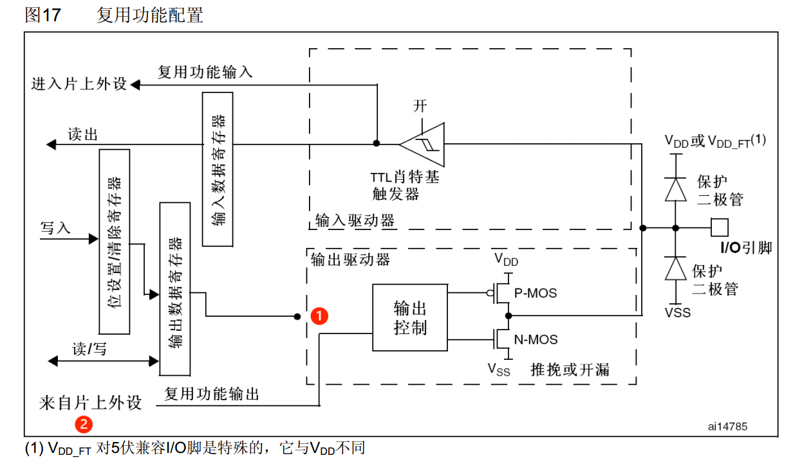

# 1.2 STM32外设-GPIO

### 3-1 GPIO输出

#### 1 GPIO简介

- GPIO(General Purpose Input Output)通用输入输出口。GPIO根据使用场景，可配置为8种输入输出模式，见下文“4 GPIO模式”
- 引脚电平：0V-3.3V。数据0就是低电平0V，数据1就是高电平3.3V，部分引脚可容忍5V
  - 容忍5V的意思是可以在这个端口输入5V的电压，也认为是高电平。但是对输出而言，最大就只能输出3.3V，因为供电就只有3.3V。具体哪些端口能容忍5V，可以参考STM32的引脚定义表，表中带FT的就表示可以容忍5V


- GPIO输出模式
  - GPIO在输出模式下可控制端口输出高低电平，用以驱动LED、控制蜂鸣器、模拟通信协议输出时序等
  - 在其他应用场景，只要是可以用高低电平进行控制的地方，都可以用GPIO完成。如果控制的是功率比较大的设备，只需要再加入驱动电路即可
  - 还可以用GPIO来模拟通应协议，比如IIC、SPI，或者某个芯片特定的协议，都可以用GPIO的输出模式来模拟其中的输出时序部分 


- GPIO输入模式
  - GPIO在输入模式下可读取端口的高低电平或电压，用于读取按键输入、外接模块电平信号输入、ADC电压采集、模拟通信协议接收数据等
  - 如果这个模块输出的是模拟量，GPIO还可以配置成模拟输入的模式，再配合内部的ADC外设，就能直接读取端口的模拟电压
  - 除此之外，模拟通信协议时，接收通信线上的数据也是靠GPIO的输入来完成的 


#### 2 GPIO基本结构

STM32中GPIO的基本结构见下图


- 在STM32中，所有的GPIO外设是挂载在APB2总线上。GPIO外设的名称是按照GPIOA、GPIOB、GPIOC这样的方式命名，每个GPIO外设，总共有16个引脚，编号从0-15。GPIOA常称为PA，其引脚为PA0-PA15
- 在GPIO模块内，主要包含**寄存器**和**驱动器**
  - 寄存器是特殊的存储器，内核可以通过APB2总线对寄存器进行读写，这样就可以完成输出电平和读取电平的功能
  - 寄存器的每一位对应一个引脚。其中，输出寄存器写1，对应的引脚输出高电平；输出寄存器写0，对应的引脚输出低电平。输入寄存器读取为1，代表对应端口目前是高电平；读取为0，代表当前端口为低电平
  - 因为STM32是32位的，即STM32的寄存器都是32位的。但GPIO的端口只有16个，所以寄存器只有低16位对应有端口，高16位没有用到
  - 驱动器是用来增加信号的驱动能力。寄存器只负责存储数据，要是进行点灯操作，还是需要驱动器来负责增大驱动能力

#### 3 GPIO位结构

- STM32的位结构电路图如下所示。其中，左边3个为寄存器（位设置\清除寄存器、输出数据寄存器、输入数据寄存器），中间是驱动器，右边是某一个I/O的引脚
- 整体结构可以分为两个部分：上面是输入部分，下面是输出部分
  

- **输入部分**
  - 最右边的I/O引脚①处接了两个保护二极管（补充知识：二极管有两个电极，正极，又叫阳极；负极，又叫阴极，给二极管两极间加上正向电压时，二极管导通， 加上反向电压时，二极管截止），其作用是对输入电压进行限幅
    - 由图可知，上面的二极管接VDD，3V3，下面接Vss，0V。如果输入电压比3V3高，则上方二极管导通，输入电压产生的电流会直接流入VDD而不会流入电路内部，这样可以避免过高的电压对内部的电路产生伤害
    - 如果输入的电压比Vss还要低（该电压是相对于Vss的电压，因此可以有负电压），下方二极管导通，电流直接从Vss流出，而不会从内部电路汲取电流，从而保护内部电路
    - 若输入电压在0-3V3之间，则两个二极管均不会导通，二极管对电路没有影响，这就是保护二极管的用途
  <br/><br/>
  - 接下来电路连接到② 处的上拉电阻和下拉电阻。上拉电阻连接VDD，下拉电阻连接Vss，这个开关可以通过程序进行配置：**如果上面导通，下面断开，就是上拉输入模式；下面导通，上面断开，就是下拉输入模式；如果两个都断开，就是浮空输入模式**。**上拉和下拉电阻的作用**是给输入提供一个默认的输入电平
    - 对于数字端口，输入不是高电平就是低电平。若引脚什么都不接，高低电平就不好判断。实际情况下，如果输入什么都不接，那输入处于浮空的状态，引脚的输入电平极易受到外界的干扰而改变
    - 为了避免引脚悬空导致的输入数据不确定，通常需要添加上拉电阻或者下拉电阻。 如果接入上拉电阻，当引脚悬空时，上拉电阻可以保证引脚默认为高电平。所以上拉输入又可以称作是默认为高电平的输入模式。下拉也是同理，就是默认为低电平的输入方式 
    - 上拉电阻和下拉电阻的阻值一般都比较大，是一种弱上拉和弱下拉（见3-3节杆子弹簧模型的分析），目的是尽量不影响正常的输入操作 
  <br/><br/>
  - ③处是一个肖特基触发器（实际上应该是施密特触发器）。施密特触发器的的作用就是对输入电压进行整型，其执行逻辑：
    - 如果输入电压大于某一阈值，输出就会瞬间升为高电平；如果输入电压小于某一阈值，输出就会瞬间降为低电平
    - 特别说明：输入电压只有高于上限，或者低于下限，输出才会变化。对于低于上限，但是高于下限的输入，施密特触发器的输出维持不变    
    
    - 由于引脚的波形是外界输入的，虽然是数字信号，实际情况下可能会产生各种失真。见上图黑色线条所示的波形，这是一个夹杂了波动的高低变化电平信号。如果没有斯密特触发器，很有可能因为干扰而导致误判
    - 如果有了施密特触发器，指定一个如上图所示的阈值上下限。高于上限输出高，低于下限输出低。施密特触发器的输出：
      - 首先是低于下限输出低，然后在①处高于上限，输出立即变为高。虽然这里信号由于波动再次低于上限，但是对于施密特触发器来说，只有高于上限或者低于下限输出才会变化。所以此时低于上限的情况，输出并不会变化，而是继续维持高电平
      - 直到下次低于下限时才会转为低电平（②处）。这里信号即使在下限附近来回横跳，因为没有高于上限，所以输出仍然是低电平，直到下一次高于上限输出高电平
      - 从图中可以看到，相比于输入信号，经过施密特触发器整型的信号接近于方波，完美多了。这里用了两个比较阈值来进行判断，中间留有一定的变化范围，这样可以有效的避免因信号波动造成的输出抖动现象 
  <br/><br/>
  - 接下来经过施密特触发器整型的波形可以直接写入输入数据寄存器（④处）了，我们再通过程序读取输入寄存器对应某一位的数据，就可以知道输入端口的电平
  - 最后上面⑤处还有两路线路，该线路是连接到片上外设的端口。其中模拟输入是连接到ADC上的，因为ADC需要模拟量，所以这根线是连接到施密特触发器之前的。另外一根是复用功能输入，这个是连接到其他需要读取的外设上，比如串口的输入引脚等，这根线接收的是数字量，所以在施密特触发器之后


- **输出部分**
  - 数字部分可以由输出数据寄存器①或者片上外设②控制，两种方式通过数据选择器③接到了输出控制部分。如果选择输出数据寄存器控制，就是普通的I/O输出。写这个数据寄存器的某一位，就可以操作对应的某个端口
  <br/><br/>
  - 位设置/清除寄存器（④处），可以单独操作输出数据寄存器的某一位而不影响其他位。因为输出数据寄存器同时控制16个端口，并且这个寄存器只能整体读写，所以想单独控制其中某一个端口而不影响其他端口，就需要特殊的操作方式：
    - 第一种方式是先读出这个寄存器，然后用按位与和按位或的方式更改某一位，最后再将更改后的数据写回去。在C语言中就是&=和|=的操作，这种方法比较麻烦，效率不高，对于IO的操作不太合适
    - 第二种方式是通过位设置/清除寄存器。若要对某一位进行置1，在位设置寄存器对应位写1即可，剩下不需要操作的位写0。这样它内部的电路会自动将输出数据寄存器的对应位设置为1，剩下写0的位置保持不变，这样就保证了只操作其中某一位而不影响其他位，并且这是一步到位的操作。如果想对某一位进行清零，就在位清除寄存器的对应位写1，这样内部电路就会把这位清零。**库函数使用的就是读写位设置/清除寄存器的方法**
    - 第三种操作方式就是读写STM32中的位带区域。位带的作用就跟51单片机的位寻址作用差不多，在STM32中专门分配有一段地址区域，这段地址映射了RAM和外设寄存器所有的位。读写这段地址中的数据，就相当于读写所映射位置的某一位，这就是位带的操作方式
  <br/><br/>
  - 输出控制之后接了两个MOS管（⑤处），分别是P-MOS和N-MOS。MOS管是一种电子开关，通过信号控制MOS管的导通和关闭，从而将I/O口接到VDD或者Vss。这里可以选择**推挽**、开漏和**关闭**三种输出模式：
    - 在**推挽**输出模式下，P-MOS和N-MOS均有效。输出数据寄存器为1时，P-MOS导通，N-MOS断开，输出直接接到VDD，即输出高电平。输出数据寄存器为0时，P-MOS断开，N-MOS导通，输出直接接到VSS，即输出低电平。这种模式下，**高低电平均有较强的驱动能力**，故推挽输出也叫强推输出模式。在推挽输出模式下，STM32对IO口具有绝对的控制权，高低电平都由STM32决定
    - 在**开漏**输出模式下，P-MOS无效，只有N-MOS工作。数据寄存器为1时，N-MOS断开，这时输出相当于断开，为高阻模式。输出数据寄存器为0时，N-MOS导通，输出接到VSS，输出低电平
      - 这种模式下，只有**低电平有驱动能力，高电平没有驱动能力**。这种模式通常用于通信协议的驱动方式（I2C等）。在多机通信的情况下，这个模式可以避免各个设备的相互干扰（待解释）
      - 开漏模式还可以用于输出5V的电平信号：比如在IO口外接一个上拉电阻到5V的电源。当输出低电平时，由内部的N-MOS直接连接VSS。当输出高电平时，由外部的上拉电阻拉高至5V。这样就可以输出5V的电平信号，用于兼容一些5V电平的设备，以上是开漏输出的主要用途
    - 在**关闭**模式下，当引脚配置为输入模式时，P-MOS和N-MOS均无效，输出关闭，端口的电平由外部信号来控制

#### 4 GPIO工作模式

通过配置GPIO的端口配置寄存器，端口可以配置成以下8种模式


| 模式名称     | 性质     | 特征                                                 |
| ------------ | -------- | ---------------------------------------------------- |
| 浮空输入     | 数字输入 | 可读取引脚电平，若引脚悬空，则电平不确定             |
| 上拉输入     | 数字输入 | 可读取引脚电平，内部连接上拉电阻，悬空时默认为高电平 |
| 下拉输入     | 数字输入 | 可读取引脚电平，内部连接下拉电阻，悬空时默认为低电平 |
| 模拟输入     | 模拟输入 | GPIO无效，引脚直接接入内部ADC                        |
| 开漏输出     | 数字输出 | 可输出引脚电平，高电平为高阻态，低电平接VSS          |
| 推挽输出     | 数字输出 | 可输出引脚电平，高电平接VDD，低电平接VSS             |
| 复用开漏输出 | 数字输出 | 由片上外设控制，高电平为高阻态，低电平接VSS          |
| 复用推挽输出 | 数字输出 | 由片上外设控制，高电平接VDD，低电平接VSS             |

- 浮空/上拉/下拉输入

  - 浮空/上拉/下拉输入的电路结构基本是一样的，区别就是上拉电阻和下拉电阻的连接。它们都属于数字输入口，特征就是都可以读取端口的高/低电平。当引脚悬空时，上拉输入默认是高电平，下拉输入默认是低电平。浮空输入的电平是不确定的，所以在使用浮空输入时，端口一定要接上一个连续的驱动源，不能出现悬空的状态。这三种模式的电路结构见下图
    
  - 在输入模式下，输出数据驱动寄存器是断开的（①处），端口只能输入而不能输出。通过两个电阻（②处）可以选择为上拉工作、下拉工作或者都不工作，对应的就是上拉输入、下拉输入和浮空输入
  - 输入经过施密特触发器进行波形整型后连接到输入数据寄存器。另外最右边的输入保护，写的是VDD或者VDD_FT（③处），这是3V3端口和容忍5V端口的区别

<br/>
- 模拟输入
  - 模拟输入的电路结构如下。由图可知，输出数据寄存器是断开的（①处），输入的施密特触发器是关闭的无效状态（②处）。整个GPIO只有模拟输入有效，即从引脚直接接入片上外设（③处），即ADC。因此当使用ADC时，将引脚配置为模拟输入就行，其他时候一般用不到模拟输入
    

<br/>
- 开漏/推挽输出
  - 开漏/推挽输出的电路结构如下，这两个电路也基本一样，都是数字输出口，可以用于输出高低电平。区别就是开漏输出的高电平呈现高阻态，没有驱动能力，而推挽输出的高/低电平都具有驱动能力 
    
  - 输出由输出数据寄存器控制（①处）。若P-MOS无效，就是开漏输出；若P-MOS和N-MOS均有效，就是推挽输出。另外可以看到，在输出模式下，输入模式也是有效的（②处）。但是在输入模式下，输出是无效的。这是因为一个端口只能有一个输出，但是输入可以有多个。所以配置成输出模式的时候，内部也可以输入一下，这个不影响

<br/>
- 复用开漏/复用推挽输出
  - 复用开漏/复用推挽输出的电路结构如下。在这个模式下，输出数据寄存器是断开的（①处），引脚电平是由片上外设控制的（②处）。在输入部分，片上外设也可以读取引脚电平，同时普通输入也是有效的，顺便接收一下电平信号

  

> 注：上述GPIO的8种模式中，除了模拟输入模式会关闭数字输入功能。在其他的7种模式中，所有输入均有效。但在浮空、上拉、下拉输入模式中，输出是断开的

#### 5 LED和蜂鸣器简介

- LED：发光二极管，正向通电点亮，反向通电不亮。正负极判断方法：
  - 一般长脚是正极，短脚是负极
  - 看LED内部，较小一半是正极，较大一半是负极
- 有源蜂鸣器：内部自带振荡源，将正负极接上直流电压即可持续发声，频率固定
- 无源蜂鸣器：内部不带振荡源，需要控制器提供振荡脉冲才可发声，调整提供振荡脉冲的频率，可发出不同频率的声音
- LED和蜂鸣器的硬件电路见下图
  


- LED驱动电路
  - 左上图是低电平驱动电路，LED正极接3V3，负极通过一个限流电阻接到PA0。当PA0输出低电平，LED两端产生电压差，形成正向导通电流，LED点亮；当PA0输出高电平时，因为LED两端都是3V3，不会形成电流，LED熄灭。限流电阻一般都是要接的，一方面防止LED因为电流过大而烧毁，另一方面可以调整LED的亮度
  - 左下图为高电平驱动的电路，LED负极接GND，正极通过一个限流电阻接到PA0。当PA0输出高电平，LED点亮；当PA0输出低电平，LED熄灭
  - **这两种驱动方式的选择依据**：要根据I/O端口的驱动能力进行选择，若I/O口具有高电平驱动能力（推挽输出），则这两种接线方法均可。若I/O口只有低电平驱动能力（开漏输出），则只能选左上图所示低电平驱动的接线方式
  - 但是在单片机的电路里面，一般倾向于第一种接法，即低电平驱动的方式。因为很多单片机或者芯片，都使用了**高电平弱驱动，低电平强驱动**的规则，这样一定程度避免高低电平打架。所以若高电平驱动能力弱，就不能使用第二种高电平驱动方法


- 蜂鸣器驱动电路
  - 右边是蜂鸣器驱动电路，这里使用了三极管开关的驱动方案。三极管开关是最简单的驱动电路，对于功率大一点的对象，直接用I/O驱动会导致STM32负担过重，这时可以用一个三极管驱动电路来完成驱动任务
  - 右上是PNP三极管的驱动电路，三极管左边是基极，带箭头的是发射极，剩下的是集电极。左边的基极给低电平，三极管导通。通过3V3和GND，就可以给蜂鸣器提供驱动电流了。基极给高电平，三极管截至，蜂鸣器没有电流
  - 右下是NPN三级管的驱动电路，左边是基极，带箭头的是发射极，剩下的是集电极。它的驱动逻辑和上面相反，基极给高电平导通，低电平断开
  - 需要注意：**PNP的三极管最好接在负载（蜂鸣器）上面（①处），NPN的三极管最好接在负载（蜂鸣器）下面（②处）**。这是因为三极管的通断，是需要在发射极和基极之间产生一定的开启电压，若把负载接在发射极这边，可能会导致三极管无法正常开启

#### 6 面包板简介

面包板的结构见下图


- 竖着的5个孔，内部都是连接在一起的
- 上下四排孔，整体的连接在一起的，主要用于供电。有的面包板中间会断开，这个需要测试一下，若是断开的，中间用跳线把两端连接在一起即可


### 3-2 RCC和GPIO库函数

#### 1 RCC库函数


- 如上图所示，GPIO是挂载在APB2总线上。因此，操作STM32的GPIO需要3个步骤：
  - **第一步，开启GPIO时钟**。使用RCC开启GPIO的时钟
  - **第二步，初始化GPIO**。配置GPIO结构体，使用GPIO_Init()函数初始化GPIO
  - **第三步，控制GPIO端口**。使用输入或者输出函数控制GPIO口
- 这其中涉及到RCC和GPIO两个外设，RCC的库函数如下
  
  - STM32库函数命名规律：
    - 带Cmd的都是使能或者失能函数
    - 带Config的都是配置函数

- 使用RCC开启GPIO时钟，需要使用RCC_APB2PeriphClockCmd函数，其定义如下
  

  

#### 2 GPIO库函数

GPIO的库函数如下


- GPIO操作第二步，初始化GPIO，需要使用GPIO_Init 函数，其包含3个参数，分别为GPIO_Pin、GPIO_Speed、GPIO_Mode

  - GPIO_Pin
    

  - GPIO_Speed
    
  - GPIO_Mode
    


- GPIO操作第三步，使用输入或者输出函数控制GPIO口，可以使用GPIO_ReadInputDataBit、GPIO_ReadInputData、GPIO_ReadOutputDataBit、GPIO_ReadOutputData、GPIO_SetBits、GPIO_ResetBits、GPIO_WriteBit、GPIO_Write这8个函数
- 举例：使用GPIO_ResetBits函数进行LED点灯操作，其接线图和代码如下
  

```
#include "stm32f10x.h"

int main(void)
{
  // 第一步，开启GPIO时钟。使用RCC开启GPIO的时钟
  RCC_APB2PeriphClockCmd(RCC_APB2Periph_GPIOA, ENABLE);

  // 第二步，初始化GPIO。配置GPIO结构体，使用GPIO_Init()函数初始化GPIO
  GPIO_InitTypedef GPIO_InitStructure;
  GPIO_InitStructure.GPIO_Mode = GPIO_Mode_Out_PP;   // 推挽输出
  GPIO_InitStructure.GPIO_Pin = GPIO_Pin_0;          // 控制PA0
  GPIO_InitStructure.GPIO_Speed = GPIO_Speed_50MHz;  // IO口电平切换最大50MHz
  GPIO_Init(GPIOA, &GPIO_InitStructure);

  // 第三步，控制GPIO端口。使用输入或者输出函数控制GPIO口
  GPIO_ResetBits(GPIOA, GPIO_Pin_0);    //  GPIO_ResetBits 将PA0置低电平

  while(1)   // 死循环
  {

  }

}
```


### 3-3 GPIO输入

#### 1 按键介绍

- 按键：常见的输入设备，按下导通，松手断开
- 按键抖动：由于按键内部使用的是机械式弹簧片来进行通断的，所以在按下和松手的瞬间会伴随有一连串的抖动，见下图
  - 按键没按下是高电平，按下了是低电平。在按键按下的瞬间，信号由高电平变为低电平时会来回抖动几下，这个抖动通常在5到10毫秒之间，人是分辨不出来的。但对于高速运行的单片机，5到10毫秒还是很漫长的
  - 所以要对这个抖动进行过滤，否则会出现按键按一下单片机却反映了多次的现象。另外在按键松手的时候也会有一小段的抖动，这个也要注意过滤。最简单的过滤方法就是加一段延时，把这个抖动时间耗过去 


#### 2 传感器模块简介

下图是套件中的传感器模块，分别是光敏电阻传感器、热敏电阻传感器、对射式红外传感器和反射式红外传感器，见下图


- 上述传感器模块的电路结构和工作原理都很类似。这些传感器模块，都是基于传感器元件（光敏电阻/热敏电阻/红外接收管等）的电阻会随外界模拟量的变化而变化的原理。例如光线越强光敏电阻的阻值就越小、温度越高热敏电阻的阻值就越小、红外光线越强红外接收管的阻值就越小
- 电阻的变化不容易被测量，因此通常将传感器元件与定值电阻进行串联分压，这样就可以得到模拟电压的输出，对电路来说检测电压就非常容易。 另外这些模块还可以通过电压比较器来对模拟电压进行二值化处理，从而得到数字电压输出。下图为传感器模块的基本电路
  

<br/>
- 上图①处所示，N1表示传感器的可变电阻，其阻值会根据环境的光线、温度等模拟量进行变化。R1是和N1进行分压的定值电阻
  - R1和N1串联，一端接在VCC，一端接在GND负极，这就构成了基本的分压电路。左边的C2是滤波电容，是为了给中间的电压输出进行滤波的，用来滤除一些干扰，保证输出电压波形的平滑（一般在电路中遇到一端接在电路中，另一端接地的电容，都可以考虑是不是滤波电容的作用。如果是滤波电容，那这个电容就是来保证电路稳定的，并不是电路的主要框架，在分析电路的时候可以将其抹掉，帮助简化电路）
  - 可以使用分压定理分析传感器电阻的阻值变化对输出电压的影响
    - **串联分压**原理：在串联电路中，各电阻上的电流相等，各电阻两端的电压之和等于电路总电压。可知每个电阻上的电压小于电路总电压，故串联电阻分压
    - **并联分流**原理：在并联电路中，各电阻两端的电压相等，各电阻上电流之和等于总电流（干路电流）。可知每个电阻上的电流小于总电流，故并联电阻分流
  - 也可以使用上下拉电阻的思想来分析：
    - 当N1的阻值变小时（电流增大），下拉的作用就会增强，中间的AO端的电压就会拉低。极端情况下，N1阻值为0，AO输出被完全下拉，输出0V
    - 当N1的阻值变大时（电流减小），下拉的作用就会减弱，中间的引脚由于R1的上拉作用，电压就会升高。极端情况下，N1的阻值无穷大，相当于断路，输出电压被R1拉高至VCC。其工作逻辑见下图
      
  - **杆子弹簧模型**分析上下拉电阻
    - AO的输出端可以想象成放在屋里的水平杆子，R1上拉电阻相当于拴在屋顶的弹簧，将杆子往上拉。N1下拉电阻相当于拴在地面的弹簧，将杆子往下拉。这个电阻的阻值越小，弹簧的拉力就越强。这个杆子的高低就相当于电路中的电压
    - 如果只有上拉弹簧或者下拉弹簧，那么杆子就只能被拉到屋顶或者拉到地面，在电路中就相当于中间点的电压为VCC或者GND。当两个弹簧相互拉扯的时候，中间的输出就会向拉力强一端偏移，至于偏移多少，就取决于两个弹簧的弹力之差
    - 如果上下拉的弹簧拉力一致，杆子就处于居中的位置，则电路输出VCC/2的电压。如果上面的阻值小，拉力强，则输出会变高；反之下面的阻值小，拉力强，输出电压会变低。如果阻值为0，在电路中是短接的状态，那就相当于拉力无穷大。如果上下拉电阻的阻值都为0，就是两个无穷大的力在对抗，在电路中呈现的状态就是电源短路，所以这种情况应该避免
    - 上拉电阻和下拉电阻，在单片机中会经常出现。比如弱上拉，弱下拉，强上拉，强下拉等，这里强和弱就是指电阻阻值的大小，也就是弹簧弹力的大小 。上/下拉电阻阻值小时，可以称为强上/下拉，反之称为弱上/下拉（GPIO的上拉电阻比较大，属于弱上拉）。上拉还是下拉是指接到VCC还是GND，也就是杆子被拉到屋顶还是拉向地面。最终的输出电压就是在弹簧拉扯下最终杆子的高低
  - 在上图所示的传感器电路中，AO是模拟电压的输出。该模块还支持数字输出，即将A0端口的电压进行二值化的输出，二值化是通过LM393（②处）来完成的
    - LM393是一个电压比较器芯片，里面有两个独立的电压比较器电路，通过VCC和GND供电。电容C1是电源供电的滤波电容
    - M393相当于运算放大器，当同相输入端的电压大于反相输入端的电压时，输出瞬间升为最大值，即输出接VCC。当同向输入端的电压小于反相输入端的电压时，输出瞬间降为最小值，即输出接GND，这样就可以对一个模拟电压进行二值化
  - 在上述电路中，IN+接到AO端，IN-接了个电位器，电位器的接法也是分压电阻的原理。拧动电位器，IN-就会生成一个可调的阈值电压。IN+和IN-进行比较，最终的输出结果就是DO，数字电压输出，DO最终接到引脚的输出端
  - 右边还有两个指示灯电路（③处），左边的是电源指示灯，通电就亮。右边是DO输出指示灯，它可以指示DO的输出电平，低电平点亮，高电平熄灭。右边的DO多了个R5的上拉电阻，是为了保证默认输出为高电平。P1的排针，分别是VCC、GND、DO和AO
  - 传感器实物图见上图。对于光敏电阻传感器，这个N1就是光敏电阻；对于热敏电阻传感器，N1就是热敏电阻；对于红外传感器，N1就是红外接收管，还有一个点亮红外发射管的电路。发射管发射红外光，接收管接收红外光，模拟电压就表示接受光的强度。最后一个模块也是红外发射管和接收管，只不过他是向下发射红外光，然后检测反射光，用来做寻迹小车

#### 3 按键和传感器的硬件电路


4种按键接法：上面两个是下接按键的方式，下面两个是上接按键的方式。**一般来说，按键都使用上两种方式，就是下接的方式。这个原因按跟LED的接法类似，主要看IO口的驱动能力**

- 左上角接法，PA0通过K1接地，没有外接上拉电阻
  - 当按键按下时，电路接通，PA0被下拉到GND，此时读取PA0的电压就是低电平
  - 当按键松手时，电路断开，PA0悬空，引脚电压不确定
  - 因此在这种接法下，必须将引脚模式配置成上拉输入模式，否则会出现引脚电压不确定的错误现象。如果PA0是上拉输入模式，引脚悬空时是PA0默认是高电平
  - 综上，在这种模式下，按下按键，引脚为低电平，松开按键，引脚为高电平
- 右上角接法，相比于左上角的图，在外部接了一个上拉电阻R1
  - 上拉电阻可以想象成一个弹簧，把PA0往屋顶上拉。当按键松手时引脚由于上拉作用自然保持为高电平
  - 当按键按下时，引脚直接接到GND，相当于一股无穷大的力把这个引脚往下拉，弹簧肯定对抗不了无穷大的力，所以引脚就为低电平。这种状态下引脚不会出现悬空状态，所以此时PA0引脚可以配置为浮空输入模式
  - 综上，此种接法下，PA0可以配置为浮空输入模式或者上拉输入模式。当配置为上拉输入模式，因为内外两个上拉电阻的共同作用，上拉效果更强，对应高电平就更加稳定。当然当引脚被下拉到低电平，损耗也会大一些
- 左下角接法，PA0通过按键K1接到3.3V。此种接法下，要求引脚模式配置成下拉输入模式。当按键按下，PA0被上拉到高电平，按键松开，PA0为低电平。这要求单片机的引脚可以配置成下拉输入模式，一般单片机不一定有下拉输入的模式，所以最好还是用上面的接法 
- 右下角接法，在左下接法的基础上，外接一个下拉电阻。因为有下拉电阻，PA0需要配置成浮空输入或者下拉输入模式


- 总结一下：
  - 上面两种接法，按键按下时引脚是低电平，松手时引脚是高电平。下面两种接法，按键按下时引脚是高电平，松手时引脚是低电平
  - 左边两种接法必须要求引脚是上拉或者下拉输入模式，右边两种接法允许引脚选择浮空输入模式，因为已经外置了上拉和下拉电阻。一般按键都用上面两种接法，下面两种接法使用的较少


### 3-4 补充知识：C语言

#### **1 C语言数据类型**


> char表示8位整数，不是表示字符串


- C语言提供的stdint头文件对上述表中第一列关键字做了替换
  - 比如int8_t就是char的新名字，意思是表示8位整型数据。右边加了一个_t表示这是用typedef重新命名的变量类型
  - unsigned char的新名字是uint8_t，还有int16_t、uint16_t、int32_t、uint32_t、int64_t、uint64_t，分别表示16位整型、32位整型和64位整型
- 之后在写程序的时候，就会按照stdint推荐使用新的名字，其代表的含义就是第一列所示的关键字，就是换个名字而已。ST关键字是ST库函数以前用的名字，属于老版本的写法，现在都用stdint的写法

#### **2 C语言宏定义**

- 关键字：#define
- **用途1：用一个字符串代替一个数字，便于理解，防止出错**。例如在程序中经常用到1代表高电平，0代表低电平，这个还算好理解。但是如果说1代表上拉输入、2代表下拉输入、3代表浮空输入等，这时用数字表示就不好理解。此时可以使用宏定义，将数字映射到一个字符串，这样这比较好理解
- **用途2：提取程序中经常出现的参数，便于快速修改**。比如写程序里面出现了10个GPIO_Pin_0，GPIO_Pin_0需要经常修改。如果逐个修改就很繁琐。此时可以用一个字符串来代替GPIO_Pin_0，需要修改的时候只需要修改一下宏定义即可 
- 定义宏定义
  - `#define pull_up 1`
  - 注意：没有分号，被定义对象在后面
- 引用宏定义
  - int a = pull_up;  //等效于 int a = 1;

#### **3 C语言typedef**

- 关键字：typedef
- 用途：将一个比较长的变量类型名换个名字，便于使用
- 定义typedef：
  - typedef unsigned char uint8_t;
  - 注意：有分号，被定义对象在前面
- 引用typedef：
  - uint8_t a;  //等效于 unsigned char a；

> 宏定义和typedef的区别：
>
> 1 宏定义中，被定义对象在后面，没有分号；typedef中，被定义对象在前面，有分号
>
> 2 宏定义任何名字都可以换，**typedef只能专门给变量类型换名字**。宏定义的改名范围更大一点
>
> 3 对变量类型进行改名，用typedef更加安全一些。因为宏定义只是单纯的改名，而typedef会对命名进行检查。如果不是变量类型的名字，是无法使用typedef的

#### **4 C语言结构体**

- 关键字：struct
- 用途：结构体也是一种数据类型，属于组合数据类型。结构体通常用于数据打包，是不同类型变量的集合，便于管理或者数据传递
- 定义结构体变量：
  - struct{char x; int y; float z;} StructName;
    - 上述代码的含义：定义一个结构体变量，名字叫StructName。其中包含了char型的x，int型的y和 float型的z三个子项
    - 因为结构体变量类型的名称一般都比较长，所以常用typedef对结构体变量进行重命名
- 引用结构体成员格式：`结构体名称.结构体成员名称`
  - StructName.x = 'A';
  - StructName.y = 66;
  - StructName.z = 1.23;
- 或者使用结构体指针的引用方式。结构体是一种组合数据类型，在函数之间的数据传递中，通常用的是地址传递而不是值传递。使用指针传递，子函数得到的就是结构体的首地址，这时我们可以用`->`运算符快速的引用结构体成员
  - pStructName->x = 'A';     // pStructName为结构体的指针名，也是首地址名
  - pStructName->y = 66;
  - pStructName->z = 1.23;

结构体基本用法举例

```
#include <stdio.h>


int main(void)
{
  int a;                                   // 定义变量
  a = 66;                                  // 引用变量
  printf("a=%d\n", a)

  int b[5];                                // 定义变量
  b[0] = 66;                               // 引用变量
  b[1] = 77;                               // 引用变量
  b[2] = 88;                               // 引用变量
  printf("b[0]=%d\n", b[0])
  printf("b[1]=%d\n", b[1])
  printf("b[2]=%d\n", b[2])

  struct{char x; int y; float z;} c;       // 定义变量
  c.x = 'A';                               // 引用变量
  c.y = 66;                                // 引用变量
  c.z = 1.23;                              // 引用变量
  printf("c.x=%c\n",c.x);
  printf("c.y=%d\n",c.y);
  printf("c.z=%f\n",c.z);


  printf("HelloWorld\n");

  return 0;

}
```

结构体特殊用法举例

```
#include <stdio.h>


typedef struct{
  char x;
  int y;
  float z;
} StructName_t;

int main(void)
{
  int a;                                   // 定义变量
  a = 66;                                  // 引用变量
  printf("a=%d\n", a)

  int b[5];                                // 定义变量
  b[0] = 66;                               // 引用变量
  b[1] = 77;                               // 引用变量
  b[2] = 88;                               // 引用变量
  printf("b[0]=%d\n", b[0])
  printf("b[1]=%d\n", b[1])
  printf("b[2]=%d\n", b[2])

  StructName_t c;                          // 定义变量
  c.x = 'A';                               // 引用变量
  c.y = 66;                                // 引用变量
  c.z = 1.23;                              // 引用变量
  printf("c.x=%c\n",c.x);
  printf("c.y=%d\n",c.y);
  printf("c.z=%f\n",c.z);


  printf("HelloWorld\n");

  return 0;

}
```


#### **5 C语言枚举**

- 关键字：enum
- **用途1：枚举也是一种数据类型，枚举用于定义一个取值受限制的整型变量，用于限制变量的取值范围；**宏定义的结合
  - 比如定义一个变量用来存储星期的值，理论上这个变量只能取值1到7。但如果定义的变量是整型类型，那这个变量取值就不受限制，这时可能会出现星期八的不合理情况。所以若想程序更加安全，可以定义一个取值受限制的整型变量，这个变量就是枚举 
- 定义枚举变量：
  - enum{FALSE = 0, TRUE = 1} EnumName;
    - 上述代码的含义：定义一个枚举变量，名字叫EnumName，EnumName只能取花括号里面的值，也就是FALSE和TRUE，不能使用其他值
    - 因为枚举的变量类型名称也比较长，所以常用typedef对枚举变量进行重命名
- 引用枚举成员：
  - EnumName = FALSE;
  - EnumName = TRUE;

```
#include <stdio.h>


typedef enum{
  TRUE =1 ,
  FALSE = 2
} Judge_t;

int main(void)
{
  
  Judge_t judge;         // 定义变量
  judge = 1;             // 引用变量，等效于judge=TRUE
  judge = 2;             // 引用变量，等效于judge=FALSE，这个赋值只能按照枚举中的定义来
  judge = 3;             // 如果这样赋值，编译器会报警告，说枚举中混入了其他变量

  int a = TRUE;          // 枚举值不是必须赋值给枚举变量，也可以随意定一个变量，把枚举值赋值给它。这样枚举的定义和宏定义（用一个字符串代替一个数字）类似，所以说枚举的定义也是一个宏定义的集合
  
  printf("HelloWorld\n");

  return 0;

}
```


#### 6 模块化编程

按键控制LED的接线图如下


- **对于驱动代码（按键和LED）而言，一般把它们封装起来，单独放在另外的.c和.h文件中，这就是模块化编程的方式**
  - 在工程文件夹新建Hardware文件夹
  - 在keil中打开工程管理，新建一个组，也叫Hardware
  - 点击魔术棒按钮，打开工程选项，选择C/C++，添加刚才新建的Hardware文件夹到头文件路径列表
- 在Hardware文件中右键，选择添加新的.c文件，输入名称为LED，这个文件用来封装LED的驱动程序，路径选择Hardware文件夹。在Hardware文件中右键，选择添加新的.h文件，输入名称LED，路径选择Hardware文件夹
- 在Hardware文件中右键，选择添加新的.c文件，输入名称为Key，这个文件用来封装按键的驱动程序，路径选择Hardware文件夹。在Hardware文件中右键，选择添加新的.h文件，输入名称Key，路径选择Hardware文件夹
- LED.c/Key.c用来存放驱动程序的主要代码，LED.h/Key.h用来存放驱动程序可以对外提供的函数或者变量的声明
- **这两个文件建好之后还需要添加一些必要的代码**：.c文件需要添加头文件，在文件中鼠标右键，选择Insert ‘#include file’插入头文件。.h文件添加防止头文件重复包含的代码，以LED.h为例：

  ```
  #ifndef __LED_H 
  #define __LED_H
  
  #endif
  
  ```

  > 这是一个框架，其他驱动代码也是按此架构
  > 注意，文件要以空行结尾，不然编译的时候会报警告


- 然后分别编写按键、LED和主函数的代码，按键和LED的代码封装起来，放在Hardware文件夹。主函数在User文件夹，主函数只负责函数调用和整个程序的逻辑，各个函数的具体内容封装到各函数对应的模块中
- 具体代码见网盘链接中的`程序源码`