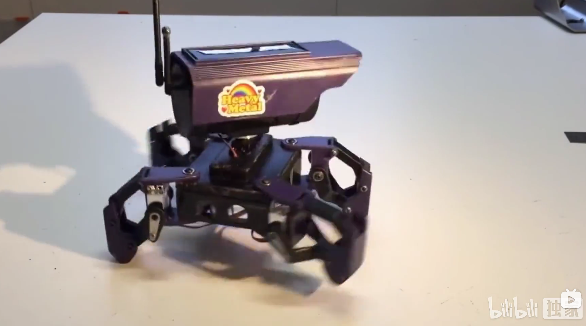
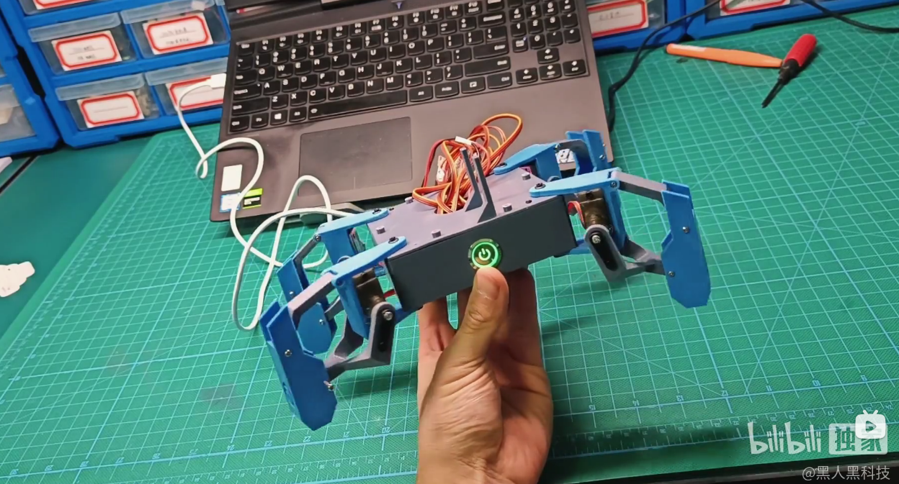
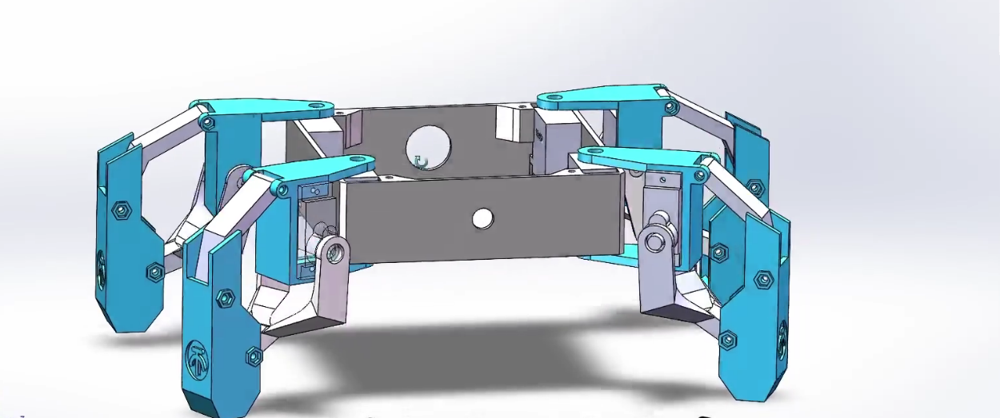
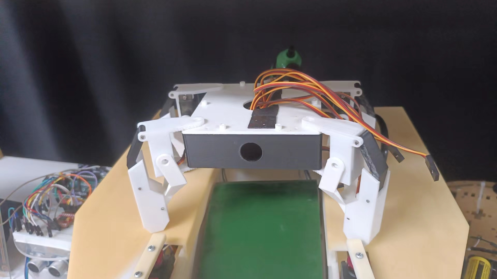
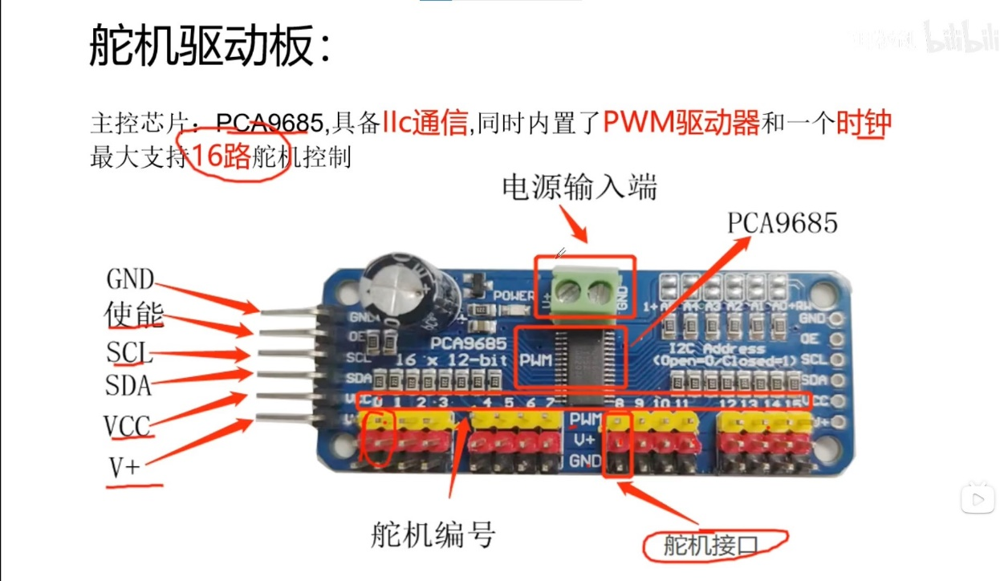
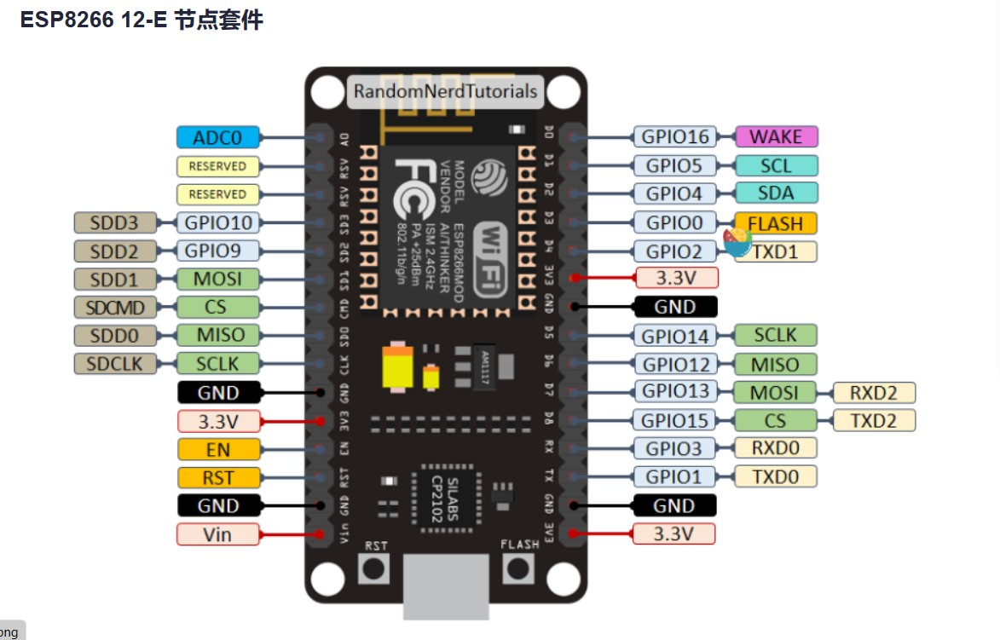
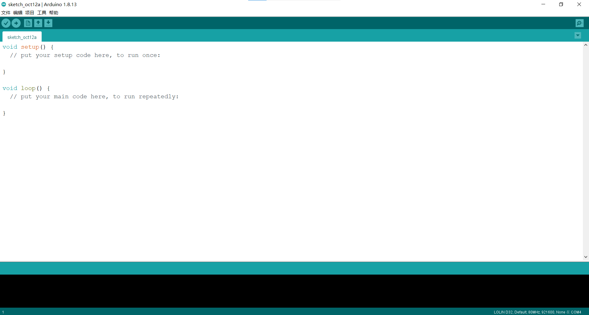
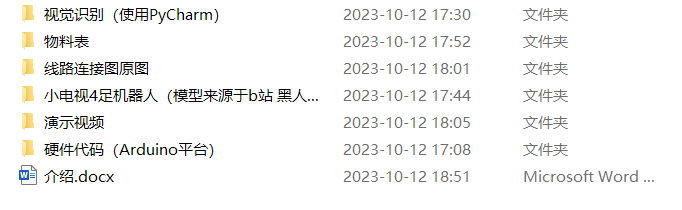
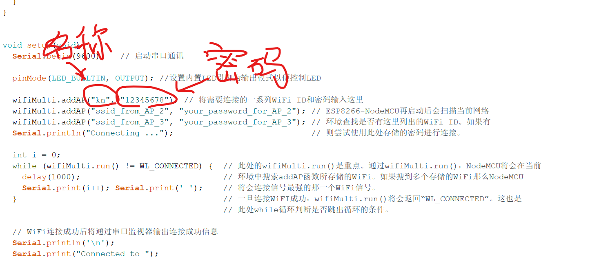
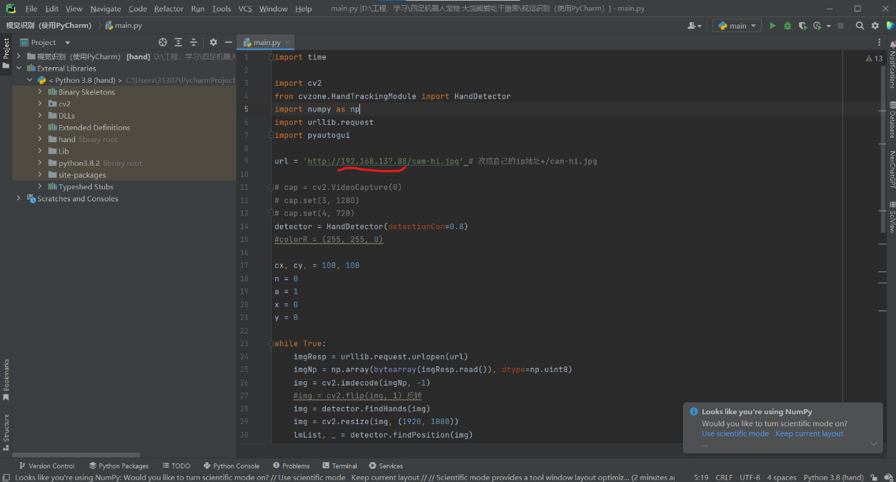

# 会打招呼的小机器人

作者：李霁桐-机工2102

链接： 链接：https://pan.baidu.com/s/1pAA77Lhh1mizlMrXfWxftg?pwd=6666 提取码：6666 

---

演示视频

    <iframe src="//player.bilibili.com/player.html?aid=407184759&bvid=BV1PG41127td&cid=1298459694&p=1&autoplay=false"
            scrolling="no" 
            border="0" 
            frameborder="no" 
            framespacing="0" 
            allowfullscreen="true" 
            style="position: absolute; top: 0; left: 0; width: 100%; height: 100%;"></iframe>

  

### 1 前言

这个小机器人最早是大一时期在网站上偶然看到的

那个时候看见这个很新鲜，话说小学毕业之后没玩过什么像样的玩具，当即决定（坏笑）就是它了，搞一个玩玩。

### 2 机械结构

每个腿有两个自由度，上下升降为最简单的四杆机构。 

所有零件均采用3D打印，方便，便宜，省事（赞！）。

我是用自己的3D打印机做的，建议大家没有打印机的在三维猴，或者未来工厂的网站上上传自己的文件请他们来打印，费用不太高，质量不错。一点注意零件数量选对。还有，记得买螺栓，长一点，长度参考SoiledWorks里面的模型选一种。 

于是我最后做了这个

（它是小黑，是上面第一张照片中小白的孪生哥哥，现在在工训中心402竞赛社）

这是我大学以来制作的第一件作（wan）品（ju）。

### 3 电路部分

电路部分采用PCA9685多路PWM舵机驱动板，这个板子的好处就是节省了主控的引脚，主控只需要两根信号引脚加上其他供电引脚就可以实现控制多路舵机的角度（要不然还得一大堆线插在主控上，哈哈）

主控器采用esp8266，很短暂地使用过Arduino开发板。后来偶然的一次使用WiFi模块做遥控车的时候，用不明白上网查了查，看完吓了一跳，esp8266的性能对Arduino UNO几乎是碾压性的优势，而当时我居然只想着用这么强大的东西简简单单做一个天线（就好比用精车加工钢管晾衣服）。于是我果断买了一块esp8266开发板。

所以整体接线非常简单： 
1、PCA9685的SCL接esp8266的SCL  
2、PCA9685的SDA接esp8266的SDA  
3、PCA9685的GND接esp8266的GND  
4、PCA9685的VCC接esp8266的3.3V（可能标着3V3）  
5、PCA9685的V+接esp8266的VIN  

这就完了。

### 4 程序烧录

随便上网找找安装Arduino环境，应该还是很好找的，然后参考教程添加esp8266的支持包。

打开文件中“硬件代码”文件夹，打开对应Arduino工程就好了（robt_drive那个），记得修改里面的WIFI名称和密码，改成自己电脑热点的名称和密码，然后点击烧录即可。：

烧录完成后，打开串口监视器，波特率调成115200（也可能是9600，我忘了）按一下esp8266的复位键，就可以得到一串类似于192.168.31.0的数字，在浏览器网址输入处粘贴这段数字就能进入一个空白网页，网页里面只有一个写着Hello的按钮，按下它你的机器人就会和你打招呼（如果你正好在他前方，如果不在它也会朝空气打招呼）。

到这里，这个机器人做完了。
怎么。你还想往下看？？？
那好，还可以来点更进阶的。

### 5 Opencv手势交互

其实前几部分完成已经很不错了，后面的东西需要一些基础，如果你用过pycharm就够了。

首先你需要在Arduino环境中额外再配置一个esp32的支持包，这个很重要，然后烧录jiqichongwu这个工程的代码（在“硬件代码”文件夹里面）。

烧录完成后打开串口监视器（记得调波特率），也会获得一串类似192.169.31.0这样的IP地址。

然后用pycharm打开视觉识别那个工程进去（打开那个main.py文件）编译器先选Scripts文件夹下面的ptyhon.exe，这个工程我临时整理的，要是不能用可以直接联系我。

用刚才串口监视器得到的IP地址替换掉我上图里面的这段，这样你的电脑就能连接到esp32cam，并把它的图像传进来。

### 6 一些问题

1 图像刚传进来会直接显示出来，建议把画面调成全屏，这样我的程序启动的时候它会接管你的鼠标自动把整个画面窗口最小化。
网页得调整到合适大小，因为我的python程序是直接控制鼠标去点击网页中的Hello按钮，所以要事先调好网页的位置让鼠标正好能点到（不要问我为啥不直接发指令，我不会啊，，，）。

2 如果你解决了上面的问题，你朝摄像头打招呼，它就能朝你打招呼啦。

3 最后你还可能因为帧率低的问题得不到机器人的回应，这样我们就得到了一个高冷（呆滞）的机器人。

4 行，就这么多，感兴趣的其他细节可以企业微信联系我。
