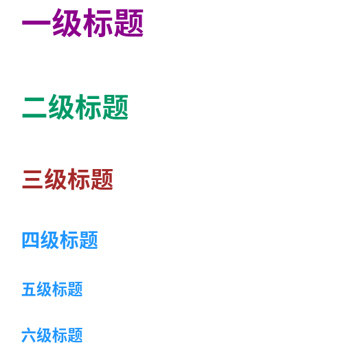

# 2.1 Markdown 基本语法

Markdown官方教程： https://markdown.com.cn/

### 1 标题

语法：
```
# 一级标题 （快捷键Ctrl+1）
## 二级标题 （快捷键Ctrl+2）
### 三级标题 （快捷键Ctrl+3）
#### 四级标题 （快捷键Ctrl+4）
##### 五级标题 （快捷键Ctrl+5）
###### 六级标题 （快捷键Ctrl+6） 
```
执行效果：
 


### 2 段落

语法：
```
使用空白行将一行或多行文本进行分隔:  
第一段: I really like using Markdown.

第二段: I think I'll use it to format all of my documents from now on.
```
执行效果：  
使用空白行将一行或多行文本进行分隔:  
第一段: I really like using Markdown.

第二段: I think I'll use it to format all of my documents from now on.


### 3 换行

语法1：  
```
在一行末尾加两个空格后回车进行换行:  
第一段: I really like using Markdown.  
第二段: I think I'll use it to format all of my documents from now on.
``` 
执行效果：  
在一行末尾加两个空格后回车进行换行:  
第一段: I really like using Markdown.  
第二段: I think I'll use it to format all of my documents from now on.

语法2：
```
使用<br>进行换行:  
第一段: I really like using Markdown.<br>
第二段: I think I'll use it to format all of my documents from now on.
```
执行效果：  
使用`<br>`进行换行:  
第一段: I really like using Markdown.<br>
第二段: I think I'll use it to format all of my documents from now on.


### 4 首行缩进

语法：
不同特殊占位符所占空白不一样大。
```
1 &emsp; 或 &#8195;   //全角

举例1：
&emsp;&emsp;这是2个&emsp;字节的首行缩进效果<br>
&#8195;&#8195;这是2个&#8195;字节的首行缩进效果<br>
这是没有首行缩进效果

2 &ensp; 或 &#8194;   //半角

举例2：
&ensp;&ensp; 这是2个&ensp;字节的首行缩进效果<br>
&&#8194;&#8194;这是2个&#8194;字节的首行缩进效果<br>
这是没有首行缩进效果
```

执行效果： <br>
举例1：<br>
&emsp;&emsp;这是2个`&emsp;`字节的首行缩进效果<br>
&#8195;&#8195;这是2个`&#8195;`字节的首行缩进效果<br>
这是没有首行缩进效果

举例2：<br>
&ensp;&ensp;这是2个`&ensp;`字节的首行缩进效果<br>
&#8194;&#8194;这是2个`&#8194;`字节的首行缩进效果<br>
这是没有首行缩进效果


### 5 强调

语法：
```
1. 加粗 （快捷键Ctrl+B）
在单词或短语前后各加两个**星号**或下划线，__下划线__ 前后不能有字。

2. 斜体 （快捷键Ctrl+I） 
在单词或短语前后各加一个*星号*或 _下划线_。

3. 斜体和加粗
在单词或短语的前后各添加三个 ***星号***或 ___下划线___。也可以进行组合，例如：**_A_**  或 __*B*__。

4. 删除
在单词或短语前后各加两个~~飘(Tab上面那个键)~~
```


执行效果：  
1 加粗  
在单词或短语前后各加两个**星号**或下划线，__下划线__ 前后不能有字。

2 斜体  
在单词或短语前后各加一个*星号*或 _下划线_。

3 斜体和加粗  
在单词或短语的前后各添加三个 ***星号***或 ___下划线___。也可以进行组合，例如：**_A_**  或 __*B*__。

4 删除
在单词或短语前后各加两个~~飘(Tab上面那个键)~~


### 6 引用

语法：
```
1. 块引用
在段落前添加一个 > 号，例如  
>Dorothy followed her through many of the beautiful rooms in her castle.  

2. 多个段落块引用
> Dorothy followed her through many of the beautiful rooms in her castle.
>
> The Witch bade her clean the pots and kettles and sweep the floor and keep the fire fed with wood.  
  
3. 嵌套块引用
>一级嵌套第一段 
>
>一级嵌套第二段
>>二级嵌套第一段
>>
>>二级嵌套第二段
>>
>>二级嵌套第三段  
>>  
>>>三级嵌套第一段  
>>>三级嵌套第二段


4. 带有其他语法的块引用
> #### The quarterly results look great!
>
> - Revenue was off the chart.
> - Profits were higher than ever.
>
> *Everything* is going according to **plan**.
```

执行效果：  
1 块引用  
在段落前添加一个 > 号，例如  
>Dorothy followed her through many of the beautiful rooms in her castle.  

2 多个段落块引用  
> Dorothy followed her through many of the beautiful rooms in her castle.
>
> The Witch bade her clean the pots and kettles and sweep the floor and keep the fire fed with wood.  
  
3 嵌套块引用  
>一级嵌套第一段 
>
>一级嵌套第二段
>>二级嵌套第一段
>>
>>二级嵌套第二段
>>
>>二级嵌套第三段  
>>  
>>>三级嵌套第一段  
>>>三级嵌套第二段

4 带有其他语法的块引用  
> #### The quarterly results look great!
>
> - Revenue was off the chart.
> - Profits were higher than ever.
>
>  *Everything* is going according to **plan**.

###  7 列表

语法：
```
1 有序列表  
在列表前添加数字和英文句点，数字必须以1开头，后续不必按照顺序排列。  
1. aaa
2. bbb
3. ccc
4. 789

2 无序列表  
在列表前添加破折号(-)、(*)或(+)，缩进一个或多个列表项可以创建嵌套列表。
- aaa  
- bbb
- ccc
    - ddd
    - eee
        - fff
    - ggg
- hhh

3 列表中嵌套其他元素  
3.1 嵌套段落
*   第一项
*   第二项  
    需要在第二项下加入其他项目
*   第三项
*   第四项

3.2 引用块
*   第一项
*   第二项
    >引用块在第二个项下方
    >
    >
*   第三项

3.3 代码块
1. 第一步骤
2. 第二步骤，代码相关操作：（采用两个制表符缩进）
        <html>
            <head>
            <title>Test<title>
            </head>
        </html>
3. 第三步骤
4. 第四步骤

3.4 图片
1. 第一步骤
2. 第二步骤，图片相关操作：

举例：
> 根据实操结果，markdown中的图片路径最好使用相对路径的方式，如果要引用其他文件夹的图片，需要使用相对路径表示法，表述出其他文件的路径信息，例如: "../../"这种方式
3. 第三步骤

3.5 列表
1. 第一项
2. 第二项
3. 第三项
    - 缩进项目
    - 缩进项目
4. 第四项
5. 第五项

4 任务列表
- [x] Java
- [x] 大数据
- [ ] 人工智能 
- [x] 机器学习
```

执行效果：  
1 有序列表  
在列表前添加数字和英文句点，数字必须以1开头，后续不必按照顺序排列。  
1. aaa
2. bbb
3. ccc
4. 789

2 无序列表  
在列表前添加破折号(-)、(*)或(+)，缩进一个或多个列表项可以创建嵌套列表。
- aaa  
- bbb
- ccc
    - ddd
    - eee
        - fff
    - ggg
- hhh

3 列表中嵌套其他元素  
3.1 嵌套段落
*   第一项
*   第二项  
    需要在第二项下加入其他项目
*   第三项
*   第四项

3.2 引用块
*   第一项
*   第二项
    >引用块在第二个项下方
    >
    >
*   第三项

3.3 代码块
1. 第一步骤
2. 第二步骤，代码相关操作：（采用两个制表符缩进）
        <html>
            <head>
            <title>Test<title>
            </head>
        </html>
3. 第三步骤
4. 第四步骤

3.4 图片
1. 第一步骤
2. 第二步骤，图片相关操作：

举例：
> 根据实操结果，markdown中的图片路径最好使用相对路径的方式，如果要引用其他文件夹的图片，需要使用相对路径表示法，表述出其他文件的路径信息，例如: "../../"这种方式
3. 第三步骤

3.5 列表
1. 第一项
2. 第二项
3. 第三项
    - 缩进项目
    - 缩进项目
4. 第四项
5. 第五项


4 任务列表
- [x] Java
- [x] 大数据
- [ ] 人工智能 
- [x] 机器学习


### 8 代码

语法：
```
1. 反引号包裹代码
命令提示，`nano`类型

2. 转义反引号
代码的单词或短语中包含多个反引号时使用  
``Use `code` in Markdown file.``

3. 代码块
3个反引号(```将以下代码填入此处```)
<html>
    <head>
    <title>Test<title>
    </head>
    <bash>
        <jg>
    </bash>
</html>
```

执行效果：  

1 反引号包裹代码  
命令提示，`nano`类型

2 转义反引号  
代码的单词或短语中包含多个反引号时使用  
``Use `code` in Markdown file.``

3 代码块
```
<html>
    <head>
    <title>Test<title>
    </head>
    <bash>
        <jg>
    </bash>
</html>
```

### 9 分割线

语法：
```
使用三个或多个星号(*)、破折号(-)或下划线(_)可创建分割线
***
---
___
```
执行效果：  
使用三个或多个星号(*)、破折号(-)或下划线(_)可创建分割线

***

---

___


### 10 链接

语法：
```
1. 语法代码
[超链接显示名](超链接地址 "超链接title")
超链接：[Markdown语法教学](https://markdown.com.cn "Markdown语法教学链接")

2. 网址和Email地址
使用尖括号将网址括起
<https://markdown.com.cn>
<fake@example.com>

3. 带格式化的链接
在链接语法前后加星号(*)，可以对链接进行加粗  
在方括号中加反引号，可将链接表示为代码
Markdown指引网站 **[Markdown Guide](https://www.markdownguide.org)**。
代码链接[`code`](https://eff.org)
```

执行效果：  
1 语法代码  
[超链接显示名](超链接地址 "超链接title")  
超链接：[Markdown语法教学](https://markdown.com.cn "Markdown语法教学链接")

2 网址和Email地址
使用尖括号将网址括起  
<https://markdown.com.cn>  
<fake@example.com>

3 带格式化的链接  
在链接语法前后加星号(`**`)，可以对链接进行加粗  
Markdown指引网站 **[Markdown Guide](https://www.markdownguide.org)**。  
在方括号中加反引号，可将链接表示为代码  
代码链接[`code`](https://eff.org)


### 11 图片

语法：
```
1. 本地图片连接


2. 网络图片链接

```

执行效果：  
1 本地图片连接


2 网络图片链接


### 12 表格

语法：
```
默认左对齐 -

|  表头1  | 表头2 |
|  -  | -  |
| 1行1列   |  1行2列  |
| 2行1列   |  2行2列  |
表格行和列还可以扩展，格式相同


居中对齐 :-:  

|  表头1  | 表头2 |
|  :-:  | :-:  |
| 1行1列   |  1行2列  |
| 2行1列   |  2行2列  |


右对齐 -:   

|  表头1  | 表头2 |
|  -:  | -:  |
| 1行1列   |  1行2列  |
| 2行1列   |  2行2列  |
```

执行效果：

默认左对齐 -

|  表头1  | 表头2 |
|  -  | -  |
| 1行1列   |  1行2列  |
| 2行1列   |  2行2列  |
表格行和列还可以扩展，格式相同


居中对齐 :-:  

|  表头1  | 表头2 |
|  :-:  | :-:  |
| 1行1列   |  1行2列  |
| 2行1列   |  2行2列  |


右对齐 -:   

|  表头1  | 表头2 |
|  -:  | -:  |
| 1行1列   |  1行2列  |
| 2行1列   |  2行2列  |


### 13 转义字符

语法：
```
Markdown中的转义字符为\，转义的有：

\\ 反斜杠 <br>
\` 反引号 <br>
\* 星号 <br>
\_ 下划线 <br>
\{\} 大括号 <br>
\[\] 中括号 <br>
\(\) 小括号 <br>
\# 井号 <br>
\+ 加号 <br>
\- 减号 <br>
\. 英文句号 <br>
\! 感叹号 <br>
```

执行效果：
\\ 反斜杠 <br>
\` 反引号 <br>
\* 星号 <br>
\_ 下划线 <br>
\{\} 大括号 <br>
\[\] 中括号 <br>
\(\) 小括号 <br>
\# 井号 <br>
\+ 加号 <br>
\- 减号 <br>
\. 英文句号 <br>
\! 感叹号 <br>


### 14 字体、字号、颜色

语法：
```
<font face="黑体">我是黑体字</font>  
<font face="微软雅黑">我是微软雅黑</font>  
<font face="STCAIYUN">我是华文彩云</font>  
<font color=#0099ff size=12 face="黑体">黑体</font>  
<font color=gray size=5>gray</font>  
<font color=#00ffff size=3>null</font>  
```

执行效果：
<font face="黑体">我是黑体字</font>
<font face="微软雅黑">我是微软雅黑</font>    
<font face="STCAIYUN">我是华文彩云</font>   
<font color=#0099ff size=12 face="黑体">黑体</font>    
<font color=gray size=5>gray</font>    
<font color=#00ffff size=3>null</font> 