# 2.2 Markdown数学公式

> **[info] 说明**
>
> 此网页不支持渲染LaTeX公式，但Markdown是支持的，在Markdown中直接使用`算式`对应的内容，即可看到公式.

## 1 LaTeX编辑数学公式基本语法元素

​LaTeX中的数学模式有两种形式:inline (行内公式)和 display(块间公式)。前者是指在正文插入行间数学公式, 后者独立排列, 可以有或没有编号。

- 行间公式(inline):用`$...$`将公式括起来。

- 块间公式(displayed)，用`$$...$$`将公式括起来是无编号的形式，块间元素默认是居中显示的。


## 2 公式语法

### 1 上/下标

|  算式  | 语法 |
|  :-:  | :-:  |
| $x2$   |  x^2  |
| $y1$​   |  y_1  |

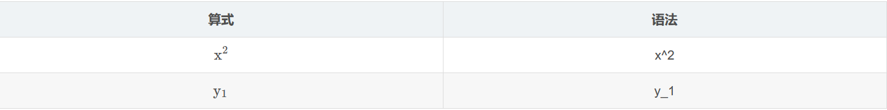

> 注意：若上/下标的内容超过一个字符，则内容需要使用花括号括起来，下同


例如：
```
$x^2+y_0+y_{n+1}$
```

执行效果为：<br>

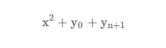


### 2 分式

|  算式  | 语法 |
|  :-:  | :-:  |
| $1/2$   |  1/2  |
| $\frac{1}{2}$​   |  \frac{1}{2}  |

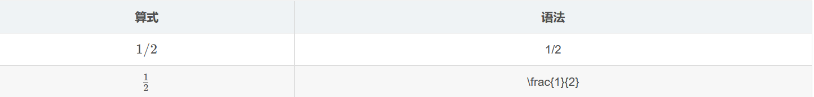

例如：<br>
```
$1/2+\frac{y+x}{2}+(x+y)/2$
```

执行效果为：<br>


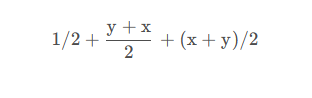


### 3 开方

|  算式  | 语法 |
|  :-:  | :-:  |
| $\sqrt{2}$   |  \sqrt{2}  |
| $\sqrt[3]{2}$​   |  \sqrt[3]{2}  |


### 4 累加累乘

|  算式  | 语法 |
|  :-:  | :-:  |
| $\sum{a}$   |  \sum{a}  |
| $\sum_{n=1}^{100}{a_n}$​   |  \sum_{n=1}^{100}{a_n}  |
| $\sum\limits_{n=1}^{100}{a_n}$   |  \sum\limits_{n=1}^{100}{a_n}  |
| $\prod{x} $​   |  \prod{x}  |
| $\prod_{n=1}^{99}{x_n}$    |  \prod_{n=1}^{99}{x_n}  |
| $\prod\limits_{n=1}^{99}{x_n} $​   |  \prod\limits_{n=1}^{99}{x_n}  |

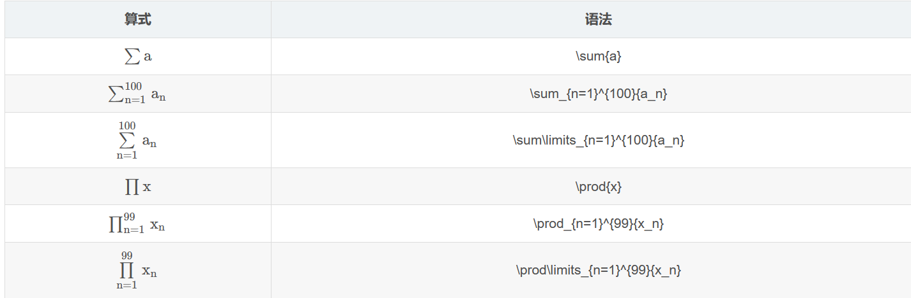

> 注意：仅当行内公式时，需要使用\limits调整下标位置，公式块对一些符号默认上下标在最上下面，因此不需要使用\limits，下同

举例：<br>
```
$$\prod_{n=1}^{99}{x_n}$$
```

执行效果为：<br>

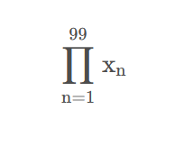

### 5 积分

|  算式  | 语法 |
|  :-:  | :-:  |
| $\int_0^1f(x)dx$   |  \int_0^1f(x)dx  |

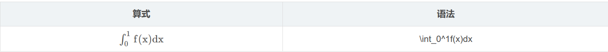

### 6 极限

|  算式  | 语法 |
|  :-:  | :-:  |
| $\lim_{n\rightarrow\infty}{n}$   |  \lim_{n\rightarrow\infty}{n}  |
| $\lim\limits_{n\rightarrow\infty}{n}$   |  \lim\limits_{n\rightarrow\infty}{n}  |

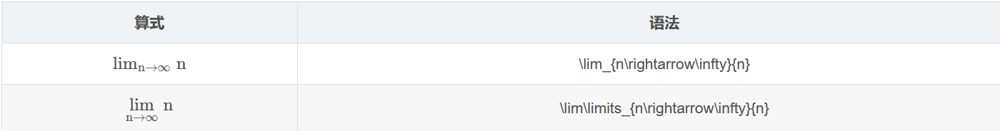

### 7 对数

|  算式  | 语法 |
|  :-:  | :-:  |
| $\ln{x}$   |  \ln{x}  |
| $\lg{x}$   |  \lg{x}  |
| $\log_a{x}$   |  \log_a{x}  |

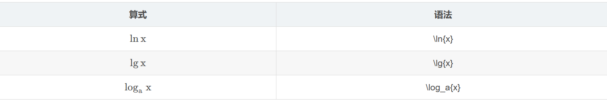

### 8 希腊字母

|  大写  | 语法 | 小写 | 语法 |
|  :-:  | :-:  |:-: | :-:  |
| $A$   |  A  |  $\alpha  $ |  \alpha  |
| $B$   |  B  |  $\beta $ |  \beta  |
| $ \Gamma $   |  \Gamma  | $ \gamma$  | \gamma   |
| $\Delta$   |  \Delta  | $\delta$  | \delta   |
| $E$   |  E  |$ \epsilon$   | \epsilon   |
|   |    |  $\varepsilon $ |  \varepsilon  |
| $Z$   |  Z  |  $ \zeta$ |  \zeta  |
| $H$   |  H  |  $\eta $ |  \eta |
| $\Theta$   |  \Theta |  $\theta $ | \theta   |
| $I $   |  I | $\iota $  |  \iota  |
| $K$   |  K  | $ \kappa$  | \kappa   |
| $\Lambda$   |  \Lambda | $ \lambda$  |  \lambda  |
| $M$   |  M |  $\mu $ | \mu   |
| $N$   |  N | $\nu $  |  \nu  |
| $\Xi$   |  \Xi  | $ \xi$  |  \xi  |
| $O$   |  O | $ \omicron$  |  \omicron  |
| $\Pi$   |  \Pi |  $ \pi$ |   \pi |
| $P$   |  P  | $\rho $  |  \rho  |
| $\Sigma$   |  \Sigma  |  $\sigma $ |  \sigma  |
| $T$   |  T  | $\tau $  |  \tau  |
| $\Upsilon$   |  \Upsilon  | $ \upsilon$  | \upsilon   |
| $\Phi$   |  \Phi  | $ \phi$  |  \phi  |
|||$ \varphi$|\varphi|
| $X$   |  X  | $ \chi$  |   \chi |
| $\Psi$   |  \Psi  | $\psi $  | \psi   |
| $\Omega$   |  \Omega | $ \omega$  |  \omega  |

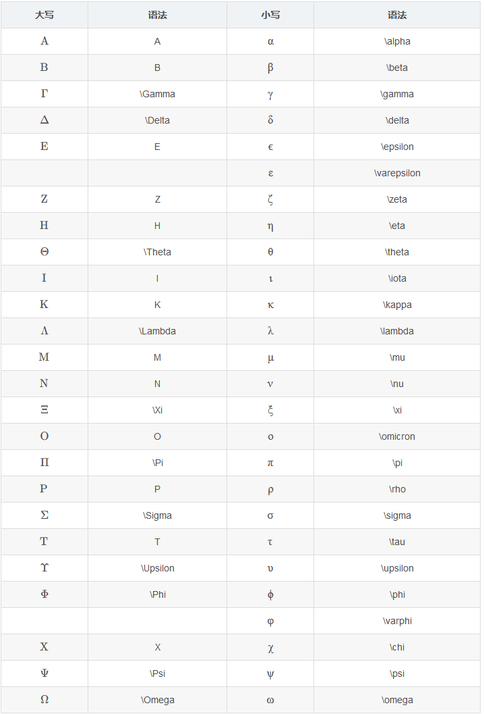


### 9 三角函数

|  算式  | 语法 |
|  :-:  | :-:  |
| $\sin{x} $   |  \sin{x}  |
| $\cos{x}  $   | \cos{x}  |
| $ \tan{x} $   |  \tan{x} |
| $\arcsin{x}$   |  \arcsin{x} |
| $\arccos{x} $   |  \arccos{x} |
| $\arctan{x}$   |  \arctan{x}|

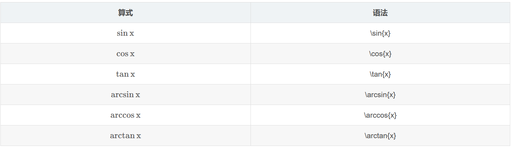

### 10 运算符

|  算式  | 语法 |
|  :-:  | :-:  |
| $\pm $   |  \pm  |
| $\times $   | \times  |
| $ \cdot $   |  \cdot|
| $\div$   | \div |
| $\neq $   |  \neq |
| $\equiv$   |  \equiv|
| $\leq$   |  \leq|
| $\geq$   |  \geq|
| $\approx$   | \approx|

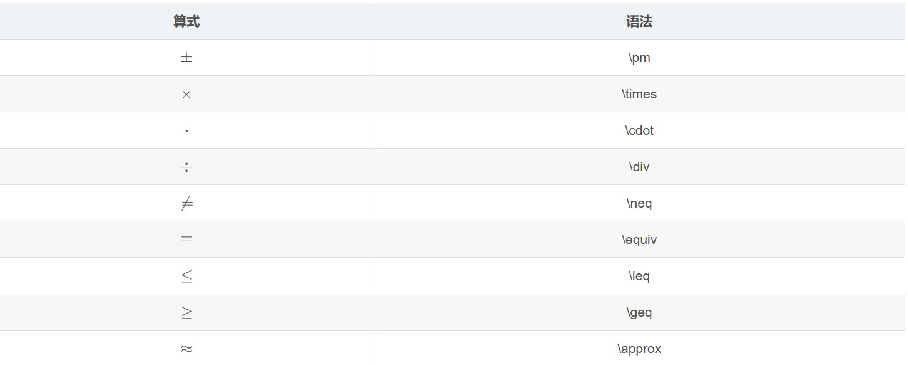

### 11 特殊字符

|  算式  | 语法 |
|  :-:  | :-:  |
| $ \forall $   |  \forall  |
| $\exists $   | \exists  |
| $ \infty$   | \infty|
| $\emptyset$   | \emptyset |
| $\cdots $   |  \cdots |
| $\nabla$   |  \nabla|
| $\bot$   |  \bot|
| $\angle$   |  \angle|
| $\because$   | \because|
| $\therefore$   | \therefore|
| 空格   | \quad|
| $\approx$   | \approx|
| $360^\circ$   | 360^\circ|
| $\in$   | \in|
| $\notin$   |\notin|
| $\{$   |\{ |
| $\}$   | \}|

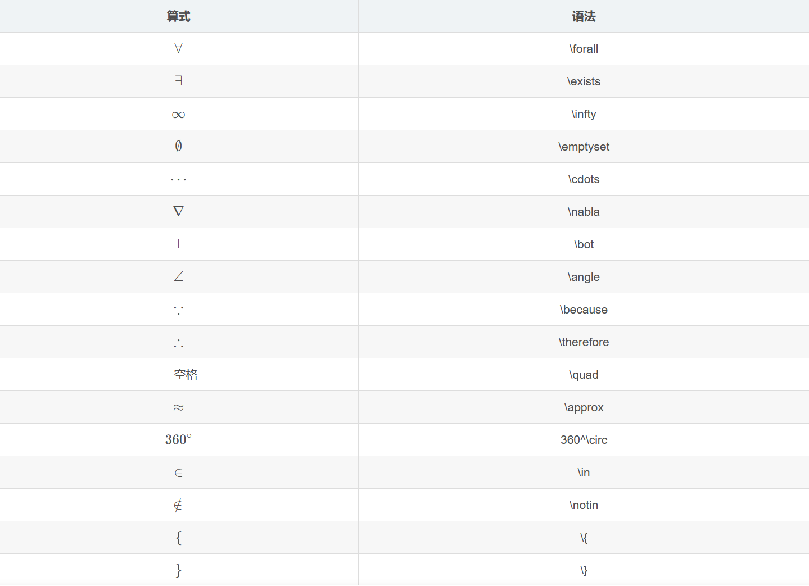


### 12 箭头

|  算式  | 语法 |
|  :-:  | :-:  |
| $ \uparrow $   | \uparrow |
| $\downarrow $   | \downarrow  |
| $\Uparrow $   | \Uparrow  |
| $  \Downarrow$   | \Downarrow|
| $\updownarrow$   | \updownarrow |
| $\Updownarrow $   |  \Updownarrow |
| $\rightarrow$   |  \rightarrow|
| $\leftarrow$   |  \leftarrow|
| $\Rightarrow$   |  \Rightarrow|
| $\Leftarrow$   | \Leftarrow|
| $\leftrightarrow$   | \leftrightarrow|
| $\Leftrightarrow$    | 	\Leftrightarrow|
| $\longrightarrow$   | \longrightarrow|
| $\longleftarrow$   | \longleftarrow|
| $\Longrightarrow$   | \Longrightarrow|
| $\Longleftarrow$   |\Longleftarrow|
| $\longleftrightarrow$   |\longleftrightarrow |
| $\Longleftrightarrow$   | \Longleftrightarrow|

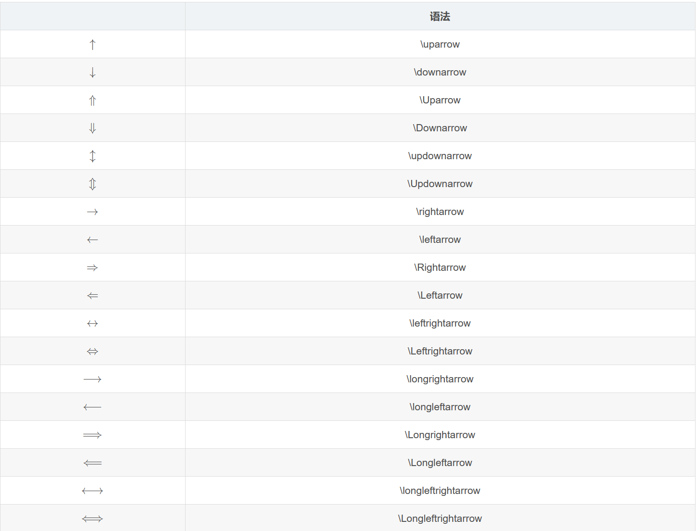


### 13 上\下花括号

|  算式  | 语法 |
|  :-:  | :-:  |
| $ \overbrace{a+b+\dots+n}^{m个} $   | \overbrace{a+b+\dots+n}^{m个} |
| $\underbrace{a+b+\dots+n}_{m个} $   | \underbrace{a+b+\dots+n}_{m个}  |

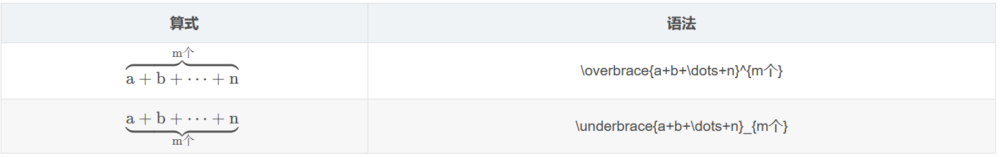


### 14 分段函数\方程组

语法：<br>
```
\left左符号(左符号'.'表示省略，下同)
    \begin{cases} 第一行\\(其中，\\是换行，下同)
		第二行\\
    	...
    \end{cases}
\right右符号(若左符号和右符号都为'.'，则\left\right可以省略)
```

举例：  <br>
```
$$
\left.
	\begin{cases}
		a_1x+b_1y+c_1z=d_1\\
		a_2x+b_2y+c_2z=d_2\\
		a_3x+b_3y+c_3z=d_3
	\end{cases}
\right\}
\Rightarrow
\begin{cases}
    x=z=1\\
    y=2
\end{cases}
$$
```

执行效果：<br>

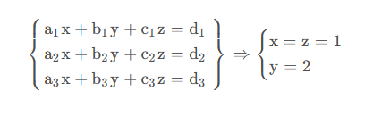


### 15 连等式

语法：<br>
```
\begin{align} 
    第一行左式 &= 第一行右式\\
    第二行左式 &= 第二行右式\\
    ...
\end{align}
```

举例：<br>
```
$$
\begin{align} 
f(x) &= x^2+2x+1\\
&=(x+1)^2
\end{align}
$$
```

执行效果：<br>  

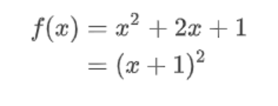


### 16 矩阵

语法：<br>
```
\begin{bmatrix} 0 & -1 \\ 1 & 0 \end{bmatrix}\\
\begin{matrix} 0 & 1 \\ 1 & 0 \end{matrix}\\
\begin{pmatrix} 0 & -i \\ i & 0 \end{pmatrix}\\
\begin{Bmatrix} 1 & 0 \\ 0 & -1 \end{Bmatrix}\\
\begin{vmatrix} a & b \\ c & d \end{vmatrix}\\
\begin{Vmatrix} i & 0 \\ 0 & -i \end{Vmatrix}
```

执行效果：<br>  

