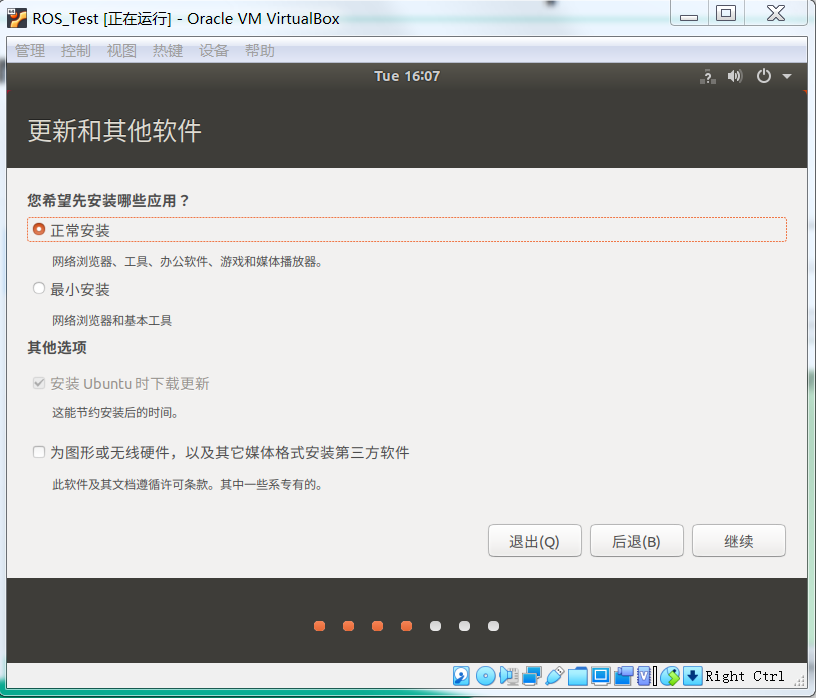
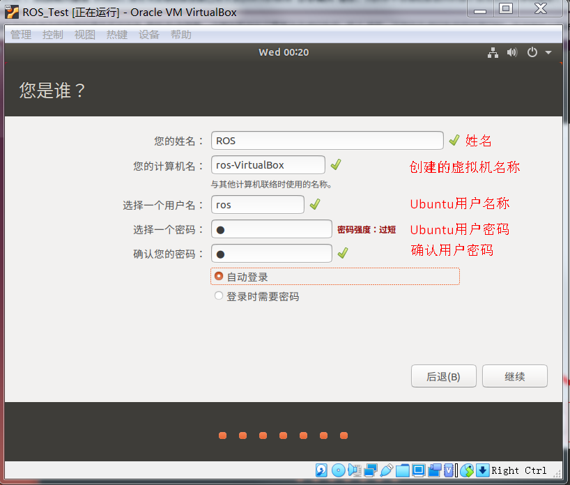

# 1.1 VirtualBox 和 Ubuntu安装

> **[danger] 注意**  
> 所有涉及到使用路径的地方(软件安装路径、虚拟机路径等)，都不要使用中文

## 1.1.1 VirtualBox安装和设置

### 1 VirtualBox下载

> 官方网站：https://www.virtualbox.org/wiki/Downloads

使用VirtualBox需下载**安装包**和**扩展包**  

进入官方网站下载VirtualBox安装包和扩展包，见下图红框标记(下图为VirtualBox7.0版本)  
 

 

### 2 VirtualBox安装

> 此处以VirtualBox-6.1.26为例演示其安装过程  
> VirtualBox-6.1.26下载地址：https://pan.baidu.com/s/1vddJwBs755XQvGqfxOv_vQ  提取码：6666

下载完成 VirtualBox 安装包，双击该安装包，弹出安装向导，点击“下一步”
 

点击 “浏览”，选择 VirtualBox 的安装位置，选择好后点击“下一步”
 

采用默认设置，点击“下一步”
 

选择“是“
 

选择“安装“
 

等待安装完成
 

点击“完成”运行 VirtualBox
 

 

### 3 VirtualBox设置

点击“完成”之后，启动 VirtualBox，出现下图所示界面，点击“全局设定”，配置 VirtualBox

 

(可选)在“常规”选项栏中，配置虚拟机的安装位置。点击下图所示下三角，弹出下拉菜单，在下拉菜单中选择“其他”
   

(可选)弹出下图所示的界面，选择需要安装的文件夹。本例中设置虚拟机安装在VirtualBox安装目录下的 Ubuntu18.04 文件夹中，具体可自行设定
   

(可选)点击“更新”选项栏，取消“检查更新”
  

点击“扩展”选项栏，点击下图所示“+”号添加扩展包
 

点击“+”号后弹出下图所示的界面，选择下载好的扩展包(扩展包和VirtualBox版本须一致，例如：VirtualBox6.1无法使用7.0的扩展包)
 

选择扩展包后弹出下图界面，点击“安装”，安装扩展包
 

扩展包安装结果见下图，点击“OK”退出全局设定，回到 VirtualBox 启动界面
 

 

### 4 新建虚拟机

在 VirtualBox 启动界面，点击“新建”，创建虚拟机
 

填写虚拟机信息：  
名称：自定义虚拟机名称  
文件夹：若在全局设置中设置虚拟电脑的位置，此处文件夹显示为设置的地址，可自行更改  
类型：选择`Linux`  
版本：可选Ubuntu (64-bit)  
填写完成后，点击“下一步”
 

配置虚拟机内存大小，采用默认配置即可，后期内存不够可调整。内存越大，虚拟机运行约流畅    
内存大小选择原则：**绿色拉满**。绿色表示建议选择范围，红色表示超标范围。选择完成后，点击“下一步”
 

虚拟硬盘，选择默认配置，点击“创建”
 

虚拟硬盘文件类型，选择默认配置，点击“下一步”
 

存储在物理硬盘上，选择默认配置，点击“下一步”
 

文件位置和大小，文件位置采用默认设置，文件大小建议最小40G，点击“创建”
 

完成虚拟机的创建。

---

VirtualBox-7.0.2创建虚拟机的过程如下，与上述过程类似，可结合上述创建过程理解各个步骤含义
 
 
 
 
 

 

### 5 虚拟机设置

虚拟机运行之前，需要对虚拟机进行配置，点击图中“设置”，配置虚拟机
 

点击“设置”之后，出现下图所示界面
 

在“常规”选项栏中的“高级”选项卡下，设置“共享粘贴板”为：双向，设置”拖放“为：双向    
共享粘贴板为双向，可在实体机和虚拟机之间共享粘贴板；拖放为双向，可在实体机和虚拟机之间双向拖放
 

在“系统”选项栏中的“主板”选项卡下，可设置内存大小，后期内存不够用可来此设置
 

在“系统”选项栏中的“处理器”选项卡下，可设置处理器数量，处理器数量越多，虚拟机运行越流畅，可按绿色标记范围进行设置

在“显示”选项栏中的“屏幕”选项卡下，可设置显存大小，显存越大，处理图像信息越流畅，可按绿色标记范围进行设置

在“存储”选项栏中，点击控制器IDE下面的 “没有盘片“，见下图。在右边的属性栏中，点击图示图标，在下拉菜单中选择“选择虚拟盘”

点击“选择虚拟盘”之后，在弹出窗口中，选择下载好的 Ubuntu18.04 镜像(或者 Ubuntu20.04 镜像)。
> **[info] 注意：**  
> 镜像文件不要加载或解压缩，直接使用下载的镜像文件

(可选)在“共享文件夹”选项栏中，点击右侧”+“号添加共享文件夹    
共享文件夹作用：将实体机的一个文件夹同步到虚拟机中，可以进实体机和虚拟机的文件传输。在共享文件夹配置中，路径为实体机的文件夹路径，名称为实体机文件夹名称，勾选“自动挂载”

> **[info] 说明：**  
> 虚拟机使用vmware亦可，vmware官网：https://www.vmware.com/cn.html

 

## 1.1.2 Ubuntu安装和设置

### 1 Ubuntu下载

Ubuntu分为桌面版(Ubuntu Desktop)和服务器版(Ubuntu Live Server)，此处使用桌面版
> **Ubuntu Desktop** 可在[Ubuntu官网](https://ubuntu.com/)下载，下载网址：https://ubuntu.com/download/desktop  
> 若下载速度过慢，可使用国内镜像，下载网址：http://mirrors.aliyun.com/ubuntu-releases/  
> 或者使用百度网盘，链接：https://pan.baidu.com/s/1yyXJuxHgye-AzyvgZvSuAw 提取码：6666 

 

### 2 Ubuntu安装

> **[info] Ubuntu版本需要和ROS相对应，安装时要注意：**  
> Ubuntu 18.04 -> ROS Melodic  
> Ubuntu 20.04 -> ROS Noetic  
> 主要区别：ROS Noetic默认使用Python3，ROS Melodic默认使用Python2

设置完成后，点击OK，退出虚拟机配置，回到 VirtualBox 启动界面。点击“启动”，启动虚拟机，启动后出现下图所示界面。在左侧语言栏中选择“中文(简体)”，在右侧点击“安装Ubuntu”
  

配置键盘布局，选择默认设置，点击继续
  
> **[info] 此步骤若无法点击"继续"按钮，解决方案：**  
> 原因：原始800x600分辨率太小。可先点击右上角"x"退出安装，在屏幕上点击右键，选择"显示设置"，修改分辨率
>    
> 点击"分辨率"，选择较大一点的分辨率(例如1280x768)，保存后返回桌面，找到ubuntu安装程序继续安装
>   

配置更新和其他软件，选择“最小安装“（双系统可选择正常安装），点击继续

配置安装类型，此处为在虚拟机中安装Ubuntu，故选择“清除整个磁盘并安装Ubuntu“；若在双系统中安装Ubuntu系统，需要选择”其它选项“，以配置硬盘和分区信息。点击”现在安装“

开始安装Ubuntu，出现安全提示，选择”继续“

选择时区，点击中国地图，点击“继续”

填写相关信息：  
`您的姓名`、`您的计算机名`和`选择一个用户名`按需设置  
建议勾选“自动登录”，这样在启动虚拟机后无需登录，直接进入Ubuntu系统  
密码建议设置成1位，后续在安装软件时需要频繁的使用此密码  
设置完成后，点击“继续”

开始安装Ubuntu，安装过程中不要点击“Skip”，可以泡几杯奶茶，等待安装完成

安装完成后，点击“现在重启”，完成安装

重启之后，出现下图所示界面，此界面为 Ubuntu18.04 的桌面环境。**此时 Ubuntu 界面无法自动调整窗口大小，需要安装增强功能，见“1.2 Ubuntu安装之后要做的事”**

 

### 3 Ubuntu设置

点击左下角的“Dash”图标(类似于 Windows 的开始图标)，进入Dash主页界面

点击“设置“，可对Ubuntu进行基本的参数设置，设置界面类似手机操作界面，可自行设置

