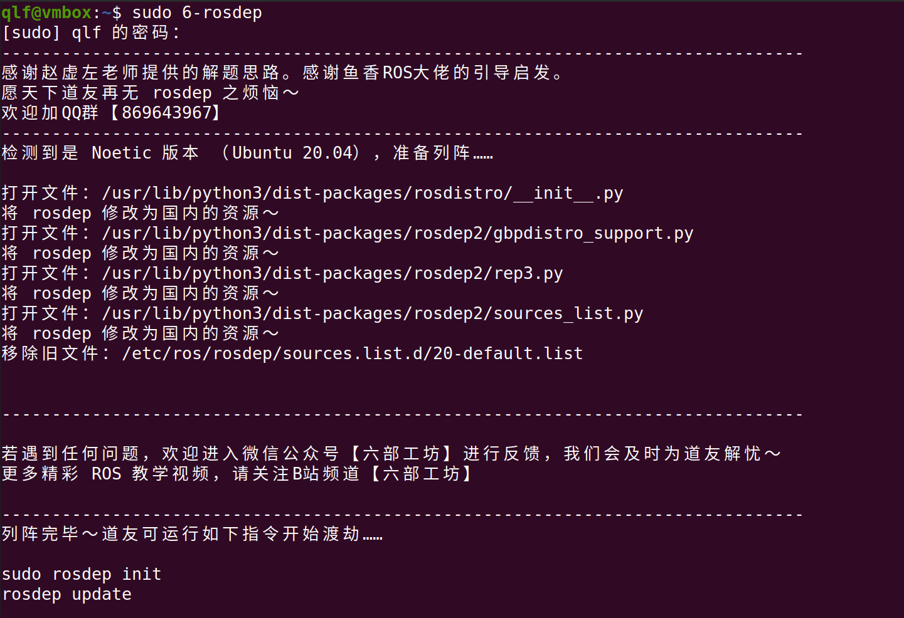
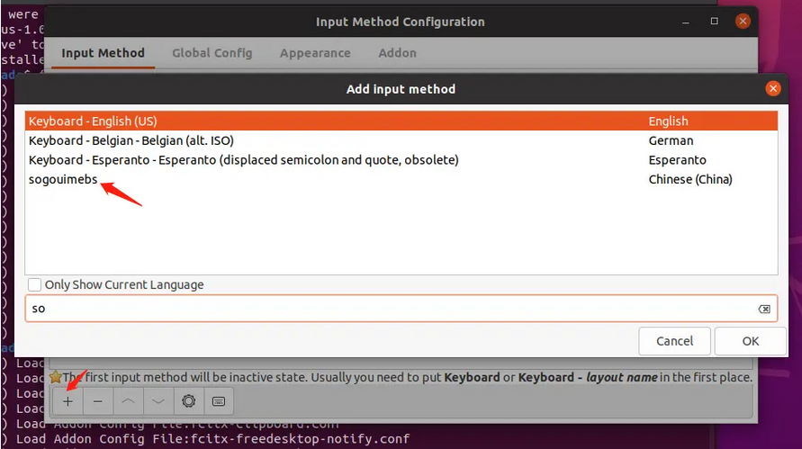

# 1.2 Ubuntu安装之后需要做的事

### 1 安装增强功能

#### 第1步 更新软件源，升级软件

打开终端，输入以下命令  
`sudo apt update`  
`sudo apt upgrade`

#### 第2步 安装build-essential

在终端中，继续输入以下命令  
`sudo apt install build-essential`  

#### 第3步 选择安装增强功能

在VirtualBox的菜单栏，点击`设备`，选择`安装增强功能`，见下图红框所示  
 

#### 第3步 安装增强功能

1 接上步骤，点击完`安装增强功能，会弹出如下对话框，选择`运行`
 

2 若未弹出对话框，可点击Dock栏中的镜像图标，进入后选择`运行软件`，见下图
 

3 接上步骤，点击`运行`或者`运行软件`后，增强功能会自动进行安装，出现下述结果表示增强功能安装成功
 


#### 第4步 配置增强功能

安装成功后，在VirtualBox的菜单栏，点击`设备`，将`共享粘贴板`和`拖放`选择为`双向`，见下图
 
  

在VirtualBox的菜单栏，点击`视图`，选择`自动调整显示尺寸`、`自动调整窗口大小`，重启虚拟机
 

<br/>

### 2 安装Vscode

#### 第1步 下载vscode

> 官方网址：https://code.visualstudio.com/  
> 国内镜像：https://vscode.cdn.azure.cn/stable/6c3e3dba23e8fadc360aed75ce363ba185c49794/code_1.81.1-1691620686_amd64.deb

进入网站，如下图，下载红框所示的.deb格式文件   


#### 第2步 安装vscode

切换到下载文件所在的目录，打开终端，执行`sudo apt install ./第1步下载的文件`(输入code后按Tab键自动补全)

例如：第1步下载的文件名称为`code_1.59.1-1629375198_amd64.deb`，则执行`sudo apt install ./code_1.59.1-1629375198_amd64.deb`  
在终端窗口输入代码如下图 


#### 第3步 安装扩展


1. C/C++ @Microsoft
2. C/C++ Extension Pack  @Microsoft
3. Chinese(Simplified)(简体中文)  @Microsoft
4. CMake  @twxs
5. CMake Tools  @Microsoft
6. ROS  @Microsoft
7. Python  @Microsoft
8. Pylance  @Microsoft
9. Markdown All in One  @Yu Zhang
10. Markdown Preview Enhanced  @Yiyi Wang
11. vscode-icons  @VSCode Icons Team
12. Code Runner  @Jun Han  

> 备注：@Microsoft表示发行商为Microsoft，选择对应的扩展进行安装

<br/>

### 3 安装ROS Noetic

#### 第1步 在“软件和更新”中配置Ubuntu仓库

点击屏幕左下角的按钮，进入Dash主页，找到软件和更新，勾选”main”, “universe”,”restricted”和 “multiverse”，在“下载自”的“其他站点”中选择国内的镜像源（aliyun等），如下图所示


#### 第2步 添加ROS下载源

打开终端，输入以下代码  
`sudo sh -c 'echo "deb http://packages.ros.org/ros/ubuntu $(lsb_release -sc) main" > /etc/apt/sources.list.d/ros-latest.list'`  

#### 第3步 添加密钥

继续在终端中输入  
`sudo apt-key adv --keyserver hkp://keyserver.ubuntu.com:80 --recv-key C1CF6E31E6BADE8868B172B4F42ED6FBAB17C654`  
运行后如下图所示即可进行下一步


#### 第4步 更新本地软件源并下载ROS Noetic

继续在终端中输入   
`sudo apt update`  
`sudo apt install ros-noetic-desktop-full`  

> 执行过程中可能因网络问题导致软件包无法正常下载，可尝试重复执行上述命令 若依旧不行，可以尝试更换手机热点后再次执行上述代码

#### 第5步 设置bashrc

继续在终端中输入   
`echo "source /opt/ros/noetic/setup.bash" >> ~/.bashrc`  
`source ~/.bashrc`

#### 第6步 安装依赖包

继续在终端中输入   
`sudo apt install python3-rosdep python3-rosinstall python3-rosinstall-generator python3-wstool build-essential`

#### 第7步 安装6-rosdep

继续在终端中输入   
`sudo apt-get install python3-pip`  
`sudo pip3 install 6-rosdep`  
`sudo 6-rosdep`  

> 此步骤执行过程中可能遇到网络问题，若遇到网络问题，重复执行上述代码即可  

出现如下提示，表示此步骤安装完成，可进行下一步   


#### 第8步 执行rosdep init

继续在终端中输入    
`sudo rosdep init `  
`rosdep update`  

出现如下结果，表示ROS安装完成  


#### 第9步 测试

打开另一个终端，输入`roscore`


打开另一个终端，输入`rosrun turtlesim turtlesim_node`，该行代码执行后将会弹出图形交互界面  


打开另一个终端，输入`rosrun turtlesim turtle_teleop_key`，该行代码执行后，可通过键盘控制小乌龟进行运动(需要将鼠标光标聚焦在上述终端中)  
  

上述3个终端的执行结果如下所示，可通过键盘在右图终端中对左图小乌龟进行控制，白色线条为小乌龟运动轨迹


<br/>

### 4 安装Terminator

在终端输入`sudo apt install terminator`，即可完成安装


<br/>

### 5 安装Anaconda

#### 第1步 下载Anaconda

进入Anaconda官网，下载Anaconda安装包 
>官方网址：https://www.anaconda.com/  
>国内镜像：https://mirrors.tuna.tsinghua.edu.cn/anaconda/archive/


等待下载完成，Anaconda安装包如下所示 


#### 第2步 安装Anaconda

在安装包位置右键，选择在终端打开，输入bash Ana，后续用Tab进行补齐代码，得到下载的Anaconda版本号相关代码  
`bash Anaconda3-2023.03-1-Linux-x86_64.sh` 

根据提示，一路回车+yes即可完成安装 

#### 第3步 配置conda init

安装完成后，弹出conda init选项，此选项用于conda初始化，配置conda环境变量，选择yes即可
安装完成后，会默认进入base环境，如需取消自动进入base环境，在终端中输入以下代码  
`conda config --set auto_activate_base false`

#### 第4步 conda init异常处理

完成上述操作后若无异常，即完成了Anaconda安装 若出现初始化异常，或者未进行初始化(在终端中输入conda无反应)，则需要修改bashrc文件，在家目录中使用`ctrl+h`快捷键显示隐藏文件
  

打开.bashrc文件，在文档最下方加入以下代码并保存
```
# >>> conda initialize >>>
# !! Contents within this block are managed by 'conda init' !!
__conda_setup="$('/home/jayson/anaconda3/bin/conda' 'shell.bash' 'hook' 2> /dev/null)"
if [ $? -eq 0 ]; then
    eval "$__conda_setup"
else
    if [ -f "/home/jayson/anaconda3/etc/profile.d/conda.sh" ]; then
        . "/home/jayson/anaconda3/etc/profile.d/conda.sh"
    else
        export PATH="/home/jayson/anaconda3/bin:$PATH"
    fi
fi
unset __conda_setup
# <<< conda initialize <<<
```
> 注意：上述代码中的`/home/jayson/`需要更换为你本机上Anaconda的安装地址

.bashrc文件修改结果如下图所示 


#### 第5步 常用Anaconda指令

下面进行一些Anaconda命令说明   
用法1：新建一个虚拟环境，此处新建的虚拟环境名称为python38，创建虚拟环境时指定安装python3.8  
`conda  create -n python38  python=3.8`

用法2：切换（激活）虚拟环境  
`conda activate python38`

用法3：取消激活虚拟环境  
`conda deactivate python38`

用法4：安装第三方包requests  
`conda install requests`

用法5：更新第三方包requests  
`conda update requests`

用法6：删除第三方包requests  
`conda remove requests`

用法7：查看虚拟环境列表  
`conda env list`

用法8：删除某个虚拟环境（包括所有包）  
`conda remove -n python38 --all`

> 注意，这里如果是在虚拟环境本身，是无法删除当前虚拟环境的 要切换到另外一个虚拟环境（activate base） 这里的python38是之前新建的虚拟环境名称；base是系统自带默认的环境  

用法9：删除虚拟环境的某个包  
`conda remove --name python38 xlrd`  
`pip uninstall xlrd`（删除默认pip环境下的包，有时候包没有装到base下面）  

用法10：更新Anaconda  
`conda update conda`        #升级conda  
`conda update anaconda`     #升级anaconda  
`conda upgrade --all`       #升级所有包  

用法11：导出当前环境的包信息  
`conda env export > environment.yaml `  

用法12：用配置文件创建新的虚拟环境  
`conda env create -f environment.yaml`  

用法13：查看Anaconda版本  
`conda --version`

<br/>

### 6 Anaconda换源

#### 第1步 创建condarc

在家目录使用`ctrl+h`显示隐藏文件，查看家目录下是否有`.condarc`文件 若没有`.condarc`文件，在终端中使用`sudo touch .condarc`命令创建`.condarc`文件

#### 第2步 配置condarc
打开`.condarc`文件，将以下代码覆盖到该文件夹并保存
```
channels:
  - defaults
show_channel_urls: true
default_channels:
  - https://mirrors.tuna.tsinghua.edu.cn/anaconda/pkgs/main
  - https://mirrors.tuna.tsinghua.edu.cn/anaconda/pkgs/r
  - https://mirrors.tuna.tsinghua.edu.cn/anaconda/pkgs/msys2
custom_channels:
  conda-forge: https://mirrors.tuna.tsinghua.edu.cn/anaconda/cloud
  msys2: https://mirrors.tuna.tsinghua.edu.cn/anaconda/cloud
  bioconda: https://mirrors.tuna.tsinghua.edu.cn/anaconda/cloud
  menpo: https://mirrors.tuna.tsinghua.edu.cn/anaconda/cloud
  pytorch: https://mirrors.tuna.tsinghua.edu.cn/anaconda/cloud
  pytorch-lts: https://mirrors.tuna.tsinghua.edu.cn/anaconda/cloud
  simpleitk: https://mirrors.tuna.tsinghua.edu.cn/anaconda/cloud
  deepmodeling: https://mirrors.tuna.tsinghua.edu.cn/anaconda/cloud/

```
结果如下图所示 


#### 第3步 清除缓存
在终端运行`conda clean -i`清除索引缓存，保证使用的是镜像站提供的索引

#### 第4步 测试
在终端运行`conda create -n myenv numpy`进行测试，根据下载速度判断是否换源成功(成功后下载速度>1M)

输入y回车，一路回车确认即可

<br/>

### 7 Pip换源

#### 第1步 创建pip目录

cd到home目录，在终端中执行以下命令，创建.pip目录  
`cd ~`  
`sudo mkdir .pip` 

#### 第2步 新建pip.conf文件

cd 到 .pip 目录，新建pip.conf文件，在终端中执行以下命令  
`cd .pip`  
`sudo touch pip.conf`

#### 第3步 打开pip.conf文件

更新pip.conf文件内容，在终端中输入以下命令  
`sudo gedit pip.conf`

#### 第4步 编辑pip.conf文件

在弹出的文件中填写以下内容  
```
[global]
index-url=https://pypi.tuna.tsinghua.edu.cn/simple
timeout = 6000

[install]
trusted-host=pypi.tuna.tsinghua.edu.cn
disable-pip-version-check = true

```

#### 第5步 测试

保存并测试，在终端中输入以下命令`pip install numpy`  
换源成功后，indexes后显示清华源网址，如下图所示


<br/>

### 8 安装国内版Firefox浏览器

#### 第1步 下载Firefox

进入Firefox官网，下载Firefox，下载获得Firefox压缩包   
> 官方网址：http://www.firefox.com.cn/


#### 第2步 移动Firefox(此步骤为可选步骤)

在家目录下新建`Software`文件，将firefox压缩包移动到家目录下的`Software`文件中 


#### 第3步 解压Firefox

打开`Software`文件，右键压缩包并点击`提出到此处`，将压缩包解压，得到下图红框所示解压文件 


#### 第4步 卸载自带的国际版Firefox

卸载ubuntu自带的Firefox软件，在终端中输入以下命令  
`sudo apt purge firefox`

#### 第5步 创建Firefox快捷方式

创建Firefox快捷方式，总共有2个步骤：
1. 进入/usr/share/applications目录，新建firefox.desktop文件，在终端中执行以下命令  
`cd /usr/share/applications`  
`sudo touch firefox.desktop`
2. 更新firefox.desktop文件内容，在终端中输入以下命令  
`sudo gedit firefox.desktop`  
在弹出的窗口中输入以下内容  

```
[Desktop Entry]
Name=firefox
Name[zh_CN]=火狐浏览器
Comment=火狐浏览器
Exec=/opt/firefox/Firefox-latest-x86_64/firefox/firefox
Icon=/opt/firefox/Firefox-latest-x86_64/firefox/browser/chrome/icons/default/default128.png
Terminal=false
Type=Application
Categories=Application;
Encoding=UTF-8
StartupNotify=true

```
> 说明：需要修改两个地方
> 1. 将Exec的路径更换为firefox的解压缩路径（即你电脑上的存放路径），例如：本机的firefox压缩包存放在home目录的Software中，则该路径为`/home/jayson/Software/Firefox-latest-x86_64/firefox`，用此路径替换上述命令中的`/opt/firefox/Firefox-latest-x86_64/firefox`
> 2. 将Icon的路径更换为firefox的解压缩文件夹中default128.png路径，例如：本机的firefox图片存放在firefox的default文件中，则该路径为`/home/jayson/Software/Firefox-latest-x86_64/firefox/browser/chrome/icons/default`，修改结果如下图所示 
> 

<br/>

### 9 安装搜狗输入法

#### 第1步 更新源

在终端执行  
`sudo apt update`


#### 第2步 安装fcitx输入法框架

1、在终端执行  
`sudo apt install fcitx`


2、设置fcitx为系统输入法
点击左下角菜单选择语言支持，将语言选择为fcitx


3、设置fcitx开机自启动
在终端执行  
`sudo cp /usr/share/applications/fcitx.desktop /etc/xdg/autostart/`


4、卸载系统ibus输入法框架
在终端执行  
`sudo apt purge ibus`


#### 第3步 安装搜狗输入法

1、在官网下载搜狗输入法安装包，并安装，安装命令 `sudo dpkg -i 安装包名`


2、安装输入法依赖
在终端执行  
`sudo apt install libqt5qml5 libqt5quick5 libqt5quickwidgets5 qml-module-qtquick2`  
`sudo apt install libgsettings-qt1`


#### 第4步 重启电脑、调出输入法

1、重启电脑

2、查看右上角，可以看到“搜狗”字样，在输入窗口即可且出搜狗输入法 


3、没有“搜狗”字样，选择配置，将搜狗加入输入法列表即可


至此，搜狗输入法安装完毕


<br/>

### 10 安装WPS
进入ubuntu的应用商店，搜索wps并下载安装即可 


<br/>

### 11 安装微信

#### 第1步 获取微信源

打开终端，输入以下代码  
`wget http://fishros.com/install -O fishros && . fishros `  
执行结果见下图   


#### 第2步 选择微信安装

接上步骤，在输入密码后，弹出如下安装界面，在输入端输入`10`，见下图 


#### 第3步 选择微信版本

接上步骤，在输入`10`，弹出如下选择版本界面，在输入端输入`1`，见下图 


#### 第4步 选择输入法版本

接上步骤，等到Docker镜像拉取完成后，弹出选择输入法 若未安装搜狗输入法，则选择1；若安装搜狗输入法，选择2 本机已安装搜狗输入法，此处选择2，见下图 


#### 第5步 拉取微信镜像

此处需要拉取带微信的Windows Docker镜像，拉取完成后即完成微信安装，见下图 


安装完成后弹出扫码登录界面，见下图 这个微信客户端版本较低，不支持朋友圈，支持传文件和文字 


#### 第6步 启动/停止微信镜像

后续可在任意终端输入`wechat`来启动/停止微信，见下图，输入相应字母进行选择即可 


<br/>

### 12 安装驱动
点击屏幕左下角的按钮，进入Dash主页，找到软件和更新，点击附加驱动，选择合适的驱动并应用更改即可(虚拟机无需安装驱动) 

> 说明:  
> 1 tested为经过测试的推荐驱动，根据电脑性能进行驱动版本的选择 保守选择，可安装470版本的驱动；  
> 2 Server为服务器版本使用更新，本系统为桌面版，不适用此类驱动 