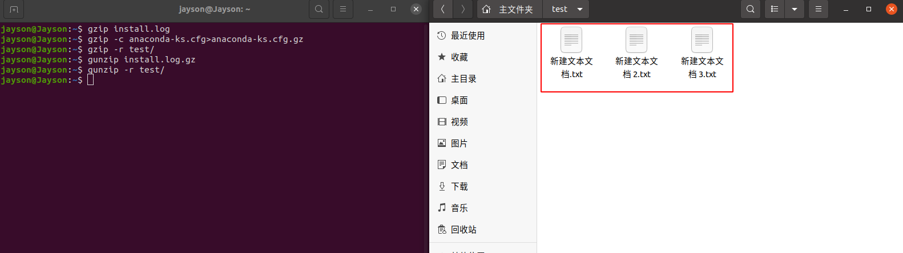

# 1.3 Ubuntu基础知识

## 1.3.1 Ubuntu 简介

### 1 Linux 是什么

Linux 是一个操作系统，如同Windows(7，10，11) 和 Mac OS 。操作系统主要作用是桥接软件和硬件，其在整个计算机系统中的角色见下图

Linux 主要是**系统调用**和**内核**这两层。直观地看，常用的操作系统还包含在其上运行的应用程序，比如文本编辑器、浏览器、电子邮件等

### 2 Unix、Linux 和 Ubuntu 发展史

#### 2.1 Unix 发展史

- 1965年之前，电脑只有军事或者学院的研究机构才有机会接触，当时大型主机至多能提供30台终端（30个键盘、显示器）的连接

- 1965年，贝尔实验室、麻省理工学院 以及 通用电气共同发起了 Multics 项目，旨在让大型主机支持300台终端

- 1969年，由于这个项目进度缓慢，资金短缺，贝尔实验室退出了研究

- 1969年，从这个项目中退出的 Ken Thompson 在实验室无聊时，为了在一台空闲的电脑上运行“星际旅行”游戏，在8月份左右趁着其妻子探亲的时间，用了1个月的时间编写了 Unix 操作系统的原型

- 1970年，Ken Thompson 以 **BCPL语言** 为基础，设计出很简单且很接近硬件的 **B语言**（取BCPL的首字母），并且用B语言写了第一个Unix操作系统

- 因为B语言的跨平台性较差，为了能够在其他的电脑上运行这个非常棒的 Unix 操作系统，Dennis Ritchie 和 Ken Thompson 从B语言的基础上准备研究一个更好的语言

- 1972年，美国贝尔实验室的 Dennis Ritchie 在B语言的基础上设计出了一种新的语言，他取 BCPL语言 的第二个字母作为这种语言的名字，它就是赫赫有名的 **C语言**

- 1973年初，C语言的主体完成，Thompson 和 Ritchie 迫不及待地开始用它完全重写了现在大名鼎鼎的 **Unix操作系统**，其图标见下


- 1977 年，Berkeley 大学的 Bill Joy 针对他的机器修改了 Unix 源码，称为 BSD（Berkeley Software Distribution），Bill Joy 是 Sun 公司的创始人

- 1979 年，Unix 发布 System V，用于个人计算机


#### 2.2 GNU 发展史

- Unix诞生之后，很多教育机构、大型企业都投入研究，并取得了不同程度的研究成果，从而导致软件的经济利益和版权问题

- 20世纪70年代，源代码开始对用户封闭。Unix爱好者 [Richard Stallman](https://www.stallman.org/) 提出开放源码（Open Source）的概念，提倡大家共享自己的程序，让很多人参与校验，在不同的平台进行测试，以编写出更好的程序

- 1983年9月，Richard Stallman 做出了GNU工程的[初始声明](https://www.gnu.org/gnu/initial-announcement.html)，GNU是"**GNU's Not Unix**"的递归缩写，其含义是开发出一套与Unix相似而不是 Unix 的系统

- 1984 年，因为 Unix 规定“不能对学生提供源码”，Tanenbaum 老师自己编写兼容于 Unix 的 Minix，用于教学；

- 1984年，Richard Stallman 创立了 **GNU** 与**自由软件基金会（Free Software Foundation，FSF）**，目标是创建一套完全自由的操作系统

- 1985年3月，Richard Stallman发表了更长的GNU工程版本，叫做[GNU宣言](https://www.gnu.org/gnu/manifesto.html)

- 1985 年，为了避免 GNU 开发的自由软件被其他人用作专利软件，因此创建 GPL（General Public License）版权声明


#### 2.3 Linux 发展史

- 1991 年，芬兰赫尔辛基大学的研究生 Linus Torvalds 基于 gcc、bash 开发了针对 386 机器的 Linux 内核

- 1994 年，Torvalds 发布 Linux-v1.0

- 1996 年，Torvalds 发布 Linux-v2.0，确定了 Linux 的吉祥物：企鹅


- 作为一个自由软件工程项目，"**自由**"（free）是指使用软件对所有的用户来说是自由的，即用户在取得软件之后，可以进行修改，进一步在不同的计算机平台上发布和复制

- 为保证 GNU 软件可以自由地**使用**、**复制**、**修改**和**发布**，所有GNU软件都有一份在禁止其他人添加任何限制的情况下，授权所有权利给任何人的协议条款。针对不同场合，GNU 包含以下3个协议条款：
  - **GNU 通用公共许可证**（GNU General Public License，GPL）
  - **GNU 较宽松公共许可证**（GNU Lesser General Public License，LGPL）
  - **GNU 自由文档许可证**（GNU Free Documentation License，GFDL）

- GNU GPL 的精神就是**开放**、**自由**，为优秀的程序员提供展现自己才能的平台，也使他们能够编写出自由的、高质量、容易理解的软件

- 任何软件加上 GPL 授权之后，即成为自由的软件，任何人可以：  
  - ① 有自由按照自己的意愿运行该软件  
  - ② 有自由复制软件并将其送给朋友和同事  
  - ③ 有自由通过对源代码的完全控制而改进程序  
  - ④ 有自由发布改进的版本从而帮助社区建设

- GNU GPL 的出现为 Linux 诞生奠定了基础。1991年，Linus Torvalds 按照 GPL 条款发布了 Linux，很快就吸引了专业人士加入 Linux 的开发

- 开始Linux并不能兼容Unix，即 Unix 上跑的应用程序不能在 Linux 上跑，即应用程序与内核之间的接口不一致。为此，Torvalds 修改了 Linux，并遵循 POSIX（Portable Operating System Interface）规范

- **Linux内核**：
  - [Linux内核](http://www.kernel.org)(kernel)是系统的心脏，是运行程序和管理像磁盘和打印机等硬件设备的核心程序，它提供了一个在裸设备与应用程序间的抽象层
  - Linux内核版本又分为**稳定版**和**开发版**，两种版本是相互关联，相互循环：
    - **稳定版**：具有工业级强度，可以广泛地应用和部署。新的稳定版相对于较旧的只是修正一些bug或加入一些新的驱动程序
    - **开发版**：由于要试验各种解决方案，版本变化很快

- **Linux发行版**：
  - Linux发行版 (也被叫做 GNU/Linux 发行版) 通常包含了桌面环境、办公套件、媒体播放器、数据库等应用软件
  - 目前市面上较知名的发行版有：**Ubuntu**、RedHat、CentOS、Debian、Fedora、SuSE、OpenSUSE、Arch Linux、SolusOS 等


#### 2.4 Ubuntu 发展史

- Debian是 Ubuntu 的一个父版本，Ubuntu的发展离不开Debian。Debian于1993年8月由美国普渡大学学生 lan Murdock 首次发布

- Debian 以其坚守Unix和自由软件的精神，以及给予用户众多选择而闻名，现在 Debian 包括的软件包超过18000个，并且支持11个计算机系统结构

- 很多 Linux 发行版本都继承了 Debian 系统，如 **Ubuntu**、Knoppix 和 Linspire，以及Xandros，其中 Ubuntu 最为著名

- Ubuntu 由 **Mark Shuttleworth** 创立，以Debian GNU/Linux不稳定分支为开发基础，其首个版本于2004年10月20日发布

- 2005年7月8日，Mark Shuttleworth 与 Canonical 有限公司宣布成立 Ubuntu 基金会，以确保将来 Ubuntu 得以持续开发与获得支持

- Ubuntu 的出现得益于 GPL，它继承了 Debian 的所有优点。Ubuntu 对 GNU/Linux 的普及尤其是桌面普及做出了巨大贡献，使更多人共享开源成果

- Ubuntu 每半年发行一个新的版本，版本号由发布年月组成。第一个版本，4.10代表是在2004年10月发行

- Ubuntu 发行长期支持版本(简称LTS)，自 Ubuntu 12.04 LTS开始，桌面版和服务器版均可获得为期5年的技术支持

- 每个发行版本都提供相应的代号，代号的命名由两个单词组成的，而且两个单词的第一个字母都是相同的，第一个单词为形容词，第二个单词为表示动物的名词，Ubuntu18.04 代号是 Bionic Beaver（仿生海狸）

- Ubuntu遵循着自由软件的精神，出现了许多衍生版本：Edubuntu、Kubuntu、Lubuntu、Mythbuntu、Ubuntu MATE，Ubuntu GNOME、Ubuntu Kylin、Ubuntu Studio 和 Xubuntu


### 3 重要人物

1. Ken Thompson：C 语言 和 Unix 之父


2. Dennis Ritchie：C 语言 和 Unix 之父


3. Richard Stallman：著名黑客，GNU 创始人，开发了 Emacs、gcc、bash shell


4. William Nelson Joy：BSD 开发者


5. Andrew Tanenbaum：Minix 开发者


6. Linus Torvalds：Linux 之父，芬兰赫尔辛基大学


1. Mark Shuttleworth：Ubuntu 之父


### 4 Linux 和 Windows 操作系统的异同

1. 免费与收费

   - 最新正版 Windows 10，需要付费购买
   - Linux 免费或少许费用

2. 软件与支持

   - Windows 平台：数量和质量的优势，大部分为收费软件；由微软官方提供重要支持和服务
   - Linux 平台：大都为开源自由软件，用户可以修改定制和再发布。由于基本免费没有资金支持，部分软件质量和体验欠缺；由全球所有的 Linux 开发者和自由软件社区提供支持

3. 安全性

   - Windows 平台：频繁打补丁安装系统安全更新，还是会中病毒木马
   - Linux 平台：相对来说比 Windows 平台要更加安全，使用 Linux 不用装某杀毒、某毒霸

4. 使用习惯

   - Windows：普通用户基本是纯图形界面下操作使用，依靠鼠标和键盘完成一切操作，用户上手容易，入门简单
   - Linux：兼具图形界面操作（需要使用带有桌面环境的发行版）和完全的**命令行操**作，可以只用键盘完成一切操作，新手入门较困难，需要一些学习和指导，一旦熟练之后效率极高

5. 可定制性

   - Windows：基本算全封闭的，系统可定制性很差
   - Linux：支持个性化定制，Windows 能做到得它都能，Windows 做不到的，它也能

6. 应用范畴

   - 世界上大部分软件和服务都是运行在 Linux 之上

7. Windows 缺乏

   - 稳定的系统
   - 安全性和漏洞的快速修补
   - 多用户
   - 用户和用户组的规划
   - 相对较少的系统资源占用
   - 可定制裁剪，移植到嵌入式平台（如安卓设备）
   - 可选择的多种图形用户界面（如 GNOME，KDE）

8. Linux 缺乏

   - 特定的支持厂商
   - 足够的专业软件支持度
   - 足够的游戏娱乐支持度  

## 1.3.2 Ubuntu 桌面环境

### 1 概述

1. 相对于现在的 Windows 系统，UNIX/Linux 本身是没有图形界面的，我们通常在 UNIX/Linux 发行版上看到的图形界面实际上是运行在  Linux 系统之上的一套软件

2. Linux 上的这套软件以前是 XFree86，现在则是 xorg（X.Org），而这套软件又是通过 X 窗口系统（X Window  System，也常被称为 X11 或 X）实现的，X 本身只是工具包及架构协议，而 xorg 是 X 架构规范的一个实现体，它实现了 X 协议规范的一个提供图形界面服务的服务器

3. 如果只有服务器也是不能实现一个完整的桌面环境的，当然还需要一个客户端，我们称为 X  Client，见下图，例如以下具有客户端功能的桌面环境 **KDE**，**GNOME**，**XFCE**，**LXDE** 。 Linux 上你可以自己选择安装不同的桌面环境，甚至可以定制自己的专属桌面


4. Ubuntu 基于 Debian 发行版和 GNOME 桌面环境。从 11.04 版起，Ubuntu 发行版放弃了 GNOME 桌面环境，改为 Unity；自 Ubuntu 18.04 LTS 起，Ubuntu 发行版又重新开始使用 GNOME；GNOME 读音：nohm


### 2 常见桌面环境

Linux系统中常用的桌面环境：Budgie、Cinnamon、Deepin、Enlightenment、**GNOME**、KDE Plasma、LXDE、LXQt、MATE、Sugar、UKUI、Xfce等

- **[Budgie](https://wiki.archlinux.org/title/Budgie_Desktop)** — Budgie 是一款专为现代用户而设计的桌面环境，它专注于简单和优雅
  
- **[Cinnamon](https://wiki.archlinux.org/title/Cinnamon)** — Cinnamon 致力于提供传统的用户体验，Cinnamon 是一个 fork GNOME 3 的项目
  
- **[Deepin](https://wiki.archlinux.org/title/Deepin_Desktop_Environment)** — Deepin 桌面界面和应用程序功能的直观和优雅的设计。四处移动，共享和搜索等已经成为一个简单的愉悦体验
  
- **[Enlightenment](https://wiki.archlinux.org/title/Enlightenment)** — Enlightenment desktop shell 提供了基于 Enlightenment Foundation Libraries  的高效窗口管理器以及其他基本桌面组件，如文件管理器，桌面图标和小部件。它支持主题，并能够在较旧的硬件或嵌入式设备上执行
  
- **[GNOME](https://wiki.archlinux.org/title/GNOME)** — GNOME桌面环境是一个既具有现代（'GNOME'）又有经典（'GNOME Classic'）会话的迷人而直观的桌面
  
- **[GNOME Flashback](https://wiki.archlinux.org/title/GNOME_Flashback)** —  GNOME Flashback 是 GNOME 3的一个 shell ，最初称为 GNOME 后备模式。桌面布局和底层技术与 GNOME 2 类似
  
- **[KDE Plasma](https://wiki.archlinux.org/title/KDE_Plasma)** — KDE Plasma 桌面环境是一个熟悉的工作环境。Plasma 提供了现代桌面计算体验所需的所有工具，因此您可以从一开始就提高生产力
  
- **[LXDE](https://wiki.archlinux.org/title/LXDE)** — 轻量级X11桌面环境是一个快速和节能的桌面环境。它配备了现代界面，多语言支持，标准键盘快捷键和附加功能。 LXDE的基本设计是轻量级的，以实现比其他环境更少地占用CPU和内存
  
- **[LXQt](https://wiki.archlinux.org/title/LXQt)** — LXQt 是轻量级桌面环境 LXDE 的下一代产品，基于 Qt 开发。 它是合并的 LXDE Qt 和 Razor-qt 项目之间的产品: 一个轻量级、模块化、速度极快的和用户友好的桌面环境
  
- **[MATE](https://wiki.archlinux.org/title/MATE)** — MATE 为使用传统隐喻的 Linux 用户提供了一个直观而有吸引力的桌面。 MATE 最初是 GNOME 2 的一个分支，现在使用 GTK+ 3
  
- **[Sugar](https://wiki.archlinux.org/title/Sugar)** — Sugar是一个为 5-12  岁孩子提供学习帮助的桌面环境，并且集成了多媒体的活动。目前全世界有将近一百万小孩使用该桌面环境，他们讲着 25 种语言，来自 40 多个国家。在 Sugar  的帮助下，他们有机会接受素质教育，从而成就自己的人生
  
- **[UKUI](https://www.ukui.org/)** — 是一款轻量级的 Linux 桌面环境，基于 GTK 和 Qt 进行开发
  
- **[Xfce](https://wiki.archlinux.org/title/Xfce)** — Xfce是 [Unix 模块化、重用代码理念](https://en.wikipedia.org/wiki/Unix_philosophy)的践行者。其中包含各种功能的组件，是真正现代的桌面环境。各个组件划分成不同的包，用户可以自由选取需要的安装使用

- **[GNOME](https://www.gnome.org/)** 是一个简单易用的桌面环境，它是由 [GNOME 项目](https://en.wikipedia.org/wiki/zh:GNOME計劃)设计并完全由自由和开源的软件组成。GNOME 是 [GNU 项目](https://en.wikipedia.org/wiki/zh:GNU計劃)的一部分。默认使用 [Wayland](https://wiki.archlinux.org/title/Wayland) 而不是 [Xorg](https://wiki.archlinux.org/title/Xorg) 进行显示
  
- GNOME 桌面环境功能:
  - 提供了一个现代化的默认视觉主题和字体
  
  - 能让您轻松访问所有窗口和程序的活动视图
  
  - 内置整合的桌面消息服务
  
  - 集成改进的 Nautilus 文件管理器
  
  - 综合系统通知服务
  
  - 新的系统设置程序
  
  - 快速的活动搜索功能
  
  - 窗口平铺功能

### 3 Ubuntu 图形界面

#### 3.1 Ubuntu 桌面

下图为 Ubuntu 20.04 桌面，桌面背景为紫色，背景图案为 20.04 的版本代号 Focal Fossa。刚安装的 Ubuntu 桌面非常整洁，后续可以在桌面添加其他图标


Ubuntu 桌面可分为四部分：

- 左侧：快捷启动栏，类似于 Windows 的任务栏，将应用程序固定到快捷启动栏，可快速启动；图中快捷启动栏的四个图标分别为：Firefox浏览器、Nautilus文件管理器、Ubuntu软件管理器、终端
  
- 左下角：Dash，点击此图标，可进入到 Dash 主页界面
  
- 顶部中间：通知栏，显示时间和通知信息
  
- 右上角：工具栏，可进行网络、开关机、输入法的快速设置

Ubuntu 常用快捷键推荐：
  
- **打开终端：ctrl + alt + t**
  
- 快速显示桌面：win + d
  
- 显示应用程序菜单：win + a
  
- 应用程序切换：alt + tab
  
- 窗口全屏、半屏切换：win + 方向键
  
- 切换桌面(工作区)：ctrl + alt + 上下方向键

#### 3.2 Ubuntu 搜索界面

搜索界面可分为 3 个部分：

- 顶部：搜索框，输入信息可搜索系统中安装的软件包、配置等
  
- 中央：打开的应用程序缩略图，点击键盘上的 “Tab” 键可进行应用程序选定和切换，也可使用鼠标进行选定和切换
  
- 右侧：桌面切换栏，Ubuntu 20.04 支持创建多个桌面（每个桌面又称为一个工作区），每个工作区运行的应用程序显示在相应的工作区下


#### 3.3 Ubuntu dash 主页

Dash 主页可分为 4 个部分：
  
- Dash 主页
- ：展示系统中安装的软件，点击图标，可启动相应的软件
  
- 顶部：搜索框，输入信息可搜索系统中安装的软件包、配置等
  
- 底部： “常用” 和 “全部” 两个标签栏，“常用” 标签栏展示了最常使用的应用；“全部” 标签栏展示了系统安装的所有应用
  
- 右侧：分页栏，若系统中安装的软件较多，一页展示不全，可点击右边按钮切换至其他页面；使用鼠标中键也可实现分页的效果


#### 3.4 Ubuntu nautilus文件管理器

Ubuntu nautilus 是 Ubuntu 的默认文件管理器，用于管理文件和文件夹。在 Dash 页面点击 “文件”，可进入 Ubuntu 的 nautilus 文件管理器。Nautilus 文件管理器类似于 Windows 系统的 “我的电脑”，里面包含主目录、桌面、视频、下载等文件夹的快捷入口，如下图
  

除了上述文件夹的快捷入口，点击“其他位置”，可查看本机的硬盘情况，如下图，双击计算机可进入 Ubuntu 系统的根目录
  

#### 3.5 Ubuntu 系统设置

在 Dash 主页点击 “设置” 图标，可进入 Ubuntu 的 系统设置。该界面类似手机系统设置界面，左边为设置对象，右边为设置选项。在系统设置中，可进行 Wi-Fi连接、蓝牙连接、桌面背景设置、输入法、通知、电源、网络等参数的基本设置，如下图


#### 3.6 GNOME 扩展工具(可选)

系统设置中对图形界面的设置选项较少，GNOME 支持扩展工具，可安装扩展工具进行个性化设置。**GNOME 扩展工具的安装方法有两种：1.命令行安装；2.浏览器安装**

1. 命令行安装

   - gnome-tweak-tool 扩展工具可提供丰富的个性化设置。在终端中输入以下命令：
  `sudo apt install gnome-tweak-tool`

   - 根据提示，输入密码后进行安装，安装完成后在 Dash主页 会新增一个 “优化” 图标

   - 在“优化”窗口中，点击“扩展”，可进入到到扩展工具的配置界面。扩展需要下载安装才可使用，推荐一个常用扩展工具：dash-to-panel。在终端中输入以下命令：
  `sudo apt install gnome-shell-extension-dash-to-panel`

   - 其他扩展工具推荐：gnome-shell-extensions（GNOME常用扩展合集）、gnome-shell-extension-top-icons-plus（托盘图标显示扩展）。在终端中输入以下命令：
  `sudo apt-get install gnome-shell-extensions gnome-shell-extension-top-icons-plus`

2. 浏览器安装
    > 官方网址：<https://extensions.gnome.org/>

    通过浏览器安装的方式，需要安装两个组件：**GNOME Shell 集成扩展** 和 **本机主机连接器**，[点击查看参考资料](https://www.51cto.com/article/690870.html)

   - 安装 GNOME Shell 集成扩展：访问 GNOME Shell 扩展网站时，你会看到以下界面，点击红框中的链接，按照网页提示安装集成扩展插件
  
  
   - 安装本地主机连接器，在终端输入
  `sudo apt install chrome-gnome-shell`

   - 安装完成之后可以通过浏览器安装需要的扩展，安装步骤：
     - 第一步，在搜索栏中搜索你需要安装的扩展
      

     - 第二步，点击右上角的 “On” 按钮
      

     - 第三步，在弹出的确认框中选择确认“安装”
      

### 4 GNOME 应用

在 Dash 主页找到 Ubuntu Software，点击即可进入 Ubuntu应用商店


常用软件，见“1.2 Ubuntu安装之后需要做的事”


## 1.3.3 Ubuntu 基本使用

### 1 Ubuntu 文件系统

文件系统的是用来组织和排列文件存取的。Linux 文件系统与 Windows 文件系统的实现机制完全不同：Windows 是以存储介质为主，主要以**分区**及**盘符**（C 盘，D  盘...）来实现文件管理，之后才是目录。除系统文件外的用户文件可以放在任何地方。UNIX/Linux 恰好相反，UNIX 是**以目录为主**的，Linux 也继承了这一优良特性

#### 1.1 Ubuntu 文件

  文件是 Linux 操作系统处理信息的基本单位，**所有软件都以文件形式进行组织**（Linux 一切皆文件），举例来说：
  - Linux 下的可执行程序是一个二进制文件
  - 程序启动时候需要加载一些配置文件，这些配置文件一般是文本文件；程序运行时会产生一些日志文件或者中间文件，这些文件一般也是文本文件
  - 如果程序产生的日志需要打印到控制台上，需要用到标准输出文件，即 stdout 文件
  - 各程序之间进行数据交互，比如一个程序的输出是另一个程序的输入，这也需要操作一个文件，这种文件叫管道文件
  - 不同的程序之间通信可以使用 socket 通信，socket 也是一个文件，在 socket 编程的时候就需要打开一个 socket 文件
  - 运行中的程序可能需要访问一些硬件设备，每个硬件设备在 Linux 上也是映射成了文件，比如硬盘一般就是 /dev/sd*
  - 文件本身需要有地方存储，存储文件的对象叫文件夹，文件夹自身也是一种文件

- 文件命名要求：
  - 单一文件或目录的最大容许文件名为 255 个字符
  - 包含完整路径名称及根目录（/）的完整文件名最长为 4096 个字符
  - 文件名严格区分大小写
  - 文件名可以包含空格等特殊字符，但必须使用引号
  - 不可以包含 “/” 字符，还应避免特殊字符(通配符)：* ? > < ; & ! [ ] | \ ' " ` ( ) { }
  - 同类文件应使用同样的后缀或扩展名

- Linux文件分为以下4种类型：**普通文件、目录文件、设备文件、链接文件**
  - 普通文件：
    - 普通文件也称为常规文件，包含各种长度的字符串。内核对这些文件没有进行结构化， 只是作为有序的字符序列把它提交给应用程序，由应用程序自己组织和解释这些数据
    - 普通文件包括文本文件、数据文件和可执行的二进制程序等
  - 目录文件：
    - 目录文件是一种特殊文件，利用它可以构成文件系统的分层树形结构。目录文件也包含数据，但与普通文件不同的是内核对这些数据加以结构化，即它是由成对的“索引节点号/文件名”构成的列表
    - 索引节点号是检索索引节点表的下标，索引节点中存有文件的状态信息。文件名是给一个文件分配的文本形式的字符串，用来标识该文件。在一个指定的目录中，任何两项都不能有重复的名字
    - 每个目录文件中至少包括两个条目：“..”表示上一级目录，也可表示为“../”；“.”表示该目录本身，也可表示为“./”
  - 设备文件：
    - 设备文件是一种特殊文件，除了存放在文件索引I节点中的信息外，它们不包含任何数据。 系统利用它们来标识各个设备驱动器，内核使用它们与硬件设备通信。设备文件又可分为两种类型：字符设备文件和块设备文件
    - Linux将设备文件置于/dev目录下，系统中的每个设备在该目录下有一个对应的设备文件，并有一些命名约定
    - 串口COM1的文件名为/dev/ttyS0，/dev/sda对应第一个SCSI 硬盘（或SATA硬盘）
    - /dev/sda5 对应第一个SCSI硬盘（或SATA硬盘）第1个逻辑分区， 光驱表示为/dev/cdrom，软驱表示为/dev/fd0
    - Linux 还提供伪设备（实际没有的）文件，如 /dev/null、/dev/zero
  - 链接文件：
    - 链接文件是一种特殊文件，它们存放的数据是文件系统中通向文件的路径。当使用链接文件时，内核自动地访问所指向的文件路径
    - 链接文件有两种，分别是**符号链接**（Symbolic Link ）和硬链接（Hard Link）
    - 符号链接文件类似于 Windows 系统中的快捷方式，其内容是指向原文件的路径。原文件删除后，符号链接失效，删除符号链接文件并不影响原文件
    - Ubuntu 20.04 中，默认使用的是Python3，因此Python程序中的`#!/usr/bin/python`会无效，有两种解决方案：
      - 方案1：将`#!/usr/bin/python`修改为`#!/usr/bin/python3`
      - 方案2：为 Python3 创建软连接，在终端执行：
        `sudo rm /usr/bin/python`  # 删除usr/bin/目录下的默认python
        `sudo ln -s /usr/bin/python3.6 /usr/bin/python`  # 设置软连接让python命令指向python3.6(填写本机的Python版本)
    - 硬链接是对原文件建立的别名。建立硬链接文件后，即使删除原文件，硬链接也会保留原文件的所有信息。与符号链接不同，硬链接和原文件必须在同一个文件系统上，而且不允许链接至目录

#### 1.2 Ubuntu 目录

  1. Ubuntu 目录是用于组织和存储文件和数据的文件夹。每个目录都具有特定的用途，用于存放不同类型的文件和数据，以便系统和用户能够更好地管理和访问它们
  
  2. 下图为 Ubuntu 的主目录(Home目录), 每个用户的个人文件和设置存储在这里。每个用户都有一个以其用户名命名的家目录，用于存放他们的文档、音乐、图片等
  

  3. Linux 使用树形目录结构来分级、分层组织管理文件，最上层是根目录，用 `/` 表示，称`/`为Linux的root(根目录)

  4. Linux的文件系统的入口就是`/`，所有的目录、文件、设备都在`/`之下，`/`就是Linux文件系统的组织者，也是最上级的领导者，见下图
  

  5. 一般将这种目录配置方式称为目录树（Directory tree），目录树具有以下特点：
  - 目录树的起始点为根目录 “/”
  - 每一个目录不仅能使用本地分区的文件系统，也可以使用网络上的文件系统
  - 每一个文件在目录树中的文件名（包含完整路径）是独一无二的
    - 路径指定一个文件在分层的树形结构（文件系统）中的位置，可采用**绝对路径**，也可采用**相对路径**
    - 绝对路径为由根目录(/)开始的文件名或目录名称，例如/home/ros/.bashrc
    - 相对路径为相对于当前路径的文件名写法，例如../../home/ros/等
   
  

### 2 文件系统层次结构标准——FHS

1. 由于 Linux 是开放源代码，各大公司和团体根据 Linux 的核心代码做各自的操作，导致根目录下目录各不相同，造成混乱。FHS（Filesystem Hierarchy Standard ）应运而生
2. FHS 定义了两层规范，第一层是， `/` 下面的各个目录应该要放什么文件数据，例如 `/etc` 应该放置设置文件，`/bin` 与 `/sbin` 则应该放置可执行文件等等；第二层则是针对 `/usr` 及 `/var` 这两个目录的子目录来定义。例如 `/var/log` 放置系统日志文件，`/usr/share` 放置共享数据等
3. 目前，FHS 是大多数 Linux 发行版采用的文件组织形式，FHS 定义了系统中每个区域的用途、所需要的最小构成文件和目录等。同时，FHS 还给出了例外处理的解决方案

#### 2.1 目录类型

- FHS 依据文件系统使用的频繁与否以及是否允许用户随意改动，将目录定义为四种交互作用的形态：
  - 可分享的：可以分享给其他系统挂载使用的目录，包括执行文件与用户的邮件等数据，是能够分享给网络上其他主机挂载用的目录
  - 不可分享的：自己机器上面运作的装置文件或者是与程序有关的 socket 文件等，由于仅与自身机器有关，所不适合分享给其他主机
  - 不可变的：不经常变动的数据，例如函式库、文件说明文件、系统管理员所管理的主机服务配置文件等
  - 可变动的：经常改变的数据，例如登录文件、一般用户可自行接收的新闻等


#### 2.2 FHS 规范

FHS定义了两层规范，第一层规范定义了根目录 “/” 下面的建议存放的目录文件，见下图
  

- 各个目录的简介如下：
  - **/bin：存放用于系统管理维护的基本命令文件**
  - /boot：存放用于系统启动的内核文件和引导装载程序文件
  - /cdrom：光盘目录，如果插入光盘会出现光盘内容
  - **/dev：存放设备文件，设备驱动文件等，设备包括鼠标、键盘、硬盘等**
  - /etc：存放系统配置文件，如网络配置、设备配置、X Window系统配置等
  - **/home：各个用户的家目录，其中的子目录名称即为各用户名**
  - /lib：存放动态连接共享库
  - /media：为光盘、软盘等设备提供的默认挂载点
  - /mnt：为某些设备提供的默认挂载点
  - **/opt：第三方软件的程序文件，安装程序的引导文件等**
  - /proc：存放的是系统信息和进程信息，记录系统运行的绝大部分性能信息和各种参数信息
  - /root： root用户家目录，不要将其与根目录混淆
  - /run：保存从系统诞生到当前的关于系统信息的文件
  - /sbin：存放系统管理员或者root用户使用的命令文件
  - /snap：snap应用框架的程序文件
  - /srv：一般是系统存储的服务相关数据
  - /sys：系统中的设备和文件层次结构。文件夹中存储系统信息，用户需要的信息也从中调用
  - /tmp：存放系统或者用户的临时文件的目录
  - **/usr：存放与系统用户直接有关的文件和目录**
  - **/var：存放系统一般运行时要改变的数据**
  - /initrd.img：临时引导系统到内核文件的镜像文件，文件是系统启动时用到的一个“最小系统”
  - /vmlinuz：是可引导的、压缩的内核，属于一个可压缩的软链接内核

第二层规范定义了 /usr 目录和 /var 目录建议存放的文件
  
- /usr 意义与内容
  - 依据 FHS 的定义，/usr 存放的数据属于可分享的与不可变动的(shareable, static)，因此 /usr 中数据可以分享给局域网络内的其他主机来使用
  - FHS建议所有软件开发者，应该将他们的数据合理的分别放置到 /usr 目录下的次目录，而不要自行建立该软件自己独立的目录
  - 所有系统默认的软件(distribution发布者提供的软件)都会放置到 /usr 目录下。因此这个目录有点类似 Windows  系统的『C:\Windows\ + C:\Program files\』这两个目录的综合体。系统刚安装完毕时，这个目录会占用最多的硬盘容量
  
  - /usr： 包括与系统用户相关的文件和目录
    - /usr/bin/：基于用户命令的可执行文件(应用程序)
    - /usr/sbin/：管理员应用程序
    - /usr/include：编译应用程序所需要的头文件
    - /usr/lib/：应用程序库文件（常用的动态链接库和软件包的配置文件）
    - /usr/share/：应用程序资源文件
    - /usr/src/：应用程序源代码
    - /usr/doc：存放文档的目录
    - /usr/man：存放帮助文档的目录
    - /usr/local：存放系统管理员在本机自行安装或自己下载的软件
    - /usr/local/bin：本地增加的命令
    - /usr/local/lib：本地增加的库根文件系统
    - /usr/X11R6：图形界面系统(存放x windows的目录)

- /var 的意义与内容
  - 依据 FHS 的定义，/var 存放的包含系统一般运行时要改变的数据，包括缓存(cache)文件、日志文件(log file)以及某些软件运作所产生的文件等
  - /var：包含系统一般运行时要改变的数据
    - /var/catman：包括了格式化过的帮助页
    - /var/lib：存放系统正常运行时要改变的文件
    - /var/local：存放/usr/local 中安装的程序的可变数据(即系统管理员安装的程序)
    - /var/lock：锁定文件，许多程序遵循在/var/lock 中产生一个锁定文件，用来支持他们正在使用某个特定的设备或文件。其他程序注意到这个锁定文件时，就不会再使用这个设备或文件
    - /var/log：各种程序的日志(log)文件，尤其是login (/var/log/wtmp log纪录所有到系统的登录和注销) 和syslog (/var/log/messages 纪录存储所有核心和系统程序信息)
    - /var/run：保存在下一次系统引导前有效的关于系统的信息文件
    - /var/spool：放置“假脱机(spool)”程序的目录，如mail、news、打印队列和其他队列工作的目录。每个不同的spool在/var/spool下有自己的子目录，例如，用户的邮箱就存放在/var/spool/mail 中
    - /var/tmp：比/tmp允许更大的或需要存在较长时间的临时文件

- 在 Linux 系统中，有几个目录是比较重要的，平时需要注意不要误删除或者随意更改内部文件：
  - **/etc**： 这个是系统中的配置文件，如果你更改了该目录下的某个文件可能会导致系统不能启动
  - **/bin, /sbin, /usr/bin, /usr/sbin**: 这是系统预设的执行文件的放置目录，比如 ls 就是在 /bin/ls 目录下
  - /bin, /usr/bin 是给系统用户使用的指令（除root外的通用户），而/sbin, /usr/sbin 则是给 root 使用的指令
  - **/var**： 这是一个非常重要的目录，系统上跑了很多程序，那么每个程序都会有相应的日志产生，而这些日志就被记录到这个目录下，具体在 /var/log 目录下，另外 mail 的预设放置也是在这里

- 由于FHS仅是定义出最上层(/)及次层(/usr, /var)的目录内容应该要放置的文件或目录数据。 因此，在其他次目录层级内，就可以随开发者自行配置


### 3 终端 和 Shell  

#### 3.1 终端

##### 3.1.1 终端基本概念

1. 通常我们在使用 Linux 时，并不是直接与 Linux 系统打交道，而是通过一个叫做 Shell 的中间程序来完成的

2. 在图形界面下为了实现让我们在一个窗口中完成用户输入和显示输出，Linux  系统还提供了一个叫做终端模拟器的程序（Terminal）

3. 下面是几个比较常见的终端模拟器： gnome-terminal，Konsole，xterm，rxvt，kvt，nxterm 和 eterm  

4. 注意，终端（Terminal）和控制台（Console）是有区别的：终端本质上是对应着 Linux 上的 /dev/tty 设备

5. Linux 的多用户登录就是通过不同的 /dev/tty 设备完成的，Linux 默认提供了 6 个纯命令行界面的 “本文模式”（准确的说这里应该是 6 个 virtual consoles）来让用户登录


##### 3.1.2 使用命令行管理 Linux

- 使用命令行管理 Linux 系统是最基本和最重要的方式。使用命令行有两种方式，一种是在桌面环境中使用Terminal，另一种是登录到控制台进行操作
1. 使用Terminal：
     - Ubuntu图形界面中使用终端窗口来执行命令行操作。该Terminal是一个终端模拟应用程序，提供命令行工作模式，可以使用如下几种方法打开终端：
       - 方法1：鼠标右键→打开终端
       - 方法2：使用组合键`<Ctrl>+<Alt>+<T>`
       - 方法3：在 Dash 中浏览到“终端“程序，或者搜索“gnome-terminal”或“终端”， 可以找到终端应用程序

   - 模拟终端窗口界面中将显示一串提示符，由4部分组成，格式如下：
     - 当前用户名@主机名: 当前目录 命令提示符
       - 当前用户名，表示当前登录的用户名称
       - 主机名，表示计算机名称
       - 当前目录，表示终端当前所在目录，“~”表示家目录，其绝对路径为：/home
       - 命令提示符，”$”表示普通用户，”#”表示超级管理员root用户

2. 使用虚拟控制台：
     - 没有安装桌面环境的 Linux 系统只能进入控制台，Ubuntu 桌面版启动之后直接进入图形界面，可以根据需要切换到控制台，此时需要登录到 Linux 系统
       - （补充知识1）直接在Linux计算机上的登录称为从控制台登录，使用telnet、SSH等工具通过网络登录到Linux主机称为远程登录
       - （补充知识2）Linux是多用户操作系统，可以同时接受多个用户登录，而且允许一个用户进行多次登录
       - （补充知识3）使用普通用户登录时，账号密码不变；使用 root 用户登陆时，第一次登录需要设置 root 账户密码，在模拟终端中输入：sudo passwd root

     - Linux 系统允许用户同时打开6个虚拟控制台(tty1~tty6)进行操作，每个控制台可以让不同用户身份登录，运行不同的应用程序。**当 Terminal 卡死时，可以切换到控制台进行终止进程、重启等操作**
     - 在 Ubuntu 图形界面中可按组合键`<Ctrl>+<Alt>+F(n)`（其中`F(n)`为`F1-F6`，分别代表 1~6号控制台）切换到控制台界面，在文本控制台界面中按组合键`<Ctrl>+<Alt>+<F1>`返回到图形界面

#### 3.2 Shell

1. 通常在图形界面中对实际体验带来差异的是 Shell（壳）。有壳就有核，这里的核就是指 UNIX/Linux 内核，Shell 是指“提供给使用者使用界面”的命令解析器，类似于 DOS 下的 command（命令行）和后来的 cmd.exe，用户通过这个界面访问操作系统内核的服务

2. Shell 是一个用 C 语言编写的程序，它是用户使用 Linux 的桥梁。Shell 既是一种命令语言，又是一种程序设计语言，允许用户编写由 Shell 命令组成的程序，这种程序称为 Shell 脚本(Shell script)或命令文件

3. Shell有多种不同版本，可分为两大类型:
     - 一类是由贝尔实验室开发的，以 Bourne Shell(sh)为代表，与之兼容的有 Bourne-Agian Shell (bash)、Korn Shell(ksh)、Z Shell(zsh)
     - 另一类是由加州大学伯克莱分校开发的，以C Shell(csh)为代表，与之兼容的有TENEX C Shell (tcsh)
     - **Ubuntu 终端默认使用的是 bash**
4. 用户进入 Linux 命令行（切换到文本界面，或者在图形界面中打开Terminal）时，系统自动运行一个默认的 Shell 程序。用户可看到 Shell 的提示符（管理员为#，普通用户为$），用户在提示符后输入指令，Shell 对这个指令进行解释。命令语法格式为：`提示符 命令 选项 参数`
    - **选项**：选项是包括一个或多个字母的代码，前面有一个”-”连字符，主要用于改变命令执行动作的类型
    - **参数**：参数通常是命令的操作对象，多数命令都可使用参数


### 4 Linux 命令

#### 4.1 文件和目录操作命令

1. `ls`

   - ls 命令是 linux 下最常用的命令，ls 命令是 list 的缩写
   - ls 用来打印出当前目录的清单。如果 ls 指定其他目录，会显示指定目录里的文件及文件夹清单
   - 通过 ls 命令可以查看 linux 文件夹包含的文件，目录和文件的权限等信息
   - 命令格式：
     - ls  [选项] [文件 或 目录]
       备注：[]中的内容表示是可选参数，可选一个或多个或不选
            {}中的内容表示只可选其中一个参数
     
   - 颜色说明：白色：表示普通文件；蓝色：表示目录；绿色：表示可执行文件；红色：表示压缩文件；浅蓝色：链接文件，主要是使用ln命令建立的文件；红色闪烁：表示链接的文件有问题；黄色：表示设备文件；灰色：表示其他文件

   - 常用参数：
     1. -a：–all 列出目录下的所有文件，包括以 . 开头的隐藏文件
     2. -l：除了文件名之外，还将文件的权限、所有者、文件大小等信息详细列出来
     3. -p or -F: 在每个文件名后附上一个字符以阐明该文件的类型:
     4. “*” 表明可执行的一般文件；“/”表明目录；“@”表明符号连接；    “|”表明FIFOs；“=”表明套接字(sockets)
     5. --help：帮助信息

   - 备注：

     - Ubuntu中，以.开头的文件为隐藏文件
     - Ubuntu中，“命令 --help”,”man 命令”可获取该命令的帮助信息
     - FIFO（First In First Out） 先进先出队列，一种缓存、或一种管道、设备、接口
     - 列出/home/文件夹下的所有文件和目录的详细资料，可以使用如下命令：
      ` ls -a -l /home `
      ` ls -al /home `

<br/>

2. `cd`

   - cd 命令是 change directory 的缩写
   - cd命令切换当前目录至指定的目录

   - 命令格式：
       cd [目录名]
       备注：cd 后不跟参数，进入主目录，即/home

   - 常用范例：
     1. 例一：从当前目录进入系统根目录，可以使用如下命令：
    ` cd  / `
     2. 例二：从当前目录进入父目录，可以使用如下命令：
    ` cd  .. `
    备注：. 表示当前目录；.. 表示父目录，即上一级目录
     3. 例三：从当前目录进入当前用户主目录，可以使用如下命令：
    ` cd  ~ `
     4. 例四：从当前目录进入上次所在目录，可以使用如下命令：
     ` cd  - `

<br/>

3. `pwd`

   - 常用范例：
     1. 例一：显示当前目录所在路径，可以使用如下命令：
      `pwd -P`
     2. 例二：显示当前目录的物理路径，可以使用如下命令：
      ` pwd `
     3. 例三：显示当前目录的链接路径，可以使用如下命令：
      ` pwd -L `

<br/>

4. `echo`

   - echo 命令用来在标准输出中显示输入的字符串
   - 命令格式：
    echo [选项] 字符串
   - 常用参数：
    -n：输出字符串不换行
    -e：处理转义字符：
     \a：发出警告声
     \b：删除前一个字符
     \c：最后不加上换行符号
     \f：换行但光标仍旧停留在原来的位置
       \n：换行且光标移至行首
     \r：光标移至行首，但不换行
     \t：插入tab
     \v：与\f相同
     \n：换行且光标移至行首
     \\：插入\字符
     \”：插入”字符

   - 常用范例：
     1. 例一：显示普通字符串：
       ` echo "\"It is a test\"" `
     2. 例二：显示转义字符：
       ` echo "It is a test" `
     3. 例三：显示结果定向至文件：
        `echo "It is a test" > ROS5.txt`
     4. 例四：显示命令执行结果：
      ``echo `date```

<br/>

5. `touch`

   - touch命令用来新建一个文件，或者修改文件时间戳
   - 命令格式：
       touch [选项] 文件

   - 常用参数：
       -a：只更改存取时间
       -d：使用指定的日期时间，而非现在的时间
       -t：使用指定的日期时间，而非现在的时间
       -m：只更改变动时间
       -r：把指定文档或目录的日期时间，设成和参考文档或目录的日期时间相同

   - 常用范例：

     1. 例一：创建文件log1.log和log2.log：
     ` sudo touch log1.log log2.log `

     2. 例二：
     创建log3.log，更新log3.log的时间和log2.log时间戳相同
     `sudo touch log3.log`
     创建log3.log，更新log3.log的时间和log2.log时间戳相同
     ` sudo touch -r log2.log log3.log `

<br/>

6. `mkdir`

   - mkdir 命令是 make directory 的缩写
   - mkdir 命令用来创建指定名称的目录
   - 要求创建目录的用户在当前目录中具有写权限，并且指定的目录名不能是当前目录中已有的目录

   - 命令格式：
       mkdir [选项] 目录

   - 常用参数：
       -m：设定权限
       -p：一次可以建立多级目录
       -v：每次创建新目录都显示信息

   - 常用范例：

     1. 例一：递归创建多个目录 ，可以使用如下命令：
     ` mkdir -p  ROS/test `
     2. 例二：创建权限为 777 的目录，可以使用如下命令：
     ` mkdir -m 777  ROS `
     3. 例三：创建目录显示信息，可以使用如下命令：
      ` mkdir -vp ROS/test `

<br/>

7. `rm`

   - rm命令是 remove 的缩写
   - rm命令的功能为删除一个目录中的一个或多个文件或目录，它也可以将某个目录及其下的所有文件及子目录均删除
   - 对于链接文件，只会删除链接，原文件均保持不变

   - 命令格式：
       rm [选项] 文件或目录

   - 常用参数：
       -f：忽略不存在的文件，从不给出提示
       -i：进行交互式删除
       -r：指示 rm 将参数中列出的全部目录和子目录均递归地删除
       -v：详细显示进行的步骤

   - 常用范例：

     1. 例一：创建文本ROS.log，删除文件，系统会先询问是否删除，可以使用如下命令：
     ` sudo touch ROS.log `
     ` rm ROS.log `
     2. 例二：强行删除文件，系统不再提示，可以使用如下命令：
     `rm -f ROS.log`
     3. 例三：删除后缀名为.log 的所有，删除前逐一询问，可以使用如下命令：
     ` rm *.log 或 rm -i *.log `
     备注：“*”为通配符，表示匹配任意字符串
                 “$”可以引用变量值

<br/>

8. `mv`

   - mv 命令是 move 的缩写
   - mv 命令功能是用来移动文件或更改文件名，经常用来备份文件或者目录
   - mv 命令根据第二个参数类型（目标是一个文件还是目录），决定执行将文件重命名或将其移至一个新的目录中
   - 当第二个参数类型是文件时，mv  命对文件进行重命名
   - 当第二个参数是已存在的目录时，mv 命令将各参数指定的源文件均移至目标目录中

   - 命令格式：
       mv [选项] 源文件或目录 目标文件或目录

   - 常用参数：
       -b：若需覆盖文件，则覆盖前先行备份
       -f：如果目标文件已经存在，不会询问而直接覆盖
       -i：若目标文件已经存在时，会询问是否覆盖
       -u：若目标文件已经存在，且源文件比较新，才会更新
       -t：移动多个源文件到一个目录，此时目标目录在前，源文件在后

   - 常用范例：

     1. 例一：将文件ROS.log重命名为ROS1.log，可以使用如下命令：
     ` mv ROS.log ROS1.log `
     2. 例二：将文件ROS1.log移动到 test 目录下（test 目录必须已经存在，否则执行重命名），可以使用如下命令：
     ` mv ROS1.log test `
     3. 例三：将文件ROS1.log移动到 test 目录下，如果文件存在，覆盖前询问是否覆盖，可以使用如下命令：
     ` mv -i ROS1.log test `

<br/>

9. `cp`

   - cp 命令是 copy 的缩写
   - cp 命令用来复制文件或者目录

   - 命令格式：
       cp [选项] 源文件 目录 cp [选项] -t 目录 源文件

   - 常用参数：
       -i：覆盖前询问
       -n：不要覆盖已存在的文件
       -s：对源文件建立符号链接，而非复制文件
       -f：强行复制文件或目录，不论目的文件或目录是否已经存在
       -u：在源文件的修改时间较晚的文件更新时，或是对应的目的文件并不存在，才复制文件

   - 常用范例：

     1. 例一：对文件ROS.log建立一个符号链接r.log，可以使用如下命令：
     ` cp -s ROS.log r.log `
     2. 例二：将 test 目录下的所有文件复制到 test1 目录下，覆盖前询问，可以使用如下命令：
     ` cp -i test/* test1 `
     3. 例三：将 test1 目录下的最近更新的文件复制到 test目录下，覆盖前询问，可以使用如下命令：
     ` cp -iu test1/* test `

<br/>

10. `cat`

    - cat 命令是 concatenate 的缩写
    - cat 命令的功能是将文件或标准输入组合输出到标准输出
    - 这个命令常用来显示文件内容，或者将几个文件连接起来显示，或者从标准输入读取内容并显示，它常与重定向符号配合使用

    - 命令格式：
        cat [选项] 文件

    - 常用参数：
        -A：等价于 -vET
        -b：对非空输出行编号
        -e：等价于 -vE
        -E：在每行结束处显示 $
        -n：由 1 开始对所有输出的行数编号
        -s：有连续两行以上的空白行，就代换为一行的空白行
        -t：与 -vT 等价
        -T：将跳格字符显示为 ^I
        -v：使用 ^ 和 M- 引用，除了 LFD 和 TAB 之外

    - 常用范例：

      1. 例一：把ROS.log的文件内容加上行号后保存到ROS1.log文件中，可以使用如下命令：
        ` cat -n ROS.log > ROS1.log `
        备注：
          “ cmd > file”中，">" 表示重定向输出。把 cmd 命令的输出重定向到文件 file 中。如果file 已经存在，则清空原有文件
          “cmd >> file”中，">>" 表示重定向输出。把 cmd 命令的输出重定向到文件 file 中，如果file已经存在，则把信息追加在原文件后面
          “cmd < file”中，"<" 表示重定向输入。使得 cmd 命令从 file 读入
          “cmd << text”中，"<<" 表示重定向输入。从命令行读取输入，直到一个与text相同的行结束。除非使用引号把输入括起来，此模式将对输入内容进行 shell 变量替换

      2. 例二：把ROS.log的文件内容加上行号后追加到ROS2.log这个文件里，多行空行换成一行输出，可以使用如下命令：
        ` cat -ns ROS.log >> ROS2.log `
      3. 例三：将ROS.log的文件内容反向显示，可以使用如下命令：
      ` tac  ROS.log `


### 5 Shell 编程

#### 5.1 Shell 编程基本概念

- Shell 脚本（shell script），是一种为 shell 编写的脚本程序
- Linux Shell 主要提供以下两种功能：
  - 解释用户在命令行提示符下输入的命令
  - 编写 Shell 脚本，实现高级管理功能

- Shell 两种执行命令的方式：
  - 第一种，**交互式**，用户每输入一条命令，Shell 就解释执行一条
  
  

  - 第二种，**批处理式**，需要事先编写一个 Shell 脚本，其中包含若干条命令，让 Shell —次将这些命令执行完，编写 Shell 脚本的过程就是 Shell 编程

- Shell 脚本是解释执行的，不需要编译(类似于Python)，Shell 程序从脚本中一行一行读取并执行这些命令，相当于一个用户把脚本中的命令一行一行敲到 Shell 提示符下执行
  

#### 5.2 Shell 脚本

- Shell 脚本是一个文本文件，Shell 脚本编程无需编译器，也不需要集成开发环境，一般使用文本编辑器即可，首选的编辑器是 Vim 或 Emacs，在桌面环境中可直接使用图形化编辑器 gedit 或 kate
- Shell脚本编写的“Hello world”：

```bash
#！/bin/bash   
# 显示"Hello World! ”
echo "Hello World!"
```

- 注解：
  - “#!“ 指定 Shell 脚本的运行环境，声明该脚本使用哪个 Shell 程序运行；如果没有指定，则以当前正在执行的 Shell 来解释执行
  - 以“#”开头的行是注释行，Shell在执行时会忽略“#”之后的所有内容
  - echo 命令用来显示提示信息

- Shell脚本可以包含外部脚本，将外部脚本的内容合并到当前脚本。包含外部脚本文件的用法如下：
  - . 脚本文件名
  - source 脚本文件名
备注：两种方式的作用一样，注意点号和脚本文件名之间一定要有一个空格

- 执行 Shell 脚本的方式有3种：
  - 方式1：在命令提示符下直接执行
    - 与执行一般的可执行文件的方式相似，首先赋予 Shell 脚本执行权限，在终端中直接执行
  
    - 注意：如果像命令那样直接输入脚本文件名，还需要让该脚本所在的目录被包含在环境变量`PATH`所定义的命令搜索路径中，否则就要明确指定脚本文件的路径  
  
    - 举例：编写上述hello的Shell脚本，执行脚本：`./hello`
      - 执行脚本命令时在脚本文件名前加上了”./”，表明启动当前目录下的脚本文件hello
      - 如果直接执行脚本文件hello，Linux系统会到命令搜索路径（PATH ）中去查找该脚本文件，由于此例脚本位于用户主目录，会提示指定文件不存在
  - 方式2： 在指定的 Shell 下执行脚本
    - 可以在指定的 Shell 下执行脚本，以脚本名作为参数。基本用法如下：
    Shell名称 脚本名［参数］  

    - 举例：执行 hello 脚本，执行结果见下图
      ```bash
      bash hello    # 使用bash
      sh hello      # 使用sh
      ```
    
  

  - 方式3： 将输入重定向到Shell脚本


#### 5.3 Shell 变量

- Linux 的 Shell 编程支持以下3种变量类型：
  1. 用户自定义变量
  2. 环境变量
  3. 系统变量

1. 用户自定义变量
  - 编写 Shell 脚本时定义的变量，可在 Shell 程序内任意使用和修改，可看作局部变量，仅在当前 Shell 实例中有效
  - 变量定义：在 Shell 编程中，变量是非类型性质的，不必指定变量是数字，还是字符串，给变量赋值的过程也就是定义一个变量的过程，其格式如下：
    `变量名=值`
    - 备注：在赋值符号两边不允许有空格。如果值中含有空格、制表符或换行符，则要将这个字符串用引号括起来
  - 在同一个变量中，可以一次存放整型值，下一次再存储字符串
  - 举例：

    ```bash
    x=8
    x=”Hello”
    ```

  - 变量名的命名应当遵循如下规则：
    - 首个字符必须为字母（a ~ z, A ~ Z ）
    - 中间不能有空格，可以使用下画线（_）
    - 不能使用标点符号
    - 不能使用 Shell 中的关键字（在bash中可用help命令查看保留关键字）

  - 删除变量：使用 `unset` 命令可以删除变量，语法如下：
   `unset 变量名`

  - 变量引用：
    如果要引用变量值，可以在变量名前面加一个美元符号`$`。例如变量名为myName, 使用`$myName`就可以引用该变量

  - 变量显示：
  通常使用函数 `echo` 来显示变量，例如：

    ```bash
    # 将一个字符串赋值给变量 hello
    $ hello=”Hello World!”
    # 显示变量 hello 的值：
    $ echo $hello
    ```

2. 环境变量
  - Linux中环境变量包括 **系统级** 和 **用户级**，系统级的环境变量是每个登录到系统的用户都要读取的系统变量，用户级的环境变量则是该用户使用系统时加载的环境变量。为了与普通变量进行区分，通常将环境变量名设为大写
    1. 系统级：
    - /etc/environment：Linux 系统在登录时读取的第一个文件，用于为所有进程设置环境变量。系统使用此文件时并不是执行此文件中的命令，而是根据 KEY=VALUE 模式的代码，对 KEY 赋值以 VALUE。文件中如果要定义 PATH 环境变量，只需加入一行形如 PATH=$PATH:/xxx/bin 的代码即可
    - /etc/profile：Linux 系统登录时执行的第二个文件，可以用于设定针对全系统所有用户的环境变量。该文件一般是调用 /etc/bash.bashrc 文件
    - /etc/bash.bashrc：系统级的 bashrc 文件，为每一个运行 bash shell 的用户执行此文件。此文件会在用户每次打开 shell 时执行一次
    - 注意：/etc/environment 是设置整个系统的环境，而 /etc/profile 是设置所有用户的环境，前者与登录用户无关，后者与登录用户有关。 这两个文件修改后一般都要重启系统才能生效
    - bashrc文件注解：Linux 系统中很多 shell，包括bash，sh，zsh，dash 和 korn 等，不管哪种 shell 都会有一个 .bashrc 的隐藏文件，它就相当于 shell 的配置文件。主要保存用户自定义环境变量、个性化设置信息等

    2. 用户级：
    - ~/.profile：对应当前登录用户的profile文件，用于定制当前用户的个人工作环境。每个用户都可使用该文件输入专用于自己使用的 shell 信息。当用户登录时，该文件仅仅执行一次。默认情况下，其设置一些环境变量，执行用户的.bashrc文件
    - ~/.bashrc：对应当前登录用户的 bash 初始化文件，当用户每次打开 shell 时，系统都会执行此文件一次。ROS使用过程中要设置此文件配置环境变量
    - 根据以上描述，这几个文件的执行先后顺序应当是：

      ```
      /etc/enviroment –>/etc/profile –>/etc/bash.bashrc
      ~/.profile –> ~/.bashrc
      ```

    - 配置环境变量：
      - 在 Linux 下设定环境变量时，如果只是临时用一下，可以直接在 shell 下用 set 或 export 命令设定环境变量。该操作只能在当前 shell 脚本下可用，切换到另一个终端就会失效，举例：
    ` export PYTHONPATH=/home/yanting/learning/ssd-caffe/python `
      - 如果希望此环境变量每次开机或打开 shell 时自动设定而无须每次都手动设定，那么需要将export命令写入以上的系统文件中，举例：

        ```bash
        sudo gedit ~/.bashrc
        export PYTHONPATH=/home/yanting/learning/caffe/python:$PYTHONPATH
        source ~/.bashrc 
        ```

    - 注解：PATH采用:来分隔，冒号左右不需要空格；$PYTHONPATH表示变量引用

3. 系统变量
  - Linux系统变量是系统为了正常执行命令，维持正常运转而自带的变量，常用大写字母表示，常见的Linux环境变量如下：
    1. HOME：表示当前用户的家目录
    2. SHELL：表示当前用户的Shell解释器
    3. LANG：表示系统的语言
    4. RANDOM：调用该变量可以由系统生成一个随机数字
    5. PATH：定义Shell解释器搜索命令的路径

### 6 重定向和管道

#### 6.1 重定向

- 在Linux下，当一个用户进程被创建时，系统会自动为该进程创建三个数据流，即：stdin，stdout 和 stderr
  - 三个数据流默认是表现在用户终端上：执行一个 shell 命令行时通常会自动打开三个标准文件：
    - 标准输入文件（stdin），通常对应终端的键盘
    - 标准输出文件（stdout）和标准错误输出文件（stderr），这两个文件都对应终端的屏幕
  - 作用：将从标准输入文件中得到输入数据，正常输出数据输出到标准输出文件，将错误信息送到标准错误文件中
  - 存在问题：
    - 输入数据从终端输入时，输入的数据只能用一次，且输入有误修改起来不方便
    - 输出到终端屏幕上的信息只能看不能修改，无法对此输出作更多处理
- 为了解决上述问题，Linux系统为输入、输出的传送引入了另外两种机制，即输入/输出重定向和管道
  - 输入重定向：
  把命令（或可执行程序）的标准输入重定向到指定的文件中。也就是说，输入不来自键盘，而来自一个指定的文件
    - 命令<文件，表示将指定文件作为命令的输入设备
    - 命令<<分界符，表示从标准输入设备（键盘）中读入，直到遇到分界符才停止（读入的数据不包括分界符），这里的分界符是自定义的字符串
    - 举例：默认情况下，cat 命令会接受标准输入设备（键盘）的输入，并显示到控制台，但如果用文件代替键盘作为输入设备，那么该命令会以指定的文件作为输入设备，并将文件中的内容读取并显示到控制台
  
    ```bash
    cat
    cat << aaa
    ```

  - 输出重定向：把命令（或可执行程序）的标准输出或标准错误输出重新定向到指定文件中。这样，该命令的输出就不显示在屏幕上，而是写入到指定文件中
    - 命令>文件，将命令执行的标准输出结果重定向输出到指定的文件中，如果该文件已包含数据，会清空原有数据，再写入新数据
    - 命令2>文件，将命令执行的错误输出结果重定向到指定的文件中，如果该文件中已包含数据，会清空原有数据，再写入新数据
    - 命令>>文件，将命令执行的标准输出结果重定向输出到指定的文件中，如果该文件已包含数据，新数据将追加入到原有内容的后面
    - 命令2>>文件，将命令执行的错误输出结果重定向到指定的文件中，如果该文件中已包含数据，新数据将追加到原有内容的后面

#### 6.2 管道

- 管道：管道是一种通信机制，通常用于进程间的通信。它表现出来的形式是将前面每一个进程的输出（stdout）直接作为下一个进程的输入（stdin）
- 管道又分为 匿名管道 和 具名管道，我们在使用过滤程序时经常会用到匿名管道，在命令行中由 “|” 分隔符表示，其语法格式为：
  - command1 | command2
  - command1 | command2 [ | commandN... ]
  - 当在两个命令之间设置管道时，管道符 | 左边命令的输出就变成了右边命令的输入
  - 只要第一个命令向标准输出写入，第二个命令是从标准输入读取，那么这两个命令就可以形成一个管道
  - 管道可以和重定向连用

### 7 打包和压缩

#### 7.1 打包tar

- Linux 中最常用的归档（打包）命令是 tar，该命令可用于打包和解打包
  - 当 tar 命令用于打包操作时，命令格式为：
 tar [选项] 源文件或目录
  - 参数说明
    - -c：将多个文件或目录进行打包
    - -v：显示打包文件过程
    - -f 包名：指定包的文件名
    - -A：追加 tar 文件到归档文件
  - 举例说明
    - 指定包名
      - 把 anaconda-ks.cfg打包为 anaconda-ks.cfg.tar文件
      `tar -cvf Handout.tar Handout`
      
      
    - 打包多个文件
      - 把 Handout文件和Software目录打包成ana.tar文件包
      ` tar -cvf ana.tar Handout Software/ `
      
      
  
  - 当 tar 命令用于解打包操作时，命令格式为：
  tar [选项] 压缩包
  - 参数说明
    - -x：对 tar 包做解打包操作
    - -v：显示解打包的具体过程
    - -f：指定要解压的 tar 包的包名
    - -t：只查看 tar 包中有哪些文件或目录，不对 tar 包做解打包操作
    - -C 目录：指定解打包位置
  - 举例说明
    - 解打包到当前目录
      ` tar -xvf Software.tar `
    - 把文件包ana.tar解打包到demo01_ws文件下
      ` tar -xvf ana.tar -C demo01_ws `
      
      

    - 只查看文件包中有哪些文件
      ` tar -tvf ana.tar `
      

#### 7.2 压缩

1. `gzip`

- gzip 是 Linux 系统中经常用来对文件进行压缩和解压缩的命令，通过此命令压缩得到的新文件，其扩展名标记为“.gz”
- gzip 命令只能用来压缩文件，不能压缩目录，即使指定了目录，也只能压缩目录内的所有文件
- gzip 命令的基本格式如下：
  gzip [选项] 源文件
- 命令中的源文件，当进行压缩操作时，指普通文件；当进行解压缩操作时，指压缩文件

- 参数说明：
  - -c：将压缩数据输出到标准输出中，并保留源文件
  - -d：对压缩文件进行解压缩
  - -r：递归压缩指定目录下以及子目录下的所有文件
  - -v：对于每个压缩和解压缩的文件，显示相应的文件名和压缩比
  - -l：对每一个压缩文件，显示以下字段：压缩文件的大小；未压缩文件的大小；压缩比；未压缩文件的名称
  - -数字：用于指定压缩等级，-1 压缩等级最低，压缩比最差；-9 压缩比最高。默认压缩比是 -6

- 举例说明
  - 基本压缩，不保留源文件
  ` gzip install.log `
  
  - 保留源文件压缩
  ` gzip -c anaconda-ks.cfg>anaconda-ks.cfg.gz `
  
  - 压缩目录 gzip命令不会打包目录，把test目录下所有的子文件分别压缩
  
  

2. `gunzip`

- gunzip 是一个使用广泛的解压缩命令，它用于解压被 gzip 压缩过的文件（扩展名为 .gz）
备注：对于解压被 gzip 压缩过的文件，还可以使用 gzip 命令，即 gzip -d 压缩包
- gunzip 命令的基本格式为：
  gunzip [选项] 文件

- 参数说明：
  - -r：递归处理，解压缩指定目录下以及子目录下的所有文件
  - -c：把解压缩后的文件输出到标准输出设备
  - -f：强制解压缩文件，不理会文件是否已存在等情况
  - -l：列出压缩文件内容
  - -v：显示命令执行过程
  - -t：测试压缩文件是否正常，但不对其做解压缩操作

- 举例说明：
  - 直接解压缩文件
  ` gunzip install.log.gz `
  
  - 解压目录下的内容
  

3. `bzip2`

- bzip2 命令同 gzip 命令类似，只能对文件进行压缩（或解压缩），对于目录只能压缩（或解压缩）该目录及子目录下的所有文件
- bzip2 命令的基本格式如下：
  - bzip2 [选项] 源文件
- 参数说明：
  - -d：执行解压缩，此时该选项后的源文件应为标记有 .bz2 后缀的压缩包文件
  - -k：bzip2 在压缩或解压缩任务完成后，会删除原始文件，若要保留原始文件，可使用此选项
  - -f：bzip2 在压缩或解压缩时，若输出文件与现有文件同名，默认不会覆盖现有文件，若使用此选项，则会强制覆盖现有文件
  - -t：测试压缩包文件的完整性
  - -v：压缩或解压缩文件时，显示详细信息
  - -数字：用于指定压缩等级，-1 压缩等级最低，压缩比最差；-9 压缩比最高
  - gzip 不打包目录，但是如果使用“-r”选项，则可以分别压缩目录下的每个文件；bzip2 命令不支持压缩目录，没有“-r”选项

- 举例说明：
  - 直接压缩文件,将anaconda-ks.cfg文件压缩成".bz2"格式
  ` bzip2 anaconda-ks.cfg `
  - 压缩的同时保留源文件
  ` bzip2 -k install.log.syslog `

4. `bunzip2`

- 解压“.bz2”格式的压缩包文件，除了使用“bzip2 -d 压缩包名”命令外，还可以使用 bunzip2 命令
  - bunzip2 命令的基本格式如下：
  bunzip2 [选项] 源文件
- 参数说明：
  - -k：解压缩后，默认会删除原来的压缩文件。若要保留压缩文件，需使用此参数
  - -f：解压缩时，若输出的文件与现有文件同名时，默认不会覆盖现有的文件。若要覆盖，可使用此选项
  - -v：显示命令执行过程
  - -L：列出压缩文件内容
  - -t：测试压缩文件是否正常，但不对其做解压缩操作

- 举例说明：
  - 直接解压缩文件
  ` bunzip2 install.log.bz2 `
  - 解压test目录下的内容
  ` bunzip2 -r test/ `

5. `zip`

- “.zip”格式文件是 Windows 和 Linux 系统都通用的压缩文件类型
- zip 命令的基本格式如下：
  - zip [选项] 压缩包名 源文件或源目录列表
- zip 压缩命令需要手工指定压缩之后的压缩包名，注意写清楚扩展名，以便解压缩时使用
- 参数说明：
  - -r：递归压缩目录，即将制定目录下的所有文件以及子目录全部压缩
  - -m：将文件压缩之后，删除原始文件，相当于把文件移到压缩文件中
  - -v：显示详细的压缩过程信息
  - -q  在压缩的时候不显示命令的执行过程
  - -u：更新压缩文件，即往压缩文件中添加新文件
  - -压缩级别：压缩级别是从 1~9 的数字，-1 代表压缩速度更快，-9 代表压缩效果更好

- 举例说明：
  - 压缩单个文件，压缩文件到ana.zip压缩包中
  ` zip ana.zip anaconda-ks.cfg `
  - 压缩多个文件,同时压缩多个文件到test.zip压缩包中
  ` zip test.zip install.log install.log.syslog `

6. `unzip`

- unzip 命令可以查看和解压缩 zip 文件，该命令的基本格式如下：
  - unzip [选项] 压缩包名
- 参数说明：
  - -d 目录名：将压缩文件解压到指定目录
  - -n：解压时并不覆盖已经存在的文件
  - -o：解压时覆盖已经存在的文件，并且无需用户确认
  - -v  查看压缩文件的详细信息，包括压缩文件中包含的文件大小、文件名以及压缩比等，但并不做解压操作
  - -t：测试压缩文件有无损坏，但并不解压
  - -x 文件列表：解压文件，但不包含文件列表中指定的文件

- 举例说明：
  - 解压缩
  ` unzip dir1.zip `
  - 把压缩包解压到指定位置
  ` unzip -d /tmp/ ana.zip `

#### 7.3 打包和压缩

1. `tar.gz and tar.bz2`

- Linux中，打包命令可以和压缩命令同时使用，该命令的基本格式如下：
  - tar [选项] 压缩包 源文件或目录
- 此处常用的选项有以下 2 个，分别是：
  - -z：压缩和解压缩 ".tar.gz" 格式
  - -j：压缩和解压缩 ".tar.bz2"格式

- 举例说明：
  - 压缩 ".tar.gz"格式，把/temp/目录直接打包压缩为".tar.gz"格式，
通过"-z"来识别格式，"-cvf"和打包选项一致
  ` tar -zcvf tmp.tar.gz /tmp/ `
  - 解压缩 ".tar.gz"格式,解压缩tmp.tar.gz文件包
  `tar -zxvf tmp.tar.gz`  

  - 压缩 ".tar.bz2"格式把/temp/目录直接打包压缩为".tar.bz2"格式
  ` tar -jcvf tmp.tar.bz2 /tmp/ `
  - 解压缩 ".tar.bz2"格式,解压缩tmp.tar.bz2文件包
  ` tar -jxvf tmp.tar.bz2 `

### 8 权限管理

#### 8.1 用户组

##### 8.1.1 访问者身份

- 文件访问者身份是指文件权限设置所针对的用户和用户组，共有以下3种类型：
  - **所有者**：每个文件都有它的所有者，又称属主，简写为u。默认情况下，文件的创建者即为其所有者。所有者对文件具有所有权，是一种特别权限
  - **所属组**：指文件所有者所属的组，简称属组，简写为g，可为该组指定访问权限。默认情况下，文件的创建者的主要组即为该文件的所属组
  - **其他用户**：指文件所有者和所属组，以及root之外的所有用户，简写为o。通常其他用户对文件拥有最低的权限，甚至没有权限

#### 8.2 权限模式

##### 8.2.1 访问权限

- 对于每个文件，针对上述3类身份的用户可指定以下3种不同级别的访问权限：
  - 读：读取文件内容或者查看目录
  - 写：修改文件内容或者创建、删除文件
  - 执行：执行文件或者允许使用cd命令进入目录

- 文件访问者身份、访问权限都包括在文件属性中，使用ls -l(ll)命令显示文件详细信息
  
  - 第1个字符表示文件类型，第2个字段表示该文件的链接数目，1表示有一个硬链接，第3个字段表示这个文件的所有者，第4个字段表示这个文件的所属组，后面3个字段分别表示文件大小、修改日期和文件名称

  
  - 第1个字符表示文件类型，d表示目录文件，-表示普通文件，l表示链接文件，b表示块设备文件，c表示字符设备文件
  - 2-10字符分别表示文件所有者、所属组和其他用户的权限
  - 3种文件权限依次用r、w和x表示读、写和执行，如果没有某种权限，则在相应权限位置用-表示

##### 8.2.2 访问权限-二进制表示

- 读、写和执行可用8进制数字表示：
  - 读：r --> 4
  - 写：w --> 2
  - 执行：x --> 1

  

#### 8.3 命令行工具

1. `chown`

- 文件所有者可以变更，即将所有权转让给其他用户，只有root才有权变更所有者
- 使用 chown 命令变更文件所有者，使其他用户对文件具有所有权，基本用法如下：
  - chown [选项] [新所有者] 文件列表
- 使用选项-R进行递归变更，即目录连同其子目录下的所有文件的所有者都变更,执行 chown 命令需要 root 权限，需要使用 sudo 命令  

- 举例说明：将 news 的所有者改为 wang
  ` sudo chown wang news `

2. `chgrp`

- 使用 chown 命令变更文件所属组，使其他用户对文件具有所有权，基本用法如下：
  - chown [选项] [新所有者]:[新的所属组] 文件列表
- 使用选项-R进行递归变更，即目录连同其子目录下的所有文件的所属组都变更
- 可以使用 chgrp 命令可以变更文件的所属组，基本用法如下：
  - chgrp [选项] [新的所属组] 文件列表
- 举例说明:改变文件fenti所属组为shentong
  ` chgrp shentong fenti `

3. `chmod`

- root 和文件所有者可以修改文件访问权限，使用 chmod 命令来修改文件权限，基本用法如下：
  - chmod [选项] 模式 文件名
    - 模式是文件权限的表达式，有字符和数字两种表示方法
    - 使用选项-R表示递归设置指定目录下所有文件的权限

- 文件权限用字符表示：
  - “+”表示增加某种权限，”-”表示撤销某种权限，”=”表示指定某种权限（同时会取消其他权限）
  - 对于用户类型，所有者、所属组和其他用户分别用字符 u、g、o表示，全部用户（包括3种用户）则用a表示
  - 权限类型用r（读）、w（写）和x（执 行）表示

  - 举例说明：
    1. 给所属组用户增加写权限，给其他用户增加读权限
    ` chmod g+w, o+r /home/ros/myfile `
    2. 同时撤销所属组和其他用户对该文件的读权限
    ` chmod go-r /home/ros/myfile `
    3. 对所有用户赋予读和执行权限
    ` chmod a=rx /home/ros/myfile `

- 文件权限用数字表示：
  - 将权限读（r ）、写（w ）和执行（x ）分别用数字 4、2 和 1 表示，没有任何权限则表示为 0
  - 每一类用户的权限用其各项权限的和表示(结果为数字0~7),依次为所有(u)、所属组(g)和其他用户(0)的权限
  - 举例说明
    1. 754表示所有者、所属组和其他用户的权限依次为[4+2+1]、[4+0+1]、[4+0+0]，转化为字符表示就是：rwxr-xr--
    2. 文件file的所有者拥有读写权限，所属组用户和其他用户只能读取
    ` chmod 644 file `
    相当于
    ` chmod u=rw,go=r file `

### 9 软件包管理

#### 9.1 Linux 软件包

- Linux下的软件包分为两种，分别是 **源码包** 和 **二进制包**：
  1. 源码包：源码包是源代码程序，是由程序员按照特定的格式和语法编写出来的软件包
      - 源码包安装需要经过编译
      - 编译：指从源代码到直接被计算机执行的目标代码的翻译过程，编译器的功能是把源代码翻译为二进制代码，让计算机识别并运行
      - 源码包一般包含多个文件，为了方便发布，通常会将源码包做打包压缩处理
  2. 二进制包，是指源码包经过成功编译之后产生的软件包
      - 二进制包是 Linux 下默认的软件安装包，二进制包有专用的包管理系统
      - RPM 包管理系统：Fedora、CentOS、SuSE软件包管理工具
      - DPKG 包管理系统：Debian 和 Ubuntu 的软件包管理工具

#### 9.2 源码包安装流程

- 源码包：Linux 中最常用的打包压缩格式为“tar.gz”，因此源码包又被称为 Tarball
- 整个安装过程可以分为以下几步：
  1. 找到相应的软件包soft，比如soft.tar.gz，下载到本机某个目录
  2. 打开一个终端，su成root用户
  3. cd soft.tar.gz 所在的目录
  4. tar -zxvf soft.tar.gz
  5. cd soft
  6. ./configure
  7. make
  8. make .install

上述安装过程可以概括为以下几步：

  1. 取得应用软件：通过下载、购买光盘的方法获得
  2. 解压缩文件：如果是 gz 格式，则可以执行：“tar –zxvf 软件包名”，就可以一步完成解压与解包工作。如果不是，则先用解压软件，再执行“tar –xvf 解压后的tar包”进行解包
  3. 阅读附带的 INSTALL 文件、README文件
  4. 执行“./configure”命令为编译做好准备
  5. 执行“make”命令进行软件编译
  6. 执行“make install”完成安装
  7. 执行“make clean”删除安装时产生的临时文件

- 注解
  - 对于多数需要编译的软件，其安装的方法大体相同：执行解压缩后产生的一个名为 configure 的可执行脚本程序
  - configure 用于检查系统是否有编译时所需的库，以及库的版本是否满足编译的需要等安装所需要的系统信息。为随后的编译工作做准备。执行命令为：` ./configure `
  - 如果检查过程中，发现有错误，configure将给予提示，并停止检查。用户可以跟据提示对系统进行配置，再重新执行该程序
  - 检查通过后，将生成用于编译的 MakeFile 文件。此时，可以开始进行编译，执行命令为：` make `
  - 成功编译后，键入如下的命令开始安装,执行命令为：` make install `
  - 安装完毕，清除编译过程中产生的临时文件和配置过程中产生的文件。执行命令：` make clean `
  - 一般来说，Linux的应用软件的可执行文件会存放在 /usr/local/bin 目录下，具体看INSTALL 和 README文件

#### 9.3 Deb 包安装流程

- Deb 包可从 Ubuntu 软件中心下载安装
- Deb 是 Debian 软件包格式的文件扩展名，有两种安装deb包的方法：apt 和 dpkg
- apt 能在线下载并安装 deb 包，能更新系统，且还能自动处理包与包之间的依赖问题，这是 dpkg 工具所不具备的，apt方式安装deb包步骤如下：
  - 打开一个终端，su成root用户
  - apt-cache search soft  # 注：soft是你要找的软件的名称或相关信息
  - 如果2中找到了软件soft.version，则用apt install soft.version命令安装软件

- apt 是 debian，ubuntu发行版的包管理工具，apt 命令一般需要 root 权限执行，所以一般跟着 sudo 命令，例如：sudo apt xxxx
  - ` sudo apt install packagename ` ——安装一个新软件包
  - ` sudo apt remove packagename ` ——卸载一个已安装的软件包
  - ` sudo apt autoremove ` ——apt会把已装或已卸的软件都备份在硬盘上，如果需要空间的话，可以让这个命令来删除你已经删掉的软件
  - ` sudo apt autoclean ` ——定期运行这个命令来清除那些已经卸载的软件包的.deb 文件
  - ` sudo apt clean ` ——这个命令会把安装的软件的备份也删除，不会影响软件的使用
  - ` sudo apt update ` ——更新软件源列表
  - ` sudo apt upgrade `——升级所有已安装的软件包
  - ` sudo apt dist-upgrade `——将系统升级到新版本
  - ` sudo apt-cache search string `——在软件包列表中搜索字符串
  - ` sudo apt-cache showpkg pkgs ` ——显示软件包信息
  - ` sudo apt-cache show pkgs ` ——显示软件包记录
  - ` sudo apt-cache pkgnames `——打印软件包列表中所有软件包的名称

- dpkg 方式安装 deb 包步骤如下：
  - 找到相应的软件包，比如 soft.version.deb，下载到本机某个目录
  - 打开一个终端，su成root用户
  - cd soft.version.deb所在的目录
  - 输入dpkg -i soft.version.deb

- 安装：dpkg -i deb的软件包名，如dpkg -i software-1.2.3-1.deb
- 卸载：dpkg -e 软件名，如dpkg -e software
- 查询：dpkg -l 软件名，如dpkg -l software

#### 9.4 bin文件安装

- 如果软件名是 soft.bin，一般情况下是个可执行文件，安装方法如下：
  - 打开一个终端，su成root用户
  - chmod +x soft.bin
  - /soft.bin   # 运行这个命令就可以执行软件安装

#### 9.5 免安装软件包

- 有些软件是不需要安装的，解压缩后可直接运行，假设下载的是firefox.tar.gz，使用方法如下：
  - 打开一个终端，su成root用户
  - tar -zxvf firefox.tar.gz   # 这一步会生成一个叫 firefox 的目录
  - cd firefox
  - chmod +x firefox   # 设置 firefox 这个程序文件为可运行
  - 执行命令./firefox 即可运行软件

- 每次运行要输入全路径或切换到生成的 firefox 目录里才可执行，在/bin目录下建立一个firefox的软链接，则打开一个终端输入 firefox 就可以运行此软件

- 如果要想 firefox 有个菜单项，使用菜单编辑工具，如 Alacarte Menu Editor，也可以到 /usr/share/applications目录，按照里面其它 *.desktop 文件的格式生成一个自己的 desktop 文件

#### 9.6 PPA 安装

- APT 和 Ubuntu 软件中心都是通过软件源方式安装软件，APT会从每一个软件源（软件仓库）下载一个软件包的列表到本地，列表中提供有软件源所包含的可用软件包的信息
- 通常从 Ubuntu 官方仓库中获取软件，考虑到稳定性，Ubuntu 官方仓库收录的软件比较正式，版本相对滞后
- 对于没有收录到 Ubuntu 官方仓库的软件，可以通过 PPA(Personal Package Archive)非正式的软件仓库进行安装，其格式如下：

  ```bash
  sudo add-apt-repository ppa:user/ppa-name
  sudo apt-get update
  sudo apt-get install ppa-name
  ```
